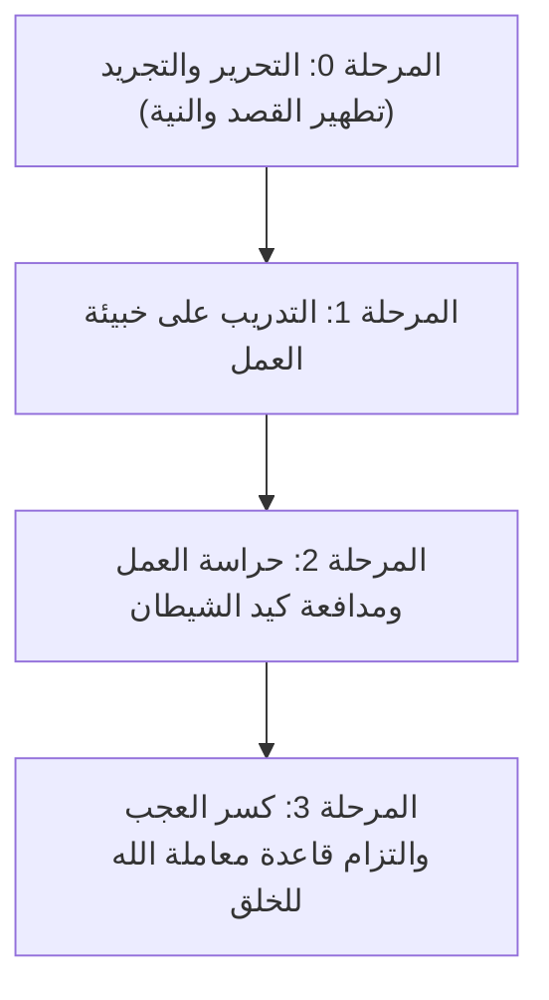

# 09 - خطة تطبيق الدروس: الدليل العملي لتحقيق الإخلاص وبناء العبودية

> [!abstract] الهدف من هذه الخطة
> تحويل المحاور الإيمانية والتربوية والتفسيرية الواردة في شرح [[سورة البينة]] إلى **خطة عمل تنفيذية مرتبة ومحددة بمراحل**، يستطيع المسلم اتباعها خطوة بخطوة لتطهير قلبه من الرياء والعجب، وتحقيق كمال الإخلاص لله في عباداته ومعاملاته.

---

## 🧭 خريطة المراحل التنفيذية

---

## 📋 المرحلة 0: التحرير والتجريد (تطهير القصد قبل العمل)
> **الهدف:** ألا تبدأ أي طاعة أو عمل إلا بعد فحص الباعث وتجريده لله وحده دون شريك.
> > من المحاضرة: «حضّر نيتك وحررها وخلّصها؛ لأن النية هي الباعث على العمل والمحرك له».

- [ ] **1. التوقف الواعي قبل كل عمل (وقفة المحاسبة):**
  - اسأل نفسك بصدق: *لماذا أفعل هذا؟ ولمن أتوجه به؟*
  - اطرد خواطر حب الظهور والمحمدة قبل التلفظ بالعمل أو الشروع فيه.
- [ ] **2. تجديد دعاء تحرير النية:**
  - الزم هذا الدعاء المأثور في المجلس في كل صباح ومساء وعند كل طاعة:
    > ا «اللهم اجعل عملي كله صالحاً، واجعله لوجهك خالصاً، ولا تجعل فيه لأحد غيرك شيئاً».
- [ ] **3. استشعار رق العبودية:**
  - تذكر مثل العبد والمالك في [[02 - تفسير الآيات 4 و 5 - علة تفرق أهل الكتاب وميثاق الإخلاص في سائر الشرائع|الجزء الثاني]]؛ أنت عبد مملوك في أرض الله، فكيف تصرف غلة عملك لغير مولاك؟!

---

## 📋 المرحلة 1: بناء خبيئة العمل والصالحات المستورة
> **الهدف:** تعويد النفس على العمل الصامت الذي لا يعلمه إلا الله عز وجل.
> > من المحاضرة: «أخفِ أعمالك ما استطعت، وكلما كانت أعمالك أخفى كلما كانت أرجى للقبول».

- [ ] **1. تخصيص صدقة سر دورية:**
  - اجعل لك صدقة أسبوعية أو شهرية لا يعلم بها أقرب الناس إليك، اقتداءً بحديث السبعة: «حتى لا تعلم شماله ما أنفقت يمينه».
- [ ] **2. ركعات الخلوة في جوف الليل:**
  - داوم على ركعتين في ظلمة الليل حيث تسكن العيون وتغلق الأبواب، لا يشهدك فيها إلا رب العالمين.
- [ ] **3. صيام سر لا يُعلن عنه:**
  - احرص على صيام يوم نافلة دون إخبار أحد أو الإشارة إليه بتلميح أو شكوى جوع.
- [ ] **4. الالتزام بسنة الصالحين في تفقد المحتاجين:**
  - راجع قصة خبيئة أبي بكر الصديق رضي الله عنه مع العجوز العمياء في [[06 - أسئلة الحضور ومسائل ختامية في العجب والرياء ومعاملة الله|الجزء السادس]].

---

## 📋 المرحلة 2: حراسة العمل أثناء أدائه ومدافعة خطرات الرياء
> **الهدف:** الصمود أمام وسوسة الشيطان الذي يحاول إفساد الطاعة وهي قائمة.
> > من المحاضرة: «تغميض عين القلب عن الالتفات إلى ما سوى الله تعالى».

- [ ] **1. إغمام عين القلب عن المخلوقين:**
  - أثناء الصلاة أو قراءة القرآن، لا تنظر إلى من دخل أو خرج ولا تلتفت لحركات الناس؛ فالمخلوق لا يملك لك نفعاً ولا ضراً ولا جنة ولا ناراً.
- [ ] **2. الاستعاذة الفورية عند طروء خواطر الرياء:**
  - إذا وسوس لك الشيطان بتحسين الهيئة للناس، استعذ بالله فوراً واستحضر أن العمل يصير هباءً إذا خالطه الشرك: «أنا أغنى الشركاء عن الشرك».
- [ ] **3. ملازمة صحبة الصادقين المخلصين:**
  - اختر من رفقائك من يذكرك بالله إذا نسيت ويعينك على الطاعة إذا ذكرت، مبتعداً عن مجالس التفاخر والمباهاة: [[04 - عوائق الإخلاص الخمسة وعلاجها والتساعية العملية لتحقيقه|الجزء الرابع]].

---

## 📋 المرحلة 3: كسر العجب وحراسة العمل بعد انقضائه
> **الهدف:** حماية العمل الصالح التام من الهدم والإحباط بسبب العجب أو التحدث به.
> > من المحاضرة: «العجب بيضيع العمل كله ويدمر الدنيا خالص! والعجب من الكبائر الباطنة».

- [ ] **1. الرد الفوري على النفس عند خواطر الغرور:**
  - إذا قالت لك نفسك: *«أنت لا مثيل لك، لقد قمت الليل وتصدقت»*، فبادرها فوراً بقولك:
    > ا «هذا من فضل ربي! ما أنتِ يا نفس أمارة بالسوء، لولا الله ما اهتديت ولا صليت ولا صمت».
- [ ] **2. كتمان الطاعات ودفنها:**
  - إياك أن تتحدث بعمل صالح فعلته في مجلس، أو تدلي بتلميحات توحي بطاعتك (كأن تقول: ما استطعت النوم البارحة إلا بعد أوراد كثيرة!).
- [ ] **3. استواء المدح والذم:**
  - عوّد قلبك ألا يهتز بثناء من مدحك، وأن تتمثل دعاء أبي بكر الصديق:
    > ا «اللهم اغفر لي ما لا يعلمون، ولا تؤاخذني بما يقولون، واجعلني خيراً مما يظنون».
- [ ] **4. تطبيق قاعدة «الجزاء من جنس العمل» مع الخلق:**
  - ارحم تُرْحَم، واعفُ يُعْفَ عنك، ويسّر على المعسرين ليتجاوز الله عنك يوم القيامة: [[05 - ثمرات الإخلاص العشر وتفسير الآيات 6 إلى 8 وجزاء الدارين|الجزء الخامس]].

---

## 🛠️ عند التعطّل (Troubleshooting) ومطابقة المشكلات بالحلول

| العارض أو المشكلة عند التطبيق | السبب الباطن | الحل العلاجي المباشر من المحاضرة |
|:---|:---|:---|
| **شعور بالثقل الشديد والكسل قبل البدء في الطاعة** | كيد الشيطان في المحطة الأولى وتثبيطه بالشهوات | استعذ بالله من الهمز والنفث، وأرغم نفسك على الشروع دون تسويف؛ فإنما هي وساوس لإخراجك من مضمار السباق. |
| **وسوسة متكررة بأنك مرائي ومنافق في صلاتك** | محاولة الشيطان دفعك لترك العمل بالكلية بدعوى الحذر من الرياء | لا تترك العمل الصالح أبداً؛ بل استمر فيه وحقق القصد لله واعلم أن مجرد كراهيتك للرياء دليل على يقظة قلبك. |
| **سماع ثناء من الناس وشعور بفرح غامر بالمدح** | تعلق القلب بنظر الخلق وضعف استشعار عظمة الله | حوّل الفرح من مدح الناس إلى الفرح بتوفيق الله؛ «قل بفضل الله وبرحمته فبذلك فليفرحوا»، وتذكر عيوب عملك وسهوك. |
| **استعظام الطاعة والتكاسل عن المزيد ظناً بالكمال** | داء الرضا بالعمل والسكون إليه | طالع عظمة حق الله وتقصيرك الشديد فيه؛ وأن ركعاتك لا تساوي نعمة واحدة من نعم البصر أو النَفَس، فكيف تسكن للعمل؟! |
| **طروء خاطر العجب بعد انقضاء العمل بأيام** | تسلل الشيطان لإفساد الثواب بعد عجزه عن إيقافه | الزم الاستغفار فوراً واجهر بلسانك وقلبك: «هذا فضل ربي»، واعلم أن العجب كبيرة تحبط الحسنات فاحذر هلاكها. |

---

## 📊 الملاحة
- **الملف السابق:** [[08 - أسئلة المراجعة والاختبار الذاتي]]
- **الفهرس العام:** [[00 - الفهرس والخطة]]
- **الملف المجمع الشامل:** [[سورة_البينة_ملف_مجمع]]
