# 00 - الفهرس والخطة: تفسير سورة التين وقضية الفطرة

> [!info] عن هذه المحاضرة
> مجلس علمي تفسيري وتربوي مبارك يتناول **[[سورة التين]]** انطلاقاً من **استحضار النية والخطوات السبع للتعامل مع القرآن الكريم**، وتفسير آيات السورة الكريمة: **القسم بالتين والزيتون وطور سينين والبلد الأمين**، وبيان **جواب القسم في خلق الإنسان في أحسن تقويم وردّه إلى أسفل سافلين واستثناء أهل الإيمان والعمل الصالح**، ودلائل **البعث وحكمة أحكم الحاكمين**، وسر شرف الإنسان بالوحي، وصولاً إلى مبحث تفصيلي معمق في **[[الفطرة]]**: حقيقتها، ومفسداتها، وكيفية بنائها، والحفاظ عليها، وتحصينها في واقعنا المعاصر.

## 📚 معلومات المصدر

| البند | البيان |
|:---|:---|
| **المصدر الأصلي** | `main_obsidian/دين/تفسير/سورة التين/تفريغ سورة التين .md` |
| **المادة** | درس تفسير وتربية إيمانية وبناء الفطرة |
| **الموضوع الرئيسي** | تفسير سورة التين، وظائف الوحي، وتأصيل قضية الفطرة صيانةً وبناءً وتحصيناً |
| **عدد أسطر التفريغ** | 693 سطراً |
| **التوقيت** | غير متوفر في المصدر الأصلي — استُخدم ترقيم الأسطر كمرجع موثق دقيق التزاماً بالأمانة العلمية وقواعد البروتوكول |

> [!warning] تنبيه بخصوص التوقيت المرجعي
> التفريغ المصدر **لا يتضمن توقيتات زمنية**؛ والتزاماً صارماً بالأمانة العلمية وقواعد البروتوكول المعتمد، **لم تُختلق أي توقيتات زيفية**، بل استُخدم **ترقيم أسطر التفريغ الأصلي** كمرجع موضعي دقيق في جميع ملفات الحزمة.

---

## 🗺️ خطة الأجزاء وعناوينها الشاملة

| # | الملف | المحور والموضوع | نطاق الأسطر |
|:---:|:---|:---|:---:|
| 00 | [[00 - الفهرس والخطة]] | الفهرس وخطة المعالجة الشاملة ومنهجية التلخيص وخريطة المفاهيم | — |
| 01 | [[01 - المقدمة واستحضار النية وخطوات التعامل مع القرآن]] | استحضار النية، أثرها في الفهم والحفظ وثبات العلم، الخطوات السبع للتعامل مع القرآن | 1–55 |
| 02 | [[02 - مرحلة التلقي وتلاوة السورة وحفظها]] | استحضار أجواء الكتاتيب، تلاوة وتلقي سورة التين جماعياً، والتأكيد على الحفظ | 56–105 |
| 03 | [[03 - تفسير الآيات 1 إلى 6 - القسم وجوابه وتكريم الإنسان]] | أسرار فواتح السور، دلالة القسم بالبقاع المقدسة ومحال النبوات، أحسن تقويم وأسفل سافلين، والجزاء غير الممنون | 106–200 |
| 04 | [[04 - تفسير الآيات 7 و 8 - دلائل البعث وسر التشريف بالوحي]] | فما يكذبك بعد بالدين، دلائل البعث (النوم والمبدأ الإنساني)، حكمة أحكم الحاكمين، تواضع جبل الطور، وسر شرف الوحي | 201–332 |
| 05 | [[05 - وظائف الوحي الأربع ولطيفة ابن عطاء الله في الفطرة]] | التين والزيتون غذاء الجسد والوحي غذاء الروح، وظائف الوحي الأربع، ولطيفة ابن عطاء الله السكندري | 333–425 |
| 06 | [[06 - الفوائد الإيمانية ومسألة بلى في الصلاة وتفويض الأمور]] | الفوائد السبع الكبرى، علة خلود المؤمن والكافر، المسألة الفقهية في قول بلى، وتفويض الأمور لأحكم الحاكمين | 426–521 |
| 07 | [[07 - قضية الفطرة - حقيقتها ومفسداتها وبناؤها وتحصينها]] | تعريف الفطرة، ملوثات الفطرة الست، سبل الحفظ الثمانية، قواعد البناء الخمس، وتحصين البيت المسلم والدعاء الختامي | 522–693 |
| 08 | [[08 - ملخص المراجعة السريعة]] | ملخص شامل ومكثف للمحاضرة في جداول جامعة للمذاكرة السريعة | 1–693 |
| 09 | [[09 - أسئلة المراجعة والاختبار الذاتي]] | بنك أسئلة واختبار ذاتي مقالي وموضوعي مع الإجابات النموذجية | 1–693 |
| 10 | [[10 - خطة تطبيق الدروس]] | خطة عمل تنفيذية بمراحل عملية ومهام بمربعات اختيار `- [ ]` وعلاج المشكلات عند التعطل | — |
| — | [[سورة_التين_ملف_مجمع]] | الملف المجمع النهائي الشامل لجميع الأجزاء بنصوصها الحرفية الكاملة دون مراجعة أو اختبارات أو توقيتات | 1–693 |

---

## 📐 منهجية المعالجة المعتمدة (وفق بروتوكول التلقينة)

1. **التطبيق المدمج الشامل:**
   - كل فقرة أو عنوان فرعي يُطبّق عليه البروتوكول كاملاً: تلخيص علمي منظم، استخراج الجداول والتصنيفات والتعريفات، الإشارة إلى نطاق الأسطر المرجعية، التنسيق بالألوان الهادئة المعتمدة، إدراج روابط WikiLinks، يعقبه مباشرة قسم **نص المتحدث الكامل** للفقرة دون حذف أي كلمة.
2. **مبدأ عدم تكرار المعلومة (البند 2.5️⃣):**
   - تُعرض كل معلومة في أقسام الملخص **مرة واحدة فقط** في الصيغة والوعاء الأنسب لها (تعريف، جدول، فائدة، تنبيه)، ولا تُكرر في وعاء آخر، والاستثناء الوحيد المسموح به هو قسم «نص المتحدث الكامل» لأنه النص الحرفي للتسجيل.
3. **دليل التنسيق بالألوان وقاعدة محاذاة النص العربي (RTL):**
   - ا الآيات والأحاديث والأدعية والقواعد الثابتة: باللون الذهبي الدافئ (`#D97706`).
   - ا التعريفات والمصطلحات والفوائد الرئيسية: باللون التركوازي الهادئ (`#0D9488`).
   - ا التحذيرات والأخطاء الشائعة والتنبيهات: باللون المرجاني الهادئ (`#E11D48`).
   - التزام صارم بقاعدة وضع حرف ألف بدون همزة ثم مسافة (`ا `) قبل وسوم HTML لضبط المحاذاة من اليمين إلى اليسار وتجنب ارتباك المحاذاة.
4. **تمييز الإضافات الإيضاحية:**
   - أي توضيح دعت الحاجة لإيراده من خارج نص المتحدث لبيان مراد علمي تم تمييزه بوضوح تام بعبارة:
     > 💡 **إيضاح من المساعد (إضافة ليست في المصدر الأصلي):** «...»
5. **المراجعة الداخلية الخماسية:**
   - إجراء 5 مراجعات عشوائية في كل جزء (البداية، منتصف البداية، المنتصف، منتصف النهاية، النهاية) لمطابقة التفريغ كلمة بكلمة والتأكد من الأمانة العلمية التامة.

---

## 🧭 خريطة المفاهيم الإيمانية والعلمية في السورة

```mermaid
graph TD
    A["[[سورة التين]]"] --> B["[[مقدمة التعامل مع القرآن والنية]]"]
    A --> C["[[القسم الإلهي بالبقاع المقدسة]]"]
    A --> D["[[جواب القسم: تكريم الإنسان وخلقته]]"]
    A --> E["[[دلائل البعث والجزاء وحكمة الله]]"]
    A --> F["[[الوحي كغذاء للروح ووظائفه]]"]
    A --> G["[[قضية الفطرة]]"]

    B --> B1["الاستحضار والبركة"]
    B --> B2["الخطوات السبع: تلقي، حفظ، تفسير، تدبر، عمل، عرض، مشروع"]

    C --> C1["التين والزيتون: الشام ونبوة عيسى عليه السلام"]
    C --> C2["طور سينين: سيناء ونبوة موسى عليه السلام"]
    C --> C3["البلد الأمين: مكة ونبوة محمد ﷺ"]

    D --> D1["أحسن تقويم: ظاهراً بالصورة وباطناً بالفطرة والعقل والروح"]
    D --> D2["أسفل سافلين: بالهوى ومعصية الله والنار"]
    D --> D3["الاستثناء: الذين آمنوا وعملوا الصالحات وأجرهم غير الممنون"]

    E --> E1["آية النوم والموتة الصغرى"]
    E --> E2["أطوار خلق الإنسان من نطفة وعلقة"]
    E --> E3["تنزيه الله عن العبث وسدى الحساب"]

    F --> F1["غذاء الجسد وغذاء الروح"]
    F --> F2["الوظائف الـ4: حفظ الفطرة، وصل الأرض بالسماء، ضبط الأخلاق، التوازن"]

    G --> G1["تعريف الفطرة: مقتضى معرفة الله وتوحيده"]
    G --> G2["الملوثات: الشيطان، الوالدان، الأسرة، الصحبة، الإعلام، مناهج التعليم"]
    G --> G3["الحفظ والبناء والتحصين بالبيت المسلم"]
```

