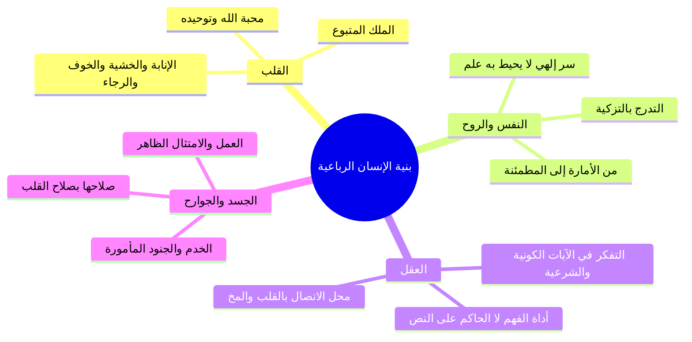

# 01 - مقدمة خطوات التعامل مع القرآن والتكوين الرباعي للإنسان

> [!info] خطة الأجزاء الكاملة
> - **الجزء 01:** [[01 - مقدمة خطوات التعامل مع القرآن والتكوين الرباعي للإنسان|مقدمة خطوات التعامل مع القرآن والتكوين الرباعي للإنسان]]
> - **الجزء 02:** [[02 - تفسير آيات القسم الأحد عشر وتدبر الآيات الكونية|تفسير آيات القسم الأحد عشر وتدبر الآيات الكونية]]
> - **الجزء 03:** [[03 - حقيقة التزكية والتدسية والجمع بين سببية العبد ومشيئة الرب|حقيقة التزكية والتدسية والجمع بين سببية العبد ومشيئة الرب]]
> - **الجزء 04:** [[04 - طغيان ثمود وعقر الناقة ودلالات الدمدمة وهيبة ولا يخاف عقباها|طغيان ثمود وعقر الناقة ودلالات الدمدمة وهيبة ولا يخاف عقباها]]
> - **الجزء 05:** [[05 - رسالة تزكية النفوس وأصولها الخمسة وثمراتها|رسالة تزكية النفوس وأصولها الخمسة وثمراتها]]
> - **الملف المجمع:** [[06 - سورة الشمس_ملف_مجمع|سورة الشمس - ملف مجمع]]
> - **خطة التطبيق:** [[07 - خطة تطبيق الدروس|خطة تطبيق الدروس]]

---

## 📌 استهلال المجلس وتجديد النية

- ا استحضار النية الصالحة: بدأ المجلس بالحث المؤكد على استحضار نية خالصة لله عز وجل في هذا المجلس، متسائلاً: لماذا اقتطعت من وقتك لتجلس؟ لعل الله يفتح على القلوب ويصلح النوايا.
- ا الاستشهاد بالشاطبية: استشهد المحاضر بأبيات الإمام الشاطبي في فضل أهل القرآن:
  > هَنِيئاً مَرِيئاً وَالِدَاكَ عَلَيْهِمَا ... مَلاَبِسُ أَنْوَارٍ مِنَ التَّاجِ وَالحُلَى  
  > فَمَا ظَنُّكُمْ بِالنَّجْلِ عِنْدَ جَزَائِهِ ... أُولَئِكَ أَهْلُ اللهِ وَالصَّفْوَةُ المَلاَ  
  > أُولُو البِرِّ وَالإِحْسَانِ وَالخَيْرِ وَالتُّقَى ... حُلاَهُمْ بِهَا جَاءَ القُرْآنُ مُفَصَّلاَ  
  > عَلَيْكَ بِهَا مَا عِشْتَ فِيهَا مُنَافِساً ... وَبِعْ نَفْسَكَ الدُّنْيَا بِأَنْفَاسِهَا العُلاَ

---

## 📖 خطوات التعامل مع القرآن الكريم

ذكّر المحاضر بالخطوات العشر للتعامل مع القرآن الكريم، مؤكداً أن الخمس الأولى هي الركائز الأساسية التي تكفي طالب العلم وتبني أساسه:

| م | الخطوة | التصنيف | البيان والأثر العملي |
|:---:|:---:|:---:|:---|
| 1 | **التلقي** | ركيزة أساسية | استقبال الآيات وسماعها سماع افتقار واسترشاد |
| 2 | **الحفظ** | ركيزة أساسية | استيداع الآيات في الصدر لتكون حاضرة في كل وقت |
| 3 | **التفسير** | ركيزة أساسية | معرفة مراد الله وفهم المعاني ودلالات الألفاظ |
| 4 | **التدبر** | ركيزة أساسية | إعمال الفكر في مقاصد الآيات وتحريك القلب بها |
| 5 | **العمل** | ركيزة أساسية | امتثال الأوامر واجتناب النواهي عملياً في الواقع |
| 6 | **العرض** | خطوة تكميلية | عرض النفس وسلوكها على معايير القرآن وميزانه |
| 7 | **المشروع** | خطوة تكميلية | اتخاذ مشروع قرآني مستمر يخدم الأمة ويثبت العلم |
| 8 | **الواقعية** | خطوة تكميلية | اليقين بوجود حقائق القرآن وقوانينه في واقع الناس |
| 9 | **الترجمة** | خطوة تكميلية | ترجمة المعاني إلى خُلق وسلوك مجسّد (كان خلقه القرآن) |
| 10 | **الزيادة** | خطوة تكميلية | استشعار زيادة الإيمان والخشوع مع كل سورة وآية |

---

## 🧩 التكوين الرباعي للإنسان ووظائف أركانه

بين المحاضر أن كل إنسان مركب من أربعة عناصر رئيسية، وجعل الله لكل عنصر غاية ومهمة:

### 1. القلب (الملك المتبوع)
- ا الغاية والوظيفة: خلقه الله ليعرفه ويحبه ويوحده، ولتصرف له الأعمال القلبية من الخوف والرجاء والخشية والإخلاص.
- ا التحذير من لوثات الفطرة: القلب يتعرض لأمور تلوثه وتنكس فطرته، ومهمة الإنسان الأولى هي حراسته وصيانته لتحصيل [[القلب السليم]].

### 2. تعريف القلب السليم
- ا التعريف الشرعي: هو القلب الذي سَلِم من الشبهات، وسَلِم من الشهوات، وسَلِم من المخالفات، وسَلِم من كل أمر يعارض مراد الله عز وجل، ولم يعد فيه إلا الله.
- ا أهميته الأخروية: هو شرط النجاة الأوحد يوم القيامة لقوله تعالى حكاية عن إبراهيم عليه السلام: ﴿يَوْمَ لَا يَنفَعُ مَالٌ وَلَا بَنُونَ * إِلَّا مَنْ أَتَى اللَّهَ بِقَلْبٍ سَلِيمٍ﴾.

### 3. النفس والروح
- ا حقيقتها الغيبية: ﴿وَيَسْأَلُونَكَ عَنِ الرُّوحِ قُلِ الرُّوحُ مِنْ أَمْرِ رَبِّي وَمَا أُوتِيتُم مِّنَ الْعِلْمِ إِلَّا قَلِيلًا﴾؛ فلا يستطيع الإنسان الإحاطة بها علماً مع كونها بين جنبيه.
- ا مراتب النفس الثلاث:
  1. **[[النفس الأمارة بالسوء]]:** وهي الأصل في جِبلّة النفس وطبيعتها الأولى (صيغة مبالغة على وزن فَعّال)، تأمر بالشهوات وتدعو إلى المحرمات وتتثاقل عن الطاعات.
  2. **[[النفس اللوامة]]:** النفس التي بدأت تترقى فتلوم صاحبها على التقصير وتندم على الذنوب.
  3. **[[النفس المطمئنة]]:** النفس المزكاة التي سكنت إلى أمر الله وشرعه، وهي وحدها المؤهلة للخطاب الإلهي بالدخول في الجنة: ﴿يَا أَيَّتُهَا النَّفْسُ الْمُطْمَئِنَّةُ * ارْجِعِي إِلَىٰ رَبِّكِ رَاضِيَةً مَّرْضِيَّةً * فَادْخُلِي فِي عِبَادِي * وَادْخُلِي جَنَّتِي﴾.

> ⚠️ تنبيه خطير
> ا النفس عدو لدود: النفس الأمارة بالسوء من أعدى أعداء الإنسان، تسعى لخديعته وحثه على المحرمات والكسل، ومواجهتها تقتضي إعداد العدة والمجاهدة الدائمة تماماً كالشيطان.

---

## 📝 نص المتحدث الكامل

صل صل على النبي. نص الليل كده احنا نايمين بنزلها؟ احنا نايمين؟ انا بنزلها صوت في الاخر، يعني انت بتنزلها صوت في الاخر؟ ده حاجه حلوه، انا بقى طول ما الفيديو شغال ما بعرفش اشرح، مش موجوده، ما بعرفش والله، الله المستعان سامحنا بقى، يعني ايه، دي حاجه نفسيه كده، ربنا يعزك ويكتر وزك يا رب، هات لنا يا عم، انا جاي، قول بس عشان... الله يعزك سيدنا، الله يعزك، الله يبارك فيك، الله يعزك الله يكرمك، جزاك الله خير، الله يحفظك ويرضى عنه يبارك فيك يا رب جزاك الله خير ربنا يبارك فيك. ماشي السلام عليكم، السلام عليكم، عليكم السلام ورحمه الله وبركاته، السلام عليكم سيدنا، الله اكبر، اللهم صل على النبي، الحال جاي من المدرسه جاي من السفر، يلا ان شاء الله بالسلامه، السلام عليكم ورحمه الله وبركاته، السلام ورحمه الله.

اعوذ بالله من الشيطان الرجيم، بسم الله الرحمن الرحيم، الحمد لله الملك القدوس السلام، والصلاه والسلام على معلمنا الامام محمد سيد ولد عدنان، وعلى اله وصحبه ومن تبعهم باحسان وبعد. مرحبا بكم ايها الاخوه الربانيون الكرام في هذا اللقاء المتجدد، ولا زلنا مع **تفسير كلام الله سبحانه وتعالى**، ووصلنا بحمد الله عز وجل وحوله ومدده وانعامه، وصلنا الى **تفسير سوره الشمس**، وصلنا الى تفسير سوره الشمس.

وذكرنا قبل ذلك الخطوات او **خطوات التعامل مع القران الكريم**، حد يذكرنا؟ اول حاجه... انت غبت ليه المره اللي فاتت بقى؟ فاتك مش عايز اقول فاتك نص عمرك، صلي على رسول الله، انت برضه كنت غايب المره اللي فاتت؟ انا بمشي 11... تمشي 11 الدوام بيخلص طبعه بقى. واحد يا سيدنا؟ واحد ايوه خدني في الدرس على طول: **واحد التلقي**، **اثنين الحفظ**، **ثلاثة التفسير**، **اربعة التدبر**، **خمسة العمل**. لسه ولا خلاص؟ العرض والمشروع، والواقعية والترجمة، اتكلمنا عن الترجمة والزيادة المره اللي فاتت، فلو انك حفظت الخمسه الاول، الخمسه الاولانيين يكفونك، يعني خمسه الاولانيين دول يعتبر ركائز اساسيه او خطوات اساسيه في التعامل مع القران الكريم، اللي هي التدبر ويعني الحاجات، الخمسه الثانيين هم مهمين ايضا، لكن التركيز على الخمسه الاولانيين يكون اكثر واقوى لانها بمثابه الاساس، لانها بمثابه الاساس اللي هو **التلقي والحفظ والتفسير والتدبر والعمل**.

ثم بنا لنشرع مع سورتنا المباركه، وسوره هذه الليله **سوره الشمس**:
اعوذ بالله من الشيطان الرجيم، بسم الله الرحمن الرحيم: **والشمس وضحاها، والقمر اذا تلاها، والنهار اذا جلاها، والليل اذا يغشاها، والسماء وما بناها، والارض وما طحاها، ونفس وما سواها، فالهمها فجورها وتقواها، قد افلح من زكاها، وقد خاب من دساها، كذبت ثمود بطغواها، اذ انبعث اشقاها، فقال لهم رسول الله ناقه الله وسقياها، فكذبوه فعقروها فدمدم عليهم ربهم بذنبهم فسواها، ولا يخاف عقباها**. جزاكم الله خيرا.

تعالوا بنا لننظر في تفسير هذه السوره الخطيره، وهذه السوره سوره الشمس هي من اهم السور، وكل سور القران مهمه، لكن يعني كل ما نفتح سوره نقول هذه سوره من السور المهمه، هذه سوره خطيره لما يتكشف لنا في هذه السوره ولما يتكشف لنا من معانيها. سوره الشمس هي بتتحدث عن ايات الله الكونيه، ومن ايات الله عز وجل النفس، نفسك التي بين جنبتيك هذه من ايات الله عز وجل، فكما انك لن تستطيع ان تصل الى حقائق والى الاحاطة بكل ايه من هذه الايات، فكذلك انت لن تستطيع ان تصل الى حقيقه النفس، لن تستطيع ان تصل الى حقيقه النفس ولن تحيط بها علما ومع ذلك هي بين جنبتك، فهذه النفس التي انت تحيا بها، وذلك لان الانسان كل واحد مننا مخلوق، **تكوينة الانسان عامه من اربع حاجات**، انسان مكون من ايه؟ انسان مكون من **قلب، ونفس اللي هي الروح، وعقل، والجسد اللي هي الجوارح**، يبقى دي اربع حاجات هم تكوينه الانسان، فمن مكونات الانسان هي مساله النفس والروح.

قال الله عز وجل في كتابه الكريم: **ويسألونك عن الروح قل الروح من امر ربي وما اوتيتم من العلم الا قليلا الا قليلا**، فمهما بلغ علم الانسان لن يستطيع ان يحيط بهذه النفس علما. لما خلق الله عز وجل القلب جعل له مهمه وجعل له غايه وهدف، النفس ليها مهمه وغايه وهدف، العقل نفس الكلام، والجوارح نفس الكلام. **هذا القلب الذي خلقه الله عز وجل لك، خلقه لك لتحبه وتوحده**، قول لا اله الا الله، لا اله الا الله، ليه؟ لتستعمل هذا القلب، انا ما بحبش المراوح وعايز اطفي التكييف كمان، صليت على الرسول صلى الله عليه وسلم، فهذا القلب ليوحد الله، ليعرف الله، لتستعمل هذا القلب في محبته ومعرفته والانابه اليه والخوف والرجاء والخشيه، هذه الاعمال القلب والاخلاص، هذه **الاعمال القلبيه كلها لا تكون الا لله عز وجل**، لكن القلب لما حصل له اللي حصل له حصل في امور لوثت القلب ونكست الفطره وحصل اللي حصل، فمهمه الانسان ان يحافظ على هذا القلب، ومهمتك ان تحصل قلبا سليما.

يبقى انت مهمتك علشان... قول عايز تقول ايه؟ النيه، النيه اه، طب انووا كده عشان ربنا يفتح علينا، انسان يستحضر كده نيه صالحه نيه طيبه، لماذا تجلس هذا المجلس؟ لماذا اقتطعت من وقتك هذا الوقت لتجلس؟ نسال الله عز وجل ان يصلح نوايانا. تسلم ايدك الله، الامام الشاطبي بيقول في الشاطبيه ايه؟ بيقول لك:
**هنيئا مريئا والداك عليهما ملابس انوار من التاج والحلى**  
**فما ظنكم بالنجل عند جزائه اولئك اهل الله والصفوة الملا**  
**اولو البر والاحسان والخير والتقى حلاهم بها جاء القران مفصلا**  
**عليك بها ما عشت فيها منافسا وبع نفسك الدنيا بانفاسها العلا**  
كفايه كده، خش بقى جزا الله بالخيرات كلها، الله يبارك لك، انت جميل.

فهذا القلب المطلوب من الانسان، المطلوب من كل واحد فينا ان **يحصل قلبا سليما**، وايه الفايده ان احنا كل واحد فينا يحصل قلب سليم؟ طب الاول نسال نفسنا: هل امتلك قلبا سليما؟ هتقول لي ما هو الاول الكلام عن الشيء فرع عن تصوره، دي قاعده اصوليه وقاعده منطقيه وقاعده في كل حاجه، يعني يقول لك الكلام عن الشيء فرع عن تصوره، عايز اتصور الاول ايه القلب السليم اللي انت بتكلمنا عنه ده يا مولانا؟ اقول لك صلي على النبي صلى الله عليه وسلم: **القلب السليم هو الذي سلم من الشبهات، وسلم من الشهوات، وسلم من المخالفات، وسلم من كل امر يعارض مراد الله عز وجل**، يبقى ده اسمه قلب سليم، سلم من كل شبهه وسلم من كل شهوه وسلم من كل عارض، اسلم من الحاجات دي كلها يبقى ده اسمه قلب سليم وليس فيه الا الله عز وجل. ايه الفايده ان انت يبقى معاك قلب سليم؟ الفايده ان انت معاك قلب سليم **انك لن تنجو يوم القيامه الا اذا كان معك قلب سليم**، الا اذا حصلت قلبا سليما، لذلك سيدنا ابراهيم عليه السلام قال: **ولا تخزني يوم يبعثون يوم لا ينفع مال ولا بنون الا من اتى الله بقلب سليم**، يبقى انت محتاج قلب سليم ولا لا؟ محتاج قلب سليم ده رقم واحد كده.

وبالنسبه للنفس والروح، انت برضه محتاج ان انت تترقى بنفسك لحد ما توصل بها الى ان تكون نفس مزكاه، لحد ما توصل بها الى **النفس المطمئنه**، لان **النفوس ثلاث انواع**: عندنا اول حاجه **النفس الاماره بالسوء**، وده اصل طبيعه النفس اصلا، طبيعه النفس باصلها ان هي اماره بالسوء، امار على طول كده تامر، اماره على وزن فعال صيغه مبالغه، على طول تامر بالسوء والفحشاء، لما تترقى شويه النفس ديت تبقى **لوامه** تلوم صاحبها، هتيجي معانا ان شاء الله في سوره القيامه: لا اقسم بيوم القيامه ولا اقسم بالنفس اللوامه، تترقى بقى بعد كده خالص بعد ما تمر بمراحل التزكيه لحد ما توصل الى **النفس المطمئنه**. طب احنا محتاجين النفس المطمئنه في حاجه؟ اه طبعا، قال الله عز وجل: **يا ايتها النفس المطمئنه ارجعي الى ربك راضيه مرضيه فادخلي في عبادي وادخلي جنتي**، مين اللي هتدخل في عباد الله وفي جنه الله؟ النفس المطمئنه مش الاماره بالسوء! الاماره بالسوء ديت اللي بتضحك على صاحبها: كل كل، نام نام، اتفرج على المحرمات اتفرج، اسمع اغاني اسمع، بص على فلانه يبص، اعمل مش عارف ايه، **والنفس هي من اعدى اعداء الانسان**، النفس هي من اعدى اعداء الانسان، انتبه خلي بالك بقى علشان تعد العده، خلي بالك علشان تعد العده، النفس دي عدو لدود عدو زي الشيطان كده، الشيطان عدو كما قال الله عز وجل: ان الشيطان لكم عدو فاتخذوه عدوا.

---

> **إجمالي الأجزاء: 5 | الجزء الحالي: 1 | المتبقي: 4**
