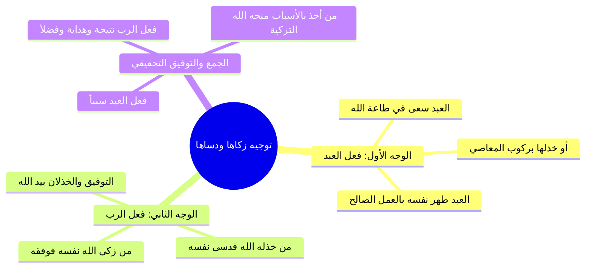

# 03 - حقيقة التزكية والتدسية والجمع بين سببية العبد ومشيئة الرب

> [!info] خطة الأجزاء الكاملة
> - **الجزء 01:** [[01 - مقدمة خطوات التعامل مع القرآن والتكوين الرباعي للإنسان|مقدمة خطوات التعامل مع القرآن والتكوين الرباعي للإنسان]]
> - **الجزء 02:** [[02 - تفسير آيات القسم الأحد عشر وتدبر الآيات الكونية|تفسير آيات القسم الأحد عشر وتدبر الآيات الكونية]]
> - **الجزء 03:** [[03 - حقيقة التزكية والتدسية والجمع بين سببية العبد ومشيئة الرب|حقيقة التزكية والتدسية والجمع بين سببية العبد ومشيئة الرب]]
> - **الجزء 04:** [[04 - طغيان ثمود وعقر الناقة ودلالات الدمدمة وهيبة ولا يخاف عقباها|طغيان ثمود وعقر الناقة ودلالات الدمدمة وهيبة ولا يخاف عقباها]]
> - **الجزء 05:** [[05 - رسالة تزكية النفوس وأصولها الخمسة وثمراتها|رسالة تزكية النفوس وأصولها الخمسة وثمراتها]]
> - **الملف المجمع:** [[06 - سورة الشمس_ملف_مجمع|سورة الشمس - ملف مجمع]]
> - **خطة التطبيق:** [[07 - خطة تطبيق الدروس|خطة تطبيق الدروس]]

---

## 🎯 جواب القسم ومدار السورة

- ا الغاية العظمى: بعد أحد عشر قسماً متتابعاً، جاء جواب القسم المقترن بـ «قد» المفيدة للتحقيق:
  > ﴿قَدْ أَفْلَحَ مَن زَكَّاهَا * وَقَدْ خَابَ مَن دَسَّاهَا﴾
- ا محور السورة: السورة كلها تدور حول هذه القضية المصيرية؛ فما قبلها تمهيد وتعظيم بالقسم، وما بعدها مثال بشري حي ومحسوس لعاقبة طغيان النفس وخيبتها.

---

## ⚖️ المقابلة القرآنية: التزكية في مقابل التدسية

| وجه المقارنة | التزكية ﴿زَكَّاهَا﴾ | التدسية ﴿دَسَّاهَا﴾ |
|:---|:---|:---|
| **المعنى اللغوي والشرعي** | التطهير والتنمية والزيادة في الخير والرفعة. | الإخفاء، والإخمال، والتحقير، والدفن في الرذائل. |
| **المسلك والعمل** | طهّر نفسه من الذنوب، ونقاها من العيوب، ورقاها بطاعة الله، وعلاها بالعلم النافع والعمل الصالح. | قمع نفسه الكريمة وأخفاها بالتدنس بالرذائل، ومقاربة الذنوب، وترك ما يكملها وينميها. |
| **النتيجة والمآل** | **الفلاح التام** (النجاح، الفوز، السعادة، والرضوان). | **الخيبة المطلقة** (الخسران، الحرمان، وأسفل سافلين). |

---

## 🔍 توجيه الإمام ابن كثير للآية والجمع الدقيق بين الوجهين

ذكر الإمام ابن كثير رحمه الله وجهين في تفسير الفاعل في قوله: ﴿زَكَّاهَا﴾ و﴿دَسَّاهَا﴾:

### 1. الوجه الأول (نسبة الفعل للعبد سبباً)
- أفلح من زكى نفسه بطاعة الله وطهرها من الأخلاق الدنيئة، وخاب من أخمل نفسه ودساها بركوب المعاصي والشهوات.

### 2. الوجه الثاني (نسبة الفعل لله تقديراً وخلقاً)
- أفلح من زكى الله نفسه وهداه، وخاب من أضل الله نفسه وخذله. ويشهد لهذا الوجه دعاء النبي ﷺ:
  > «اللهم آت نفسي تقواها، وزكها أنت خير من زكاها، أنت وليها ومولاها».

### 3. الجمع والتحقيق العلمي
- التزكية **من فعل العبد سبباً وبذلاً**، ثم هي **من فعل الرب نتيجةً وتوفيقاً وهدايةً وفضلاً**. فالعبد يبذل الجهد ويطرق أبواب الطاعة والأسباب، فإذا رأى الله منه صدق الإقبال منحه التزكية الحقيقية وطهره، مصداقاً لقوله تعالى: ﴿وَالَّذِينَ جَاهَدُوا فِينَا لَنَهْدِيَنَّهُمْ سُبُلَنَا﴾ وقوله: ﴿ثُمَّ تَابَ عَلَيْهِمْ لِيَتُوبُوا﴾.

---

## 🤲 أدعية نبوية مأثورة في طلب التزكية والاستعاذة من شر النفس

جمع المحاضر باقة من الأدعية النبوية التي كان يلهج بها النبي ﷺ طلباً لسلامة القلب وزكاة النفس:

1. ا «اللَّهُمَّ آتِ نَفْسِي تَقْوَاهَا، وَزَكِّهَا أَنْتَ خَيْرُ مَنْ زَكَّاهَا، أَنْتَ وَلِيُّهَا وَمَوْلَاهَا».
2. ا «اللَّهُمَّ أَلْهِمْنِي رُشْدِي، وَأَعِذْنِي مِنْ شَرِّ نَفْسِي».
3. ا «اللَّهُمَّ إِنِّي أَعُوذُ بِكَ مِنْ عِلْمٍ لَا يَنْفَعُ، وَمِنْ قَلْبٍ لَا يَخْشَعُ، وَمِنْ نَفْسٍ لَا تَشْبَعُ، وَمِنْ دَعْوَةٍ لَا يُسْتَجَابُ لَهَا».
4. ا «وَنَعُوذُ بِاللَّهِ مِنْ شُرُورِ أَنْفُسِنَا وَمِنْ سَيِّئَاتِ أَعْمَالِنَا».

---

## 📝 نص المتحدث الكامل

**قد افلح من زكاها، اي طهر نفسه من الذنوب ونقاها من العيوب، ورقاها بطاعه الله وعلاها بالعلم النافع والعمل الصالح، فهذا من المفلحين. وقد خاب من دساها، يعني اخفى نفسه الكريمه التي ليست حقيقه بقمعها واخفائها بالتدنس بالرذائل والدنو من العيوب والذنوب، وترك ما يكملها وينميها، واستعمل ما يشينها ويدنسها**، يبقى الانسان بيزكي نفسه بايه؟

اه هنا كلام للامام ابن كثير رحمه الله بيقول: **قد افلح من زكاها فيها وجهين**:
- **الوجه الاول:** يعني قد افلح من زكى نفسه بطاعه الله وطهرها من الاخلاق الدنيئه والرذائل، وقد خاب من دساها يعني قد خاب من اخملها ووضع منها بخذلانه اياها عن الهدى حتى ركب المعاصي وترك طاعه الله عز وجل. يبقى هنا التزكيه والتدسيه من فعل مين؟ من فعل العبد ولا من فعل غيره؟ من فعل العبد، يبقى انت اللي سعيت في تزكيه نفسك، او العياذ بالله هو الذي سعى في تدسيه نفسه وتحقيرها وخستها.

قال **الوجه الثاني**، والصراحه انا فضلت واقف مع الوجه ده شويه تعجبت منه صراحه، صاحي؟ ما هو الوجه ده محتاج صحيان شويه محتاج صلاه على النبي صلى الله عليه وسلم. يبقى مين اللي يقول للوجه الاول قد افلح من زكاها وقد خاب من دساها؟ قال ان ده **فعل العبد**، يعني ايه فعل العبد؟ هو اللي زكى نفسه، هو اللي سعى في تزكيه نفسه بالطاعه، او هو الذي دسها دس نفسه وحقرها ووضع منها ومن قيمتها: ثم رددناه اسفل سافلين، هو الذي فعل ذلك بفعل المعاصي وارتكاب الذنوب والقبائح.

الوجه الثاني، الوجه الثاني ها؟ الوجه الثاني قال: **قد افلح من زكى الله نفسه، وقد خاب من دسى الله نفسه**، فنسب الفعل الى الله! اسمك ايه؟ هادي، اللهم اهدنا سواء السبيل امين يا رب. فعم الشيخ هادي يقول لي: طب ازاي بقى وانت حيرتني، هي التزكيه من فعل العبد ولا من فعل الرب جل جلاله؟ فهو عند الله، والعلم عند الله واسال الله عز وجل ان يعفو عني ان كنت مخطئا، **فالتزكيه من فعل العبد سببا، ثم هي من فعل الرب نتيجه!** ما شاء الله.

يبقى انت الاول، من باب قول الله عز وجل في سوره الليل: فاما من اعطى واتقى وصدق بالحسنى فسنيسره لليسرى، ان اللي انت عاوزه ايه، انت عاوز خير وعاوز صلاح وسعيت فيه فربنا هيزودك، وكما في قول الله عز وجل: **حتى اذا ضاقت عليهم الارض بما رحبت وضاقت عليهم انفسهم وظنوا ان لا ملجا من الله الا اليه ثم تاب عليهم ليتوبوا**، هداهم الله للتوبه فتابوا بالفعل، فلما تابوا تاب الله عز وجل عليهم.

فانت نفس الكلام هنا معانا: فانت سعيت في طرق التزكيه لتزكي نفسك، ثم منحك الله عز وجل التزكيه حقيقه وتطهير نفسك حقيقه. ايه الدليل على كده؟ استدل على الوجه الثاني ده بان النبي صلى الله عليه وسلم كان يدعو فيقول: **اللهم ات نفسي تقواها وزكها انت خير من زكاها انت وليها ومولاها**، وكان يدعو: **اللهم الهمني رشدي واعذني من شر نفسي**، وكان يدعو صلى الله عليه وسلم: **اللهم اني اعوذ بك من علم لا ينفع، ومن قلب لا يخشع، ومن نفس لا تشبع، ودعوه لا يستجاب لها**، وكان يقول صلى الله عليه وسلم: **ونعوذ بالله من شرور انفسنا ومن سيئات اعمالنا**. يبقى «اللهم ات نفسي تقواها» يبقى هو يطلب التزكيه من من؟ من الله عز وجل. نفس الكلام ده اللي انا بقوله، ان انت الاول بتسعى في الاخذ بالسبب، وبعدين الله عز وجل يمنحك ويتم عليك ويعطيك النتيجه.

---

> **إجمالي الأجزاء: 5 | الجزء الحالي: 3 | المتبقي: 2**
