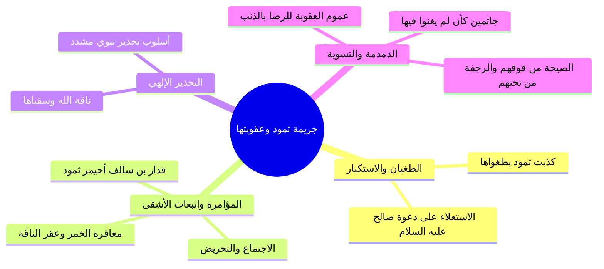

# 04 - طغيان ثمود وعقر الناقة ودلالات الدمدمة وهيبة ولا يخاف عقباها

> [!info] خطة الأجزاء الكاملة
> - **الجزء 01:** [[01 - مقدمة خطوات التعامل مع القرآن والتكوين الرباعي للإنسان|مقدمة خطوات التعامل مع القرآن والتكوين الرباعي للإنسان]]
> - **الجزء 02:** [[02 - تفسير آيات القسم الأحد عشر وتدبر الآيات الكونية|تفسير آيات القسم الأحد عشر وتدبر الآيات الكونية]]
> - **الجزء 03:** [[03 - حقيقة التزكية والتدسية والجمع بين سببية العبد ومشيئة الرب|حقيقة التزكية والتدسية والجمع بين سببية العبد ومشيئة الرب]]
> - **الجزء 04:** [[04 - طغيان ثمود وعقر الناقة ودلالات الدمدمة وهيبة ولا يخاف عقباها|طغيان ثمود وعقر الناقة ودلالات الدمدمة وهيبة ولا يخاف عقباها]]
> - **الجزء 05:** [[05 - رسالة تزكية النفوس وأصولها الخمسة وثمراتها|رسالة تزكية النفوس وأصولها الخمسة وثمراتها]]
> - **الملف المجمع:** [[06 - سورة الشمس_ملف_مجمع|سورة الشمس - ملف مجمع]]
> - **خطة التطبيق:** [[07 - خطة تطبيق الدروس|خطة تطبيق الدروس]]

---

## 🐪 ثمود: النموذج القرآني الحي لخيبة النفس وطغيانها

- ا حكمة التمثيل القرآني: من منهج القرآن الكريم أن يعقب التقرير النظري بمثال بشري محسوس؛ لأن ضرب المثل أوقع في النفس وأوضح للفهم. وبعد أن قرر: ﴿وَقَدْ خَابَ مَن دَسَّاهَا﴾، ساق قصة **قوم ثمود** ونبيهم صالح عليه السلام كشاهد عملي على الهلاك الناشئ عن طغيان النفس واستكبارها.
- ا الآية وقسمة الماء: طلبوا آية فأخرج الله لهم الناقة: ﴿هَٰذِهِ نَاقَةُ اللَّهِ لَكُمْ آيَةً﴾، وكانت قسمة الماء بينهم: ﴿وَنَبِّئْهُمْ أَنَّ الْمَاءَ قِسْمَةٌ بَيْنَهُمْ كُلُّ شِرْبٍ مُّحْتَضَرٌ﴾؛ تشرب الناقة من البئر يوماً ويشربون يوماً، وينتفعون بلبنها كنعمة مباركة.

---

## 📜 تسلسل الجريمة والعقوبة

### 1. انبعاث الأشقى
- ا الفاعل المباشر: هو **قدار بن سالف** (المسمى في الحديث النبوي: أحيمر ثمود، أشقى الأولين)، شرب الخمر وبتشجيع من قومه وتفويضهم خرج ممتشقاً سلاحه فعقر الناقة وقتلها.

### 2. أسلوب التحذير النبوي
- ا ﴿نَاقَةَ اللَّهِ وَسُقْيَاهَا﴾: منصوبة على **التحذير** في قواعد اللغة العربية؛ أي: احذروا عقر ناقة الله واحذروا منعها من شربها الذي جعله الله لها.

### 3. عموم العقوبة ومبدأ التضامن في الجرم
- ا قاعدة شرعية: **«الراضي بالذنب كفاعله»**؛ فعلى الرغم من أن المباشر للعقر رجل واحد، إلا أن العقوبة عمتهم جميعاً: ﴿فَكَذَّبُوهُ فَعَقَرُوهَا فَدَمْدَمَ عَلَيْهِمْ رَبُّهُم بِذَنبِهِمْ فَسَوَّاهَا﴾؛ لأنهم مالؤوه وأيدوه ورضوا بجريمته.
- ا معنى الدمدمة والتسوية: أطبق الله عليهم العذاب ودمرهم جميعاً، فأرسل عليهم الصيحة من فوقهم والرجفة من تحتهم، فسوّى بينهم في الإبادة، وأصبحوا في ديارهم باركين على ركبهم هلكى كأن لم يعيشوا فيها أبداً.

---

## ⚡ الوقف المهيب: ﴿وَلَا يَخَافُ عُقْبَاهَا﴾

- ا مقارنة بين بطش الملوك وبطش القهار: عادات ملوك الدنيا وأهل القوة إذا بطشوا بقوم أن يتربصوا ويخافوا ردود الأفعال وعواقب انتقامهم أو ثأر حلفائهم، أما **الله جل جلاله** إذا عذب وأهلك فلا يبالي بأحد، ولا يخاف عاقبةً ولا تَبِعة، ولا يستطيع أحد في الوجود منعه أو رد بأسه سبحانه.
- ا شؤم الذنب الواحد: قال تعالى: ﴿فَدَمْدَمَ عَلَيْهِمْ رَبُّهُم بِذَنبِهِمْ﴾ ولم يقل «بذنوبهم»، إشارةً إلى أن **ذنباً واحداً كبيراً أصر عليه القوم ورضوا به** كان كافياً لإحلال الاستئصال والدمدمة الإلهية.

---

## 📝 نص المتحدث الكامل

كذبت ثمود بطغواها، عملوا ايه بقى لما النفس طغت في جواهم وشافوا نفسهم قوي خدت بالك، وعلوا وتكبروا وتجبروا؟ انبعث اشقاهم. طبعا ثمود قوم سيدنا صالح، قوم سيدنا صالح وديارهم وبقاياهم موجوده لحد النهارده، والبير اللي كانت بتشرب منه الناقه كنت بشرح فقه فقمت داخل على النت وكاتب، موجود لحد النهارده الحاجات دي متصوره ومعمول عليها كده، تدخل على النت تكتب: قرى ثمود، البئر الذي كانت تشرب منه ناقة سيدنا صالح عليه السلام.

سيدنا صالح جالهم: **والى عاد اخاهم هودا**، وهنا: **والى ثمود اخاهم صالحا قال يا قوم اعبدوا الله ما لكم من اله غيره**، واخذ يدعوهم الى عباده الله، قالوا: لا عايزين ايه! فارسل الله عز وجل لهم ايه: **قد جاءتكم بينه من ربكم هذه ناقه الله لكم ايه**، انتم عايزين ايه عشان تؤمنوا؟ جت لهم ايه، فلما جاءتهم هذه الايه اللي هي ناقه الله لكم ايه: **فذروها تاكل في ارض الله ولا تمسوها بسوء فياخذكم عذاب اليم**. والايات كثيره في القران بتكلمك عن قصه سيدنا صالح مع قومه. فكانت هذه الناقه ترد البئر فتشرب يوما ويشربون يوما، كما قال الله عز وجل في سوره القمر: **ونبئهم ان الماء قسمه بينهم كل شرب محتضر**، هم يشربوا من البير يوم والناقه تشرب من البير يوم، لكن اليوم اللي هتشرب منه الناقه انتوا هتحلبوا لبنها وتشربوه.

اذ انبعث اشقاها، فقام اشقى القوم وكان يسمى **قدار بن سالف**، اشقى القوم احيمر ثمود كما اخبر عنه النبي صلى الله عليه وسلم: **اشقى الناس احيمر ثمود** ورجل اخر اخبر عنه النبي صلى الله عليه وسلم. فقام فتعاطى يعني فشرب الخمر، قام شارب الخمر وكلهم قاعدين متجمعين وبيعوه: انت البطل، انت الزعيم، انت الشجاع، فقام شارب الخمر وقام مطلع الخنجر بتاعه وقام عقر الناقه وقتلها.

اذ انبعث اشقاها فقال لهم رسول الله، وكان سيدنا صالح عليه السلام يحذرهم: **ناقه الله**، منصوبه «ناقه الله» منصوبه على التحذير، انت عندك في اللغه العربيه اسلوبين: اسلوب الاغراء واسلوب التحذير، اسلوب التحذير: ناقه الله وسقياها، يعني احذروا ناقه الله واحذروا سقياها، اوعى حد يقرب لها!

**فكذبوه فعقروها فدمدم عليهم ربهم بذنبهم فسواها**، يعني عمهم كلهم بالعقوبه، لم يفلت منهم احد، ليه لم يفلت منهم احد؟ لان كلهم كانوا مؤيدين، طالما هم ايدوا هذا الذي قتل الناقه وهذا الذي ارتكب المعصيه، ومع انهم لم يرتكبوها ولم يباشروا هذا الذنب وهذه المعصيه الا انهم رضوا بها، **فالراضي بالذنب كفاعله تماما**، لذلك لما نزلت العقوبه نزلت عليهم اجمعين.

قال الشيخ السعدي: **كذبت ثمود بطغواها**، يعني بسبب طغيانها وترفعها عن الحق وعتوها على رسولهم. **اذ انبعث اشقاها** يعني اشقى القبيله وهو قدار بن سالف لعقرها حين اتفقوا على ذلك، امروه فاتمر لهم: يلا يا بطل يلا يا شجاع انت اللي تقتل الناقه، فقام اشقاهم وخلد الله عز وجل ذكره في القران الى يوم القيامه. فقال لهم رسول الله سيدنا صالح: **ناقه الله وسقياها**، يعني احذروا عقر ناقه الله التي جعلها لكم ايه عظيمه، ولا تقابلوا نعمه الله عليكم بلبنها ان تعقروها، فكذبوا نبيهم صالحا فعقروها.

**فدمدم عليهم ربهم بذنبهم**، يعني دمر عليهم وعمهم بعقابه، وارسل عليهم الصيحه من فوقهم والرجفه من تحتهم، فاصبحوا جاثمين باركين على ركبهم، لا تجد منهم داعيا ولا مجيبا، فاخذتهم الرجفه فاصبحوا في دارهم جاثمين كان لم يغنوا فيها، الا ان ثمود كفروا ربهم الا بعدا لثمود هلاك وبعد لهم. **فسواها** يعني سواها عليهم، يعني سوى بينهم في العقوبه، العقوبه نزلت على الجميع لم يفلت منهم احد.

ومع ان الله عز وجل عمهم بالعقوبه ودمدم عليهم العذاب فاهلكهم جميعا ولم يبق منهم احد، **ولا يخاف عقباها**! خدت بالك، بعدما دمدم الله عز وجل عليهم العذاب اجمعين، الايه اللي في الاخر اكثر ايه ترعبك: فدمدم عليهم ربهم بذنبهم فسواها ولا يخاف عقباها، ولا يبالي جل جلاله سبحانه وتعالى، لان عاده الملوك اذا بطشوا بقوم انهم يخافون او يتربصون مردود ما فعلوه: هيعملوا ايه، هيسووا ايه؟ الا الله جل جلاله، ملك الملوك سبحانه، اذا عذب لا يبالي، ولن يستطيع احد منعه، ولن يستطيع احد ان يدفع شيئا، ولن يستطيع احد ان يفعل اي شيء، فخلي بالك انت مش قد ربنا، لا انا ولا انت ولا من في الارض جميعا.

لذلك الله عز وجل يقول في سوره هود بعدما ذكر الاقوام، وسوره هود من السور النفس فيها عالي واللهجه فيها قويه واللهجه فيها مرعبه: **شيبتني هود**، لان لهجه العذاب والاسلوب بتاع سوره هود مرعب، من اول السوره عماله تفصل لك العذاب: من اول سيدنا نوح وهلاك قومه وابنه، وعاد ونجيناهم من عذاب غليظ، وثمود واخذ الذين ظلموا الصيحه فاصبحوا في ديارهم جاثمين، وقوم لوط جعلنا عاليها سافلها وامطرنا عليها حجاره من سجيل منضود، وقوم شعيب واخذت الذين ظلموا الصيحه، وفرعون يقدم قومه يوم القيامه فاوردهم النار وبئس الورد المورود... وشوف بقى اخر السوره: **ذلك من انباء القرى نقصه عليك منها قائم وحصيد، وما ظلمناهم ولكن ظلموا انفسهم... وكذلك اخذ ربك اذا اخذ القرى وهي ظالمه ان اخذه اليم شديد**.

الله عز وجل حينما يعاقب قرى ومدن ودول على بعضها، ده سيدنا جبريل له 600 جناح اقتلع قرى قوم لوط على طرف ريشه من جناح ثم رفعها الى السماء حتى سمعت الملائكه نباح كلابهم ثم قلبها واطبقها واتبع عليهم حجاره من سجيل، فما بالك بالملك جل جلاله! **ولا يخاف عقباها** حينما يدمر، حينما يدمدم، حينما يهلك، حينما يطبق السماء على الارض، لا يخاف عقباها جل جلاله. فالانسان يحذر ويخاف من الله عز وجل ويخاف من معصيته، لان يوم ما دول عملوا ذنب: فدمدم عليهم ربهم، ولم يقل بذنوبهم وانما قال: **بذنبهم**، فممكن ذنب واحد تحل على الانسان عقوبه، وخلي بالك اذا نزلت العقوبه: ولا يخاف عقباها.

---

> **إجمالي الأجزاء: 5 | الجزء الحالي: 4 | المتبقي: 1**
