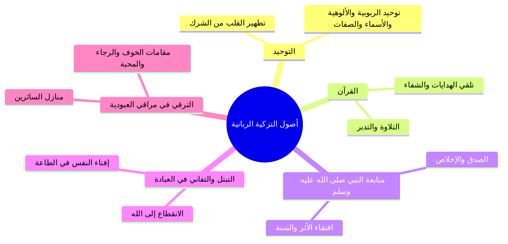

# 05 - رسالة تزكية النفوس وأصولها الخمسة وثمراتها

> [!info] خطة الأجزاء الكاملة
> - **الجزء 01:** [[01 - مقدمة خطوات التعامل مع القرآن والتكوين الرباعي للإنسان|مقدمة خطوات التعامل مع القرآن والتكوين الرباعي للإنسان]]
> - **الجزء 02:** [[02 - تفسير آيات القسم الأحد عشر وتدبر الآيات الكونية|تفسير آيات القسم الأحد عشر وتدبر الآيات الكونية]]
> - **الجزء 03:** [[03 - حقيقة التزكية والتدسية والجمع بين سببية العبد ومشيئة الرب|حقيقة التزكية والتدسية والجمع بين سببية العبد ومشيئة الرب]]
> - **الجزء 04:** [[04 - طغيان ثمود وعقر الناقة ودلالات الدمدمة وهيبة ولا يخاف عقباها|طغيان ثمود وعقر الناقة ودلالات الدمدمة وهيبة ولا يخاف عقباها]]
> - **الجزء 05:** [[05 - رسالة تزكية النفوس وأصولها الخمسة وثمراتها|رسالة تزكية النفوس وأصولها الخمسة وثمراتها]]
> - **الملف المجمع:** [[06 - سورة الشمس_ملف_مجمع|سورة الشمس - ملف مجمع]]
> - **خطة التطبيق:** [[07 - خطة تطبيق الدروس|خطة تطبيق الدروس]]

---

## 🌿 تعريف التزكية وجماع حقيقتها

- ا المعنى اللغوي: التزكية تدور حول معنيين: **التطهير** و**النماء**.
- ا التعريف الاصطلاحي الجامع:
  > «تطهير النفس من أدرانها وأوساخها الطبيعية والخلقية والمكتسبة بسبب ذنوبها وخطاياها، وتقليل قبائحها ومساوئها، وزيادة ما فيها من محاسن الطبائع ومكارم الأخلاق».

---

## 🌪️ طبيعة النفس في القرآن والمؤثرات المشكّلة للشخصية

أوضح المحاضر أن في النفس طبائع جبلية وأخرى مكتسبة، ومهمة التزكية هي مداواة الطرفين:

### 1. أوصاف النفس الجبلية في القرآن
- **الهلع والجزع والمنع:** ﴿إِنَّ الْإِنسَانَ خُلِقَ هَلُوعًا * إِذَا مَسَّهُ الشَّرُّ جَزُوعًا * وَإِذَا مَسَّهُ الْخَيْرُ مَنُوعًا﴾.
- **الجحود والكنود:** ﴿إِنَّ الْإِنسَانَ لِرَبِّهِ لَكَنُودٌ﴾.
- **العجلة والجدل والقتور:** ﴿خُلِقَ الْإِنسَانُ مِنْ عَجَلٍ﴾، ﴿وَكَانَ الْإِنسَانُ أَكْثَرَ شَيْءٍ جَدَلًا﴾، ﴿وَكَانَ الْإِنسَانُ قَتُورًا﴾.

### 2. المؤثرات الخمسة المكتسبة في شخصية الإنسان
1. **الأسرة:** النواة الأولى للتربية وغرس المفاهيم.
2. **البيئة والمجتمع:** المؤثرات العرفية والاجتماعية المحيطة.
3. **الإعلام:** القنوات والمنصات ومصادر التلقي البصري والفكري.
4. **مناهج التربية:** التعليم النظامي والتوجيه المعرفي.
5. **الصحبة:** الأقران والخلطاء الذين يسري طبعهم في الإنسان.

---

## 🧭 أهمية التزكية وثمراتها الخمس

| المحور | العناصر والبيان القرآني |
|:---|:---|
| **أهمية التزكية** | 1. الإنسان خُلق في الدنيا مبتلى ممتحناً ﴿لِيَبْلُوَكُمْ أَيُّكُمْ أَحْسَنُ عَمَلًا﴾. 2. اختبار الإنسان بهذه النفس وأمره بتزكيتها. 3. النفس لا تطاوع الإنسان على حسن العمل بسهولة بل تميل للشهوة. 4. عدم التزكية خيبة وخسارة محققة في الدارين. |
| **ثمرات التزكية** | 1. **رضا الله ودخول الجنة:** خاص بالنفس المطمئنة ﴿فَادْخُلِي فِي عِبَادِي وَادْخُلِي جَنَّتِي﴾. 2. **محبة الله تعالى:** ﴿إِنَّ اللَّهَ يُحِبُّ التَّوَّابِينَ وَيُحِبُّ الْمُتَطَهِّرِينَ﴾. 3. **الدرجات العلى من الجنة:** ﴿جَنَّاتُ عَدْنٍ... وَذَٰلِكَ جَزَاءُ مَن تَزَكَّىٰ﴾. 4. **الحياة الطيبة:** السكينة وانشراح الصدر وطمأنينة القلب في الدنيا. 5. **الفلاح المطلق:** الفوز والنجاح والسلامة في المعاش والمعاد. |

---

## ⏳ أمد المجاهدة: لا فراغ حتى الموت

- ا المعركة المستمرة: سُئل الأئمة: إلى متى نجاهد أنفسنا؟ قالوا: «إلى أن نضع أول قدم في الجنة».
- ا موقف الإمام أحمد بن حنبل: كان الإمام أحمد في سكرات الموت يغيب ويفيق وهو يقول: «لا بَعْدُ، لا بَعْدُ!»، فلما سُئل قال: «إن الشيطان يعض على أنامله ويقول: أفلتَّ مني يا أحمد! فأقول له: لا بَعْدُ حتى تخرج الروح!».

---

## 🏛️ الأصول الخمسة للتزكية الربانية

1. ا [[التوحيد]]: العمل على تطهير النفس من جميع أنواع الشرك، والتحقق بتوحيد الربوبية والألوهية والأسماء والصفات.
2. ا [[القرآن]]: الاستمساك بكتاب الله تعلماً وتدبراً وعملاً وتحاكماً.
3. ا [[متابعة النبي ﷺ]]: متابعته بصدق وإخلاص في الصغيرة والكبيرة.
4. ا [[التبتل والتفاني في العبادة]]: بذل الجهد وإفناء العمر في محراب الطاعة والعبودية لله وحده.
5. ا [[الترقي في مراقي العبودية]]: التنقل في منازل العبودية ومقامات المقربين (المحبة، والرضا، والشكر، واليقين).

---

## 📝 نص المتحدث الكامل

تعالوا ناخد طيب، اذا كنا بنتكلم عن النفس علشان ما اطولش عليكم، ده **كتاب تزكيه النفوس** للوالد من اخر اصداراتنا اخر اصداراته حفظه الله تعالى، تكلم فيه على قضيه التزكيه، قضيه التزكيه قضيه من اخطر القضايا وما تنتهيش في محاضره ولا اثنين ولا ثلاثه، لكني اعطيك منها زبدا.

اول حاجه: **تعريف التزكيه**، ما معنى التزكيه، ما معنى تزكيه النفس؟ التزكيه معناها: **التطهير والنماء**. تزكيه معناها ايه؟ وجماعها جماع تعريف التزكيه: **تطهير النفس من ادرانها واوساخها الطبيعيه والخلقيه والمكتسبه بسبب ذنوبها وخطاياها، وتقليل قبائحها ومساوئها، وزياده ما فيها من محاسن الطبائع ومكارم الاخلاق**.

يبقى انا عندي النفس دي يا جماعه في اصلها فيها اصلا حاجات هي مطبوعه عليها حاجات وحشه، طب وايه، طب ليه؟ ما عشان هو ده الاختبار: **انا خلقنا الانسان من نطفه امشاج نبتليه فجعلناه سميعا بصيرا**. فالانسان مطبوع، شوف بقى اوصاف النفس في القران: **ان الانسان خلق هلوعا، اذا مسه الشر جزوعا، واذا مسه الخير منوعا**، وجت معانا في سوره العاديات: **ان الانسان لربه لكنود** يعني جحود، **وانه على ذلك لشهيد، وانه لحب الخير لشديد**، **خلق الانسان من عجل**، **وكان الانسان اكثر شيء جدلا**، **وكان الانسان قتورا**... كل دي اوصاف في النفس، زائد الاوصاف اللي الانسان بقى بيكتسبها، فاكرين موضوع الفطره؟ ان الانسان بيكتسب، في **خمس حاجات خمس مؤثرات يؤثروا في تكوين او في تشكيل شخصيه الانسان**:
اول حاجه: **الاسره**، والبيئه، والمجتمع، والاعلام، ومناهج التربيه، والصحبه، نزود الصحبة. فالحاجات دي اصلا بتاثر على ايه، فالانسان اكتسب اكتسب طباع كمان، فاكتسب مثلا صفه الخيانه، او اكتسب الكبر، او اكتسب طباع، فالطباع دي انت محتاج ان انت تطهرها، تطهر الطباع الاساسيه وتطهر الطباع المكتسبه، والانسان برضه مولود جواه صفات وجواه طباع حلوه، فممكن تلاقي انسان مولود وفيه طبع مثلا الحلم، او ربنا كرمه واداله الصفه دي فالانسان يبدا ينمي الصفه دي عنه، او اكتسب صفه الصبر فبقى الصبر ده عنده حاجه مكتسبه فمحتاج انه يزود الصبر ده عنده، يبقى عرفنا معنى التزكيه.

طيب صلي على الرسول صلى الله عليه وسلم، **اهميه التزكيه**: التزكيه دي مهمه؟ نعم مهمه:
1. ان الانسان خلق في الدنيا مبتلى ممتحنا.
2. ان من ابتلاء الانسان اختباره بهذه النفس وامره بتزكيتها.
3. من الاختبار ان النفس لا تطاوع الانسان على حسن العمل بسهوله.
4. عدم التزكيه خيبه وخساره.
يبقى اول واحده: انسان خلق مبتلى، قال الله عز وجل: **الذي خلق الموت والحياه ليبلوكم ايكم احسن عملا**، فمن الابتلاء بتاعك ابتلاؤك بالنفس اللي بين جنبك دي، ومن شده الابتلاء ان النفس ديت ما بتطاوعكش على طاعه ربنا وعلى ما يحبه الله ويرضاه بسهوله، فلا عايزه تصلي لان من طبيعه النفس انها بتحب الشهوات وبتحب الفجور، فكون ان ربنا جل جلاله ينزل عليك احكام يقول لك احكم النفس دي، ده انت كده هو ده الاختبار بقى: **بل يريد الانسان ليفجر امامه**، هو ده الانسان، اي نفس. فلذلك جاءت الشريعه عشان تعمل كنترول وتحكم على نفسك.

**ثمرات التزكيه**: هتجاهد نفسك وتقاوم نفسك وتزكي نفسك، ايه اللي هتستفيده بقى من تزكيه نفسك؟
1. **رضا الله ودخول الجنه**: اللهم ارزقنا امين يا رب: ارجعي الى ربك راضيه مرضيه فادخلي في عبادي وادخلي جنتي، هي مين؟ النفس المطمئنه مش النفس الاماره بالسوء.
2. **حب الله تعالى**: ان الله يحب التوابين ويحب المتطهرين، ما احنا بنقول التزكيه تطهير ونماء، فكلما زاد الانسان طهاره كلما زاد لله حبا.
3. **الدرجات العلى من الجنه**: ده كل ده بسبب التزكيه، قال الله عز وجل: **ومن ياته مؤمنا قد عمل الصالحات فاولئك لهم الدرجات العلى، جنات عدن تجري من تحتها الانهار خالدين فيها وذلك جزاء من تزكى**! عرفت بقى ليه الـ 11 قسم؟ عشان اهميه التزكيه، ودي اخطر حاجه انت عمال تعاني بيها في حياتك، كلنا بنعاني في موضوع التزكيه.
4. **الحياه الطيبه**.
5. **الفلاح في الدنيا والاخره**: بكل ما تحمله الكلمه من معاني الفلاح، الفلاح بقى تحط تحتها نجاح، تحط تحتها فوز، تحط تحتها راحه، تحط تحتها هناء، كل حاجه تحطها تحت الفلاح دوت لقول الله عز وجل: **قد افلح من زكاها**.

خمس دقايق ونختم يا سيدنا الشيخ احمد: **كيف نزكي انفسنا؟** كيف ازكي نفسي ازاي بايه؟ عمال تقول لي التزكيه وتعريف التزكيه وثمرات التزكيه، شوقتنا يا اخي!
اولا التزكيه انت هتفضل تزكي نفسك لحد ما تموت، قالوا: الى متى يا امام نجاهد انفسنا؟ قال: **الى ان نضع اول قدم في الجنه**. الامام احمد على فراش الموت ويفوق من سكرات الموت يقول: **لا بعد، لا بعد!** يقولوا له انت بتقول لا بعد لمين؟ فقال: انه ياتيني الشيطان ويقول لي: مت يهوديا مت نصرانيا، او كان يقول: افلت مني يا احمد افلت مني يا احمد، فاقول له: لا بعد لا بعد لسه الروح ما طلعتش! عمال بيعافر لسه وبينازع مع الشيطان، وهو الشيطان مش سايبه وهو بيموت بيطلع في الروح، وهو يقول له افلت مني يا احمد والامام احمد يقول له لسه الروح ما طلعتش ما افلتش منك، ربنا يكفيني شرك امين يا رب.

عندنا **اصول التزكيه الربانيه خمسه**:
1. **التوحيد**.
2. **القران**.
3. **متابعه النبي صلى الله عليه وسلم بصدق واخلاص**.
4. **التبتل والتفاني في العباده**، تفني نفسك تبري نفسك في العباده بس مرتبطه باللي قبلها بمتابعه النبي صلى الله عليه وسلم.
5. **الترقي في مراقي العبوديه**، تترقى بقى في المنازل والاحوال والمقامات بقى وتعيش حياه المقربين اللهم اجعلنا منهم، في مراقي العبوديه منازل العبوديه بقى اللي الامام ابن القيم بيشرحها والامام الهروي.

يبقى الخمس حاجات: التوحيد، تزكي نفسك بالتوحيد، وبالقران، وبمتابعه النبي صلى الله عليه وسلم بصدق واخلاص، وبالتبتل والتفاني في التعبد في العباده، وبالترقي في مراقي العبوديه.

كانت هذه سوره الشمس، دي سوره خطيره وسوره مهمه، عنوان هذه السوره وملخص هذه السوره وشعار هذه السوره:
**قد افلح من زكاها، وقد خاب من دساها**.
بروزها لان الموضوع ده هتفضل شغال عليه طول عمرك الى ان تضع ان شاء الله عز وجل اول قدم لك في الجنه. هذا والله اعلم، وصل اللهم وسلم وبارك على سيدنا النبي محمد وصحبه وسلم وجزاكم الله خيرا.

دور انت بقى، هو انت جاي تسال بعد ما الدرس خلص؟ بتطهير... بالعمل على تطهير النفس من جميع انواع الشرك، والتمثل والتحقق توحيد الربوبيه، توحيد الالوهيه، توحيد الاسماء والصفات، لما تخلصهم يبقى انت كده ايه زكيت نفسك بالتوحيد، الموضوع كبير، اللهم ات نفوسنا تقواها وزكها انت خير من زكاها انت وليها ومولاها.

---

> **إجمالي الأجزاء: 5 | الجزء الحالي: 5 | المتبقي: 0 (تمت الأجزاء بنجاح)**
