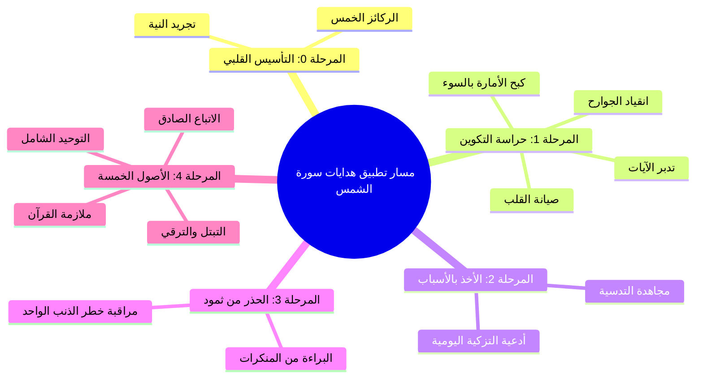

# 07 - خطة تطبيق الدروس: المسار العملي لتزكية النفس وهدايات سورة الشمس

> [!abstract] الغرض من هذا الملف
> تحويل الهدايات العلمية والتفسيرية المستفادة من سورة الشمس إلى **خطة عمل تنفيذية عملية** واضحة المعالم، تمكّن السالك وطالب العلم من تطبيق أصول التزكية ومجاهدة النفس خطوة بخطوة، مع إمكانية متابعة الإنجاز عبر مربعات الاختيار `- [ ]`.

---

## 🗺️ المراحل التنفيذية للخطة

---

## المرحلة 0: تصحيح النية وتفعيل ركائز التعامل مع القرآن (Phase 0)

> **الهدف:** تأسيس المنطلق الإيماني وتفعيل الخطوات الخمس الأساسية في التعامل مع كتاب الله قبل الشروع في المجاهدة.
> *المرجع:* [[01 - مقدمة خطوات التعامل مع القرآن والتكوين الرباعي للإنسان]]

- [ ] **إخلاص النية لله عز وجل:** استحضار مقصد التعلم والتزكية قبل كل جلسة علم، واستشعار السؤال: «لماذا اقتطعت هذا الوقت لتجلس؟».
  > من المحاضرة: «تستحضر نية صالحة نية طيبة، لماذا تجلس هذا المجلس؟ لماذا اقتطعت من وقتك هذا الوقت لتجلس؟ نسأل الله عز وجل أن يصلح نوايانا».
- [ ] **استيفاء خطوات التلقي والحفظ:** قراءة سورة الشمس بتؤدة وسماعها، وتثبيت حفظ آياتها مع مراعاة أحكام التلاوة.
- [ ] **استيفاء التفسير والتدبر:** مراجعة معاني مفردات السورة (الضحى، جلاها، طحاها، سواها، فجورها، دساها، بطغواها، دمدم) وتدبر دلالة الأحد عشر قسماً.
- [ ] **تحديد واجب العمل المباشر:** استخراج تكليف عملي واحد من كل مقطع من مقاطع السورة للبدء في تطبيقه فوراً.

---

## المرحلة 1: حراسة أركان التكوين الإنساني الأربعة (Phase 1)

> **الهدف:** ضبط بوصلة القلب، وكبح جماح النفس، وإعمال العقل في محله، وتسخير الجوارح في الطاعة.
> *المرجع:* [[01 - مقدمة خطوات التعامل مع القرآن والتكوين الرباعي للإنسان]] و [[02 - تفسير آيات القسم الأحد عشر وتدبر الآيات الكونية]]

- [ ] **حراسة [[القلب السليم]]:**
  - [ ] تفتيش القلب يومياً وتطهيره من واردات **الشبهات** في العقيدة والوحي.
  - [ ] تصفية القلب من شوائب **الشهوات** المحرمة والمطامع الدنيوية.
  - [ ] صرف الأعمال القلبية الخالصة لله وحده: المحبة، الخوف، الرجاء، والإنابة.
  > من المحاضرة: «القلب السليم هو الذي سلم من الشبهات، وسلم من الشهوات، وسلم من المخالفات، وسلم من كل أمر يعارض مراد الله عز وجل».
- [ ] **كبح جماح [[النفس الأمارة بالسوء]]:**
  - [ ] رفض الانقياد لنداءات النفس بالكسل والشبع المفرط والنوم الزائد وفضول النظر والسمع.
  - [ ] الترقي بها إلى **النفس اللوامة** بمحاسبتها الصارمة عند كل تقصير.
  - [ ] استحضار عداوتها اللدودة كالشيطان لحرمانها من غواية صاحبها.
- [ ] **إعمال العقل في التدبر والاعتبار:**
  - [ ] التفكر اليومي في آيات الله الكونية (الشمس، القمر، تعاقب الليل والنهار، إحكام بناء السماء).
  - [ ] تقديم نصوص الوحي المعصومة على الهوى والعقلانية المادية المجردة.
- [ ] **تسخير الجوارح كجنود للملك:**
  - [ ] إلزام اللسان بذكر الله والاستغفار.
  - [ ] إلزام الجوارح بالصلاة وقضاء حوائج المسلمين وكف الأذى.

---

## المرحلة 2: تفعيل أسباب التزكية ومدافعة التدسية (Phase 2)

> **الهدف:** بذل العبد لأسباب التزكية المشروعة لتحصيل هداية الله وفضله، والاستعاذة من خيبة التدسية.
> *المرجع:* [[03 - حقيقة التزكية والتدسية والجمع بين سببية العبد ومشيئة الرب]]

- [ ] **الملازمة اليومية لأدعية التزكية النبوية:**
  - [ ] ترديد: «اللَّهُمَّ آتِ نَفْسِي تَقْوَاهَا، وَزَكِّهَا أَنْتَ خَيْرُ مَنْ زَكَّاهَا، أَنْتَ وَلِيُّهَا وَمَوْلَاهَا» (3 مرات صباحاً ومساءً).
  - [ ] ترديد: «اللَّهُمَّ أَلْهِمْنِي رُشْدِي، وَأَعِذْنِي مِنْ شَرِّ نَفْسِي».
  - [ ] ترديد: «اللَّهُمَّ إِنِّي أَعُوذُ بِكَ مِنْ عِلْمٍ لَا يَنْفَعُ، وَمِنْ قَلْبٍ لَا يَخْشَعُ، وَمِنْ نَفْسٍ لَا تَشْبَعُ، وَمِنْ دَعْوَةٍ لَا يُسْتَجَابُ لَهَا».
- [ ] **مدافعة أسباب [[التدسية]]:**
  - [ ] حصر الرذائل والعيوب الشخصية والسعي في قطع أسبابها ومثيراتها.
  - [ ] صيانة النفس الكريمة عن الدنو والتحقير باجتناب مواطن المعاصي والشبهات.
  - [ ] الجمع الدائم بين **بذل الأسباب** و**افتقار القلب لمشيئة الله وتوفيقه**.
  > من المحاضرة: «التزكية من فعل العبد سبباً، ثم هي من فعل الرب نتيجةً ومنحةً وتوفيقاً».

---

## المرحلة 3: استحضار عبرة ثمود والحذر من شؤم الذنب والرضا به (Phase 3)

> **الهدف:** التحصن من أسباب الهلاك والاستئصال، واجتناب التواطؤ أو الرضا بالمنكرات.
> *المرجع:* [[04 - طغيان ثمود وعقر الناقة ودلالات الدمدمة وهيبة ولا يخاف عقباها]]

- [ ] **البراءة التامة من المنكرات وأهلها:**
  - [ ] الحذر الشديد من إقرار المعصية أو تأييد فاعلها أو الضحك لها، عملاً بالقاعدة: **«الراضي بالذنب كفاعله»**.
  > من المحاضرة: «طالما هم أيدوا هذا الذي قتل الناقة ومع أنهم لم يباشروا هذا الذنب إلا أنهم رضوا به، فالراضي بالذنب كفاعله تماماً».
- [ ] **استشعار خطر الذنب الواحد:**
  - [ ] التوبة الفورية من كل ذنب صغير أو كبير، وعدم الاستهانة بأي خطيئة لقوله: ﴿بِذَنبِهِمْ﴾.
- [ ] **استحضار هيبة بطش الجبار سبحانه:**
  - [ ] إحياء الخوف من الله في الخلوات، وتذكر قوله: ﴿وَلَا يَخَافُ عُقْبَاهَا﴾؛ فالله إذا أهلك وبطش لا يبالي بأحد.

---

## المرحلة 4: تحقيق الأصول الخمسة للتزكية ومجاهدة حتى الممات (Phase 4)

> **الهدف:** السير على الصراط المستقيم بأصول التزكية الخمسة والاستمرار في المجاهدة دون توقف حتى الوفاة.
> *المرجع:* [[05 - رسالة تزكية النفوس وأصولها الخمسة وثمراتها]]

| الأصل | الإجراء التنفيذي المطلوب | تم الإنجاز |
|:---|:---|:---:|
| **1. [[التوحيد]]** | تجريد التوحيد بأنواعه الثلاثة: إفراد الله بالخلق والتدبير (ربوبية)، وإفراده بالعبادة والرجاء والدعاء (ألوهية)، وإثبات ما أثبته لنفسه بلا تمثيل ولا تعطيل (أسماء وصفات). | - [ ] |
| **2. [[القرآن]]** | ورد يومي ثابت لا ينقطع من التلاوة والتدبر والعمل والتداوي بآيات الله. | - [ ] |
| **3. [[متابعة النبي ﷺ]]** | التزام الهدي النبوي الشريف في العبادات والسلوك والأخلاق ونبذ الابتداع. | - [ ] |
| **4. [[التبتل والتفاني في العبادة]]** | تخصيص أوقات خلوة وانقطاع للتعبد المحض (قيام ليل، صيام نافلة، تبتل ودعاء). | - [ ] |
| **5. [[الترقي في مراقي العبودية]]** | السير في منازل العبودية من التوبة إلى الصبر فالشكر والرضا والمحبة واليقين. | - [ ] |

- [ ] **ترسيخ شعار الثبات والمجاهدة المستمرة:**
  - [ ] التمسك بكلمة الإمام أحمد بن حنبل عند الموت: **«لا بَعْدُ حتى تخرج الروح»**.
  - [ ] اليقين بأن معركة التزكية لا تضع أوزارها إلا بوضع أول قدم في الجنة.

---

## 🛠️ عند التعطّل (Troubleshooting)

إذا واجه السالك عقبات أثناء تطبيق هذه الخطة، فليراجع التوجيهات التالية المستمدة من المحاضرة:

| المشكلة / العائق | سببه كما بينه المحاضر | العلاج العملي المباشر |
|:---|:---|:---|
| **ثقل الطاعة والرغبة في المعصية** | طبيعة النفس الأمارة بالسوء التي جُبلت على حب الفجور والتفلت ﴿بَلْ يُرِيدُ الْإِنسَانُ لِيَفْجُرَ أَمَامَهُ﴾. | إدراك أن هذا هو جوهر الابتلاء، وتذكير النفس بثمرة الفلاح في الجنة وخيبة من دساها. |
| **انتكاس العزيمة بعد الإقبال** | تأثير الخلطاء أو البيئة والإعلام (المؤثرات الخمسة المكتسبة). | تنقية الصحبة فوراً، ومقاطعة المحتوى الإعلامي الفاسد، وإلزام النفس بمجالس العلم. |
| **الشعور باليأس من إصلاح النفس** | توهم أن التزكية قدرة ذاتية محضة دون افتقار للرب. | اللجوء الفوري بالدعاء: «اللهم آت نفسي تقواها وزكها أنت خير من زكاها»؛ فالتزكية منحة وتوفيق من الله. |
| **الفتور في الاستمرار** | الغفلة عن حقيقة أن المعركة مستمرة حتى الموت. | استحضار موقف الإمام أحمد مع الشيطان على فراش الموت وترديد: «لا بعد حتى تخرج الروح». |
