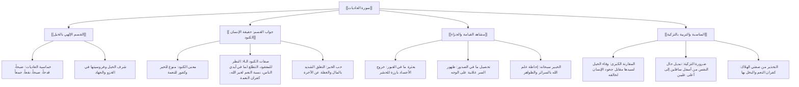

# 00 - الفهرس والخطة: تفسير سورة العاديات والوفاء للخالق

> [!info] عن هذه المحاضرة
> مجلس علمي وتفسيري وتربوي نافع يتناول **[[سورة العاديات]]** بالتحليل والتدبر؛ مستهلاً بـ **تحرير النية واستحضار سكينة القلب والفتح الإلهي**، ثم بيان **سر قسم الله بالخيل وخماسية أوصافها في ساحات الجهاد**، وصولاً إلى **تفسير جواب القسم في كَنود الإنسان وجحوده وحبه الشديد للمال**، واستعراض **مشاهد القيامة في بعثرة القبور وتحصيل الصدور**، وختاماً بـ **المناسبة البديعة بين وفاء الخيل لسيدها وجحود الإنسان لخالقه، وضرورة تزكية النفس للتخلص من صفتي كفران النعمة والبخل بها**.

## 📚 معلومات المصدر

| البند | البيان |
|:---|:---|
| **المصدر الأصلي** | `main_obsidian/دين/تفسير/سورة العاديات/تفريغ سورة العاديات .md` |
| **المادة** | درس تفسير وتربية إيمانية وتزكية نفس |
| **الموضوع الرئيسي** | تفسير سورة العاديات، وفاء الخيل ومقارنته بكنود الإنسان، وعلاج حب المال والتزكية |
| **عدد أسطر التفريغ** | 223 سطراً |
| **التوقيت** | غير متوفر في المصدر الأصلي — استُخدم ترقيم الأسطر كمرجع موضعي دقيق التزاماً بالأمانة العلمية |

> [!warning] تنبيه بخصوص التوقيت المرجعي
> التفريغ المصدر **لا يتضمن توقيتات زمنية**؛ والتزاماً صارماً بالأمانة العلمية وقواعد البروتوكول المعتمد، **لم تُختلق أي توقيتات زيفية**، بل استُخدم **ترقيم أسطر التفريغ الأصلي** كمرجع موضعي دقيق في جميع ملفات الحزمة.

---

## 🗺️ خطة الأجزاء وعناوينها الشاملة

| # | الملف | المحور والموضوع | نطاق الأسطر |
|:---:|:---|:---|:---:|
| 00 | [[00 - الفهرس والخطة]] | الفهرس وخطة المعالجة الشاملة ومنهجية التلخيص وخريطة المفاهيم | — |
| 01 | [[01 - المقدمة وتحرير النية وسر القسم بالحيوانات في القرآن]] | تحرير النية، بيعة الرضوان والسكينة، سر ذكر وأقسام الحيوانات في القرآن (النحل، النمل، العنكبوت، الفيل، الخيل) | 1–42 |
| 02 | [[02 - خماسية العاديات وتفسير آيات القسم الخمس]] | خماسية أوصاف الخيل في الجهاد (العاديات ضبحاً، الموريات قدحاً، المغيرات صبحاً، إثارة النقع، توسط جموع الأعداء) | 43–64 |
| 03 | [[03 - تفسير إن الإنسان لربه لكنود وصفات الكنود الأربع]] | جواب القسم، معنى الكنود لغةً وتفسيراً، شرف الخيل عند ابن القيم، والصفات الأربع القاتلة للإنسان الكنود | 65–117 |
| 04 | [[04 - تفسير وإنه لحب الخير لشديد ومشاهد يوم القيامة]] | شهادة الإنسان على نفسه، حقيقة حب الخير (المال)، قصر النظر على العاجلة، وبعثرة القبور وتحصيل الصدور | 118–144 |
| 05 | [[05 - المناسبة البديعة بين الخيل والإنسان ومشهد الجزاء وتحصيل الصدور]] | قاعدة «لا تكن الخيل أوفى منك»، وفاء الخيل مقابل خسّة طبع الإنسان غير المزكّى، علاجه بالتزكية، وظهور سر الصدور على الوجوه | 145–223 |
| 06 | [[06 - ملخص المراجعة السريعة]] | ملخص مكثف وجداول جامعة لكامل السورة والمحاضرة للمذاكرة السريعة | 1–223 |
| 07 | [[07 - أسئلة المراجعة والاختبار الذاتي]] | بنك أسئلة واختبار ذاتي مقالي وموضوعي مع الإجابات النموذجية | 1–223 |
| 08 | [[08 - خطة تطبيق الدروس]] | خطة عمل تنفيذية بمراحل عملية ومهام بمربعات اختيار `- [ ]` وعلاج التعطل | — |
| — | [[سورة_العاديات_ملف_مجمع]] | الملف المجمع النهائي الشامل لجميع الأجزاء بنصوصها الحرفية الكاملة دون مراجعة أو اختبارات أو توقيتات | 1–223 |

---

## 📐 منهجية المعالجة المعتمدة (وفق بروتوكول التلقينة)

1. **التطبيق المدمج الشامل:**
   - كل فقرة أو عنوان فرعي يُطبّق عليه البروتوكول كاملاً: تلخيص علمي منظم، استخراج الجداول والتصنيفات والتعريفات، الإشارة إلى نطاق الأسطر المرجعية، التنسيق بالألوان الهادئة المعتمدة، إدراج روابط WikiLinks، يعقبه مباشرة قسم **نص المتحدث الكامل** للفقرة دون حذف أي كلمة.
2. **مبدأ عدم تكرار المعلومة (البند 2.5️⃣):**
   - تُعرض كل معلومة في أقسام الملخص **مرة واحدة فقط** في الصيغة والوعاء الأنسب لها (تعريف، جدول، فائدة، تنبيه)، ولا تُكرر في وعاء آخر، والاستثناء الوحيد المسموح به هو قسم «نص المتحدث الكامل» لأنه النص الحرفي للتسجيل.
3. **دليل التنسيق بالألوان وقاعدة محاذاة النص العربي (RTL):**
   - ا الآيات والأحاديث والأدعية والقواعد الثابتة: باللون الذهبي الدافئ (`#D97706`).
   - ا التعريفات والمصطلحات والفوائد الرئيسية: باللون التركوازي الهادئ (`#0D9488`).
   - ا التحذيرات والأخطاء الشائعة والتنبيهات: باللون المرجاني الهادئ (`#E11D48`).
   - التزام صارم بوضع حرف ألف بدون همزة ثم مسافة (`ا `) قبل وسوم HTML لضبط المحاذاة من اليمين إلى اليسار وتجنب ارتباك المحاذاة.
4. **المراجعة الداخلية الخماسية:**
   - إجراء 5 مراجعات عشوائية في كل جزء (البداية، منتصف البداية، المنتصف، منتصف النهاية، النهاية) لمطابقة التفريغ كلمة بكلمة والتأكد من الأمانة العلمية التامة.

---

## 🧭 خريطة المفاهيم الإيمانية والعلمية في السورة

