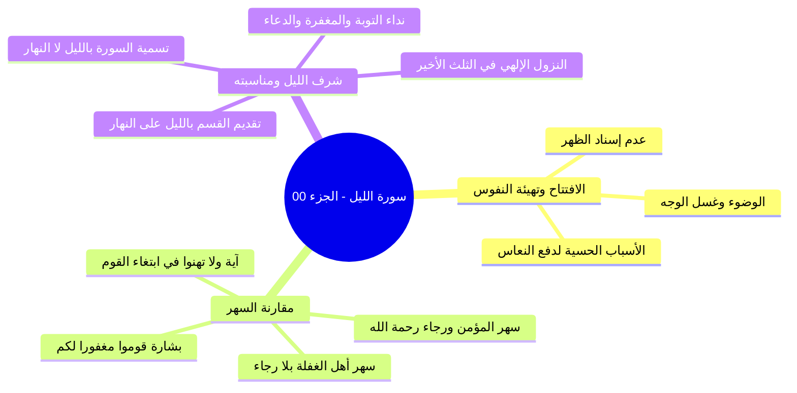

# خطة سورة الليل - مقدمة وفضل السهر في الطاعة وشرف الليل

> [!info] الهدف
> تلخيص وشرح تفريغ مجلس تفسير «[[سورة الليل]]» من قصار المفصل وفق بروتوكول التلخيص الشامل، وتوزيع المحتوى العلمي والتوجيهات الإيمانية على أجزاء دراسية مستقلة ومترابطة، مع صياغة ملف مجمع نهائي، وملخص مراجعة سريعة، وأسئلة اختبار ذاتي، وخطة تطبيقية للدروس.

---

## 🗺️ خريطة الأجزاء والعناوين

| # | العنوان والملف | المدى المرجعي بالتفريغ | المحتوى العلمي الرئيسي |
|:---:|:---|:---:|:---|
| 00 | [[00 - مقدمة وخطة الأجزاء وفضل الليل ومناسبته]] | الأسطر 1–64 | الافتتاح والدعابة الأخوية وتهيئة النفوس، السهر في طاعة الله واستحضار رجاء ما عند الله، شرف الليل ونزول الرب في الثلث الأخير، ومناسبة وقت المجلس لاسم السورة. |
| 01 | [[01 - خطوات التعامل مع القرآن ومفهوم الترجمة والقدوة]] | الأسطر 65–128 | خطوات التعامل العشر مع القرآن، تجسيد القرآن في الواقع (الترجمة)، نص كتاب «مدرسة السيرة» في صياغة الصحابة قرآناً حياً، أثر القدوة والتحذير من التناقض الصاد عن الدين. |
| 02 | [[02 - تلاوة سورة الليل وضبط الحروف وبلاغة المقابلات]] | الأسطر 129–182 | تلاوة السورة مع الحضور، ضبط الحروف اللثوية (الذال، الثاء، الظاء)، بلاغة السورة في فن «المقابلات» والتضاد البديعي، ومناسبة ترتيب النزول مع سورة الأعلى. |
| 03 | [[03 - تفسير الآيات (1-4) أقسام السورة وتفاوت سعي العباد]] | الأسطر 183–220 | أقسام السورة الثلاثة (الليل إذا يغشى، النهار إذا تجلى، وما خلق الذكر والأنثى)، فطرية الليل والنهار وذم قلب الفطرة، سنة الزوجية، وجواب القسم: ﴿إن سعيكم لشتى﴾. |
| 04 | [[04 - الرابط بين الشمس والليل وتزكية النفس وحديث التيسير]] | الأسطر 221–260 | الربط العضوي بين سورتي الشمس والليل، أقسام الشمس الـ 11 وسؤال التزكية، دور سورة الليل في بيان السعي العملي، حديث «اعملوا فكل ميسر»، وحرية اختيار المكلف. |
| 05 | [[05 - تفسير الآيات (5-7) العطاء والتقوى والتصديق بالحسنى]] | الأسطر 261–344 | أوجه معنى ﴿أعطى﴾ (مالية، بدنية، مركبة)، معنى ﴿واتقى﴾، الأوجه الستة في تفسير ﴿وصدق بالحسنى﴾ (الخلف، التوحيد، الشرائع، المجازاة، الإسلام، الجنة)، واختلاف التنوع. |
| 06 | [[06 - تفسير الآيات (8-10) التيسير لليسرى والبخل والاستغناء والعسرى]] | الأسطر 345–394 | تفسير ﴿فسنيسره لليسرى﴾، معاني البخل ومنع الماعون، معاني الاستغناء عن الله وبالدنيا والمال، قصة أيوب مع جراد الذهب، وكمون أمراض النفوس وطغيان الغنى. |
| 07 | [[07 - تفسير الآيات (11-13) خذلان المال إذا تردى وبيان الهدى]] | الأسطر 395–431 | تيسير العسرى ومقايضة المعاصي، صيغة «مناع للخير»، معاني ﴿وما يغني عنه ماله إذا تردى﴾ الأربعة، تكفل الله بالهدى وإرسال الرسل، وملك الله المطلق للآخرة والأولى. |
| 08 | [[08 - تفسير الآيات (14-21) نار تلظى وصفات الأشقى والأتقى ولسوف يرضى]] | الأسطر 432–475 | التحذير من نار تلظى، صفة الأشقى والتكذيب والتولي، نزول آيات الأتقى في أبي بكر، معاني ﴿يتزكى﴾ السبعة، كمال الإخلاص وقطع المنن، وبشارة ﴿ولسوف يرضى﴾. |
| 09 | [[09 - الفوائد التربوية والإيمانية وسنن التوفيق ومناقب الصديق]] | الأسطر 476–531 | سنة الله في توقف التوفيق على رغبة العبد وتسخير جوارحه، عظمة أبي بكر وعلو همته، معرفة العبد لثغره واستثماره للدين كما وظف الصديق ماله وأسرته، وخاتمة المجلس. |

---

## 📚 الملفات الإضافية الملحقة بالحزمة

- [[ملخص المراجعة السريعة]] — ملخص مكثف للمفاهيم والقواعد التفسيرية والتربوية لجلسات المذاكرة السريعة.
- [[أسئلة المراجعة والاختبار الذاتي]] — بنك أسئلة واختبارات شاملة بنظام القوائم المنسدلة (`details`).
- [[سورة الليل - تفسير وبيان وهدايات تربوية - ملف مجمع]] — الملف المجمع الشامل الذي يضم كامل محتوى الأجزاء ونصوص المتحدث كاملة بالنص.
- [[10 - خطة تطبيق الدروس]] — خطة تنفيذية مرتبة في مراحل ومربعات اختيار لتحويل معاني السورة إلى مسار عملي يومي.

---

> [!note] إحصائيات الحزمة
> - **إجمالي ملفات الأجزاء:** 10 أجزاء (من الجزء 00 حتى 09).
> - **الملفات الإضافية:** 4 ملفات (ملخص، اختبار، مجمع، خطة تطبيق).
> - **إجمالي ملفات العمل:** 14 ملفاً مستقلاً.

---

## 📝 الملخص العلمي المنظم للجزء 00

### 1. الافتتاح وملاطفة الحضور لتهيئة النفوس
- افتتح الشيخ المجلس بالحمد لله والصلاة والسلام على رسول الله ﷺ، وتخلل ذلك ممازحة خفيفة مع الحضور حول التكييف ومقاومة النعاس وتقديم رشفات من العصير والتمر؛ لتنشيط الهمم وتجاوز التعب البدني المعتاد في الساعات المتأخرة.
- التنبيه على ضرورة اتخاذ الأسباب الحسية لطرد النوم: كالوضوء، غسل الوجه بالماء البارد، تناول تمرات، والامتناع عن إسناد الظهر؛ لأن إسناد الظهر يجلب التراخي والنعاس.

### 2. السهر بين رجاء المؤمن وغفلة العابث
- استدل الشيخ بقول الله تعالى:
  - ا ﴿وَلَا تَهِنُوا فِي ابْتِغَاءِ الْقَوْمِ ۖ إِن تَكُونُوا تَأْلَمُونَ فَإِنَّهُمْ يَأْلَمُونَ كَمَا تَأْلَمُونَ ۖ وَتَرْجُونَ مِنَ اللَّهِ مَا لَا يَرْجُونَ﴾ [النساء: 104].
- المقارنة الفاصلة بين نوعين من السهر:
  - **سهر أهل الدنيا والفسوق:** سهر وتعب وبذل أموال في اللهو والمعاصي وما لا طائل تحته ولا أجر فيه.
  - **سهر أهل الإيمان ومجالس العلم:** تعب وبذل في طاعة الله وطلب مرضاته، يرجون مغفرة الذنوب، وحصول الرحمات، والظفر ببشارة:
    - ا «قُومُوا مَغْفُوراً لَكُمْ».

| وجه المقارنة | سهر أهل الغفلة والفسوق | سهر أهل الإيمان ومجالس العلم |
|:---|:---|:---|
| **الغاية والنية** | لهو، معاصٍ، متعة فانية، إضاعة الأوقات | ابتغاء مرضاة الله، طلب العلم، قيام الليل |
| **المعاناة والجهد** | سهر وتعب وبذل للأموال والأوقات بلا ثواب | مقاومة للنوم ومجاهدة للنفس وبذل مأجور |
| **النتيجة والرجاء** | انقضاء المتعة، ثقل المعصية، خسران الآخرة | حصول المغفرة، رفع الدرجات، ورجاء ما عند الله |

### 3. شرف الليل في التصور الإسلامي
- الليل من أشرف الأوقات وساعات المناجاة للمؤمن، وله مزايا عظمى:
  - اختيار الله عز وجل الليل لوقت النزول الإلهي في الثلث الأخير؛ حيث ينزل ربنا تبارك وتعالى نزولاً يليق بجلاله وكماله إلى السماء الدنيا فينادي:
    - ا «هَلْ مِنْ دَاعٍ فَأَسْتَجِيبَ لَهُ؟ هَلْ مِنْ مُسْتَغْفِرٍ فَأَغْفِرَ لَهُ؟ هَلْ مِنْ تَائِبٍ فَأَتُوبَ عَلَيْهِ؟».
  - نزول السكينة والرحمات والبركات ونزول الملائكة.
- **لطيفة قرآنية في التسمية والقسم:**
  - سمّى الله السورة بـ «سورة الليل»، ولا يوجد في كتاب الله سورة باسم «سورة النهار».
  - قدّم الله القسم بالليل على النهار في مطلعها فقال: ﴿وَاللَّيْلِ إِذَا يَغْشَىٰ * وَالنَّهَارِ إِذَا تَجَلَّىٰ﴾.

---

## 🧭 خريطة المفاهيم الذهنية (Mindmap)

---

## 🔍 المراجعة الداخلية (5 أسئلة تحقق سريعة)

1. **س:** ما الآية التي استشهد بها الشيخ للتفريق بين سهر أهل الطاعة وسهر أهل اللهو؟
   - **ج:** قوله تعالى: ﴿إِن تَكُونُوا تَأْلَمُونَ فَإِنَّهُمْ يَأْلَمُونَ كَمَا تَأْلَمُونَ ۖ وَتَرْجُونَ مِنَ اللَّهِ مَا لَا يَرْجُونَ﴾.
2. **س:** ما الوسائل الحسية العملية التي نبّه الشيخ عليها لمغالبة النوم في مجالس العلم؟
   - **ج:** الوضوء، غسل الوجه بالماء، أكل بضع تمرات، والجلوس بانتصاب دون إسناد الظهر.
3. **س:** ما سبب شرف الليل على النهار في أوقات التعبد كما ذكر الشيخ؟
   - **ج:** لشرف ما يقع فيه من النزول الإلهي إلى السماء الدنيا كل ليلة في الثلث الأخير، ونزول الرحمات واستجابة الدعوات للمستغفرين والسائلين.
4. **س:** ما هي اللطيفة القرآنية المتعلقة بأسماء السور ومطالع القسم في سورة الليل؟
   - **ج:** تسمية السورة باسم الليل ولا توجد سورة باسم النهار، وتقديم القسم بالليل على النهار في مطلعها.
5. **س:** ما البشارة النبوية المرجوة لأهل مجالس الذكر والعلم في ختام مجالسهم؟
   - **ج:** أن يقال لهم: «قوموا مغفوراً لكم قد بُدلت سيئاتكم حسنات».

---

## 🗣️ نص المتحدث الكامل (من الأسطر 1 إلى 64)

> السلام ورحمه اللهعين
>
> انت حد حد على السلامه سلام جزاك الله حط لا اله الا الله حاجه عايز تهدي التكييف ده شويه او ارفع الريش فوق ربنا يرزقك بريشه حلوه كده
>
> ريشهضاني ارفع ارفع ارفع
>
> انت كده محتاج خروف
>
> لا لا مراحل
>
> جزاك الله خير السلام عليكم ورحمه الله وبركاته
>
> وعليكم السلام ورحمه اللهلام ورحمه الله وبركاته ما
>
> فيش حاجه للناس دي الناس اللي قاعده سهرانه دي اي رشه عصير كده متاخر يا سيدنا
>
> سامحني عندي
>
> كانت الدنيا
>
> والله كان في مش تعين كده يعني حاجه لاخوك ولا حاجه المره اللي مكسرين
>
> خلاص بقى فاتت بقى صلي على الرسول صلى الله عليه وسلم
>
> في حاجات حلوه يعني تشوقني انت كده
>
> تين
>
> الله
>
> يعني عيد سوره التين تاني يعني انا اديكم العلم وتعملوا بيه من وراياطبقه عامله يا سيد
>
> نعم
>
> الطبقه عامله
>
> اه
>
> اسمك ايه
>
> حمزه
>
> حمزه وماله حمزه معانا النهارده الله
>
> لسه برده من شويه حد اسمه حمزه
>
> حد تاني فوق يا شيخ احمد
>
> في تحت
>
> ممكن يكون حد نايم فوق كده يمين ولا شمال
>
> ما تقلقش منامه يعني سيبه اللي ورا العمودشوف
>
> اللي ورا العمود
>
> خليه في السكينه
>
> سيبه وشيل العمود السلام عليكم ورحمه الله وبركاته. السلام ورحمه الله.
>
> اعوذ بالله من الشيطان الرجيم. بسم الله الرحمن الرحيم. الحمد لله رب العالمين والصلاه والسلام على اشرف الانبياء والمرسلين سيدنا محمد وعلى اله واصحابه اجمعين. يعني قبل ما نبدا درسنا في بعض المعاني ا محتاجين ان احنا نذكر في هذا الوقت يعني ان هي دلوقتي الساعه كام وخلاص وكله فصل والدماغ نامت الفراخ نامت يا عم نام يا ولا الفراخ نامت خدت بالك بس سبحان الله حتى الفراخ بيبقى عندها يقظه بيقول له يا بني لا يكن الديك اكياس منك يسبح او يؤذن وانت نائم الديك بيصحى امتى صح للفجر ده ناصح ده ديك
>
> سبحان الله العظيم ساعتين
>
> نعم
>
> اصحاب الفجر ساعه ساعتين
>
> اه ساعه ساعتين كده بتاع
>
> الديك بتاع النهارده م انتكست فطرتها برض ولا مادش اصلا
>
> اللي كنت عايز اقوله يعني سبحان الله العظيم ذكرت قول الله عز وجل ولا تهنوا في ابتغاء القوم ان تكونوا تالمون فانهم يالمون كما تالمون لكن الفارق الفارق بين المسلم بين المؤمن وبين الفاسق والفاجر والعياذ بالله ان المؤمن يرجو من الله عز وجل رحمته وفضله وبره واحسان انه وجوده ومغفرته وعطائه كل خير من الله اما هذا فلا يرجو ف ان تكونوا تسهرون
>
> فانهم يسهرون
>
> فانهم يسهرون كما تسهرون
>
> لكن
>
> وترجون من الله
>
> ما لا رج تكونوا تتعبون
>
> فانهم يتعبون كما تتعبون وترجون من الله
>
> ما لا يرجون ان تكونوا تبذلون فانهم يبذلون وينفقون كما تنفقون وترجون من الله
>
> ما ترجون دلوقتي في ناس لسه الليل بتاعها هيبدا
>
> والسهره لسه تحمر وتحلو زي ما بيقولوا يعني للصبح بقى ومش عارف الكلام ز** فيه ده لكن انت سبحان الله العظيم انت انت سهران في طاعه الله في مرضاه الله ان احسنت النيه ان اخلصت النيه
>
> وابتغيت بذلك مرضاه الله عز وجل وان تري الله عز وجل من نفسك يا رب انا انا نفسي انام الشده يعني ايه نفسي انام لكن انا مش هنام انا هقاوم انا هتغلب على نفسي انا ممكن اقوم اتوضى ممكن اقوم اغسل وشي بشويه ميه ممكن اكل تمرتين ثلاثه المهم اعمل اي حاجه انها ايه اعمل اي حاجه ان انا افوق علشان ان اصيب في هذا المجلس باذن الله عز وجل خيرا اسال الله عز وجل ان يكتب لنا في هذه الساعه خير ما يكتبه لعباده الصالحين
>
> امين
>
> وان يجعلنا ممن يقال لهم قوموا مغفورا لكم
>
> امين
>
> امين امين امين امين ووالدينا
>
> ومشايخنا واهلنا وذرياتنا واولادنا اجمعين والمسلمين
>
> امين خاصه احنا اعظم اعظم ساعات اليوم يوم الجمعه يوم الجمعه يوم
>
> نعم حتى سبحان سبحان الله العظيم من المناسبات الجميله ان اول مره اظن نبدا دلوقتي المتاخر ده
>
> خدت بالك ما فيش مره قبل كده بدانا متاخر كده
>
> ويصادف هذا الامر ان احنا النهارده معانا سوره الليل
>
> ما شاء الله
>
> على غير موعد يعني والليل طبعا الليل وشر الليل هو من اشرف من اشرف الاوقات ومن اشرف الساعات للمؤمن ا الليل وذلك لان الله عز وجل حينما اراد ان يتنزل لعبادي في كل يوم اختار الله عز وج اختار الله عز وجل من الزمان اشرفه فاختار الله عز وجل الليل ولا النهار
>
> الليل
>
> فشرف الليل لشرف ما يحدث فيه من نزول الم ملائكه طب ونزول الرحمات والبركات والسكينه هل من داع فاستجيب له هل من مستغفر فاغفر هل من داع فاستجيب له هل من تائب فاتوب كل ده بيبقى امتى
>
> كل ده بالليل كل ده بالليل فلذلك شرف الليل على غيره لذلك والعلم عند الله اقسم الله عز وجل في سوره الليل فبدا سماها الاول حاجه سماها سوره
>
> ما فيش في القران سوره النهار مبدئيا كده وحينما اقسم الله عز وجل في السوره بدا بالليل على النهار فقال سبحانه والليل اذا
>
> والنهار اذا تجلى ماشي ندخل السوره
>
> بسم الله

---

## 📊 حالة الإنجاز ومسار الأجزاء
- **إجمالي الأجزاء:** 10 أجزاء (00–09).
- **الجزء الحالي:** 00.
- **الأجزاء المتبقية:** 9 أجزاء.

---

## ⏭️ الانتقال التالي
- الانتقال إلى: [[01 - خطوات التعامل مع القرآن ومفهوم الترجمة والقدوة]]
