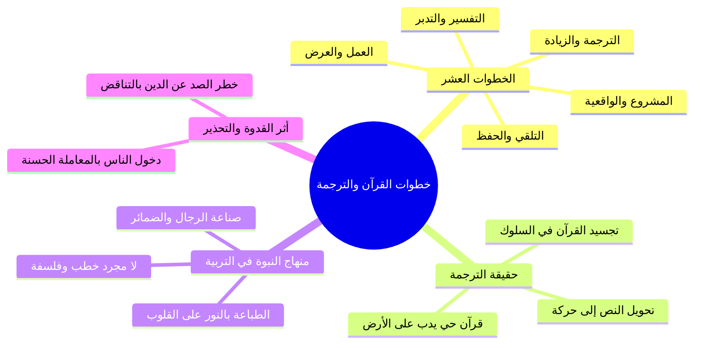

# خطوات التعامل مع القرآن ومفهوم الترجمة والقدوة

> [!info] بيانات الجزء
> - **المدى المرجعي بالتفريغ:** الأسطر 65–128.
> - **المحور العام:** مراجعة خطوات التعامل العشر مع القرآن الكريم، والتركيز على خطوة «الترجمة» وتجسيد القرآن في سلوك بشري واقعي، ونقل كلام نفيس من كتاب «مدرسة السيرة»، وأثر القدوة الحية في الدعوة، والتحذير من التناقض الصاد عن دين الله.

---

## 📝 الملخص العلمي المنظم للجزء 01

### 1. خطوات التعامل العشر مع القرآن الكريم
- راجع الشيخ مع الحضور الخطوات المنهجية العشر في فقه التعامل مع القرآن:
  1. ا التلقي: أخذ القرآن واستماعه من الشيوخ المتقنين.
  2. ا الحفظ: استظهار الآيات وضبط ألفاظها في الصدر.
  3. ا التفسير: فهم معاني الكلمات وسياق الآيات وأسباب نزولها.
  4. ا التدبر: استخراج الهدايات والعظات والتأمل في مراد الله.
  5. ا العمل: امتثال الأوامر واجتناب النواهي على صعيد الفرد.
  6. ا العرض: عرض النفس وأخلاقها وأحوالها على القرآن لمحاسبتها وتصحيح مسارها.
  7. ا المشروع: أن يتبنى المسلم مشروعاً قرآنياً عملياً يخدم به أمته.
  8. ا الواقعية: تنزيل آيات القرآن على الواقع المعاش لمعالجة قضاياه ونوازله.
  9. ا الترجمة: تجسيد معاني القرآن وأحكامه في حركة واقعية وسلوك بشري ظاهر.
  10. ا الزيادة: الاستزادة المستمرة والترقي في مراتب الإيمان والعمل دون توقف.

### 2. مفهوم «الترجمة» وتجسيد القرآن في الواقع
- معنى الترجمة: ألا يبقى القرآن مجرد نصوص مكتوبة أو مواعظ مسموعة، بل يتحول إلى «حركة» يراها الناس، بحيث يتجسد كلام الله عز وجل في شخصية إنسانية سوية يراها الناس فيرون تطبيق الإسلام.

### 3. نص نفيس من كتاب «مدرسة السيرة»
- استشهد الشيخ بنص من كتاب والده حفظه الله («مدرسة السيرة النبوية - الجزء الثالث: ما بعد أحد إلى غزوة بني قريظة»)، وخلاصته:
  - ا «ولقد انتصر سيدنا النبي محمد ﷺ يوم صنع أصحابه صوراً حية من إيمانه، تأكل الطعام وتمشي في الأسواق».
  - ا «يوم صاغ من كل منهم قرآناً حياً يدب على الأرض، وجعل من كل فرد نموذجاً مجسماً للإسلام يراه الناس فيرون الإسلام».
  - النصوص وحدها لا تصنع شيئاً، والمصحف وحده لا يعمل حتى يكون رجلاً.
  - المبادئ وحدها لا تعيش إلا أن تكون سلوكاً.
  - هدف النبي ﷺ الأول لم يكن إلقاء المواعظ ولا تدبيج الخطب ولا إقامة فلسفة مجردة، بل كان:
    - أن يصنع رجالاً تلمسهم الأيدي وتراهم العيون.
    - أن يصوغ ضمائر ويبني أمة تجسد عقيدة الإسلام.
  - لم يطبع النبي ﷺ مئات النسخ من المصاحف بالمداد على صحائف الورق، بل طبعها بالنور على صحائف القلوب، ثم أطلقها تخالط الناس وتأخذ وتعطي وتقول بالفعل والعمل: هذا هو الإسلام.

### 4. القدوة وأثرها في الدعوة والتحذير من الصد عن سبيل الله
- لما انطلق الصحابة رضي الله عنهم في مشارق الأرض ومغاربها، رأى الناس فيهم خلقاً جديداً لم تعهده البشرية، فاندفع الناس يحققون الإسلام في ذواتهم بالقدوة ودخلوا في دين الله أفواجاً.
- هذا المعنى هو سر انتشار الإسلام في بقاع شتى (كإندونيسيا وجنوب شرق آسيا) وفي بلاد الغرب؛ حيث أسلم كثيرون بسبب صدق معاملات المسلمين وأمانتهم.

> ⚠️ تنبيه وتحذير شديد
> ا التناقض بين الظاهر والسلوك يصد عن سبيل الله: نبه الشيخ على أن أخطر ما يصيب المجتمع المسلم أن يظهر شخص بمظهر الالتزام الديني والسمت الصالح، ثم تصدر منه خيانات في المعاملات المالية كأكل أموال الناس بالباطل أو الغش أو سوء الخلق؛ فإن ذلك يصد الناس عن دين الله ويورث بغض الملتزمين، والواجب أن يعلم كل مسلم أنه قدوة على ثغرة من ثغور الإسلام.

---

## 🧭 خريطة المفاهيم الذهنية (Mindmap)

---

## 🔍 المراجعة الداخلية (5 أسئلة تحقق سريعة)

1. **س:** ما هي الخطوات العشر المنهجية في التعامل مع القرآن الكريم؟
   - **ج:** التلقي، الحفظ، التفسير، التدبر، العمل، العرض، المشروع، الواقعية، الترجمة، الزيادة.
2. **س:** ما المقصود بخطوة «الترجمة» كما بينها الشيخ؟
   - **ج:** ترجمة القرآن إلى حركة واقعية، وتجسيد كلام الله في شخصية وسلوك إنساني يراه الناس رأي العين.
3. **س:** كيف وصف كتاب «مدرسة السيرة» صناعة النبي ﷺ لأصحابه الرعيل الأول؟
   - **ج:** بأنه صاغ من كل منهم «قرآناً حياً يدب على الأرض»، ونموذجاً مجسماً للإسلام يراه الناس فيرون الإسلام.
4. **س:** لماذا لا تكفي المواعظ والنصوص المجردة وحدها في بناء الأمة؟
   - **ج:** لأن النصوص والمصاحف لا تعمل وحدها حتى تتحول إلى رجال وسلوك عملي يلمسه الناس ويتأسون به.
5. **س:** ما التحذير الذي وجهه الشيخ للمنتسبين إلى الالتزام والتدين؟
   - **ج:** التحذير من التناقض بين المظهر والمعاملة (كأكل الأموال أو سوء الخلق)؛ لما فيه من الصد الشديد عن دين الله وبغض التدين.

---

## 🗣️ نص المتحدث الكامل (من الأسطر 65 إلى 128)

> من يذكرنا بالخطوات التي ذكرناها في التعامل مع القران
>
> اول حاجه
>
> التلقي
>
> ها التلقي
>
> الحفظ
>
> تفسير تدبر
>
> العمل
>
> العمل
>
> عرض
>
> عرض
>
> مشروع
>
> مشروع
>
> الواقعيه
>
> الواقعيه
>
> الترجمه
>
> الترجمه
>
> الزياده
>
> الزياده بمناسبه الترجمه انا جبت لكم الفقره اللي انا كنت حابب اقراها لكم في موضوع الترجمه ان المقصود ماشي لو حد يعني ايه حد عاوز يفوق يغسل وشه حد عايز يتوضى حد عايز ما يسندش ظهره لان سنده الظهر بترخي وبتجيب النوم خدت بالك حد عايز يشرب حاجه فيقوم يعمل كوبايه شاي المهم يعني انتوا ايه يعني عايزكم بس اهم حاجه ان احنا نستفيد يعني ان شاء الله
>
> ان شاء الله
>
> في مساله الترجمه قلنا ان معنى الترجمه انك تترجم القران الى الى حركه بمعنى
>
> ان تجسد هذا القران الذي هو كلام الله عز وجل بان يكون مجسدا في شخصيه انسان تعال بقى نقرا بقى كلام زي الفل بس عايز ناس
>
> زي الفل صليت على الرسول
>
> هو انتوا يعني ناس زي الفل ان شاء الله صليت على
>
> سيدنا الوالد حفظه الله تعالى بيقول في كتاب مدرسه السره الجزء الثالث اللهم باركد
>
> ما بعد ما بعد غزوه احد ده اجدد جزء نزل ربنا يا رب يتمه على خير ويتم الوالد على خير ويتم بقيه السيره
>
> في مدرسه السيره النبويه ما بعد احد الى غزوه بني قريض ذكر هنا فقره جميله قال وهي فقره منقوله قال ا ولقد انتصر سيدنا النبي محمد
>
> صلى الله عليه وسلم
>
> الكلام ده بقى عايز بقى يا عم الشيخ محمد عم الشيخ علي عايز ناس ايه؟ عايز ناس مصحصحه ولقد انتصر سيدنا النبي محمد
>
> صلى الله عليه وسلم
>
> يوم صنع اصحابه صورا حيه من ايمانه
>
> تاكل الطعام وتمشي وتمشي في الاسواق يوم صاغ من كل منهم اللي هم الراعيل الاول بقى يوم صاغ النبي صلى الله عليه وسلم من كل منهم قرانا حيا يدب على الارض
>
> يوم جعل من كل فرد نموذجا مجسما للاسلام يراه الناس فيرون الاسلام
>
> ده مين
>
> الصحابه
>
> الصحابه ان النصوص وحدها لا تصنع شيئا وان المصحف وحده لا يعمل حتى يكون رجلا القران ده تحس بيه لما تلاقيه ايه
>
> مجسد اما تشوفه في بني ادم تقول هو ده الاسلام هو ده القران وان المبادئ وحدها لا تعيش الا ان تكون سلوكا ومن ثم يعني لاجل ذلك جعل رسول الله صلى الله عليه وسلم هدفه الاول ان يصنع رجالا ان يلقي مواعظ وان يصوغ ضمائر لا ان يدبج خطبا وان يبني امه لا ان يقيم فلسفه اما الفكره ذاتها فقد تكفل بها القران الكريم فكان عمل سيدنا النبي صلى الله عليه وسلم ان يحول الفكره المجرده الى رجال تلمسهم الايدي وتراهم العيوب فلما انطلق هؤلاء الرجال في مشارق الارض ومغاربها ها راى الناس فيهم ترجمه حيه لدين محمد
>
> صلى الله عليه وسلم
>
> كلام واضح
>
> نعم
>
> ان يحول الفكره المجرده الى رجال تلمسهم الايدي وتراهم العيون فلما انطلق هؤلاء الرجال في مشارق الارض ومغاربها راى الناس فيهم ترجمه حيه لدين محمد صلى الله عليه وسلم كانوا تجسيدا فعليا لعقيده الاسلام والمنهج الذي جاء به رسول الله
>
> صلى الله
>
> صلى الله عليه وسلم
>
> فلما راوهم لما الناس شافوا الناس دول الناس صنعت ازاي دي ايه ده مين ابو بكر سيدنا ابوكر سيدنا عمر
>
> الناس دي انت تشوفهم تراهم ترى الاسلام تراهم ترى القران فلما راوهم راوا خلقا جديدا لا عهد للبشريه به عندئذ امن الناس ودخلوا في دين الله افواجا لما شافوا ايه مع ان القران ما بين الناس بس ما امنوش الا لما شافوا ايه لما رشفوا القران ده متجسد في اشخاص هم بيتعاملوا معاهم وشايفينهم قدامهم كده
>
> نعم لانهم راوا الرجل الذي تتمثل فيه عقيده الاسلام وشريعته فاندفعوا يحققونها في ذواتهم بالقدوه فيسلكون نفس الطريق خلف ذلك النبي صلى الله عليه وسلم
>
> لقد انتصر سيدنا النبي صلى الله عليه وسلم يوم صاغ من فكره الاسلام شخوصا وحول ايمانهم بالاسلام عملا وطبع من المصحف عشرات من النسخ بل مئات والوفا ولكنه لم يطبعها بالمداد على صحائف الورق وانما طبعها بالنور على صحائف القلوب
>
> اللهم صل وسلم
>
> صلى الله
>
> ثم اطلقها تعامل الناس وتاخذ منهم وتعطي وتقول بالفعل والعمل ما هو الاسلام الذي جاء به محمد
>
> صلى الله عليه وسلم
>
> صلى الله عليه وسلم
>
> عرفت يعني ايه الترجمه
>
> احنا محتاجين الترجمه دي
>
> اللهزقنا الترجمه واض شوف يعني بيقول لك انتصر سيدنا النبي صلى الله عليه وسلم امتى لما حول القران ده الى في ايه
>
> في اشخاص
>
> اللي يشوفهم يشوف ي القران اللي يشوفهم يشوف الاسلام اللي يشوفهم يحب يحب الدين ويحب السنه ويحب الالتزام اللي مجرد بس ان يشوف يقول له يا اخي انا حبيت الصلاه بسببك يقول له اخي انا حبيت الملتزمين بسببك بسبب معاملتك او بسبب كلمتك او بسبب سمتك وتعاملاتك مع الناس هو ده ان الناس يحتاجون اكثر ليس الى الناس لا يحتاجون الى كثير كلام ده سبب
>
> ولا كثير مواعظ نعم يا سي
>
> سبب اسلام كتير قوي في اوروبا بسبب معاملات المسلمين
>
> ما احنا محتاجين ده في المسلمين نفسهم المسلمين في اوروبا في امريكا له قدوات منه فبدا
>
> احنا محتاجين اكتر القدوات دي هنا ما بينا احنا المسلمين والا بتبص تلاقي اخ او بلاش اخاهره الالتزام وبتصدر منه افعال وتصدر منه اخطاء بيصد الناس عن دين صدودا
>
> اعوذ بالله
>
> بس يقول له يا اخي انا كرهت الشيوخ بسبب معاملتك يا يقول له انا كرهت الدين بسبب انت مش عارف ايه انت مثلا كال عليه فلوس او تعامل خلي بالك علشان انت بين الناس
>
> قدوه
>
> قدوه فاما ان تكون قدوه حسنه واما ان تكون واما ان يكون غير ذلك والعياذ بالله ده الكلمتين بتوع الترجمه كلمتين يعني حلوين قوي بحب اقراهم فقلت يعني ايه اشارككم معايا في تدوق تدوقوا حاجه حلوه من دي يلا نقرا سوره اللي

---

## 📊 حالة الإنجاز ومسار الأجزاء
- **إجمالي الأجزاء:** 10 أجزاء (00–09).
- **الجزء الحالي:** 01.
- **الأجزاء المتبقية:** 8 أجزاء.

---

## ⏭️ الانتقال التالي
- الانتقال إلى: [[02 - تلاوة سورة الليل وضبط الحروف وبلاغة المقابلات]]
