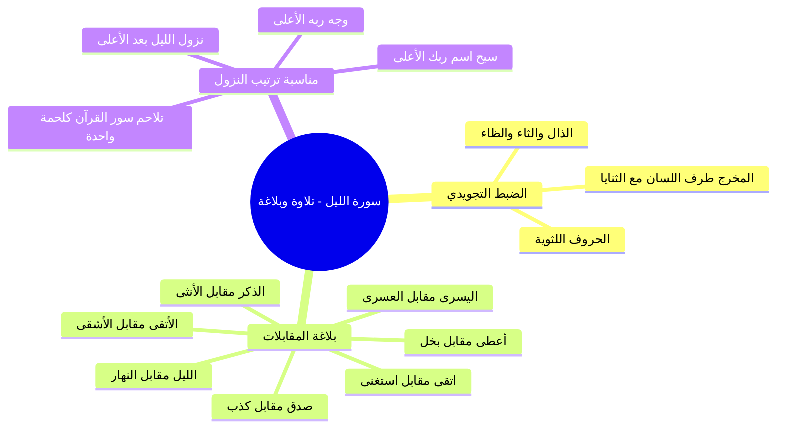

# تلاوة سورة الليل وضبط الحروف وبلاغة المقابلات

> [!info] بيانات الجزء
> - **المدى المرجعي بالتفريغ:** الأسطر 129–182.
> - **المحور العام:** تلاوة سورة الليل مع الحضور وتصحيح مخارج الألفاظ، الضبط التجويدي للحروف اللثوية، بلاغة السورة في فن «المقابلات» والتضاد المتناسق، ومناسبة ترتيب النزول بين سورتي الأعلى والليل.

---

## 📝 الملخص العلمي المنظم للجزء 02

### 1. تلاوة آيات السورة وضبط الحروف اللثوية
- قرأ الشيخ مع الحضور آيات سورة الليل بالتلقي آية آية.
- نبه الشيخ على ضرورة إخراج اللسان عند النطق بحرف الذال في قوله تعالى: ﴿وَمَا خَلَقَ الذَّكَرَ وَالأُنْثَىٰ﴾.
- **الضابط الصوتي التجويدي:**
  - ا الحروف اللثوية الثلاثة: هي (الذال - الثاء - الظاء).
  - مخرجها: من طرف اللسان مع أطراف الثنايا العليا، والخطأ الشائع فيها نطقها كحروف صفير (زاى أو سين).

### 2. الإعجاز البلاغي: فن «المقابلات» في سورة الليل
- استعرض الشيخ الجماليات البيانية في سورة الليل، مبيناً أنها بُنيت على فن بلاغي رفيع هو «المقابلة»؛ وهو أن يُؤتى بمعنيين أو أكثر ثم يُؤتى بما يقابل ذلك على الترتيب ليتضح المعنى بالضد: «وبضدها تتبين الأشياء».

| المعنى الأول (الفريق الأول / الحال الأول) | المقابل له في السورة (الفريق الثاني / الحال الثاني) | الدلالة البلاغية والتربوية |
|:---|:---|:---|
| **الليل** ﴿وَاللَّيْلِ إِذَا يَغْشَىٰ﴾ | **النهار** ﴿وَالنَّهَارِ إِذَا تَجَلَّىٰ﴾ | تقابل الزمانين: ظلام وسكون مقابل ضياء وانتشار |
| **الذكر** ﴿وَمَا خَلَقَ الذَّكَرَ﴾ | **الأنثى** ﴿وَالأُنثَىٰ﴾ | تقابل الزوجية في الخلق لحفظ النسل وسنة التناسل |
| **أعطى** ﴿فَأَمَّا مَنْ أَعْطَىٰ﴾ | **بخل** ﴿وَأَمَّا مَن بَخِلَ﴾ | تقابل السعي المالي والبدني: بذل وسخاء مقابل شح ومنع |
| **اتقى** ﴿وَاتَّقَىٰ﴾ | **استغنى** ﴿وَاسْتَغْنَىٰ﴾ | تقابل الحال القلبي: خشية وافتقار مقابل طغيان واستغناء |
| **صدق بالحسنى** ﴿وَصَدَّقَ بِالْحُسْنَىٰ﴾ | **كذب بالحسنى** ﴿وَكَذَّبَ بِالْحُسْنَىٰ﴾ | تقابل الاعتقاد: يقين بالوعد والجزاء مقابل تكذيب وجحود |
| **اليسرى** ﴿فَسَنُيَسِّرُهُ لِلْيُسْرَىٰ﴾ | **العسرى** ﴿فَسَنُيَسِّرُهُ لِلْعُسْرَىٰ﴾ | تقابل العاقبة والمآل: تيسير للجنة والخير مقابل تيسير للشر والنار |
| **الأولى** ﴿وَإِنَّ لَنَا لَلآخِرَةَ وَالأُولَىٰ﴾ | **الآخرة** ﴿وَإِنَّ لَنَا لَلآخِرَةَ وَالأُولَىٰ﴾ | تقابل الدارين في الملك والتصرف الإلهي التام |
| **الأتقى** ﴿وَسَيُجَنَّبُهَا الأَتْقَى﴾ | **الأشقى** ﴿لا يَصْلاهَا إِلاَّ الأَشْقَى﴾ | تقابل المصير النهائي للعباد: نجاة ورضا مقابل صلي وتلظٍّ |

### 3. مناسبة ترتيب النزول بين سورة الأعلى وسورة الليل
- ترتيب سور المصحف العثماني توقيفي، أما ترتيب النزول التاريخي فجاءت فيه سورة الليل بعد سورة الأعلى مباشرة (نزلت: اقرأ، ثم المدثر، المزمل، القلم... ثم الأعلى، ثم الليل، ثم الفجر).
- **وجه المناسبة والالتحام:**
  - ختم الله سورة الليل بقوله: ﴿إِلاَّ ابْتِغَاءَ وَجْهِ رَبِّهِ الأَعْلَىٰ﴾.
  - والسورة التي نزلت قبلها مباشرة في الترتيب الزمني هي «سورة الأعلى» ﴿سَبِّحِ اسْمَ رَبِّكَ الأَعْلَى﴾.
  - هذا التشابك البديع يثبت أن سور القرآن يرمي بعضها إلى بعض بخيوط لتتشابك أطرافها وتكون لحمة واحدة تنزيلاً من حكيم حميد.

---

## 🧭 خريطة المفاهيم الذهنية (Mindmap)

---

## 🔍 المراجعة الداخلية (5 أسئلة تحقق سريعة)

1. **س:** ما هي الحروف اللثوية التي نبّه الشيخ على مخرجها عند تلاوة السورة؟
   - **ج:** الذال، الثاء، الظاء؛ وتخرج من طرف اللسان مع أطراف الثنايا العليا.
2. **س:** ما الفن البلاغي البارز الذي قامت عليه سورة الليل؟
   - **ج:** فن «المقابلة» بين المعاني المتضادة على سبيل الترتيب والتقابل التام.
3. **س:** اذكر ثلاثة أزواج من المقابلات الواردة في السورة.
   - **ج:** (الليل والنهار)، (الذكر والأنثى)، (أعطى واتقى وبخل واستغنى).
4. **س:** ما السورة التي نزلت قبل سورة الليل في ترتيب النزول؟
   - **ج:** سورة الأعلى (سبح اسم ربك الأعلى).
5. **س:** ما الرابط اللفظي البديع بين ختام سورة الليل واسم السورة النازلة قبلها؟
   - **ج:** ختام سورة الليل: ﴿إِلاَّ ابْتِغَاءَ وَجْهِ رَبِّهِ الأَعْلَىٰ﴾ متصل باسم ووصف سورة ﴿الأعلى﴾ التي نزلت قبلها.

---

## 🗣️ نص المتحدث الكامل (من الأسطر 129 إلى 182)

> بسم الله اصحى بقى اللي عايز ينام ها هتناموا كده اللي هيسند هينام الله اعوذ بالله من الشيطان الرجيم
>
> اعوذ بالله من الشيطان الرجيم
>
> بسم الله الرحمن الرحيم
>
> بسم الله الرحمن الرحيم
>
> صوتك كمان والليل اذا يغشى
>
> والليل اذا يغشى
>
> والنهار اذا تجلى
>
> والنهار اذا تجلى
>
> وما خلق الذكر والانثى
>
> وما خلق الذكر والانثى
>
> جزاك الله خير طلع لسانك في الذال الذكر والانثى اسمها الحروف اللثويه الحروف اللثويه اللي هي الذال والثاء والظاء ماشي بيطلعوا من طرف اللسان وما خلق الذكر والانثى
>
> وما خلق الذكر والانسى
>
> ان سعيكم لشتى
>
> ان سعيكم لشتى فاما من اعطى واتقى
>
> فاما من اعطى واتقى
>
> وصدق بالحسنى
>
> وصدق بالحسنى
>
> فسنيسره لليسرى
>
> فسنيسره لليسرى
>
> واما من بخل واستغنى
>
> وا من واستغنى
>
> وكذب بالحسنى
>
> وكذب بالحسنى
>
> فسنيسره للعسرى
>
> فسنيسره للعسرى
>
> وما يغني عنه ماله اذا تردى
>
> وما يغني عنه ماله اذا تردى
>
> ان علينا للهدى
>
> ان علينا للهدى
>
> وان لنا للاخره والاولى وان لنا للاخره والاولى
>
> فانذرتكم نارا تلظى
>
> فانذرتكم نارا تلظا
>
> لا يصلاها الا الاشقى
>
> لا يصلاها الا الاشق الذي كذب وتولى
>
> الذي كذب وتولى
>
> وسيجنبها الاتقى
>
> وسيجنبها الاتقى
>
> الذي يؤتي ماله يتزكى
>
> الذي يؤتي ماله يتزكى
>
> وما لاحد عنده من نعمه تجزى
>
> وما لاحد عنده من نعمه تجزى
>
> الا ابتغاء وجه ربه الاعلى
>
> الا ابتغاء وجه ربه الاعلى
>
> ولسوف يرضى
>
> ولسوف يرضى
>
> جزاكم الله خيرا
>
> الله الجمي جماليات هذه السوره المقابلات وده ضرب من ضروب البلاغه فتلاقي شوف كده المقابلات في السوره الليل
>
> والنهار الذكر
>
> والانثى اعطى بخل اتقى كذب او صدق كذب اليسرى والعسرى الاخره والاولى الاتقى الاشقى ا فتلاقي المقابلات في الصوره كثيره وهذا ضرب من ضروب البلاغه تعالوا نشوف الشيخ السعدي رحمه الله قال لنا ايه في في هذه السوره المباركه طبعا من المناسبات الجميله ايضا ان سوره الليل في ترتيب النزول طبعا ترتيب المصحف الان مش على ترتيب النزول
>
> وانما ترتيب النزول ان اول سوره كانت
>
> اقرا العلق بعدين المدثر المزمل
>
> القلم وانت ماشي كده فترتيب النزول ان سوره الاعلى نزلت بعديها سوره الليل بعدها سوره ال فجر ده ترتيب النزول فجينا نبص في سوره الليل يلاقينا الا ابتغاء وجه ربه
>
> الاعلى
>
> و والسوره اللي نازله قبلها كانت سوره

---

## 📊 حالة الإنجاز ومسار الأجزاء
- **إجمالي الأجزاء:** 10 أجزاء (00–09).
- **الجزء الحالي:** 02.
- **الأجزاء المتبقية:** 7 أجزاء.

---

## ⏭️ الانتقال التالي
- الانتقال إلى: [[03 - تفسير الآيات (1-4) أقسام السورة وتفاوت سعي العباد]]
