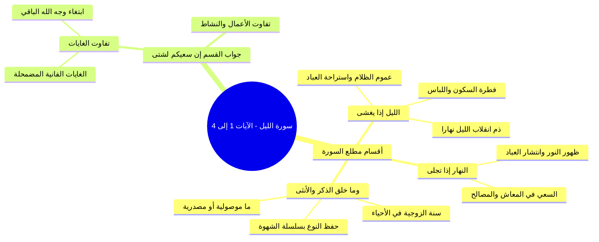

# تفسير الآيات (1-4) أقسام السورة وتفاوت سعي العباد

> [!info] بيانات الجزء
> - **المدى المرجعي بالتفريغ:** الأسطر 183–220.
> - **المحور العام:** تفسير الآيات الأربع الأولى من سورة الليل من كلام الشيخ السعدي رحمه الله، أقسام السورة الثلاثة (الليل، النهار، ذات الله الخالقة للزوجين)، فطرية الليل والنهار وذم قلب الفطرة، وحكمة الزوجية في الخلق، وجواب القسم: ﴿إِنَّ سَعْيَكُمْ لَشَتَّىٰ﴾ وتفاوت غايات العباد.

---

## 📝 الملخص العلمي المنظم للجزء 03

### 1. أقسام مطلع السورة وتفسير كلام الشيخ السعدي
- افتتح الله جل جلاله هذه السورة بثلاثة أقسام عظيمة:
  1. القسم بالزمان في حال سكونه: ﴿وَاللَّيْلِ إِذَا يَغْشَىٰ﴾.
  2. القسم بالزمان في حال ضيائه: ﴿وَالنَّهَارِ إِذَا تَجَلَّىٰ﴾.
  3. القسم بذاته العلية الموصوفة بكونه خالق الذكور والإناث: ﴿وَمَا خَلَقَ الذَّكَرَ وَالأُنْثَىٰ﴾.

### 2. تفسير ﴿وَاللَّيْلِ إِذَا يَغْشَىٰ﴾ وفطرية السكون
- معنى «يَغْشَىٰ»: أي يعم الخليقة بظلامه، فيسكن كل مخلوق إلى مأواه ومسكنه، ويستريح العباد من الكد والتعب والنصب.
- ضرب الشيخ مثلاً بحال القرى والأرياف قديماً قبل دخول الكهرباء (منذ 25 إلى 30 سنة): فبمجرد حلول المغرب يسكن الكون كله، وتنقطع الأصوات، ويستريح الناس من الكد.

> ⚠️ نقد انتكاس الفطرة في العصر الحاضر
> ا انقلاب الليل نهاراً والنهار ليلاً: نبه الشيخ على أن الله خلق الليل لباساً وسكناً وخلق النهار معاشاً ومبصراً؛ ولكن بسبب الغزو الثقافي وأنماط الحياة المعاصرة انتكست الفطرة، فصار ليل الناس سهراً ولهواً وشغلاً ومعاصي، وصار نهارهم نوماً وكسلاً؛ فترتب على ذلك ضياع بركة البكور، ومحق بركة الأعمار والأرزاق والصحة والعافية.

### 3. تفسير ﴿وَالنَّهَارِ إِذَا تَجَلَّىٰ﴾
- معنى «تَجَلَّىٰ»: أي ظهر وبان ووضح ضياؤه للخلق، فاستضاءوا بنوره، وانتشروا في أرض الله يبتغون من فضله ومصالحهم الدينية والدنيوية؛ كما قال تعالى: ﴿إِنَّ لَكَ فِي النَّهَارِ سَبْحاً طَوِيلاً﴾.

### 4. تفسير ﴿وَمَا خَلَقَ الذَّكَرَ وَالأُنْثَىٰ﴾ وسنة الزوجية
- في دلالة «مَا» وجهان لأهل التفسير:
  1. **«مَا» موصولية:** بمعنى (والذي خلق الذكر والأنثى)، فيكون قسماً بذات الله المقدسة الموصوفة بالخلق.
  2. **«مَا» مصدرية:** فيكون المعنى (وخَلْقِ الذكر والأنثى)، ويدل عليه قراءة الصحابي الجليل عبد الله بن مسعود رضي الله عنه: «وَالذَّكَرِ وَالأُنْثَىٰ».
- **حكمة التقدير في خلق الزوجين:**
  - خلق الله من كل صنف من الأحياء (الإنسان، الحيوان، بل حتى النبات والنخل) ذكراً وأنثى ليبقى النوع ولا يضمحل.
  - قاد سبحانه كلاً منهما إلى صاحبه بسلسلة الشهوة والميل الفطري وجعل كلاً منهما ملائماً للآخر: ﴿فَتَبَارَكَ اللَّهُ أَحْسَنُ الْخَالِقِينَ﴾.

### 5. جواب القسم: ﴿إِنَّ سَعْيَكُمْ لَشَتَّىٰ﴾
- هذا هو المُقْسَم عليه في السورة:
  - معنى «شَتَّىٰ»: أي متفاوت تفاوتاً عظيماً وكثيراً.
- **أوجه التفاوت بين سعي العباد:**
  1. تفاوت في **نفس الأعمال** ومقاديرها والنشاط فيها (صلاة، زكاة، صدقة، بر مقابل غفلة ومعاصٍ).
  2. تفاوت في **الغاية المقصودة بالعمل**:
     - فمن عمل قاصداً **وجه الله الأعلى الباقي**؛ بقي عمله بنقاء وبقاء وجه الله وانتفع به صاحبه أبد الآباد.
     - ومن عمل لغاية دنيوية مضمحلة فانية؛ بطل سعيه ببطلانها واضمحل باضمحلالها وحُرم ثوابه.

---

## 🧭 خريطة المفاهيم الذهنية (Mindmap)

---

## 🔍 المراجعة الداخلية (5 أسئلة تحقق سريعة)

1. **س:** ما هي الأقسام الثلاثة التي افتتح الله تعالى بها سورة الليل؟
   - **ج:** القسم بالليل إذا غشي بظلامه، وبالنهار إذا تجلى بنوره، وبذاته سبحانه الخالقة للذكر والأنثى.
2. **س:** ما معنى ﴿إِذَا يَغْشَىٰ﴾ وما أثره الفطري على الأحياء؟
   - **ج:** يعم الخلق بظلامه، وأثره أن تسكن الخلائق إلى مأواها وتستريح الأبدان من النصب والكد.
3. **س:** ما الآثار المترتبة على انتكاس الفطرة بالسهر بالليل والنوم بالنهار كما بين الشيخ؟
   - **ج:** ضياع بركة البكور، ومحق بركة الأعمار والأرزاق والصحة، وتفشي المعاصي.
4. **س:** ما المعنيان المحتملان لـ «مَا» في قوله تعالى: ﴿وَمَا خَلَقَ الذَّكَرَ وَالأُنْثَىٰ﴾؟
   - **ج:** إما موصولية بمعنى (والذي خلق)، أو مصدرية بمعنى (وخَلْقِ الذكر والأنثى).
5. **س:** ما هو المقسم عليه في السورة، وما معنى ﴿لَشَتَّىٰ﴾؟
   - **ج:** المقسم عليه قوله تعالى: ﴿إِنَّ سَعْيَكُمْ لَشَتَّىٰ﴾، ومعنى لشتى: لمختلف ومتفاوت تفاوتاً هائلاً في الأعمال والغايات والنتائج.

---

## 🗣️ نص المتحدث الكامل (من الأسطر 183 إلى 220)

> سوره الاعلى فتلاقي الصور كلها ايه بترمي خيوط علشان تتشابك اطرافها ايه مع بعضيها كده تلاقي القران كله لحمه واحده و تنزيل من حكيم حميد سبحانه وتعالى سبحان ا الشيخ السعد رحمه الله بيقول ايه؟ بيقول والليل اذا يغشى هذا قسم فالله جل جلاله افتتح هذه السوره المباركه بثلاثه اقسام الليل والنهار وذاته المقدسه الليل والنهار و
>
> ثم ذاته واقصى الله عز وجل بنفسه قال هذا قسم من الله بالزمان الذي تقع فيه افعال العباد على تفاوت احواله فقال والليل اذا يغشى يعني ايه يغشى يعني يعم الخلق بظلامه فيسكن كل ماواه ومسكنه ويستريح العباد من الكد والتعب تخيل كده في هذا الوقت وقت السكون بقى والليل اذا ايه يغشى تحيث تطلع كده مثلا على السطح ولا حاجه بلاش في الشارع لان دلوقتي الليل بقى حاجه مؤذيه خالص انما في الليل عايزك كده ترجع ا 30 سنه
>
> الارياف ايام سيدي وستك الله يرحمهم لما كان كان مافيش كهرباء خدت بالك مثلا اه حوالي 25 30 سنه كده ولا حاجه
>
> عايز تلغينا سيد
>
> الناس دي مش هتبقى موجوده يا مولانا الناس دي مش هتبقى موجوده
>
> اه فمافيش ومافيش كهربا اصلا يعني ايه
>
> وبعدين كده المغربيه اول ما المغرب يدخل خلاص تسمع صوتا ولا تسمع شيئا دخل الليل بسكون وغشي الناس فسكن كل الى ماواه ويستريح العباد في هذا الليل من الكد والتعب وذلك لان الله عز وجل خلق الليل وجعل له طبيعه وخلق النهار
>
> وجعل له طبيعه ثم جاء هذا الانسان كما تكلمنا في سوره التين على مساله الفطره وان الانسان مولود معاه ايه مولود على الفطره فطره بيضا وبعدين ايه اللي بوظ له الفطره ولوث له الفطره
>
> ابواه
>
> ابواه والمجتمع شويه والاعلام شويه والتعليم شويه ومش عارف واصحابه شويه فالفطره ايه انتكست واتلوثت كذلك برضو الليل خلقه الله عز وجل كما قال في القران الكريم وجعلنا الليل
>
> لباسا وجعلنا النهار
>
> معاشا جعل لكم الليل لايه؟
>
> لتسكنوا فيه والنهار
>
> مبصره
>
> مبصره.
>
> فايه اللي حصل النهارده بسبب الغزو الغربي؟ ان اه ان بقى الليل للشغل وللعب وللسهر وللافساد وللمعاصي وللفجور و ولام ده كله والنهار بقى للنوم وبقى فما عادش في بركه لان انسان بينا بالنهار ويضيع وقت البكور ضيع على نفسه البركه ولا عاد في بركه لا في الارزاق ولا عاد في بركه في العمر ولا عاد في بركه في الصحه ولا عاد في بركه في حاجه خالص الا ما شاء الله قال والنهار قال والليل اذا يغشى والنهار اذا تجلى اي للخلق فاصطاوا بنوره وانتشروا في مصالحهم ان النهار قال الله عز وجل ان لك في النهار
>
> سبحا طويلا وما خلق الذكر والانثى بيقول ان كانت ما موصوله بمعنى الذي يعني والذي خلق الذكر والانثى يبقى من الذي خلق الذكر وهو خلق الانثى
>
> الله
>
> يبقى فالله عز وجل يقسم
>
> بنفسه سبحانه وتعالى كان اقساما بنفسه الكريمه الموصوفه بكونه خالق الذكور والاناث وان كانت مصدريه مصدريه يعني ايه وما خلق الذكر والانثى يعني
>
> خلق الذكر
>
> خلق نعم احسنت وما خلقها كم مع بعضهم في تاويل مصدر وخلق الذكر والانثى فكان كان ذلك قسما بخلقه للذكر والانثى ا لذلك لو كانت مصدريه تبقى والذكر والانثى كما في قراءه ابن مسعود رضي الله عنه في قراءه ابن مسعود انها والليل اذا يغشى والنهار اذا تجلى
>
> والذكر والانثى مش وما خلق الذكر وانثى والذكر والانثى ان سعيكم ايه ان سعيكم لشتى ثم قال ان خلق ان ان خلق من كل انه خلق من كل صنف من الحيوانات التي يريد ابقائها ذكرا وانثى ليبقى النوع ولا يضمحل وقاد كلا منهما الى الاخر بسلسله الشهوه وجعل كلا منهما مناسبا للاخر فتبارك الله احسن الخالقين يبقى كل حاجه عندك تلاقي فيها ذكر وايهثى
>
> حتى النبات
>
> ذكرى
>
> ذكر وانثى حتى النخلذ
>
> ذكر وانثى ليه علشان تستمر سلسله التناسل وسلسله الخلق التي هي سنه الله عز وجل في خلقه هذا كله هو القسم جواب القسم ان سعيكم لشتى ان سعي سعيكم ايه؟ هذا هو المقسم عليه اي ان سعيكم ايها المكلفون لمتفاوت تفاوتا كثيرا وذلك بحسب تفاوت نفس الاعمال ومقدارها والنشاط فيها وبحسب الغايه المقصوده بتلك الاعمال هل هو وجه الله الاعلى الباقي؟ فيبقى العمل له ببقائه وينتفع به صاحبه ام هي غايه مضمحله فانيه فيبطل سعي ببطلانها ويضمحل باضمحلالها وهذا كل عمل يقصد به غير وجه الله تعالى بهذا الوصف يبقى السوره ديت بتكلمنا مجمل هذه السوره وملخص سوره الليل بدا من سوره الشمس لان كل سوره بتبقى مرتبطه لها علاقه بالصوره اللي قبلها وعلاقه بالصوره
>
> اللي بعدها فلما انا عايزك تصلي على النبي
>
> صلى الله عليه وسلم واللي هلاقي نايم احدفه ببلح برحي
>
> ده برحي ده ولا ايه؟
>
> طب افتح بقك بقى
>
> هيبقى فاتح بقه ازاي؟
>
> انا عايزك بقى تفتح صح
>
> صح ها مين اللي نايم؟
>
> اللي نايم يرفع ايده انتوا كلكم نايمين امال انا بشرح لمين؟ اللي صاحي
>
> طب لا كلهم صاحيين ما شاء الله
>
> طب انا هاخد انا بقى صليت على الرسول
>
> صلى الله عليه وسلم

---

## 📊 حالة الإنجاز ومسار الأجزاء
- **إجمالي الأجزاء:** 10 أجزاء (00–09).
- **الجزء الحالي:** 03.
- **الأجزاء المتبقية:** 6 أجزاء.

---

## ⏭️ الانتقال التالي
- الانتقال إلى: [[04 - الرابط بين الشمس والليل وتزكية النفس وحديث التيسير]]
