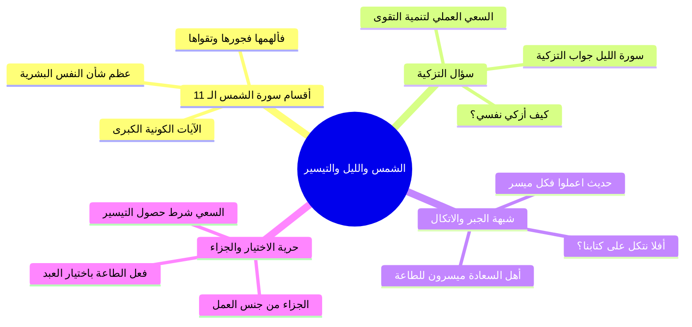

# الرابط بين الشمس والليل وتزكية النفس وحديث التيسير

> [!info] بيانات الجزء
> - **المدى المرجعي بالتفريغ:** الأسطر 221–260.
> - **المحور العام:** الربط التفسيري والموضوعي البديع بين سورتي الشمس والليل، أقسام سورة الشمس الـ 11 وسؤال تزكية النفس، رد شبهة الجبر ببيان سعي العبد ومسؤوليته، شرح حديث «اعملوا فكل ميسر لما خلق له»، وقاعدة «الجزاء من جنس العمل».

---

## 📝 الملخص العلمي المنظم للجزء 04

### 1. الرابط الموضوعي بين سورة الشمس وسورة الليل
- بيّن الشيخ أن سور القرآن يربط بينها حبل وثيق؛ فكل سورة لها علاقة بالتي قبلها والتي بعدها.
- **أقسام سورة الشمس الـ 11:**
  - أقسم الله في سورة الشمس بأحد عشر قسماً كونياً مهيباً:
    1. والشمس.
    2. وضحاها.
    3. والقمر إذا تلاها.
    4. والنهار إذا جلاها.
    5. والليل إذا يغشاها.
    6. والسماء.
    7. وما بناها.
    8. والأرض.
    9. وما طحاها.
    10. ونفس.
    11. وما سواها.
  - إيراد قسم النفس في سياق هذه الأجرام والأفلاك العظيمة دليل قاطع على عظم شأن النفس البشرية وخطرها.

### 2. سؤال التزكية وإجابة سورة الليل
- بعد تلك الأقسام بيّن الله حال النفس فقال:
  - ا ﴿فَأَلْهَمَهَا فُجُورَهَا وَتَقْوَاهَا * قَدْ أَفْلَحَ مَن زَكَّاهَا * وَقَدْ خَابَ مَن دَسَّاهَا﴾ [الشمس: 8–10].
- **الإشكال القائم في النفس:** إذا كان الله قد ألهم النفس فجورها وتقواها، فهل يقعد الإنسان متكلاً؟ وكيف يزكي المرء هذه النفس؟
- **جواب سورة الليل:**
  - جاءت سورة الليل لتبين أن الأمر لا يتوقف على مجرد الاستعداد الفطري، بل يفتقر حتماً إلى **سعي العبد وعمله**:
    - فمن سعى في طاعة الله؛ نمّى تقواه وزكّى نفسه فكان من المفلحين.
    - ومن سلك سبل الشر والمعاصي؛ أهمل تقواه ودسّى نفسه فكان من الخائبين.
  - سورة الليل هي الخريطة التطبيقية المباشرة لقوله: ﴿قَدْ أَفْلَحَ مَن زَكَّاهَا﴾ عبر ثلاثية: (أعطى، واتقى، وصدق بالحسنى).

### 3. حديث التيسير وشبهة الاتكال على القدر
- لما نزلت سورة الليل، أشكل الأمر على بعض الصحابة فسألوا رسول الله ﷺ:
  - «يا رسول الله، أفلا نتكل على كتابنا وندع العمل؟» (ما دام المقعد مكتوباً في الجنة أو النار).
  - فأجابهم النبي ﷺ بالقاعدة الإيمانية الحاسمة:
    - ا «اعْمَلُوا فَكُلٌّ مُيَسَّرٌ لِمَا خُلِقَ لَهُ؛ أَمَّا مَنْ كَانَ مِنْ أَهْلِ السَّعَادَةِ فَيُيَسَّرُ لِعَمَلِ أَهْلِ السَّعَادَةِ، وَأَمَّا مَنْ كَانَ مِنْ أَهْلِ الشَّقَاوَةِ فَيُيَسَّرُ لِعَمَلِ أَهْلِ الشَّقَاوَةِ» ثم تلا: ﴿فَأَمَّا مَنْ أَعْطَىٰ وَاتَّقَىٰ...﴾.

### 4. حرية اختيار المكلف وقاعدة الجزاء من جنس العمل
- أكد الشيخ على بطلان دعوى الجبر والإكراه؛ فالإنسان حين يقوم ليصلي أو يقعد، وحين ينفق أو يبخل، يفعل ذلك بمشيئته واختياره التام الذي أناط الله به التكليف.
- **القاعدة الإلهية:** «الجزاء من جنس العمل والنتيجة من جنس السعي»:
  - بادر العبد بالسعي في الطاعة ← كانت النتيجة: ﴿فَسَنُيَسِّرُهُ لِلْيُسْرَىٰ﴾.
  - بادر العبد بالبخل والاستغناء ← كانت النتيجة: ﴿فَسَنُيَسِّرُهُ لِلْعُسْرَىٰ﴾.

---

## 🧭 خريطة المفاهيم الذهنية (Mindmap)

---

## 🔍 المراجعة الداخلية (5 أسئلة تحقق سريعة)

1. **س:** كم قسماً أقسم الله تعالى به في مطلع سورة الشمس قبل ذكر النفس؟
   - **ج:** أحد عشر قسماً كونياً ونفسياً.
2. **س:** ما الرابط الموضوعي التفسيري بين سورة الشمس وسورة الليل؟
   - **ج:** سورة الشمس بيّنت فلاح من زكى نفسه وخيبة من دساها، وسورة الليل جاءت لتبين السبيل العملي لتزكية النفس عبر السعي (أعطى واتقى وصدق بالحسنى).
3. **س:** ما الشبهة التي أثارها الصحابة رضي الله عنهم بعد سماع نصوص السعادة والشقاوة؟
   - **ج:** قالوا: «أفلا نتكل على كتابنا وندع العمل؟».
4. **س:** بماذا أجاب النبي ﷺ على سؤال الصحابة حول الاتكال على القدر؟
   - **ج:** قال ﷺ: «اعملوا فكل ميسر لما خلق له»، وقرأ آيات سورة الليل.
5. **س:** كيف يُستدل بسورة الليل على قاعدة «الجزاء من جنس العمل»؟
   - **ج:** لأن تيسير الله للعبد لليسرى كان مرتباً على سعيه بالعطاء والتقوى والتصديق، وتيسيره للعسرى كان جزاءً على بخله واستغنائه وتكذيبه.

---

## 🗣️ نص المتحدث الكامل (من الأسطر 221 إلى 260)

> لما لما اخبرنا الله عز وجل في سوره الشمس كم قسم؟ 10 ولا 11
>
> عد معايا كده هتيجي معانا ان شاء الله الاسبوع اللي جاي والشمس
>
> وضحاها
>
> والقمر اذا تلاها
>
> والنهار اذا جلاها
>
> والليل اذاشاه
>
> والسماء
>
> وما بناه
>
> والارض وما طحاها ونفس وما سواه كم قسم
>
> 11
>
> 11 قسم ونفس ما سواها فالهمها فجورها وتقواها قد افلح من زكاها وقد خاب من دساها فكانك تقول على عظم المقصد عليه
>
> نعم
>
> على عظم عليه
>
> نعم اللي هي النفس
>
> ايه من ايات الله لذلك جاءت في سياق الايات الكونيه خدت بالك سر عجيب فكانك تقول قد افلح من زكاها فكيف
>
> ازكيه
>
> كيف ازكي هذه النفس وما هو السبيل؟ طيب فالهمها فجورها وتقواها اذا طالما ان النفس الهمت طب انا انا مالوش لازمه بقى ان انا اعمل
>
> خلاص هي كده كده النفس ملهمه فجور وتقوى فلو فيها خير هتعمل ما فيهاش خير مش هتعمل فخلاص انا ماليش اي تدخل خدت بالك فجتلك سوره الله تقوللك لا الموضوع مش هيتوقف على مساله الالهام ان انت اي نعم الهمت الفجور والهمت التقوى لكن ده محتاج منك لسعي فلو سعيت في سبيل الطاعه
>
> يبقى انت كده نميت وزكيت وكثرت هذه التقوى التي في داخلك فتكون بذلك قد زكت نفسك ولو انك اهملتها او سلكت سبل الشر وسبل المعاصي فالموضوع كله مرتبط بايه؟
>
> مرتبط بك انت بسعيك انت الموضوع مرتبط فجت سوره الليل بتتكلم عن سعي الانسان انت اول حاجه اول حاجه عشان بس ما حدش يقول لك طب انا ايش داخلي انت دخلك كبير انت اول حاجه ان الله عز وجل حينما خلق نفسك الهمها الفجور
>
> والهمها التقوى انت ما عليك الا ان
>
> تسعى
>
> تسعى هتسعى في ايهسرهم سنيسرهم
>
> لا سنيسره ديت دي النتيجه
>
> عشان بس لان الصحابه بمناسبه سوره الليل بيقولوا يا رسول الله
>
> صلى الله عليه وسلم
>
> افلا نتكل على كتابنا وندع العمل خلاص طالما فلان مكتوب انه من السعداء او فلان مكتوب والعياذ بالله من الاشقياء يبقى مالوش لازمه ايه
>
> ان احنا نشتغل هنشتغل ليه با ده مكتوب من اهل الجنه وده مكتوب من اهل النار فقال لهم النبي صلى الله عليه وسلم صلى الله عليه وسلم
>
> اعملوا فكل ميسر لما خلق له فمن كان من اهل السعاده يسر او وفق لعمل اهل الجنه ومن كان من اهل الشقاوي يسر او وفق الى عمل اهل النار او كما قال صلى الله عليه وسلم
>
> يبقى عملوا فكل ميسر ايه
>
> العمل ده في مقدورك ولا مش في مقدورك
>
> انت حد جبرك على ان انت ما تصليش ولا حد يبقى انت عندك نوع من الاختيار ولا ما عندكش عندك اه دلوقتي انت قاعد بمزاجك ولا غصب عنك لما الاذان بياذن تقوم تصلي قايم بمزاجك ولا غصب عنك يبقى انت عندك اختيار اهو
>
> يبقى انت بتختار يبقى انت بتسعى والسعي اللي انت هتسعى فيه ده بقى هتسعى في ايه؟ يبقى اول حاجه بدايه الامر فالهمها
>
> فجورها وتقويه يبقى كل نفس كل نفس فجور
>
> وفيها تقوى والنتيجه قد افلح من زكاها وقد خاب من دساها هتقول لي كيف ازكي نفسي هتجي لك سوره الليل ومش سوره الليل بس صور كثيره جدا هتقول لك هذا سبيل من سبل تزكيه النفس فمن سبل تزكيه النفس المباشر اللي جاي معانا وده من اهم واخطر واقوى سبيل في تزكيه النفس من اقوى السبل في تزكيه النفس اعطى واتقى وصدق بالحسن عايز تزكي نفسك عشان تبقى من المفلحين قد افلح من زكاها اوه جت لك السوره اللي بعدها فاما من اعطى هو اعطى واتقى وصدق بالحسنى ده من سعي ده من سعيك انت طب النتيجه
>
> فسنيسره لليسر طب بخل واستغنى وكذب بالحسنى هاسر
>
> يبقى النتيجه سيسر للعسر يبقى النتيجه دي على حسب ايه
>
> على حسب عملك انت يبقى الجزاء من جنس العمل والنتيجه من جنس ما تعمل لذلك ان سعيكم لشتى اي ان عملكم لمختلف فمن الاعمال حسنات ومن الاعمال
>
> سيئات زي جميل كده يا سيدنا
>
> قاللك زي جميل كده لما كانت ا بتفعل شبه جزاء من جنس العمل بعقابه

---

## 📊 حالة الإنجاز ومسار الأجزاء
- **إجمالي الأجزاء:** 10 أجزاء (00–09).
- **الجزء الحالي:** 04.
- **الأجزاء المتبقية:** 5 أجزاء.

---

## ⏭️ الانتقال التالي
- الانتقال إلى: [[05 - تفسير الآيات (5-7) العطاء والتقوى والتصديق بالحسنى]]
