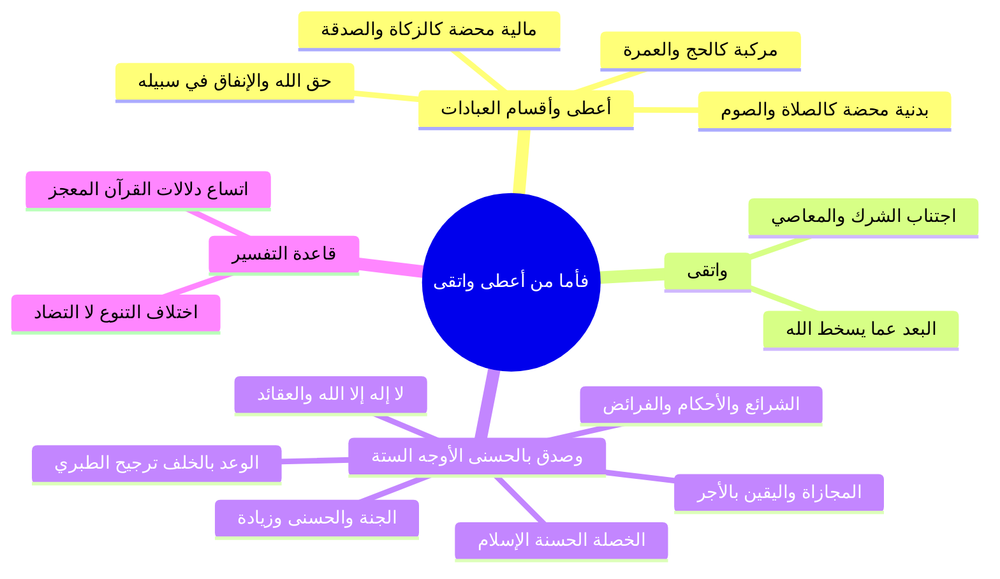

# تفسير الآيات (5-7) العطاء والتقوى والتصديق بالحسنى

> [!info] بيانات الجزء
> - **المدى المرجعي بالتفريغ:** الأسطر 261–344.
> - **المحور العام:** تفسير قول الله تعالى: ﴿فَأَمَّا مَنْ أَعْطَىٰ وَاتَّقَىٰ * وَصَدَّقَ بِالْحُسْنَىٰ * فَسَنُيَسِّرُهُ لِلْيُسْرَىٰ﴾، أقسام العبادات (مالية، بدنية، مركبة)، أوجه معنى التقوى، الأوجه التفسيرية الستة في معنى «صدق بالحسنى»، وقاعدة اختلاف التنوع وإعجاز القرآن.

---

## 📝 الملخص العلمي المنظم للجزء 05

### 1. تفسير ﴿فَأَمَّا مَنْ أَعْطَىٰ﴾ وأقسام العبادات
- ذكر الشيخ السعدي رحمه الله والمفسرون عدة أوجه لمعنى العطاء في الآية:
  1. **أداء ما أُمر به من العبادات:**
     - عبادات بدنية محضة: كالصلاة والصوم.
     - عبادات مالية محضة: كالزكوات الواجبة، والنفقات، والكفارات، وصدقات التطوع.
     - عبادات مركبة (بدنية ومالية معاً): كالحج والعمرة والجهاد؛ ولهذا كان الحج من أعظم أركان الإسلام لجمعه بين جهاد البدن وبذل المال.
  2. **أداء حق الله عز وجل** الواجب على المكلف في كل باب.
  3. **الإنفاق في وجوه البر وسبيل الله.**

### 2. تفسير ﴿وَاتَّقَىٰ﴾
- معنى «اتَّقَىٰ»: أي اتقى ما يسخط الله عز وجل؛ فاجتنب الشرك، والمحرمات، والمعاصي، والكبائر، وصغائر الذنوب والآثام على اختلاف أجناسها، جاعلاً بينه وبين عذاب الله وقاية بطاعته.

### 3. الأوجه الستة في تفسير ﴿وَصَدَّقَ بِالْحُسْنَىٰ﴾
- استعرض الشيخ ستة أقوال مأثورة لأئمة التفسير في معنى «الحسنى»:

| # | الوجه التفسيري | البيان والدليل الشرعي |
|:---:|:---|:---|
| 1 | **الوعد بالخلف على الإنفاق** | وهو ما رجحه الإمام ابن جرير الطبري؛ أن يوقن بأن ما أنفقه في سبيل الله سيخلفه الله عليه: ﴿وَمَا أَنفَقْتُم مِّن شَيْءٍ فَهُوَ يُخْلِفُهُ﴾، وحديث: «أَنْفِقْ أُنْفِقْ عَلَيْكَ»، و«مَا نَقَصَ مَالٌ مِنْ صَدَقَةٍ». |
| 2 | **كلمة التوحيد: «لا إله إلا الله»** | التصديق بكلمة الإخلاص وما دلت عليه من العقائد الدينية والتوحيد الخالص؛ «من قال لا إله إلا الله مخلصاً من قلبه دخل الجنة». |
| 3 | **الشرائع والأحكام وفرائض الدين** | التصديق بالفرائض من صلاة وصيام وزكاة وأنها حق من عند الله («من صام رمضان إيماناً واحتساباً»). |
| 4 | **المجازاة واليقين بالثواب والجزاء** | إيقان العبد التام بأن عمله الصالح محفوظ ولن يضيع عند الله أبداً: ﴿إِنَّا لَا نُضِيعُ أَجْرَ مَنْ أَحْسَنَ عَمَلاً﴾، ﴿فَاسْتَجَابَ لَهُمْ رَبُّهُمْ أَنِّي لَا أُضِيعُ عَمَلَ عَامِلٍ مِّنكُم﴾. |
| 5 | **الخصلة الحسنة وهي ملة الإسلام** | التصديق بدين الإسلام الكامل وأخلاقه وآدابه. |
| 6 | **الجنة والنعيم المقيم** | التصديق بدار الكرامة التي أعدها الله للمتقين؛ كقوله تعالى: ﴿لِّلَّذِينَ أَحْسَنُوا الْحُسْنَىٰ وَزِيَادَةٌ﴾ [يونس: 26]. |

### 4. قاعدة تفسيرية: اختلاف التنوع وسعة القرآن المعجز
- أكد الشيخ على قاعدة أصولية هامة في فهم خلاف المفسرين:
  - اختلاف الصحابة والتابعين في تفسير مثل هذه الآيات هو من باب «اختلاف التنوع» لا «اختلاف التضاد».
  - فالأقوال الستة لا تتنافى، بل الآية الكريمة تتسع لها جميعاً لإيجاز ألفاظ القرآن وعظيم إعجازه.
  - وضرب الشيخ مثلاً بقوله تعالى: ﴿رَبَّنَا آتِنَا فِي الدُّنْيَا حَسَنَةً وَفِي الآخِرَةِ حَسَنَةً﴾ حيث قيل إن للعلماء فيها نحو 500 قول وكلها ترجع إلى خيري الدنيا والآخرة دون تضاد.

---

## 🧭 خريطة المفاهيم الذهنية (Mindmap)

---

## 🔍 المراجعة الداخلية (5 أسئلة تحقق سريعة)

1. **س:** ما هي الأقسام الثلاثة للعبادات كما فصّلها الشيخ عند تفسير قوله تعالى: ﴿فَأَمَّا مَنْ أَعْطَىٰ﴾؟
   - **ج:** عبادات بدنية محضة، عبادات مالية محضة، وعبادات مركبة تجمع بين البدن والمال كالحج.
2. **س:** ما معنى ﴿وَاتَّقَىٰ﴾ في سياق الآية؟
   - **ج:** اتقى ما يسخط الله تعالى فاجتنب الشرك والمعاصي والذنوب على اختلاف أجناسها.
3. **س:** ما القول الذي رجحه الإمام ابن جرير الطبري في معنى ﴿وَصَدَّقَ بِالْحُسْنَىٰ﴾؟
   - **ج:** تصديق الوعد بالخلف على النفقة والبذل في سبيل الله (﴿وما أنفقتم من شيء فهو يخلفه﴾).
4. **س:** اذكر ثلاثة أوجه أخرى لمعنى «الحسنى» غير الخلف على النفقة.
   - **ج:** كلمة التوحيد (لا إله إلا الله)، الجزاء والمثوبة على الأعمال، والجنة.
5. **س:** كيف يُوفق طالب العلم بين الأقوال المتعددة للعلماء في تفسير ألفاظ القرآن مثل «الحسنى»؟
   - **ج:** بأن هذا الخلاف هو اختلاف تنوع وتكامل لا اختلاف تضاد، وكلام الله معجز يتسع لجميع هذه المعاني الحقة.

---

## 🗣️ نص المتحدث الكامل (من الأسطر 261 إلى 344)

> في النار القلاده يعني في جدي حبل من مثل حتى سوره اتسمت باسم المثل طيب فاما من اعطى الشيخ السعد بيقول لك ايه فاما من اعطى اي ما امر به من العبادات الماليه كالزكوات والنفقات والكفارات والصدقات والانفاق في وجوه الخير والعبادات البدنيه كالصلاه والصوم وغيرها والمركبه من ذلك يعني ايه مركبه من ذلك يعني مركبه من البدن والمال لان انت عندك عبادات ما عبادات بدنيه محضه وعبادات ماليه محضه وعبادات بدنيه وماليه وهذه اعلى العبادات العبادات البدنيه المحضه
>
> الصلاه والصيام
>
> الماليه الماليه عندك زي الزكاه والكفارات بدنيه ماليه زي الحج لذلك الحج ايه من اعظم اركان الاسلام هو ايه
>
> الحج لانه جمع بين لانه لانه بالبدن جهاد بالبدن وجهاد بايه
>
> بالمال
>
> اللهم ارزقنا الحج يا رب
>
> امين يا رب يسر لنا السبيل
>
> امين يا رب
>
> قال فاما من اعطى واتقى يبقى الشيخ السعد قال لك اعطى ما رب من العبادات وفي وجه اخر يعني اعطى حق الله عز وجل ثلاثه اعطى يعني انفق في سبيل الله يبقى دي اوجه في معنى ايه اعطى اعطى يعني ايه ها
>
> انفق
>
> اعطى يعني انفق في سبيل الله اثنين اعطى يعني اعطى حق الله ثلاثه اعطى يعني ايه ما امر به من العبادات البدنيه والماليه والتي جمعت بين البدنيه والماليه واتقى يعني ايه واتقى يعني اتقى وابتعد يعني ابتعد عما يسخط الله عز وجل من الشرك والمعاصي الشيخ السعدي قال لك واتقى ما نهي عنه من المحرمات والمعاصي على اختلاف ايه اختلاف اجناسه حد نايم
>
> انا اهو يا
>
> خذ ادي اللي جنبك مين اللي نايم ورا
>
> اهو اهو لا اللي ورا خلاص يا شيخ
>
> خلاص احدف
>
> ها مين اللي نايم تاني اعطى واتقى هاخذ سيدنا عفو مين اللي هنا
>
> اوفسايد ها بسم الله مين تاني هنا
>
> ها احدف
>
> الى اليمين
>
> الى اليمين قليل ها الى اليمين ها جزاك الله
>
> ها مين تاني بسم الله ا احذف ايوه كده اصحى صحصح معايا انا شت شويه ليا انا بقى مش معقول يعني بقى
>
> انام انا عشان اكل جزاك الله خير قربنا نخلص ان شاء الله واتقى اعطى يعني اعطى ها ها اعطى واتقى اتقى ما يسقط الله عز وجل من الشرك والمعاصي والاثام والذنوب لان هذه الامور كلها مما يسخط الله عز وجل وصدق بالحسنى يعني صدق بلا اله الا الله
>
> لا اله الا الله
>
> لا اله الا الله لا اله الا الله
>
> من قال لا اله الا الله مخلصا من قلبه دخل الجنه
>
> لا اله الا الله صدق بلا اله الا الله وما دلت عليه من جميع العقائد الدينيه وما ترتب عليها من الجزاء ده اللي الشيخ السعدي ذكره اكتب بقى معايا كده عشان انا مجمع لك تجميعه حلوه في اللي هي ايه وصدق بالحسنى واحد
>
> وصدق بالحسنى يعني ايه وصدق بالحسنى قول انت عايز تقول حاجه من من ساعتها قول
>
> صدق بالحسنى يعني صدق بالادب يعني ماطرناش في طريقه تاني
>
> طب نشوف المفسرين قالوا ايه ناخد راي سعادتك المقصود بها الصدقه
>
> نعم
>
> المقصود بها الصدقه
>
> ما انا جايلك اهو ما هو اعطى هو اعطى يعني تصدق
>
> اي
>
> وصدق يعني صدق الوعد بالخلف على الانفاق وده اللي رجحه ابن جري طب
>
> اكتبوا بقى سيدناش
>
> وصدق بالحسنى واحد يعني بالوعد على الخلف او بالخلف على الانفاق ايه الوعد ها
>
> وما انفقتم
>
> من شيء
>
> فهو يخلفه وهو خير الرازقين تشهد
>
> تصدق الله
>
> انفق
>
> والنبي صلى الله عليه وسلم انفق انفق عليه
>
> انفق ولا تخشى من العرش اقلال ها
>
> ما نقص مال
>
> ما نقص مال من صدقه كتير الادلهق ينفق عليه
>
> والوعود نعم
>
> اثنين وصدق بالحسنى يعني بلا اله الا الله
>
> لا اله الا الله
>
> ده اتنين لاثه صدق بالشرائع والاحكام يعني صدق بالدين من الصلاه والزكاه والصوم صدقه الفطر ليه بقى ده يفكرنا بقول النبي صلى الله عليه وسلم
>
> من صام رمضان
>
> ايمانا
>
> ايه
>
> ايمانا انت مؤمن مؤمن بالصيام ده ومؤمن ان ربنا فرض مؤمن ده الايمان
>
> اربعه صدق بالمجازاه على الاعمال وكان صدق هنا بمعنى ايقنه
>
> وكان صدق وكان صدق هنا بمعنى ايقنه ايقنه بالمجازاه على الاعمال ان العمل اللي هيعمله مش ضايع عليه مش هيضيع
>
> قال الله عز وجل انا لا نضيع
>
> اجر من احسن عملا فاستجاب لهم ربهم
>
> من اجمل الجمل اللي لسه اختبار بالي من اسبوعين وبسمع الشيخ المنشاوي لقيته بيقول ايه فاستجاب لهم ربهم
>
> اني لا اضيع عمل عاجل
>
> مش هضيع عملك يا اخي لا صغير ولا كبير
>
> اعمل وخليك على يقين بص خليك على يقين تام ان الحسنه اللي انت بتعملها دي ربنا مش
>
> هيضيعهاكر فلنحيين وحياه طيبه وصدق بالحسنى من معانيها ايضا بالخصله الحسنه وهي الاسلام وايضا وصدق بالحسنى يعني بالجنه اللهم ارزقنا الجنه
>
> امين
>
> بغير حساب ولا سابقه ع
>
> امين للذين يحسنوا الحسنى وزياده
>
> اللهم ارزقنا الحسنى والزياده
>
> امين
>
> خلاص كده انت عرفت يعني هو صدق بالحسنى
>
> والايه والايه تحتمل كل هذه الوجوه
>
> نعم
>
> طالما يا جماعه خليك عفان كده طالما ان الاختلاف في تفسير الايه هو من باب باختلاف التنوع حماد
>
> يبقى هذا بيعطيك اتساع افقي اتساع افق اتساع نظره اتساع في فهم كلام الله
>
> وكلام الله لانه معجز فتلاقي الايه ممكن تحتمل 500 قول او برقليش قيل في تفسير قول الله عز وجل ومنهم من يقول
>
> ربنا اتنا في الدنيا حسنه
>
> وفي الاخره حسنه
>
> وقينا عذاب النار قيل ان العلماء اختلفوا في تفسير حسنه الدنيا وحسنه الاخره على 500 قول
>
> ولا اخال ولا اظن ان هذا الاختلاف هو من باب اختلاف التضاد
>
> وان هو من باب اختلاف الت فهلاقي الايه تشيل 500 قول
>
> مش كلام معجز
>
> وده كله اللي احنا ذكرناه دههو كله من باب اختلاف يعني اختلاف التنوع يعني ما فيش معنيين ضد بعض وانما لو قلنا ان وصدق بالحسن يعني بالخلف على الانفاق وبلا اله الا الله وبالدين والاحكام والمجازاه على الاعمال والخصنه الحسنه والجنه تشيل ده كله ما فيش تضاد بينهم ولا حاجه صليت على الرسول
>
> صلى الله عليه وسلم
>
> الايجاز والانجاز يعني مازال القران للايجاز وانجاز عظيم
>
> ماشي صليت على الرسول
>
> صلى الله عليه وسلم

---

## 📊 حالة الإنجاز ومسار الأجزاء
- **إجمالي الأجزاء:** 10 أجزاء (00–09).
- **الجزء الحالي:** 05.
- **الأجزاء المتبقية:** 4 أجزاء.

---

## ⏭️ الانتقال التالي
- الانتقال إلى: [[06 - تفسير الآيات (8-10) التيسير لليسرى والبخل والاستغناء والعسرى]]
