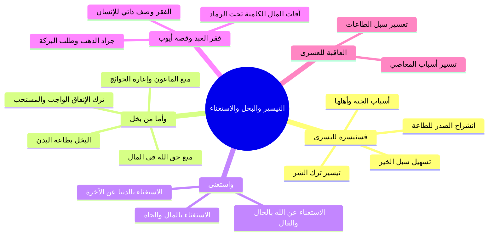

# تفسير الآيات (8-10) التيسير لليسرى والبخل والاستغناء والعسرى

> [!info] بيانات الجزء
> - **المدى المرجعي بالتفريغ:** الأسطر 345–394.
> - **المحور العام:** تفسير قول الله تعالى: ﴿فَسَنُيَسِّرُهُ لِلْيُسْرَىٰ﴾، وعرض المقابل في الفريق الثاني: ﴿وَأَمَّا مَن بَخِلَ وَاسْتَغْنَىٰ * وَكَذَّبَ بِالْحُسْنَىٰ * فَسَنُيَسِّرُهُ لِلْعُسْرَىٰ﴾، أوجه البخل ومنع الماعون، حقيقة الاستغناء عن الله، فقر العبد الذاتي وقصة أيوب عليه السلام مع جراد الذهب، وكمون آفات المال في النفس.

---

## 📝 الملخص العلمي المنظم للجزء 06

### 1. تفسير ﴿فَسَنُيَسِّرُهُ لِلْيُسْرَىٰ﴾
- بين الشيخ السعدي رحمه الله جزاء من أعطى واتقى وصدق بالحسنى:
  1. **تيسير أمره كله:** بأن يجعله الله مسهلاً عليه كل طريق خير عاقبته رشد.
  2. **تيسير ترك كل شر:** بأن يصرف الله عنه مسالك المعاصي والفتن بلطفه.
  3. **سلوك الطريقة اليسرى:** وهي فعل الصالحات واجتناب المحرمات بيسر وسهولة وانشراح صدر دون مشقة وعنت.
  4. **التيسير للجنة:** تيسير أسباب الجنة، وأقوالها، وأعمالها، وصحبة أهلها الأخيار؛ لأن العبد قدم أسباب التيسير.

### 2. تفسير ﴿وَأَمَّا مَن بَخِلَ﴾
- أوجه معنى البخل في الآية:
  1. ترك الإنفاق الواجب (كالزكاة ونفقة الأهل) والإنفاق المستحب (كصدقات التطوع).
  2. منع الماعون: وهو ما لا تضر إعارته من الآنية والأدوات والحوائج اليسيرة؛ امتثالاً لقوله: ﴿وَيَمْنَعُونَ الْمَاعُونَ﴾.
  3. منع حق الله عز وجل في ماله ونعمه.
  4. البخل بطاعة الله البدنية؛ فيبخل ببدنه أن يركع أو يسجد أو يصوم.

### 3. تفسير ﴿وَاسْتَغْنَىٰ﴾ وحقيقة الفقر إلى الله
- أوجه معنى الاستغناء:
  1. **الاستغناء عن ربه بلسان الحال أو المقال:** فيترك العبودية جانباً، ولا يرى نفسه مفتقرة إلى خالقها؛ فيترك الصلاة، وينقطع عن الدعاء والتضرع؛ ظاناً أنه غير محتاج إلى الله.
  2. **الاستغناء بالدنيا عن الآخرة:** كقوله تعالى: ﴿إِنَّ الَّذِينَ لَا يَرْجُونَ لِقَاءَنَا وَرَضُوا بِالْحَيَاةِ الدُّنْيَا وَاطْمَأَنُّوا بِهَا﴾ [يونس: 7].
  3. **الاستغناء بالمال والولد والجاه:** فيطغى به كما قال صاحب الجنتين في سورة الكهف: ﴿أَنَا أَكْثَرُ مِنكَ مَالاً وَأَعَزُّ نَفَراً﴾.

### 4. قصة أيوب عليه السلام وفقر العبد الذاتي لربه
- الفقر وصف ذاتي ملازم للإنسان: ﴿يَا أَيُّهَا النَّاسُ أَنتُمُ الْفُقَرَاءُ إِلَى اللَّهِ ۖ وَاللَّهُ هُوَ الْغَنِيُّ الْحَمِيدُ﴾.
- ضرب الشيخ مثلاً بنبي الله أيوب عليه السلام:
  - لما شفاه الله أَمطر عليه من السماء جراداً من ذهب، فجعل أيوب عليه السلام يحثو في ثوبه.
  - فناداه ربه: «يا أيوب، ألم أكن أغنيتك عما ترى؟».
  - فقال عليه السلام:
    - ا «بَلَىٰ يَا رَبِّ، وَلَكِنْ لَا غِنَىٰ لِي عَنْ بَرَكَتِكَ».

> ⚠️ التحذير من آفات المال الكامنة
> ا المال كالنار تحت الرماد: نبه الشيخ على أن المال له آفات وأعراض كامنة في نفس كل إنسان؛ فما دام العبد فقيراً يظن أنه كريم متواضع، فإذا جاءه المال هاجت أمراض الكبر والاستغناء والبخل ما لم يطهر نفسه بالزكاة والتواضع والصدقة.

### 5. تفسير ﴿وَكَذَّبَ بِالْحُسْنَىٰ * فَسَنُيَسِّرُهُ لِلْعُسْرَىٰ﴾
- كذب بما أوجب الله على العباد التصديق به من العقائد الدينية والجزاء في الدار الآخرة.
- الجزاء المقابل: تيسيره للحالة العسرة والخصال الذميمة؛ فتتيسر له أسباب المعاصي والشرور، وتتعسر عليه سبل الطاعات والمبرات جزاء وفاقاً.

---

## 🧭 خريطة المفاهيم الذهنية (Mindmap)

---

## 🔍 المراجعة الداخلية (5 أسئلة تحقق سريعة)

1. **س:** ما معنى قوله تعالى: ﴿فَسَنُيَسِّرُهُ لِلْيُسْرَىٰ﴾ في حق المؤمن؟
   - **ج:** نيسر له أمور الخير كلها ونسهل عليه فعل الطاعات وترك المنكرات ونهيئه لدخول الجنة.
2. **س:** ما المقصود بـ «الماعون» الذي يبخل به الشحيح؟
   - **ج:** هو الشيء اليسير الذي لا تضر إعارته بين الجيران كالقدر والدلو والإناء.
3. **س:** كيف يستغني الإنسان عن الله «بلسان حاله» وإن لم يتلفظ بلسانه؟
   - **ج:** بترك الصلاة، وهجر الدعاء والتضرع، وتوهم أنه مكتفٍ بماله وثروته عن عون الله وفضله.
4. **س:** ماذا قال نبي الله أيوب عليه السلام لما عاتبه ربه على جمع جراد الذهب؟
   - **ج:** قال: «بلى يا رب، ولكن لا غنى لي عن بركتك».
5. **س:** ما الشبه الذي ذكره الشيخ لأمراض المال الكامنة في النفس؟
   - **ج:** شبهها بالنار الكامنة تحت الرماد؛ تهيج وتظهر عند ورود المال والثراء ما لم تزكَّ النفس بالصدقة.

---

## 🗣️ نص المتحدث الكامل (من الأسطر 345 إلى 394)

> صلى الله عليه وسلم قال رحمه الله تعالى فسنيسره لليسر احلى سلام بقى هو عمل اشتغل اول حاجه عملها ايه اعطى
>
> التقى
>
> صدق بالحسنى ايه الجزاء بتاعه
>
> ايه اليسر
>
> طب تعال كده نشوف قال نيسر له امره ونجعله ونجعله مسهلا عليه
>
> كل خير
>
> ميسرا له ترك كل شر لانه اتى باسباب التيسير فيسر الله له ذك
>
> تلاقي كل حاجه
>
> فيها خير وعاقبتها رشد ومالها الى خير تلاقي ربنا ايه
>
> مسهل له عايز يروح عمره
>
> ل سلكه ليه؟ لان هو مقدم اعطى
>
> واتقى
>
> مصدق بالحسن عاوز يقوم الليل ربنا مسهله له
>
> عاوز يطلب العلم هتلاقي واحد بيقول له مش عارف في ايه وفي مجلس مش عارف وفي درس وتعال مش عارف نعمل كذا عايز يحفظ قران تقول له والله يا اخي ده انا كنت بدور على واحد ده في النهارده حد قال لي ان في تحفيظ مش عارف ايه ونحفظ قر فتلاقي العمليه ايه
>
> تتيسر له ليه؟ لانه كما ذكرت وقيل وسنصر لليسرى يعني ضيف بقى عندك ليه؟ للطريقه اليسرى وهي فعل الخيرات وترك السيئات وكيف سنيسره لليسرى يعني للخير وربنا هيسرك لايه؟خير للخير وساعه ما توصل للخير تلاقيه سهل ميسور عليك ما فيهوش معاناه
>
> وقيل للعمل بما يرضاه الله منه في الدنيا ليجب له به الجنه
>
> في حديث يا عم الشيخ بشره يسروا ولا تعسروا
>
> نعم
>
> لا العمل بما يرضاه الله
>
> بما العمل بما يرضاه الله منه في الدنيا ليوجب له به الجنه
>
> يسروا ولا تعصروا نعم
>
> اني كده للعمل بما يرضاه الله منه في الدنيا ليوجب له به الجنه وقيل فسنيسر ليسرى يعني للجنه ربنا هيسرك لايه؟
>
> للجنه ازاي؟ لاعمالها واقوالها واحوالها وناسها واهلها هتلاقي كل حاجه عندك ايه موديه على فين؟
>
> على الجنه
>
> هتلاقي ربنا مسهل لك سكه الجنه كده ليه؟ لانه انت مقدم تعالوا بقى ناخد السوره المقابله دي الصوره الاولانيه قال واما من بخل
>
> واستغ
>
> واستغ وكذب بالحسنى فسنيسر العسر اما من بخل يعني بما امر بما امر به فترك الانفاق الواجب والمستحب من صدقه التطوع حتى يا اخي وكان اني اشم فيه قول الله عز وجل ويمنعون
>
> الماعون
>
> الماعون يا اخي اللي ما بيتمنعش هو بيمنعه
>
> مخ بخيل ولم تسمح نفسه باداء ما وجب لله مش كده وبس واستغنى واستغنى عن الله فكان هذا الذي معه من مال و والثروه والكلام ده كله خلاته يعمل ايه؟ خلاته في حاله استغناء لدرجه انه وصل انه قال بلسان حاله قبل ان ينطق بلسان قيله انه مستغن عن الله هو مش عايز حاجه من ربنا والعياذ بالله
>
> واستغنى عن الله فترك عبوديته جانبا ولم يرى نفسه مفتقره غايه الافتقار الى ربها الذي لا نجاه لها ولا فوز ولا فلاح الا ب ان يكون هو محبوبه او معبوده الذي تقصده وتتوجه له
>
> شيخنا يعني ايه بحاله قبل قب قوله
>
> من جواه حتى لو ما نطقش افعاله وشكله كده بيقول ان ايه مش عايز حاجه من ربنا فلا بيصلي ولا بيراعي حق الله ولا بيتعبد لله وعايش كده عايش عيشه استغناء عن الله زي ما واحد اا شيخ مشايخنا بيقول لواحد يا عم الزكاه حق الله فقال له يعني ايه يعني هو ربنا عندنا 2.5% اهم
>
> ربنا له عندك 2.5%
>
> ربنا له كل حاجه
>
> وانت مالكش ولا حاجه سبحان
>
> ايه ربنا لو عندك 2.5% خدهم اهم
>
> ده زي سوره سوره الكهف كده سيدنا
>
> انا اكثر منك مالا واعز زفر ودخل جنته قال ما اظن انت بذلك في كده فهو بلسان الحال بتاعه بيقول هو ما نطقش ببقه لا في بينطق ببق في بينطق بلسانه يقول لك مش عايز حاجه مش عايز حاجه لسان حاله ازاي تلاقيه قليل الدعاء ما بيدعيش ليه ما بيدعيش ربنا ليه
>
> هو جواه بيقول هو انا اصلا مش عايز حاجه من ربنا هو بيقول كده فالشيخ السعدي بيقول لك يا حبيبي يا بابا هو انت اصلا نفسك بذاتها فقيره الى ربها فقيره الى العبوديه لله سبحانه وتعالى هو انت بس عشان سيدنا ايوب عليه السلام لما شفاه الله عز وجل امطر الله عز وجل عليه من السماء جرادا من ذهب السما مطرت فوق دماغه جراد من ذهب فاخذ ايوب عليه السلام يحثو هذا الجراد في حجره فنادى الله عز وجل عليه يا ايوب الم اشفك يا ايوب الم اغنك مش اغنيتك لازم يعني حف الجراد من ده تحطه في حجرك قال بلى يا رب ولكن لا غنى ليه عن بركتك
>
> الله
>
> الله
>
> يا رب انت اغني بس ده غير بركه جايه من عندك يا رب اسيبها ازاي ماسيبهاش قال بلى يا رب ولكن لا غنى ليه عن بركته لان مشكله المال انا دايما اقول يا جماعه ان المال مجرد انه اول ما بيجي له افات وله اعراض كامنهود النار تحت الرماد في داخل كل انسان انا ده انا كريم ده انا عمري ما اتكبر على حد ده انا مش عارف ايه واول ما تيجي الفلوس المشكلات تظهر رغم انفلو ان الانسان ما طهرش نفسه من الامراض ديت يهلك واما من بخل واستغنى وكذب بالحسن يعني كذب بما اوج ب الله على العباده التصديق به من العقائد الحسنه هنا بقى معانا ايه واما من بخل خد بقى يعني بخل بماله فلم ينفقوا في سبيل الله اثنين يعني بخل بطاعه الله على الاطلاق بخيل حتى يا اخي انه يصليش ثلاثه بخل يعني بخل بما عنده مش بس فلوس و عونه
>
> الماعون هو ما لا تضر اعارته ممكن يا اخي تديني الكوبايه بتاعتك بس اعمل فيها هشرب فيها ميه لا يا عم الكوبايه مش هتخيس خدت بالك يعني بخل بما عنده وقيل اربعه بخل يعني منع حق الله واستغنى واحد يعني استغنى عن ربه والعياذ بالله فلم يطعه اثنين يعني استغنى بالدنيا عن الاخره قال لك يا عم انا عايز مش عايز حاجه من الاخره ف كدهده انا عايش كده ايه
>
> عايش كده ملك قال الله عز وجل ان الذين لا يرجون لقاءنا
>
> ورضوا بالحياه الدنيا واطمانوا بها والذين هم عن اياتنا غافلون اولئك ماواهم النار بما كانوا يكسبون واستغنى ايضا من معانيها واستغنى بماله وولده وجاهه فلم يعمل عملا صالحا يقربه الى الله وايضا واستغنى يعني واستغنى عن الله فلم يساله من فضله يقول لك انا معايا مش محتاج لا انت محتاج لربنا محتاج لرب ربنا في النفس اللي بتتنفسه فالفقر هو وصف ذاتي لازم ادم مهما ملك فهو
>
> فقير
>
> فقير يا ايها الناس انتم الفقراء الى الله والله هو الغني الحميد
>
> وكذب بالحسنى يعني كذب بالجزاء في الدار الاخره وبما اوجب الله على العباده التصديق من العقائد الحسنه فسنيسره للعسره يعني ايه نيسره للعسره يعني للحاله العسره والخصال الذميمه بان يكون ميسرا للشر اينما كان ومقيضا له افعال المعاصي تلاقي المعاصي ايه
>
> متسهله له وتلاقي الخصال الزميمه سهله معاه ويجي يعمل حسنات تلاقي العمليه ايه؟

---

## 📊 حالة الإنجاز ومسار الأجزاء
- **إجمالي الأجزاء:** 10 أجزاء (00–09).
- **الجزء الحالي:** 06.
- **الأجزاء المتبقية:** 3 أجزاء.

---

## ⏭️ الانتقال التالي
- الانتقال إلى: [[07 - تفسير الآيات (11-13) خذلان المال إذا تردى وبيان الهدى]]
