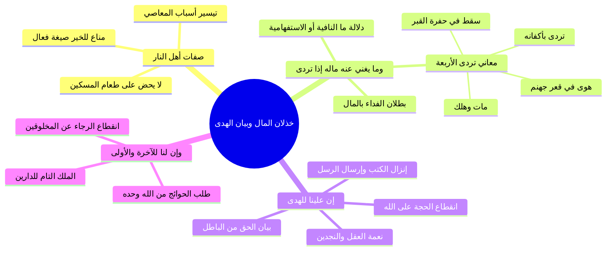

# تفسير الآيات (11-13) خذلان المال إذا تردى وبيان الهدى

> [!info] بيانات الجزء
> - **المدى المرجعي بالتفريغ:** الأسطر 395–431.
> - **المحور العام:** تتمة تيسير العبد للعسرى وخذلان المعاصي، بلاغة القرآن في صيغة «منّاع للخير»، تفسير قوله تعالى: ﴿وَمَا يُغْنِي عَنْهُ مَالُهُ إِذَا تَرَدَّىٰ﴾ ومعاني «تردى» الأربعة، وتفسير ﴿إِنَّ عَلَيْنَا لَلْهُدَىٰ * وَإِنَّ لَنَا لَلآخِرَةَ وَالأُولَىٰ﴾.

---

## 📝 الملخص العلمي المنظم للجزء 07

### 1. تيسير العبد للعسرى وبلاغة «مَنَّاعٍ لِّلْخَيْرِ»
- إذا سلك العبد طريق الشح والتكذيب يسره الله للحالة العسرة؛ فتصبح المعاصي ميسرة له، بينما تتعسر عليه ركعتان أو بذل درهم.
- استشهد الشيخ بصفات أهل النار في سورة ق: ﴿مَّنَّاعٍ لِّلْخَيْرِ مُعْتَدٍ مُّرِيبٍ﴾:
  - جاءت بـ صيغة المبالغة «فَعَّال» (مَنَّاع)؛ أي كثير المنع لخير نفسه، وكثير المنع لغيره أن يفعلوا الخير، يجمع بين البخل وأمر الناس بالبخل.
  - وبلاغة قوله تعالى: ﴿وَلَا يَحُضُّ عَلَىٰ طَعَامِ الْمِسْكِينِ﴾ أبلغ من قوله «لا يطعم»؛ لأنه إذا كان لا يحض غيره فمن باب أولى أنه لا يطعم بنفسه.

### 2. تفسير ﴿وَمَا يُغْنِي عَنْهُ مَالُهُ إِذَا تَرَدَّىٰ﴾
- دلالة حرف «مَا»:
  1. **نافية:** أي: لا ينفعه ولا يدفع عنه عذاب الله ماله قط.
  2. **استفهام على سبيل الإنكار والتعجب:** أي: أي شيء يغني ويدفع عنه ماله إذا هلك؟!
- **المعاني الأربعة لقوله ﴿إِذَا تَرَدَّىٰ﴾:**
  1. **إذا مات وهلك:** فلا يصحبه ماله، بل يتركه لغيره ويتحمل حسابه.
  2. **إذا تردى بأكفانه:** حين يُجرد من ملابسه وثروته وساعته، ولا يخرج من الدنيا إلا بخرقة الكفن.
  3. **إذا سقط في القبر:** وووري في ظلمات التراب ولن ينفعه إلا العمل الصالح.
  4. **إذا سقط وتردى في قعر جهنم:** كما يقال تردى من الجبل إذا هوى وسقط.
- استشهد الشيخ بنصوص خذلان المال يوم القيامة:
  - ا ﴿يَوَدُّ الْمُجْرِمُ لَوْ يَفْتَدِي مِنْ عَذَابِ يَوْمِئِذٍ بِبَنِيهِ * وَصَاحِبَتِهِ وَأَخِيهِ * وَفَصِيلَتِهِ الَّتِي تُؤْوِيهِ * وَمَن فِي الأَرْضِ جَمِيعاً ثُمَّ يُنجِيهِ﴾ [المعارج: 11–14].
  - ا ﴿لَوْ أَنَّ لَهُم مَّا فِي الأَرْضِ جَمِيعاً وَمِثْلَهُ مَعَهُ لِيَفْتَدُوا بِهِ مِنْ عَذَابِ يَوْمِ الْقِيَامَةِ مَا تُقُبِّلَ مِنْهُمْ﴾ [المائدة: 36].

### 3. تفسير ﴿إِنَّ عَلَيْنَا لَلْهُدَىٰ﴾
- معنى الآية: إن على الله عز وجل بمقتضى حكمته ورحمته وفضله أن يبين للعباد طريق الهدى من طريق الضلال:
  - فأنزل الكتب وأرسل الرسل مبشرين ومنذرين؛ لئلا يكون للناس على الله حجة بعد الرسل.
  - وركب في الإنسان العقل ليميز به بين الحق والباطل، والخير والشر: ﴿وَهَدَيْنَاهُ النَّجْدَيْنِ﴾، ﴿إِنَّا هَدَيْنَاهُ السَّبِيلَ إِمَّا شَاكِراً وَإِمَّا كَفُوراً﴾.
  - فطريق الهدى مستقيم يدني من رضوان الله، وطريق الضلال مسدود لا يوصل إلا إلى العذاب.

### 4. تفسير ﴿وَإِنَّ لَنَا لَلآخِرَةَ وَالأُولَىٰ﴾
- الداران (الدنيا والآخرة) ملك وتصرف لله وحده سبحانه وتعالى لا شريك له فيهما:
  - فمن أراد صلاحاً ونعيماً في الآخرة؛ فليطلبه من الله وحده.
  - ومن أراد رزقاً وعافية في الدنيا؛ فليطلبه من الله وحده.
  - وثمرة ذلك: انقطاع رجاء المخلوقين عن غير الله تعالى، وتجريد التوكل عليه والرغبة إليه سبحانه.

---

## 🧭 خريطة المفاهيم الذهنية (Mindmap)

---

## 🔍 المراجعة الداخلية (5 أسئلة تحقق سريعة)

1. **س:** ما الدلالة البلاغية لورود كلمة «مَنَّاع» بصيغة فعال في القرآن؟
   - **ج:** تدل على المبالغة والكثرة؛ فهو كثير المنع لخيره ولخير غيره.
2. **س:** ما المعنيان المحتملان لحرف «مَا» في قوله: ﴿وَمَا يُغْنِي عَنْهُ مَالُهُ﴾؟
   - **ج:** نافية (لا يغني عنه ماله شيئاً)، أو استفهام إنكاري تعجبي (أي شيء يغني عنه ماله؟).
3. **س:** اذكر معاني «تَرَدَّىٰ» الأربعة في سياق الآية.
   - **ج:** مات وهلك، لُفَّ في أكفانه وتجرد من ماله، سقط في قبره، أو هوى في قعر جهنم.
4. **س:** ما الواجب الذي تكفل الله تعالى به في قوله: ﴿إِنَّ عَلَيْنَا لَلْهُدَىٰ﴾؟
   - **ج:** تكفل سبحانه ببيان طريق الحق والرشاد وإيضاح الحلال من الحرام بإرسال الرسل وإنزال الكتب.
5. **س:** ما الثمرة الإيمانية العملية المترتبة على قوله: ﴿وَإِنَّ لَنَا لَلآخِرَةَ وَالأُولَىٰ﴾؟
   - **ج:** انقطاع الرجاء عن المخلوقين، وإفراد الله وحده بطلب حوائج الدنيا والآخرة لأنه مالك الدارين.

---

## 🗣️ نص المتحدث الكامل (من الأسطر 395 إلى 431)

> متعصره كده وصعبه ما تدور يا عم الاسباب اهي يا عم انت بتتصدق ما فيش صدقه ولا في ايمان ولا في تصديق ولا في حاجه خالص ما انت اللي جايبه لنفسك فسنيسره للعسره وما يغني عنه ماله اذا ترد ما هنا ال قي في جهنم كل كفاء ما دي بقى من اوصاف اهل النار اهي من اوصاف اهل النار كفار عنيد منع للخير ودي برض لسه فاك لسه واخد بالي من الملمح ده قريب في قول الله عز وجل من مش مانع للخير
>
> ده مناع صيغه مبالغه فعال لان صيغ المبالغه لها اربع او خمس صيغ
>
> منها فعال فعوله فعال يعني مناع يعني فعال كثير المنع خدت بالك يمنع خيره ويمنع الناس ان ايه ان يفعلوا الخير يبخلون
>
> ويامرون الناس بالبخل
>
> ولا يحط طعام المسكين
>
> ولا يحط هو ده دي ابلغ من انه يقول ايه ولا يطعم المسكين لان هو لا يحض على طعام المسكين فمن باب اوله هو ما بيطعمش المسكين
>
> تفسير القران بقران ده عم الشيخ
>
> الله يفتح عليك
>
> الله يع تفسير القران بالقران نعم وما يغني عنه ماله لو اذا ترد ما هنا اما ان نقول ان ما هنا نافيه
>
> او انها استفهام على سبيل الانكار نافيه يعني ايه ما وما يغني عن تنفي المال يغني عنه اذا تردى يعني اذا مات او اذا هلك او يوم القيامه او عند دخول النار ان يا عم الحاج اللي عمال تجمع المال وشايف ان المال ده كل حاجه قدامك وا اغنيت بالمال والولد والجاه عن الله مش عايز حاجه من ربنا يبقى خلي الفلوس
>
> يبقى خلي الفلوس ترد عنك ملك الموت يبقى خلي الفلوس تنفعك يوم القيامه لما هيجي الكافر يود المجرم لو يرتدي من عذاب يومئذ ببنيه وصاحبته واخيه في الصلاه و من في الارض جميعا ثم ينجيه لو ان لهم ما في الارض جميعا ومثله معه ليفتدوا به من عذاب يوم القيامه ما تقبل منه هات ملك الارض كل ملك الدنيا باللي فيها عشان تفتدي من عذاب الله مش هيقبل منه مش انت استغنيت بالفلوس ابقى خلي الفلوس تنفعك لما تيجي تموت
>
> مش هينفعك يا حبيبي مش هينفعك يا سيدي غير عملك الصالح يا اما عند الموت هو عملك الصالح فبرك هو عملك الصالح يوم القيامه عملك الصالح اكتر من كده مش هينفعك حاجه
>
> اللهم اصلح اعمال
>
> اللهم اصلح اعمالنا
>
> يبقى ما نافيه وما يغني عنه ملو اذا تردد او انها استفهام للتعجب والانكار وما يغني يعني هيغني عنه ماله اذا تردى حاجه الاستفهام للتعجب هل يغني عنه ماله اذا مت؟
>
> لا
>
> يبقى استفهام للتعجب والانكار يبقى اول حاجه وما يغني عنه ماله اذا ترد والثانيه وما يغني عنه ماله اذا ترد وما ها هل يغني عنه ماله شيء
>
> اذا هلك تردى فيها اربعه معاني بمعنى هلك يعني مات اثنين يعني سقط في القبر لاثه يعني تردى باكفانه من الرداء مش الانسان بيلبس ازاره ورداء لما يلفوه في اكفانه الفلوس هتنفعه ده اول حاجه يطلعها الفلوس اللي في جيبك
>
> اذا كانت اول حاجه هيطلعها الفلوس اللي في جيبك وقلعوك الساعه وقلعوك اللي انت لابسه ده مش هتاخد معاك حاجه اصلا يبقى خلي بالك بقى من اعمالك مش تبقى مشغول بايه بالمال والمال مش هينفعك
>
> الثالثه عندما تزود من ايه
>
> اول حاجه عند الموت
>
> اه
>
> تردى يعني هلك يعني مات اثنين
>
> ممكن نرتبهم اثنين يعني تردى باكفانه يعني لبس اكفانه هل ينفعه ماله؟
>
> لا ومش هينفعه ماله ثلاثه عندما يسقط في القبر يدخل في القبر عشان يندفع هل ينفعه ماله
>
> ولن ينفعه ماله ده معنى ايه النفي وايه والاستفهام الرابعه يعني اذا سقط في جهنم والعياذ بالله هل ينفعه ماله ولن ينفعه مال
>
> يوم لا ينفع مال ولا
>
> نعم يوم لا ينفع مال ولا بنون الا من اتى الله قد
>
> وما يغني عنه الشيخ السعدي بيقول لك وما يغني عنه ماله اذا ترد يعني الذي اذا اطغاه المال واستغنى به وبخل به اذا هلك ومات فانه لا يصحب الانسان الا عمله الصالح اما ماله الذي لم يخرج منه الواجب فانه يكون وبالا عليه اذ لم يقدم لاخرته شيئا ان علينا للهدى يا سلام الله عز وجل بيقول لك اعمل اعطى واتقى وصدق بالحسنى والهدايه ديت علينا تكفلت بها يبقى الهدايه يا جماعه لها طريق ولا مالهاش
>
> ل
>
> لها طريق لها سكه انت بتبدا والنتيجه
>
> على الله
>
> على الله على الله قصد سبيل ان علينا نلد ان الله عز وجل تكفل سبحانه ببيان الخير وببيان سبل الخيرات كما قال الله عز وجل ا في سوره البلد
>
> وهديناه النجدين
>
> وهديناه النجدين ونفسنا وسواها فالهمها فجورها وتقوى انا هديناه السبيل اما شاكرا
>
> واما يجي بقى تفصيل السبيل ده والسبيل ده في القران الكريم كله فانزل الله الله عز وجل الكتب وارسل الرسل عشان يبينوا للناس طريق الخير وطريق ايه
>
> وطريق الشر تكفل الله عز وجل ببيان ببيان الهدى فبين الحلال والحرام وبين الحق من الباطل وبين الطاعه من المعصيه واعطاك عقلا لتميز به بين الحق والباطل وبين الطاعه وايه والمعصيه عليك ليك حجه ثاني ورسلا مبشرين ومنذرين لاللا يكون للناس على الله حجه بعد الرس

---

## 📊 حالة الإنجاز ومسار الأجزاء
- **إجمالي الأجزاء:** 10 أجزاء (00–09).
- **الجزء الحالي:** 07.
- **الأجزاء المتبقية:** جزءان (08 و09).

---

## ⏭️ الانتقال التالي
- الانتقال إلى: [[08 - تفسير الآيات (14-21) نار تلظى وصفات الأشقى والأتقى ولسوف يرضى]]
