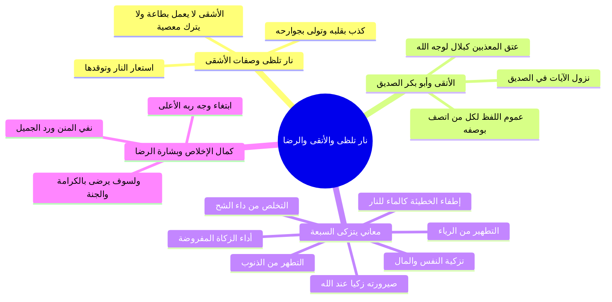

# تفسير الآيات (14-21) نار تلظى وصفات الأشقى والأتقى ولسوف يرضى

> [!info] بيانات الجزء
> - **المدى المرجعي بالتفريغ:** الأسطر 432–475.
> - **المحور العام:** تفسير قول الله تعالى: ﴿فَأَنذَرْتُكُمْ نَاراً تَلَظَّىٰ * لا يَصْلاهَا إِلاَّ الأَشْقَى * الَّذِي كَذَّبَ وَتَوَلَّىٰ﴾، ومقابلها: ﴿وَسَيُجَنَّبُهَا الأَتْقَى * الَّذِي يُؤْتِي مَالَهُ يَتَزَكَّىٰ﴾، معاني «يتزكى» السبعة، كمال إخلاص الأتقى ونزول الآيات في الصديق، وبشارة ﴿وَلَسَوْفَ يَرْضَىٰ﴾.

---

## 📝 الملخص العلمي المنظم للجزء 08

### 1. تفسير ﴿فَأَنذَرْتُكُمْ نَاراً تَلَظَّىٰ﴾
- معنى «تَلَظَّىٰ»: أي تتوقد، وتستعر، وتلتهب نيرانها شواظاً وحريقاً.
- هذا إنذار رحيم وشفيق من النبي ﷺ لأمته؛ ليحذروا موجبات سخط الله وعذابه الأليم.

### 2. صفات «الأشقى» وعقوبته
- معنى الأشقى كما ورد في الأثر النبوي:
  - ا «الأَشْقَى هُوَ الَّذِي لَا يَعْمَلُ بِطَاعَةِ اللَّهِ وَلَا يَتْرُكُ لِلَّهِ مَعْصِيَةً».
- صفتاه الملازمتان:
  1. **كذّب:** كذب بالخبر الصادق بقلبه، وكذب بالنبي ﷺ وبما أنزل عليه.
  2. **تولّى:** أعرض عن الأمر الشرعي بجوارحه فترك امتثال الطاعات.

### 3. صفات «الأتقى» ونزولها في أبي بكر الصديق
- قوله تعالى: ﴿وَسَيُجَنَّبُهَا الأَتْقَى﴾:
  - أجمع المفسرون على أن هذه الآيات نزلت في الصحابي الجليل أبي بكر الصديق رضي الله عنه حين كان يشتري العبيد المعذبين في الله كبلال بن رباح وعامر بن فهيرة ويعتقهم لوجه الله.
  - وهي مع ذلك عامة في كل من اتصف بهذه الأوصاف الفاضلة إلى يوم القيامة.

### 4. الأوجه السبعة لمعنى ﴿الَّذِي يُؤْتِي مَالَهُ يَتَزَكَّىٰ﴾
- جمع الشيخ سبعة معانٍ جليلة لكلمة «يتزكى»:

| # | الوجه التفسيري | البيان والمعنى الشرعي |
|:---:|:---|:---|
| 1 | **أداء الزكاة المفروضة** | إخراج الفريضة المالية التي أوجبها الله في ماله. |
| 2 | **الصيرورة زكياً عند الله** | أن يصير زكياً طاهراً وجيهاً مقبولاً في الملأ الأعلى. |
| 3 | **التطهير من الذنوب والآثام** | يخرج المال بقصد محو السيئات وتطهير صحيفته من الخطايا. |
| 4 | **إطفاء حرارة المعاصي** | لما للصدقة من أثر خاص في إطفاء غضب الرب ومحو أثر الذنب؛ «وَالصَّدَقَةُ تُطْفِئُ الْخَطِيئَةَ كَمَا يُطْفِئُ الْمَاءُ النَّارَ». |
| 5 | **تزكية النفس والمال والنعمة** | صرف المال في طاعة الله لينمي إيمانه ويبارك الله في دينه ودنياه وماله. |
| 6 | **تخليص العمل من الرياء والسمعة** | تزكية النية وتصفيتها من شوائب الشرك الخفي والظهور؛ فلا يريد إلا وجه الله. |
| 7 | **التطهر من مرض الشح والبخل** | مجاهدة النفس بكسر شهوة الجمع والمنع؛ فدواء داء الشح هو بذل الصدقة. |

- **تنبيه فقهي للشيخ السعدي:** نبه السعدي رحمه الله على أن قوله ﴿يَتَزَكَّىٰ﴾ يدل على أنه إذا تضمن الإنفاق المستحب ترك واجب (كدين مستحق أو نفقة واجبة على أهل وبيته) فإنه إنفاق غير مشروع؛ لأن الواجب مقدم على التطوع.

### 5. كمال الإخلاص وبشارة ﴿وَلَسَوْفَ يَرْضَىٰ﴾
- قوله تعالى: ﴿وَمَا لأَحَدٍ عِندَهُ مِن نِّعْمَةٍ تُجْزَىٰ * إِلاَّ ابْتِغَاءَ وَجْهِ رَبِّهِ الأَعْلَىٰ﴾:
  - لم يكن دافعه للبذل مكافأة يد سبقت إليه أو رد جميل من أحد، ولا طلب جزاء مستقبلي من الخلق؛ بل بقيت أعماله مخلصة لوجه الله الأعلى.
  - وهذا الوصف تمحض في أبي بكر الصديق رضي الله عنه؛ إذ لم يكن لأحد من قريش ولا الخلق عليه يد تجزى حتى رسول الله ﷺ إلا نعمة الرسالة والدعوة إلى الإسلام التي لا تكافأ إلا بالاتباع.
- **البشارة الإلهية العظمى: ﴿وَلَسَوْفَ يَرْضَىٰ﴾:**
  - وعد صادق لا يتخلف من الله تعالى بأن يرضي هذا الأتقى في الآخرة بأنواع الكرامات، وجزيل المثوبة، ودخول جنات النعيم، ورضوان الله الأكبر الذي لا سخط بعده.

---

## 🧭 خريطة المفاهيم الذهنية (Mindmap)

---

## 🔍 المراجعة الداخلية (5 أسئلة تحقق سريعة)

1. **س:** ما معنى ﴿نَاراً تَلَظَّىٰ﴾؟
   - **ج:** ناراً تتوقد وتستعر وتلتهب على العصاة والمكذبين.
2. **س:** كيف عرّف الحديث النبوي صفة «الأشقى»؟
   - **ج:** هو الذي لا يعمل بطاعة الله ولا يترك لله معصية؛ كذب بالخبر وتولى عن الأمر.
3. **س:** فيمن نزلت آيات: ﴿وَسَيُجَنَّبُهَا الأَتْقَى...﴾ باتفاق المفسرين؟
   - **ج:** في خليفة رسول الله أبي بكر الصديق رضي الله عنه.
4. **س:** اذكر ثلاثة من معاني «يَتَزَكَّىٰ» التي فصلها الشيخ في الدرس.
   - **ج:** أداء الزكاة، إطفاء الخطيئة كإطفاء الماء للنار، والتطهر من داء الشح والبخل.
5. **س:** ما معنى قوله تعالى: ﴿وَلَسَوْفَ يَرْضَىٰ﴾؟
   - **ج:** وعد من الله بأن يعطيه من الكرامات والنعيم في الجنة ما يرضيه ويرضى به قلبه تمام الرضا.

---

## 🗣️ نص المتحدث الكامل (من الأسطر 432 إلى 475)

> بعد الرسل ان علينا للهدى اي ان الهدى المستقيم طريقه يوصل الى الله ويدن من الرضا اما الضلال فطرق مسدوده عن الله لا توصل صاحبها الا للعذاب الشديد وان لنا للاخره والاولى اي حاجه عاوزها للاخره فاطلبها من الله واذا اردت شيئا من الدنيا فاطلبه من الله لان الاخره والاولى ملكا او وتصرفا ليس له ليس لله عز وجل فيهما مشارك فليرغب الراغبون اليه في الطلب ولينق طع رجاء رجاء المخلوقين عن غير الله عز وجل طيب ثم قال قال الله عز وجل فانذرتكم نارا تلظى يعني تستعر وتتوقد لا يصلها الا الاشقى الذي كذب يعني كذب بالخبر وتولى عن الامر
>
> تتلظى يعني ايه
>
> تلظى يعني تستعر وتتوقد و تلتهب الاشقى ف نارا تنظى لا يصلا الا الاشقى الاشقى هو الذي لا يعمل بطاعه الله ولا يترك لله معصيه ورد عن النبي صلى الله عليه وسلم انه قال ان الاشقى هو الذي لا يعمل بطاعه الله ولا يترك لله معصيه المعاصي شغال والطاعه ما فيش وقيل كذب الذي كذب وتولى وقيل كذب يعني كذب بقلبه و تولى يعني تولى بجوارحه وايضا كذب يعني كذب بالنبي صلى الله عليه وسلم وبما جاء به كذب وتولى واعرض عن الايمان بالنبي صلى الله عليه وسلم
>
> لا يصلاها الا الاشقى الذي كذب وتولى وسيجنبها الاتقى قيل بان هذه الايات
>
> ابي بكر
>
> نزلت في ابي بكر الصديق الله يفتح
>
> انا بقى وانا بحضر بقيت قاعد جنش دي في شعر
>
> عايزين نقرا عن سيدنا ابو بكر
>
> ايه ده
>
> بقيت قاعد يعني ناس سيدنا ابو بكر اقول لكم طرف كده من سيدنا ابو بكر بس في الفوائد حاجه طب خد يا تزكى الاول لان تزكى برده حيرت طاش بها عقله يعني ايه يتزكى يعني ايه يعني ايه يؤتي ما له يتزكى قيل يتزكى يعني من من اداء الزكاه الزكاه المفروضه
>
> بيؤدي زكاه واحد اثنين يرحمك الله من الزكاه ان يصيروا زكيا عند الله تعالى ثلاثه من التطهير يعني يتطهر من ذنوبه يعني بيطلع ماله بنيه ايه يتزكى يعني يتطهر من ذنوبه اربعه يعني يتطهر من اثار الذنوب والاثام الاثار بتاعتها بقى كما قال النبي صلى الله عليه وسلم والصدقه
>
> تطفئ الخطيئه كما يطفئ الماء النار من المعصيه دي بتعمل لهيب فتيجي تتصدق الصدقه تعمل ايه؟ تطفي نار الاثم والذنب ده خمسه يؤتي ما له يتزكى يعني يصرف ماله في طاعه ربه ليزكي نفسه وماله وما وهبه الله من دين ودنيا يصرف ماله في طاعه ربه ليزكي نفسه وماله وما وهبه الله من دين ودنيا خمسه
>
> سته يتطهر به يعني يتزكى يعني يتطهر به فيخلصه لله ويصفيه من الرياء والسمعه سبعه يعني يتزكى يعني يتطهر به من مرض الشح والبخل عاوز تتخلص من مرض الشح والبخل تعمل ايه؟
>
> تتصدق ده معنى يتزكى الشيخ السعدي قال يتزكى بان يكون قصده به تزكيه نفسه وتطهيرها من الذنوب والادناس قاصدا به وجه الله تعالى فدل ذلك على ان على انه اذا تضمن الانفاق المستحب ترك واجب كدين ونفقه ونحوهما فانه غير مشروع طيب وما لاحد عنده من نعمه تجزى اخر ايه بقى يلا ها صل على النبي
>
> صلى الله عليه وسلم
>
> وما لاحد عندهم من نعمه تجزى يعني ليس لاحد من الخلق على هذا الاتقى نعمه تجزى الا وقد كافاه عليها وربما بقي له الفضل والمنه على الناس فيتمحض عبدا لله لانه رقيق احسانه وحده واما من بقيت عليه نعمه الناس فلم يجزاها ويكافئها فانه لابد ان يترك للناس وافعلهم ما ما ينقص اخلاصه قال وهذه الايه وان كانت متناوله لابي بكر الصديق رضي الله عنه بل قد قيل انها نزلت بسبب فانه رضي الله عنه ما لاحد عنده من نعمه تجزى حتى ولا رسول الله
>
> صلى الله عليه
>
> صلى الله عليه وسلم الا نعمه الرسول التي لا يمكن جزاؤها وهي نعمه الدعوه الى دين الاسلام وتعليم الهدى ودين الحق فان لله ورسوله المنه على كل احد منه لا يمكن لها جزاء ولا مقابله فانها متناوله لكل من اتصف بهذا الوصف الفاضل فلم يبقى لاحد عليه من الخلق نعمه تجزى فبقيت اعماله خالصه لوجه الله تعالى ولهذا قال الا ابتغاء وجه ربه الاعلى ولسوف يرضى هذا الاتقى بما يعطيه الله من انواع الكرامات والمثوبه يعني ايه وما الى احد عندهم من التجزء يعني لما بيجي يعمل يتصدق مش واحد كان عمل فيه جميله فالدافع ليه انه يتصدق او يبذل الخير ده رد جميله لا هو اصلا ماحدش له عليه جميله وانما الذي دفعه الى هذا العمل والذي دفعه لهذه الصدقه ابتغاء وجه ربه الاعلى الذي يفعل ذلك ايه
>
> اخلاص وايضا لا يقصد جزاء على هذه الصدقه من احد في المستقبل ولسوف يرضى واحد وعد بان يرضيه الله في الاخره ولسوف يرضى يعني وعد بان بان يرضيه الله في الاخره اثنين ولسوف يرضى من اتصف بهذه الصفات اللي اتصف بالصفات اللي في السوره ديت ربنا هيرضيه وهيرضيه ويرضى عنه ثلاثه يعني يعطيه الله من الكرامه ما يرضى به في دار السلام التي هي الجنه صلى الله عليه وسلم بيقول ان كافئنا كل الناس الا ابو بكر الله عز وجل يا سيدنا
>
> اثنين
>
> اثنين ولسوف يرضى من اتصف بهذه الصفات الهدى في الايه يا عم الشيخ ممكن ممكن نقول النور
>
> لا احنا مش هنقول قول يمكن احنا هنقول كلام المفسرين اللي هم قالوه احنا بننسج على منوالهم
>
> حتى انا قريتها في في هدى للمتقين الهدى برض في تفسير الطبري النور
>
> ان علينا للهدى يعني بيان الخير من الشر والطاعه من المعصيه ده معنى اعم معنى اعم واشمل
>
> صليت على الرسول
>
> صلى الله عليه وسلم
>
> الفوائد يعني انا مش مش هقول لكم الفوائد كلها لان احنا كده خلاص يعني انتوا كده جزاك انتوا كده شطبتوا خلاص يعني هو الفوائد مش كتير يعني يعني حوالي حوالي 24 25 فاذا يعني
>
> يعني مش كتير يعني ف لو
>
> مش عايز اطول عليكم يعني الجمعه
>
> شيخنا احنا بنسجل شيخنا بنسجل والشيخ هينزلها على الجروب فممكن حضرتك لو تقولها لنا سريع من غير ما نكتب ونفرجه بعد كده
>
> طب ما انا اديكم الورقه وانتم تكتبوه يعني حد
>
> هاتها صوا مره بس برض عشان لن نعدم خيرا
>
> هنقول ثلاث اربع فوائد
>
> ماشي
>
> وممكن نصور الشيخ ايمن فين
>
> ما جاشصور يا شيخ
>
> مهندس ايمن ماتردش
>
> صلي على الرسول
>
> صلى الله عليه وسلم
>
> حد يبقى يكتبها الاخوه ورد ويرفعها لهم على الجروب يبقى جزاه الله خير صورها كده بالتليفون ويرفعها
>
> ماشي مش هنكتب يعني هنكتبك لاثه اربعه
>
> طيب ا في كان سؤال معلش نكتب ان يصير ا ذكيا دي في تذكر المقصود بها ذكيا فطينا ولا المقصود بها ذكيا طاهرا
>
> طاهرا بص يا سيدي صلي على الرسول
>
> صلى الله عليه وسلم

---

## 📊 حالة الإنجاز ومسار الأجزاء
- **إجمالي الأجزاء:** 10 أجزاء (00–09).
- **الجزء الحالي:** 08.
- **الأجزاء المتبقية:** جزء واحد (09).

---

## ⏭️ الانتقال التالي
- الانتقال إلى: [[09 - الفوائد التربوية والإيمانية وسنن التوفيق ومناقب الصديق]]
