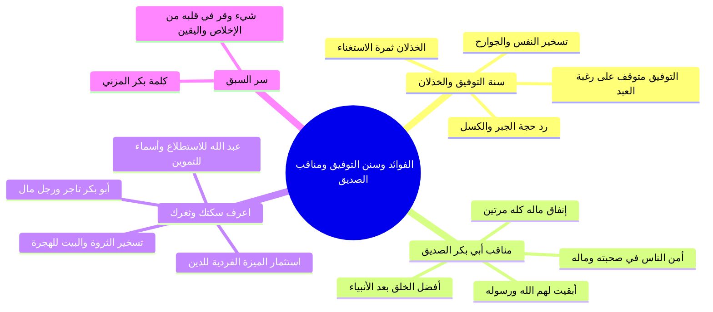

# الفوائد التربوية والإيمانية وسنن التوفيق ومناقب الصديق

> [!info] بيانات الجزء
> - **المدى المرجعي بالتفريغ:** الأسطر 476–531.
> - **المحور العام:** استنباط أعظم الفوائد الإيمانية والتربوية من سورة الليل، قانون وسنة التوفيق والخذلان وعلاقتها برغبة العبد وتسخير جوارحه، عظمة أبي بكر الصديق وعلو همته، مبدأ «اعرف سكتك وثغرك واستعمل ما ميزك الله به لدينه»، وسر سبْق الصديق باليقين، وخاتمة المجلس والدعاء.

---

## 📝 الملخص العلمي المنظم للجزء 09

### 1. الفائدة التربوية الكبرى الأولى: سنة التوفيق والخذلان
- قرر الشيخ قاعدة إيمانية كبرى مستنبطة من السورة تنفع الداعية في معاملة نفسه ومعاملة الخلق:
  - ا «إن التوفيق للعمل بالطاعة متوقف على رغبة العبد وطلبه وحرصه عليه واختياره وتسخير نفسه وجوارحه له».
  - وكذلك التوفيق للعمل الفاسد والولوج في المعاصي متوقف على رغبة العبد وطلبه واختياره وحرصه وتسخير جوارحه له.
- **ميزان الإرادة الإنسانية:**
  - «الله عز وجل ينظر إلى قلب العبد: عاوز ولا ما نتش عاوز؟
    - لو عاوز وصادق: يسر الله له سبل اليسرى (هَيّأ له حلقة علم، تحفيظ قرآن، صحبة صالحة، انشراح صدر).
    - لو مش عاوز ومستغنٍ: خلى الله بينه وبين نفسه ووُكل إلى العسرى».
- **الرد على حجج الكسالى:** من اعتذر بالقدر وقال: «نفسي أصلي أو أقوم الليل لكن مش قادر!»، يُقال له: لو صدقت رغبتك في الخير لسعيت في أسبابه ويسرك الله له؛ فالنفس إن لم تشغلها بالحق شغلتك بالباطل: ﴿قُلْ كُلٌّ يَعْمَلُ عَلَىٰ شَاكِلَتِهِ﴾، ﴿إِمَّا شَاكِراً وَإِمَّا كَفُوراً﴾.

### 2. الفائدة التربوية الكبرى الثانية: علو همة الصديق ومنزلته
- بيان منزلة أبي بكر الصديق رضي الله عنه؛ فهو خير هذه الأمة وأفضل الخلق قاطبة بعد الأنبياء والمرسلين.
- تمحضت عبوديته لله حتى لم تبقَ لأحد عليه منة دنيوية إلا لرسول الله ﷺ بنعمة البلاغ والدعوة.
- خرج من ماله كله في سبيل الله مرتين:
  - ولما سأله النبي ﷺ: «مَاذَا أَبْقَيْتَ لِأَهْلِكَ يَا أَبَا بَكْرٍ؟»
  - قال بلسان اليقين:
    - ا «أَبْقَيْتُ لَهُمُ اللَّهَ وَرَسُولَهُ».
- شهادة النبي ﷺ الخالدة له:
  - ا «إِنَّ أَمَنَّ النَّاسِ عَلَيَّ فِي صُحْبَتِهِ وَمَالِهِ أَبُو بَكْرٍ، وَلَوْ كُنْتُ مُتَّخِذاً خَلِيلاً غَيْرَ رَبِّي لَاتَّخَذْتُ أَبَا بَكْرٍ خَلِيلاً، وَلَكِنْ أُخُوَّةُ الإِسْلَامِ وَمَوَدَّتُهُ».

### 3. المبدأ العملي والدعوي: «اعرف سكتك وثغرك»
- صاغ الشيخ مفهوماً تربوياً بديعاً مستمداً من سيرة أبي بكر الصديق:
  - كان أبو بكر رضي الله عنه تاجر ثرياً ورجل أعمال خبيراً بالمال والتجارة؛ فعرف طريقه وثغره واستثمر ما ميزه الله به في خدمة دين الله:
    - جهز ناقتين للهجرة من خالص ماله.
    - استأجر خبيراً دليلاً للطريق (عبد الله بن أريقط).
    - وظف ابنه عبد الله في الغار لاستطلاع الأخبار الحربية لقريش.
    - وظفت ابنته أسماء رضي الله عنها نطاقها لحمل الطعام والتموين.
    - جعل بيته كله وماله وأهله (عائشة وأسماء وعبد الله) مسخرين لخدمة الهجرة النبوية ونصرة دين الله.
- **التوجيه العملي لكل مسلم:**
  - ما الذي ميزك الله به واختصك به عن غيرك؟ هل هو مال، أو فكر، أو لسان وبيان، أو مهارة تقنية، أو وجاهة؟
  - ابحث عن هذا السر، واعرف سكتك، ووظف ثغرك لنصرة دين الله؛ تصل به إلى أعلى الدرجات.

### 4. سر سبْق أبي بكر الصديق
- ختم الشيخ بكلمة التابعي الجليل بكر بن عبد الله المزني رحمه الله:
  - ا «مَا سَبَقَهُمْ أَبُو بَكْرٍ بِكَثْرَةِ صِيَامٍ وَلَا صَلَاةٍ، وَلَكِنْ بِشَيْءٍ وَقَرَ فِي قَلْبِهِ» (وهو كمال اليقين والإخلاص والتسليم لله ورسوله).

### 5. ختام المجلس والدعاء
- ختام الدرس بالدعاء المأثور: «اللهم علمنا ما ينفعنا، وانفعنا بما علمتنا، واجعل ما تعلمنا حجة لنا لا علينا»، والصلاة والسلام على رسول الله محمد ﷺ.

---

## 🧭 خريطة المفاهيم الذهنية (Mindmap)

---

## 🔍 المراجعة الداخلية (5 أسئلة تحقق سريعة)

1. **س:** على أي شيء يتوقف توفيق الله للعبد بالعمل الصالح في هذه الحياة؟
   - **ج:** على رغبة العبد الصادقة، وطلبه، وحرصه، واختياره، وتسخير جوارحه ونفسه لطاعة الله.
2. **س:** كم مرة خرج أبو بكر الصديق رضي الله عنه من ماله كله في سبيل الله؟ وماذا قال للنبي ﷺ؟
   - **ج:** خرج من ماله كله مرتين، وقال: «أبقيت لهم الله ورسوله».
3. **س:** ما المبدأ العملي الذي استنبطه الشيخ من توظيف أبي بكر الصديق لماله في الإسلام؟
   - **ج:** مبدأ «اعرف سكتك وثغرك»؛ بأن يبحث كل مؤمن عما ميزه الله به فيوظفه في خدمة دين الله.
4. **س:** كيف سخر أبو بكر رضي الله عنه أسرته في خدمة حادثة الهجرة النبوية؟
   - **ج:** سخر ابنه عبد الله لاستطلاع الأخبار، وابنته أسماء لحمل الزاد، ودليلاً خبيراً للطريق، وناقتين مجهزتين.
5. **س:** بماذا علل التابعي بكر بن عبد الله المزني سبْق أبي بكر للصحابة جميعاً؟
   - **ج:** قال: «ما سبقهم أبو بكر بكثرة صيام ولا صلاة، ولكن بشيء وقر في قلبه».

---

## 🗣️ نص المتحدث الكامل (من الأسطر 476 إلى 531)

> من من الفوائد المهمه جدا في السوره دي من سنن الله تعالى في خلقه اكتبها بقى اكتب الفائده دي في فايده مهمه من سنن الله تعالى في خلقه ان التوفيق للعمل بالطاعه دي هتفيدك في التعامل مع نفسك وفي التعامل مع الناس في الدعوه الى الله ها ان التوفيق للعمل بالطاعه متوقف على رغبه العبد
>
> متوقف على رغبه العبد وطلبه وحرصه عليه واختياره وتسخير نفسه وجوارحه له
>
> لذلك اما تيجي تقول لحد صلي يقول لك ايه
>
> انا نفسي والله اصلي بس الايه بتقول انت كف بتقول انت كذا او كذا نفسي والله اقوم الليل لو انك صادق هتقوم الليل تاني ان التوفيق للعمل بالطاعه
>
> متوقف
>
> على رغبه العبد
>
> الله عز وجل ينظر الى العبد
>
> عاوز
>
> ولا ما انتش عاوز عاوز هنيسره لليسر مش عاوز خالص مش عاوز متوقف على رغبه العبد وطلبي وحرصه عليه واختيار وتسخير نفسه وجوارح وجوارح كما ان التوفيق للعمل الفاسد اشتمل بقى المعاصي والاثام والفجور شيء من متوقف على رغبه العبد وطلبه واختياره وحفظه وتسخين نفسه وجوارحه طيب
>
> ا من فوايد سيدنا لو
>
> الانسان مش مشغول بالطاعه هيتشغل بغير بالطاعه
>
> ماشي
>
> يعني في المعنى ده يعني هو مش ا موفق لما كل فلا او زي ما حضرتكقول توقف على رغبته هو مش لو ما شغلهاش بالطاعه
>
> مش هيبقى هيبقى مشغول بالمعصيه هنا ما فيهاش رغبه هو كده واقع فيها اساسا التوفيق للعمل بالطاعه متوقف على رغبه فلو ان الانسان عنده في داخله رغبه الى الخير ورغبه الى الصلاح ورغبه الى والى الى ما يحبه الله ويرضاه ربنا هيوفقه ويسر له سبل ذن هيسر له حلقه علم هيسر له تحفيظ قران هيسر له بيئه صالحه هيسر له هيسر له هيسر له مش عا ز ومش راغب و يا عم الشيخ ما انا مبسوط كده
>
> خليك مبسوط
>
> انا هو يقول لك يا عم الشيخ انا مبسوط كده انا بصلي بجمعه والدنيا كده هو مش عايز يبقى هيوفق لايه
>
> للي هو عاوزه ان سعيكم
>
> لا قل كل يعمل
>
> على شاكلته يبقى في الاخر هديناه النجدين هديناه السبيل اما شاكرا واما كفورا بس ما حدش ضرب على ايده انه يبقى من المعصيه ولا حد جبر ان انت معاك اسلوك ده او اسلوك ده سلكت ده هتوصل لنهايته يسر لليسرى اللي هي اخرها الجنه عايز الثاني الطريق الثاني امشي فيه بس نهايتك
>
> النار والعياذ بالله
>
> من الفوائد ايضا بيان منزله سيدنا ابو بكر الصديق رضي الله عنه وعلو همتهم وعلو همته اذ لا منه لاحد عليه الا رسول الله برسالته
>
> صلى الله عليه وسلم
>
> صلى الله عليه وسلم
>
> سيدنا ابو بكر ده هو افضل اصحاب الانبياء اصحاب النبي صلى الله عليه وسلم
>
> صلى الله عليه وسلم
>
> اصحاب النبي صلى الله عليه وسلم افضل الخلق بعد الانبياء وافضل ابو بكر
>
> سيدنا ابو بكر الصديق رضي الله عنه سيدنا ابو بكر الصديق من الفوائد اللي انت تطلع منها في طبعا اقرا عن سيدنا ابو بكر الصديق وعن شخصيته وعن سماته وعن اخلاقه وما الى ذلك ان سيدنا ابو بكر الصديق عرف سكته انت عارف سكتك ايه يعني عرف سكته صلي
>
> صلى الله عليه وسلم
>
> سيدنا ابو بكر الصديق كان رجل اعمال رجل تاجر من كبار التجار فلما دخل الاسلام هو عارف عارف سكته ان هو راجل بزنسمان رجل تاني رجل اعمال فيعمل ايه؟ فخدم دين الاسلام بماله كله صغيره وكبيره انفق ماله كم مره في سبيل الله؟ مرتين خرج من ماله كله في سبيل الله ماذا ابقيت لاهلك ابا بكر؟
>
> قال ابقيت لهم الله ورسوله اثنين قال صلى الله عليه وسلم صلي عليه
>
> صلى الله عليه وسلم
>
> ان ان الناس علي
>
> ابو بكر
>
> في صحبته وماله ابو بكر ولو كنت متخذا خليلا غير ربي لاتخذت ابا بكر
>
> ولكن خله الاسلام ومودته ده ده في الهجره كل حاجه كانت عند سيدنا ابو بكر كانت في خدمه دين الله عز وجل هو عارف قد انا راجل بتاع مال وراجل معايا ثروه ف بذلها كلها في سبيل الله وخدمه دين الله فتلاقي مثلا في الهجره قام جايب ناقتين قال له يا رسول الله ناقتين جهزتهما بكل ما عليهما واحده لي وواحده لك يا رسول الله
>
> قال له النبي صلى الله عليه وسلم لا ساخذها بالثمن اخدها بثمنها خدت بالك يروح يختبئ في الغار سيدنا ابو بكر يجيب دليل عبد الله بن قريقط يستاجره مين اللي كان بيودي لهم يستطلع الاخبار في مكه
>
> عبد الله ابن سيدنا ابو بكر الصديق ابنه مين اللي كان بيودي لهم الاكل في الغار سيدنا
>
> سيدنا اسماء بنته ما لقتش حاجه تحط فيها الاكل قامت خالعه نطاقها متشقه نصين واحد تحط فيه الاكل واحد تربطه في وسطها كل حاجه في بيت سيدنا ابو بكر بنته
>
> السيده عائشه
>
> رضي الله
>
> الدجاج لو ق لو قلنا يعني ان الدجاج اللي كان في بيت سيدنا ابو بكر كان بينطبخ مثلا يعني والاكل حتى الاكل كان بيجي من بيت سيدنا ابو بكر فكل حاجه عن سيدنا ابو بكر كان مسخره في خدمه
>
> في خدمه الله ورسوله
>
> صلى الله عليه وسلم
>
> فانت سكتك ايه السك ما كل واحد ربنا ميزه بميزه واعطاه نعمه ليصل بها الى الله من خلالها انت ربنا ادالك ايه اللي انت ربنا اداهولك اختصك بيه عن بني جنسك او عن غيرك حتى تستعمله في خدمه دين الله عز وجل وفي نصره الله ورسوله ربنا ادالك ايه؟ دور واوصل للسر ده هتصل به الى الله
>
> ابو بكر عمل ليه سته من 10 مباشرين من
>
> طيب ا قال ابن رجب قال بكر المزني ما سبقهم ابو بكر بكثره صيام ولا صلاه ولكن بشيء وقر في قلبه
>
> نكتفي بهتين الفائدتين
>
> العظيمتين ا ونكمل ان شاء الله عز وجل في المحاضره القادمه نسال الله عز وجل ان يعلمنا ما ينفعنا
>
> وان ينفعنا بما علمنا وان يجعل ما علمنا حجه لا علينا
>
> امين امين امين
>
> وصل اللهم وسلم وبارك على سيدنا النبي محمد وعلى اله وصحبه وسلم وجزاكم الله خيرا وشكر الله لكم حسن استماع
>
> واياك الله
>
> ومين بقى يتكفل ب بالورقتين دول يكتبهم ويرعهم للاخوه
>
> الاداره يا باشا الاداره
>
> مافيش خلاص بر لم يا عم العم يا عم العز
>
> يعني في

---

## 📊 حالة الإنجاز ومسار الأجزاء
- **إجمالي الأجزاء:** 10 أجزاء (00–09).
- **الجزء الحالي:** 09 (الجزء الأخير من الأجزاء التفصيلية).
- **الأجزاء المتبقية:** 0 أجزاء.
- **تم بحمد الله إنجاز كافة ملفات الأجزاء التفصيلية من 00 حتى 09 كاملة.**

---

## ⏭️ الانتقال التالي
- الانتقال إلى: [[ملخص المراجعة السريعة]]
- الانتقال إلى: [[أسئلة المراجعة والاختبار الذاتي]]
- الانتقال إلى: [[10 - خطة تطبيق الدروس]]
- الانتقال إلى: [[سورة الليل - تفسير وبيان وهدايات تربوية - ملف مجمع]]
