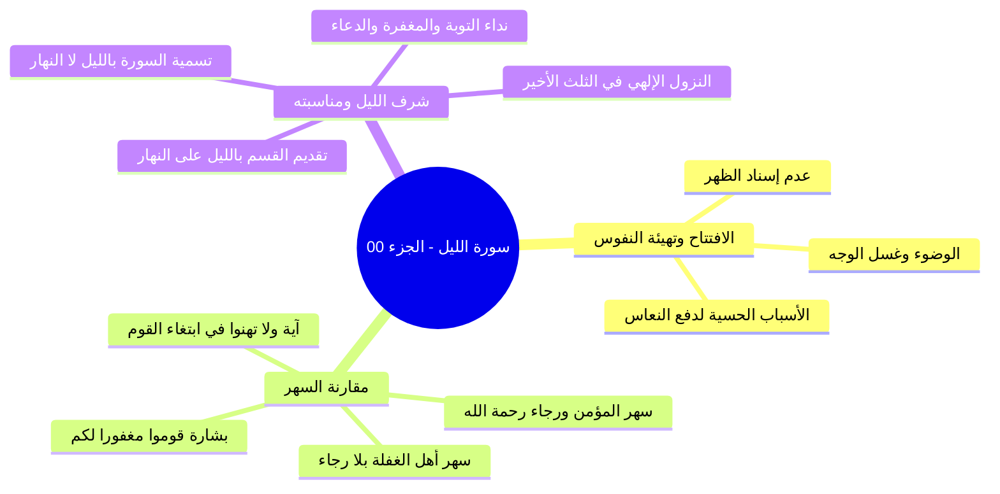
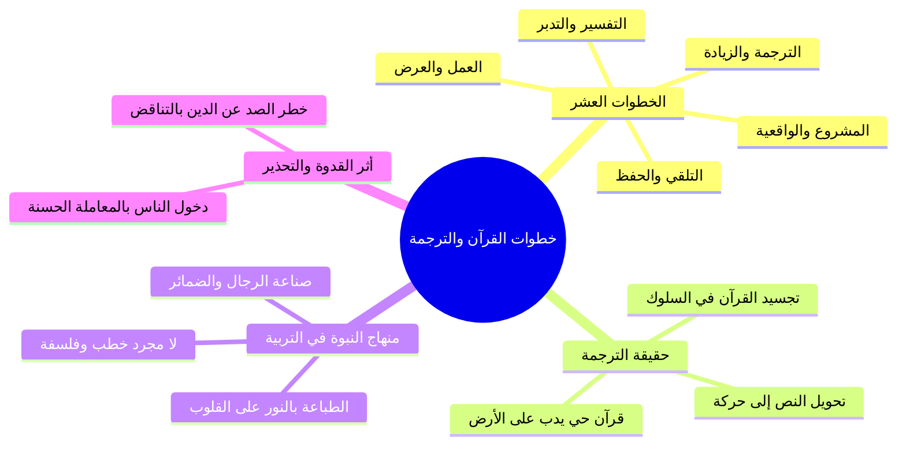
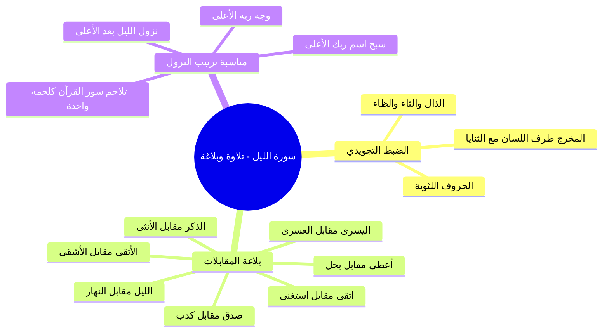
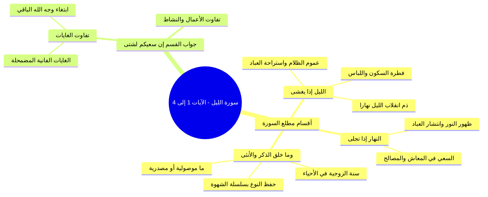
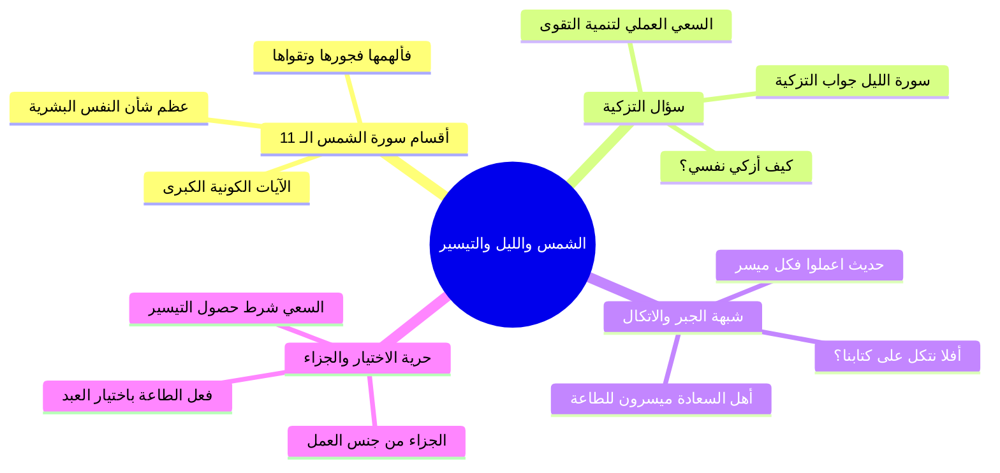
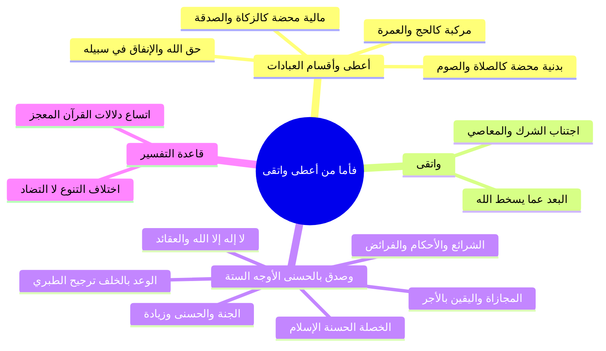
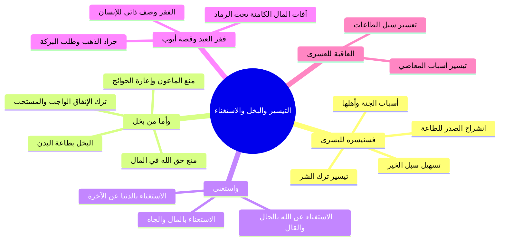
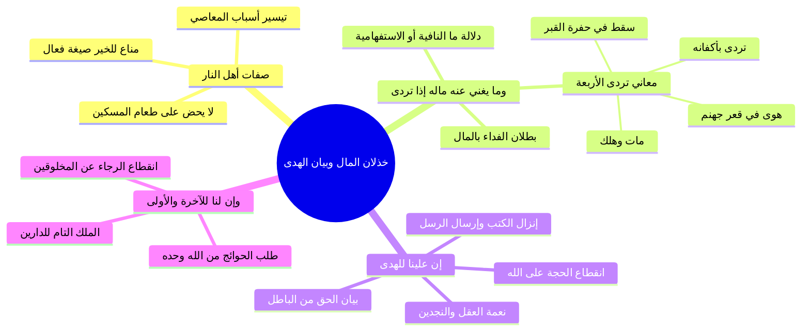
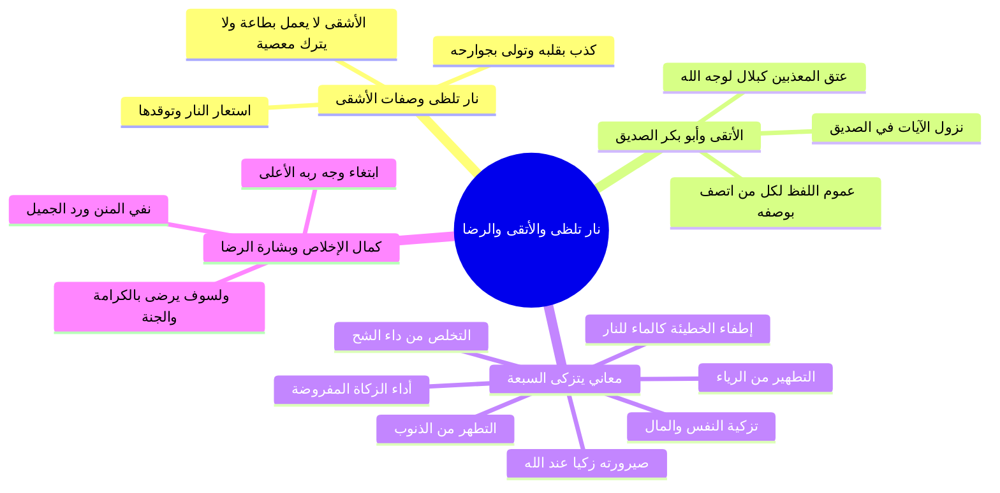
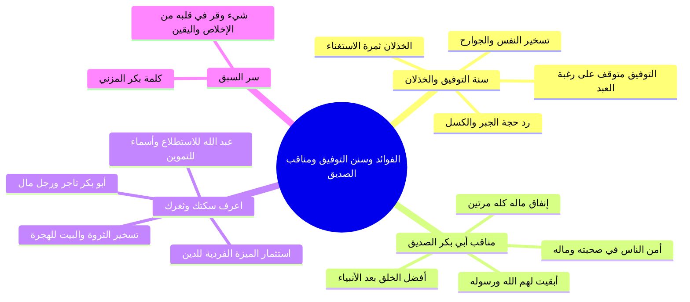

# سورة الليل - تفسير وبيان وهدايات تربوية - ملف مجمع شامل

> [!abstract] بطاقة الملف المجمع
> يضم هذا الملف التفسير والبيان العلمي المنظم لكامل مجلس «[[سورة الليل]]» من قصار المفصل، مشتملاً على جميع الأقسام والتحليلات البيانية والجداول والخرائط الذهنية، مع **نص المتحدث كاملاً بالنص دون أي اختصار أو حذف** لكل جزء، ومجرداً من أسئلة الاختبارات الذاتية وملخصات المراجعة السريعة وفق بروتوكول التلخيص الشامل.

---

## 📑 فهرس محتويات الملف المجمع

1. [[#الجزء 00 مقدمة وفضل السهر في طاعة الله وشرف الليل|الجزء 00: مقدمة وفضل السهر في طاعة الله وشرف الليل]]
2. [[#الجزء 01 خطوات التعامل مع القرآن ومفهوم الترجمة والقدوة|الجزء 01: خطوات التعامل مع القرآن ومفهوم الترجمة والقدوة]]
3. [[#الجزء 02 تلاوة سورة الليل وضبط الحروف وبلاغة المقابلات|الجزء 02: تلاوة سورة الليل وضبط الحروف وبلاغة المقابلات]]
4. [[#الجزء 03 تفسير الآيات (1-4) أقسام السورة وتفاوت سعي العباد|الجزء 03: تفسير الآيات (1-4) أقسام السورة وتفاوت سعي العباد]]
5. [[#الجزء 04 الرابط بين الشمس والليل وتزكية النفس وحديث التيسير|الجزء 04: الرابط بين الشمس والليل وتزكية النفس وحديث التيسير]]
6. [[#الجزء 05 تفسير الآيات (5-7) العطاء والتقوى والتصديق بالحسنى|الجزء 05: تفسير الآيات (5-7) العطاء والتقوى والتصديق بالحسنى]]
7. [[#الجزء 06 تفسير الآيات (8-10) التيسير لليسرى والبخل والاستغناء والعسرى|الجزء 06: تفسير الآيات (8-10) التيسير لليسرى والبخل والاستغناء والعسرى]]
8. [[#الجزء 07 تفسير الآيات (11-13) خذلان المال إذا تردى وبيان الهدى|الجزء 07: تفسير الآيات (11-13) خذلان المال إذا تردى وبيان الهدى]]
9. [[#الجزء 08 تفسير الآيات (14-21) نار تلظى وصفات الأشقى والأتقى ولسوف يرضى|الجزء 08: تفسير الآيات (14-21) نار تلظى وصفات الأشقى والأتقى ولسوف يرضى]]
10. [[#الجزء 09 الفوائد التربوية والإيمانية وسنن التوفيق ومناقب الصديق|الجزء 09: الفوائد التربوية والإيمانية وسنن التوفيق ومناقب الصديق]]

---
# خطة سورة الليل - مقدمة وفضل السهر في الطاعة وشرف الليل

> [!info] الهدف
> تلخيص وشرح تفريغ مجلس تفسير «[[سورة الليل]]» من قصار المفصل وفق بروتوكول التلخيص الشامل، وتوزيع المحتوى العلمي والتوجيهات الإيمانية على أجزاء دراسية مستقلة ومترابطة، مع صياغة ملف مجمع نهائي، وملخص مراجعة سريعة، وأسئلة اختبار ذاتي، وخطة تطبيقية للدروس.

---

## 📝 الملخص العلمي المنظم للجزء 00

### 1. الافتتاح وملاطفة الحضور لتهيئة النفوس
- افتتح الشيخ المجلس بالحمد لله والصلاة والسلام على رسول الله ﷺ، وتخلل ذلك ممازحة خفيفة مع الحضور حول التكييف ومقاومة النعاس وتقديم رشفات من العصير والتمر؛ لتنشيط الهمم وتجاوز التعب البدني المعتاد في الساعات المتأخرة.
- التنبيه على ضرورة اتخاذ الأسباب الحسية لطرد النوم: كالوضوء، غسل الوجه بالماء البارد، تناول تمرات، والامتناع عن إسناد الظهر؛ لأن إسناد الظهر يجلب التراخي والنعاس.

### 2. السهر بين رجاء المؤمن وغفلة العابث
- استدل الشيخ بقول الله تعالى:
  - ا ﴿وَلَا تَهِنُوا فِي ابْتِغَاءِ الْقَوْمِ ۖ إِن تَكُونُوا تَأْلَمُونَ فَإِنَّهُمْ يَأْلَمُونَ كَمَا تَأْلَمُونَ ۖ وَتَرْجُونَ مِنَ اللَّهِ مَا لَا يَرْجُونَ﴾ [النساء: 104].
- المقارنة الفاصلة بين نوعين من السهر:
  - **سهر أهل الدنيا والفسوق:** سهر وتعب وبذل أموال في اللهو والمعاصي وما لا طائل تحته ولا أجر فيه.
  - **سهر أهل الإيمان ومجالس العلم:** تعب وبذل في طاعة الله وطلب مرضاته، يرجون مغفرة الذنوب، وحصول الرحمات، والظفر ببشارة:
    - ا «قُومُوا مَغْفُوراً لَكُمْ».

| وجه المقارنة | سهر أهل الغفلة والفسوق | سهر أهل الإيمان ومجالس العلم |
|:---|:---|:---|
| **الغاية والنية** | لهو، معاصٍ، متعة فانية، إضاعة الأوقات | ابتغاء مرضاة الله، طلب العلم، قيام الليل |
| **المعاناة والجهد** | سهر وتعب وبذل للأموال والأوقات بلا ثواب | مقاومة للنوم ومجاهدة للنفس وبذل مأجور |
| **النتيجة والرجاء** | انقضاء المتعة، ثقل المعصية، خسران الآخرة | حصول المغفرة، رفع الدرجات، ورجاء ما عند الله |

### 3. شرف الليل في التصور الإسلامي
- الليل من أشرف الأوقات وساعات المناجاة للمؤمن، وله مزايا عظمى:
  - اختيار الله عز وجل الليل لوقت النزول الإلهي في الثلث الأخير؛ حيث ينزل ربنا تبارك وتعالى نزولاً يليق بجلاله وكماله إلى السماء الدنيا فينادي:
    - ا «هَلْ مِنْ دَاعٍ فَأَسْتَجِيبَ لَهُ؟ هَلْ مِنْ مُسْتَغْفِرٍ فَأَغْفِرَ لَهُ؟ هَلْ مِنْ تَائِبٍ فَأَتُوبَ عَلَيْهِ؟».
  - نزول السكينة والرحمات والبركات ونزول الملائكة.
- **لطيفة قرآنية في التسمية والقسم:**
  - سمّى الله السورة بـ «سورة الليل»، ولا يوجد في كتاب الله سورة باسم «سورة النهار».
  - قدّم الله القسم بالليل على النهار في مطلعها فقال: ﴿وَاللَّيْلِ إِذَا يَغْشَىٰ * وَالنَّهَارِ إِذَا تَجَلَّىٰ﴾.

---

## 🧭 خريطة المفاهيم الذهنية (Mindmap)

---

## 🗣️ نص المتحدث الكامل (من الأسطر 1 إلى 64)

> السلام ورحمه اللهعين
>
> انت حد حد على السلامه سلام جزاك الله حط لا اله الا الله حاجه عايز تهدي التكييف ده شويه او ارفع الريش فوق ربنا يرزقك بريشه حلوه كده
>
> ريشهضاني ارفع ارفع ارفع
>
> انت كده محتاج خروف
>
> لا لا مراحل
>
> جزاك الله خير السلام عليكم ورحمه الله وبركاته
>
> وعليكم السلام ورحمه اللهلام ورحمه الله وبركاته ما
>
> فيش حاجه للناس دي الناس اللي قاعده سهرانه دي اي رشه عصير كده متاخر يا سيدنا
>
> سامحني عندي
>
> كانت الدنيا
>
> والله كان في مش تعين كده يعني حاجه لاخوك ولا حاجه المره اللي مكسرين
>
> خلاص بقى فاتت بقى صلي على الرسول صلى الله عليه وسلم
>
> في حاجات حلوه يعني تشوقني انت كده
>
> تين
>
> الله
>
> يعني عيد سوره التين تاني يعني انا اديكم العلم وتعملوا بيه من وراياطبقه عامله يا سيد
>
> نعم
>
> الطبقه عامله
>
> اه
>
> اسمك ايه
>
> حمزه
>
> حمزه وماله حمزه معانا النهارده الله
>
> لسه برده من شويه حد اسمه حمزه
>
> حد تاني فوق يا شيخ احمد
>
> في تحت
>
> ممكن يكون حد نايم فوق كده يمين ولا شمال
>
> ما تقلقش منامه يعني سيبه اللي ورا العمودشوف
>
> اللي ورا العمود
>
> خليه في السكينه
>
> سيبه وشيل العمود السلام عليكم ورحمه الله وبركاته. السلام ورحمه الله.
>
> اعوذ بالله من الشيطان الرجيم. بسم الله الرحمن الرحيم. الحمد لله رب العالمين والصلاه والسلام على اشرف الانبياء والمرسلين سيدنا محمد وعلى اله واصحابه اجمعين. يعني قبل ما نبدا درسنا في بعض المعاني ا محتاجين ان احنا نذكر في هذا الوقت يعني ان هي دلوقتي الساعه كام وخلاص وكله فصل والدماغ نامت الفراخ نامت يا عم نام يا ولا الفراخ نامت خدت بالك بس سبحان الله حتى الفراخ بيبقى عندها يقظه بيقول له يا بني لا يكن الديك اكياس منك يسبح او يؤذن وانت نائم الديك بيصحى امتى صح للفجر ده ناصح ده ديك
>
> سبحان الله العظيم ساعتين
>
> نعم
>
> اصحاب الفجر ساعه ساعتين
>
> اه ساعه ساعتين كده بتاع
>
> الديك بتاع النهارده م انتكست فطرتها برض ولا مادش اصلا
>
> اللي كنت عايز اقوله يعني سبحان الله العظيم ذكرت قول الله عز وجل ولا تهنوا في ابتغاء القوم ان تكونوا تالمون فانهم يالمون كما تالمون لكن الفارق الفارق بين المسلم بين المؤمن وبين الفاسق والفاجر والعياذ بالله ان المؤمن يرجو من الله عز وجل رحمته وفضله وبره واحسان انه وجوده ومغفرته وعطائه كل خير من الله اما هذا فلا يرجو ف ان تكونوا تسهرون
>
> فانهم يسهرون
>
> فانهم يسهرون كما تسهرون
>
> لكن
>
> وترجون من الله
>
> ما لا رج تكونوا تتعبون
>
> فانهم يتعبون كما تتعبون وترجون من الله
>
> ما لا يرجون ان تكونوا تبذلون فانهم يبذلون وينفقون كما تنفقون وترجون من الله
>
> ما ترجون دلوقتي في ناس لسه الليل بتاعها هيبدا
>
> والسهره لسه تحمر وتحلو زي ما بيقولوا يعني للصبح بقى ومش عارف الكلام ز** فيه ده لكن انت سبحان الله العظيم انت انت سهران في طاعه الله في مرضاه الله ان احسنت النيه ان اخلصت النيه
>
> وابتغيت بذلك مرضاه الله عز وجل وان تري الله عز وجل من نفسك يا رب انا انا نفسي انام الشده يعني ايه نفسي انام لكن انا مش هنام انا هقاوم انا هتغلب على نفسي انا ممكن اقوم اتوضى ممكن اقوم اغسل وشي بشويه ميه ممكن اكل تمرتين ثلاثه المهم اعمل اي حاجه انها ايه اعمل اي حاجه ان انا افوق علشان ان اصيب في هذا المجلس باذن الله عز وجل خيرا اسال الله عز وجل ان يكتب لنا في هذه الساعه خير ما يكتبه لعباده الصالحين
>
> امين
>
> وان يجعلنا ممن يقال لهم قوموا مغفورا لكم
>
> امين
>
> امين امين امين امين ووالدينا
>
> ومشايخنا واهلنا وذرياتنا واولادنا اجمعين والمسلمين
>
> امين خاصه احنا اعظم اعظم ساعات اليوم يوم الجمعه يوم الجمعه يوم
>
> نعم حتى سبحان سبحان الله العظيم من المناسبات الجميله ان اول مره اظن نبدا دلوقتي المتاخر ده
>
> خدت بالك ما فيش مره قبل كده بدانا متاخر كده
>
> ويصادف هذا الامر ان احنا النهارده معانا سوره الليل
>
> ما شاء الله
>
> على غير موعد يعني والليل طبعا الليل وشر الليل هو من اشرف من اشرف الاوقات ومن اشرف الساعات للمؤمن ا الليل وذلك لان الله عز وجل حينما اراد ان يتنزل لعبادي في كل يوم اختار الله عز وج اختار الله عز وجل من الزمان اشرفه فاختار الله عز وجل الليل ولا النهار
>
> الليل
>
> فشرف الليل لشرف ما يحدث فيه من نزول الم ملائكه طب ونزول الرحمات والبركات والسكينه هل من داع فاستجيب له هل من مستغفر فاغفر هل من داع فاستجيب له هل من تائب فاتوب كل ده بيبقى امتى
>
> كل ده بالليل كل ده بالليل فلذلك شرف الليل على غيره لذلك والعلم عند الله اقسم الله عز وجل في سوره الليل فبدا سماها الاول حاجه سماها سوره
>
> ما فيش في القران سوره النهار مبدئيا كده وحينما اقسم الله عز وجل في السوره بدا بالليل على النهار فقال سبحانه والليل اذا
>
> والنهار اذا تجلى ماشي ندخل السوره
>
> بسم الله

---

---

# خطوات التعامل مع القرآن ومفهوم الترجمة والقدوة

> [!info] بيانات الجزء
> - **المدى المرجعي بالتفريغ:** الأسطر 65–128.
> - **المحور العام:** مراجعة خطوات التعامل العشر مع القرآن الكريم، والتركيز على خطوة «الترجمة» وتجسيد القرآن في سلوك بشري واقعي، ونقل كلام نفيس من كتاب «مدرسة السيرة»، وأثر القدوة الحية في الدعوة، والتحذير من التناقض الصاد عن دين الله.

---

## 📝 الملخص العلمي المنظم للجزء 01

### 1. خطوات التعامل العشر مع القرآن الكريم
- راجع الشيخ مع الحضور الخطوات المنهجية العشر في فقه التعامل مع القرآن:
  1. ا التلقي: أخذ القرآن واستماعه من الشيوخ المتقنين.
  2. ا الحفظ: استظهار الآيات وضبط ألفاظها في الصدر.
  3. ا التفسير: فهم معاني الكلمات وسياق الآيات وأسباب نزولها.
  4. ا التدبر: استخراج الهدايات والعظات والتأمل في مراد الله.
  5. ا العمل: امتثال الأوامر واجتناب النواهي على صعيد الفرد.
  6. ا العرض: عرض النفس وأخلاقها وأحوالها على القرآن لمحاسبتها وتصحيح مسارها.
  7. ا المشروع: أن يتبنى المسلم مشروعاً قرآنياً عملياً يخدم به أمته.
  8. ا الواقعية: تنزيل آيات القرآن على الواقع المعاش لمعالجة قضاياه ونوازله.
  9. ا الترجمة: تجسيد معاني القرآن وأحكامه في حركة واقعية وسلوك بشري ظاهر.
  10. ا الزيادة: الاستزادة المستمرة والترقي في مراتب الإيمان والعمل دون توقف.

### 2. مفهوم «الترجمة» وتجسيد القرآن في الواقع
- معنى الترجمة: ألا يبقى القرآن مجرد نصوص مكتوبة أو مواعظ مسموعة، بل يتحول إلى «حركة» يراها الناس، بحيث يتجسد كلام الله عز وجل في شخصية إنسانية سوية يراها الناس فيرون تطبيق الإسلام.

### 3. نص نفيس من كتاب «مدرسة السيرة»
- استشهد الشيخ بنص من كتاب والده حفظه الله («مدرسة السيرة النبوية - الجزء الثالث: ما بعد أحد إلى غزوة بني قريظة»)، وخلاصته:
  - ا «ولقد انتصر سيدنا النبي محمد ﷺ يوم صنع أصحابه صوراً حية من إيمانه، تأكل الطعام وتمشي في الأسواق».
  - ا «يوم صاغ من كل منهم قرآناً حياً يدب على الأرض، وجعل من كل فرد نموذجاً مجسماً للإسلام يراه الناس فيرون الإسلام».
  - النصوص وحدها لا تصنع شيئاً، والمصحف وحده لا يعمل حتى يكون رجلاً.
  - المبادئ وحدها لا تعيش إلا أن تكون سلوكاً.
  - هدف النبي ﷺ الأول لم يكن إلقاء المواعظ ولا تدبيج الخطب ولا إقامة فلسفة مجردة، بل كان:
    - أن يصنع رجالاً تلمسهم الأيدي وتراهم العيون.
    - أن يصوغ ضمائر ويبني أمة تجسد عقيدة الإسلام.
  - لم يطبع النبي ﷺ مئات النسخ من المصاحف بالمداد على صحائف الورق، بل طبعها بالنور على صحائف القلوب، ثم أطلقها تخالط الناس وتأخذ وتعطي وتقول بالفعل والعمل: هذا هو الإسلام.

### 4. القدوة وأثرها في الدعوة والتحذير من الصد عن سبيل الله
- لما انطلق الصحابة رضي الله عنهم في مشارق الأرض ومغاربها، رأى الناس فيهم خلقاً جديداً لم تعهده البشرية، فاندفع الناس يحققون الإسلام في ذواتهم بالقدوة ودخلوا في دين الله أفواجاً.
- هذا المعنى هو سر انتشار الإسلام في بقاع شتى (كإندونيسيا وجنوب شرق آسيا) وفي بلاد الغرب؛ حيث أسلم كثيرون بسبب صدق معاملات المسلمين وأمانتهم.

> ⚠️ تنبيه وتحذير شديد
> ا التناقض بين الظاهر والسلوك يصد عن سبيل الله: نبه الشيخ على أن أخطر ما يصيب المجتمع المسلم أن يظهر شخص بمظهر الالتزام الديني والسمت الصالح، ثم تصدر منه خيانات في المعاملات المالية كأكل أموال الناس بالباطل أو الغش أو سوء الخلق؛ فإن ذلك يصد الناس عن دين الله ويورث بغض الملتزمين، والواجب أن يعلم كل مسلم أنه قدوة على ثغرة من ثغور الإسلام.

---

## 🧭 خريطة المفاهيم الذهنية (Mindmap)

---

## 🗣️ نص المتحدث الكامل (من الأسطر 65 إلى 128)

> من يذكرنا بالخطوات التي ذكرناها في التعامل مع القران
>
> اول حاجه
>
> التلقي
>
> ها التلقي
>
> الحفظ
>
> تفسير تدبر
>
> العمل
>
> العمل
>
> عرض
>
> عرض
>
> مشروع
>
> مشروع
>
> الواقعيه
>
> الواقعيه
>
> الترجمه
>
> الترجمه
>
> الزياده
>
> الزياده بمناسبه الترجمه انا جبت لكم الفقره اللي انا كنت حابب اقراها لكم في موضوع الترجمه ان المقصود ماشي لو حد يعني ايه حد عاوز يفوق يغسل وشه حد عايز يتوضى حد عايز ما يسندش ظهره لان سنده الظهر بترخي وبتجيب النوم خدت بالك حد عايز يشرب حاجه فيقوم يعمل كوبايه شاي المهم يعني انتوا ايه يعني عايزكم بس اهم حاجه ان احنا نستفيد يعني ان شاء الله
>
> ان شاء الله
>
> في مساله الترجمه قلنا ان معنى الترجمه انك تترجم القران الى الى حركه بمعنى
>
> ان تجسد هذا القران الذي هو كلام الله عز وجل بان يكون مجسدا في شخصيه انسان تعال بقى نقرا بقى كلام زي الفل بس عايز ناس
>
> زي الفل صليت على الرسول
>
> هو انتوا يعني ناس زي الفل ان شاء الله صليت على
>
> سيدنا الوالد حفظه الله تعالى بيقول في كتاب مدرسه السره الجزء الثالث اللهم باركد
>
> ما بعد ما بعد غزوه احد ده اجدد جزء نزل ربنا يا رب يتمه على خير ويتم الوالد على خير ويتم بقيه السيره
>
> في مدرسه السيره النبويه ما بعد احد الى غزوه بني قريض ذكر هنا فقره جميله قال وهي فقره منقوله قال ا ولقد انتصر سيدنا النبي محمد
>
> صلى الله عليه وسلم
>
> الكلام ده بقى عايز بقى يا عم الشيخ محمد عم الشيخ علي عايز ناس ايه؟ عايز ناس مصحصحه ولقد انتصر سيدنا النبي محمد
>
> صلى الله عليه وسلم
>
> يوم صنع اصحابه صورا حيه من ايمانه
>
> تاكل الطعام وتمشي وتمشي في الاسواق يوم صاغ من كل منهم اللي هم الراعيل الاول بقى يوم صاغ النبي صلى الله عليه وسلم من كل منهم قرانا حيا يدب على الارض
>
> يوم جعل من كل فرد نموذجا مجسما للاسلام يراه الناس فيرون الاسلام
>
> ده مين
>
> الصحابه
>
> الصحابه ان النصوص وحدها لا تصنع شيئا وان المصحف وحده لا يعمل حتى يكون رجلا القران ده تحس بيه لما تلاقيه ايه
>
> مجسد اما تشوفه في بني ادم تقول هو ده الاسلام هو ده القران وان المبادئ وحدها لا تعيش الا ان تكون سلوكا ومن ثم يعني لاجل ذلك جعل رسول الله صلى الله عليه وسلم هدفه الاول ان يصنع رجالا ان يلقي مواعظ وان يصوغ ضمائر لا ان يدبج خطبا وان يبني امه لا ان يقيم فلسفه اما الفكره ذاتها فقد تكفل بها القران الكريم فكان عمل سيدنا النبي صلى الله عليه وسلم ان يحول الفكره المجرده الى رجال تلمسهم الايدي وتراهم العيوب فلما انطلق هؤلاء الرجال في مشارق الارض ومغاربها ها راى الناس فيهم ترجمه حيه لدين محمد
>
> صلى الله عليه وسلم
>
> كلام واضح
>
> نعم
>
> ان يحول الفكره المجرده الى رجال تلمسهم الايدي وتراهم العيون فلما انطلق هؤلاء الرجال في مشارق الارض ومغاربها راى الناس فيهم ترجمه حيه لدين محمد صلى الله عليه وسلم كانوا تجسيدا فعليا لعقيده الاسلام والمنهج الذي جاء به رسول الله
>
> صلى الله
>
> صلى الله عليه وسلم
>
> فلما راوهم لما الناس شافوا الناس دول الناس صنعت ازاي دي ايه ده مين ابو بكر سيدنا ابوكر سيدنا عمر
>
> الناس دي انت تشوفهم تراهم ترى الاسلام تراهم ترى القران فلما راوهم راوا خلقا جديدا لا عهد للبشريه به عندئذ امن الناس ودخلوا في دين الله افواجا لما شافوا ايه مع ان القران ما بين الناس بس ما امنوش الا لما شافوا ايه لما رشفوا القران ده متجسد في اشخاص هم بيتعاملوا معاهم وشايفينهم قدامهم كده
>
> نعم لانهم راوا الرجل الذي تتمثل فيه عقيده الاسلام وشريعته فاندفعوا يحققونها في ذواتهم بالقدوه فيسلكون نفس الطريق خلف ذلك النبي صلى الله عليه وسلم
>
> لقد انتصر سيدنا النبي صلى الله عليه وسلم يوم صاغ من فكره الاسلام شخوصا وحول ايمانهم بالاسلام عملا وطبع من المصحف عشرات من النسخ بل مئات والوفا ولكنه لم يطبعها بالمداد على صحائف الورق وانما طبعها بالنور على صحائف القلوب
>
> اللهم صل وسلم
>
> صلى الله
>
> ثم اطلقها تعامل الناس وتاخذ منهم وتعطي وتقول بالفعل والعمل ما هو الاسلام الذي جاء به محمد
>
> صلى الله عليه وسلم
>
> صلى الله عليه وسلم
>
> عرفت يعني ايه الترجمه
>
> احنا محتاجين الترجمه دي
>
> اللهزقنا الترجمه واض شوف يعني بيقول لك انتصر سيدنا النبي صلى الله عليه وسلم امتى لما حول القران ده الى في ايه
>
> في اشخاص
>
> اللي يشوفهم يشوف ي القران اللي يشوفهم يشوف الاسلام اللي يشوفهم يحب يحب الدين ويحب السنه ويحب الالتزام اللي مجرد بس ان يشوف يقول له يا اخي انا حبيت الصلاه بسببك يقول له اخي انا حبيت الملتزمين بسببك بسبب معاملتك او بسبب كلمتك او بسبب سمتك وتعاملاتك مع الناس هو ده ان الناس يحتاجون اكثر ليس الى الناس لا يحتاجون الى كثير كلام ده سبب
>
> ولا كثير مواعظ نعم يا سي
>
> سبب اسلام كتير قوي في اوروبا بسبب معاملات المسلمين
>
> ما احنا محتاجين ده في المسلمين نفسهم المسلمين في اوروبا في امريكا له قدوات منه فبدا
>
> احنا محتاجين اكتر القدوات دي هنا ما بينا احنا المسلمين والا بتبص تلاقي اخ او بلاش اخاهره الالتزام وبتصدر منه افعال وتصدر منه اخطاء بيصد الناس عن دين صدودا
>
> اعوذ بالله
>
> بس يقول له يا اخي انا كرهت الشيوخ بسبب معاملتك يا يقول له انا كرهت الدين بسبب انت مش عارف ايه انت مثلا كال عليه فلوس او تعامل خلي بالك علشان انت بين الناس
>
> قدوه
>
> قدوه فاما ان تكون قدوه حسنه واما ان تكون واما ان يكون غير ذلك والعياذ بالله ده الكلمتين بتوع الترجمه كلمتين يعني حلوين قوي بحب اقراهم فقلت يعني ايه اشارككم معايا في تدوق تدوقوا حاجه حلوه من دي يلا نقرا سوره اللي

---

---

# تلاوة سورة الليل وضبط الحروف وبلاغة المقابلات

> [!info] بيانات الجزء
> - **المدى المرجعي بالتفريغ:** الأسطر 129–182.
> - **المحور العام:** تلاوة سورة الليل مع الحضور وتصحيح مخارج الألفاظ، الضبط التجويدي للحروف اللثوية، بلاغة السورة في فن «المقابلات» والتضاد المتناسق، ومناسبة ترتيب النزول بين سورتي الأعلى والليل.

---

## 📝 الملخص العلمي المنظم للجزء 02

### 1. تلاوة آيات السورة وضبط الحروف اللثوية
- قرأ الشيخ مع الحضور آيات سورة الليل بالتلقي آية آية.
- نبه الشيخ على ضرورة إخراج اللسان عند النطق بحرف الذال في قوله تعالى: ﴿وَمَا خَلَقَ الذَّكَرَ وَالأُنْثَىٰ﴾.
- **الضابط الصوتي التجويدي:**
  - ا الحروف اللثوية الثلاثة: هي (الذال - الثاء - الظاء).
  - مخرجها: من طرف اللسان مع أطراف الثنايا العليا، والخطأ الشائع فيها نطقها كحروف صفير (زاى أو سين).

### 2. الإعجاز البلاغي: فن «المقابلات» في سورة الليل
- استعرض الشيخ الجماليات البيانية في سورة الليل، مبيناً أنها بُنيت على فن بلاغي رفيع هو «المقابلة»؛ وهو أن يُؤتى بمعنيين أو أكثر ثم يُؤتى بما يقابل ذلك على الترتيب ليتضح المعنى بالضد: «وبضدها تتبين الأشياء».

| المعنى الأول (الفريق الأول / الحال الأول) | المقابل له في السورة (الفريق الثاني / الحال الثاني) | الدلالة البلاغية والتربوية |
|:---|:---|:---|
| **الليل** ﴿وَاللَّيْلِ إِذَا يَغْشَىٰ﴾ | **النهار** ﴿وَالنَّهَارِ إِذَا تَجَلَّىٰ﴾ | تقابل الزمانين: ظلام وسكون مقابل ضياء وانتشار |
| **الذكر** ﴿وَمَا خَلَقَ الذَّكَرَ﴾ | **الأنثى** ﴿وَالأُنثَىٰ﴾ | تقابل الزوجية في الخلق لحفظ النسل وسنة التناسل |
| **أعطى** ﴿فَأَمَّا مَنْ أَعْطَىٰ﴾ | **بخل** ﴿وَأَمَّا مَن بَخِلَ﴾ | تقابل السعي المالي والبدني: بذل وسخاء مقابل شح ومنع |
| **اتقى** ﴿وَاتَّقَىٰ﴾ | **استغنى** ﴿وَاسْتَغْنَىٰ﴾ | تقابل الحال القلبي: خشية وافتقار مقابل طغيان واستغناء |
| **صدق بالحسنى** ﴿وَصَدَّقَ بِالْحُسْنَىٰ﴾ | **كذب بالحسنى** ﴿وَكَذَّبَ بِالْحُسْنَىٰ﴾ | تقابل الاعتقاد: يقين بالوعد والجزاء مقابل تكذيب وجحود |
| **اليسرى** ﴿فَسَنُيَسِّرُهُ لِلْيُسْرَىٰ﴾ | **العسرى** ﴿فَسَنُيَسِّرُهُ لِلْعُسْرَىٰ﴾ | تقابل العاقبة والمآل: تيسير للجنة والخير مقابل تيسير للشر والنار |
| **الأولى** ﴿وَإِنَّ لَنَا لَلآخِرَةَ وَالأُولَىٰ﴾ | **الآخرة** ﴿وَإِنَّ لَنَا لَلآخِرَةَ وَالأُولَىٰ﴾ | تقابل الدارين في الملك والتصرف الإلهي التام |
| **الأتقى** ﴿وَسَيُجَنَّبُهَا الأَتْقَى﴾ | **الأشقى** ﴿لا يَصْلاهَا إِلاَّ الأَشْقَى﴾ | تقابل المصير النهائي للعباد: نجاة ورضا مقابل صلي وتلظٍّ |

### 3. مناسبة ترتيب النزول بين سورة الأعلى وسورة الليل
- ترتيب سور المصحف العثماني توقيفي، أما ترتيب النزول التاريخي فجاءت فيه سورة الليل بعد سورة الأعلى مباشرة (نزلت: اقرأ، ثم المدثر، المزمل، القلم... ثم الأعلى، ثم الليل، ثم الفجر).
- **وجه المناسبة والالتحام:**
  - ختم الله سورة الليل بقوله: ﴿إِلاَّ ابْتِغَاءَ وَجْهِ رَبِّهِ الأَعْلَىٰ﴾.
  - والسورة التي نزلت قبلها مباشرة في الترتيب الزمني هي «سورة الأعلى» ﴿سَبِّحِ اسْمَ رَبِّكَ الأَعْلَى﴾.
  - هذا التشابك البديع يثبت أن سور القرآن يرمي بعضها إلى بعض بخيوط لتتشابك أطرافها وتكون لحمة واحدة تنزيلاً من حكيم حميد.

---

## 🧭 خريطة المفاهيم الذهنية (Mindmap)

---

## 🗣️ نص المتحدث الكامل (من الأسطر 129 إلى 182)

> بسم الله اصحى بقى اللي عايز ينام ها هتناموا كده اللي هيسند هينام الله اعوذ بالله من الشيطان الرجيم
>
> اعوذ بالله من الشيطان الرجيم
>
> بسم الله الرحمن الرحيم
>
> بسم الله الرحمن الرحيم
>
> صوتك كمان والليل اذا يغشى
>
> والليل اذا يغشى
>
> والنهار اذا تجلى
>
> والنهار اذا تجلى
>
> وما خلق الذكر والانثى
>
> وما خلق الذكر والانثى
>
> جزاك الله خير طلع لسانك في الذال الذكر والانثى اسمها الحروف اللثويه الحروف اللثويه اللي هي الذال والثاء والظاء ماشي بيطلعوا من طرف اللسان وما خلق الذكر والانثى
>
> وما خلق الذكر والانسى
>
> ان سعيكم لشتى
>
> ان سعيكم لشتى فاما من اعطى واتقى
>
> فاما من اعطى واتقى
>
> وصدق بالحسنى
>
> وصدق بالحسنى
>
> فسنيسره لليسرى
>
> فسنيسره لليسرى
>
> واما من بخل واستغنى
>
> وا من واستغنى
>
> وكذب بالحسنى
>
> وكذب بالحسنى
>
> فسنيسره للعسرى
>
> فسنيسره للعسرى
>
> وما يغني عنه ماله اذا تردى
>
> وما يغني عنه ماله اذا تردى
>
> ان علينا للهدى
>
> ان علينا للهدى
>
> وان لنا للاخره والاولى وان لنا للاخره والاولى
>
> فانذرتكم نارا تلظى
>
> فانذرتكم نارا تلظا
>
> لا يصلاها الا الاشقى
>
> لا يصلاها الا الاشق الذي كذب وتولى
>
> الذي كذب وتولى
>
> وسيجنبها الاتقى
>
> وسيجنبها الاتقى
>
> الذي يؤتي ماله يتزكى
>
> الذي يؤتي ماله يتزكى
>
> وما لاحد عنده من نعمه تجزى
>
> وما لاحد عنده من نعمه تجزى
>
> الا ابتغاء وجه ربه الاعلى
>
> الا ابتغاء وجه ربه الاعلى
>
> ولسوف يرضى
>
> ولسوف يرضى
>
> جزاكم الله خيرا
>
> الله الجمي جماليات هذه السوره المقابلات وده ضرب من ضروب البلاغه فتلاقي شوف كده المقابلات في السوره الليل
>
> والنهار الذكر
>
> والانثى اعطى بخل اتقى كذب او صدق كذب اليسرى والعسرى الاخره والاولى الاتقى الاشقى ا فتلاقي المقابلات في الصوره كثيره وهذا ضرب من ضروب البلاغه تعالوا نشوف الشيخ السعدي رحمه الله قال لنا ايه في في هذه السوره المباركه طبعا من المناسبات الجميله ايضا ان سوره الليل في ترتيب النزول طبعا ترتيب المصحف الان مش على ترتيب النزول
>
> وانما ترتيب النزول ان اول سوره كانت
>
> اقرا العلق بعدين المدثر المزمل
>
> القلم وانت ماشي كده فترتيب النزول ان سوره الاعلى نزلت بعديها سوره الليل بعدها سوره ال فجر ده ترتيب النزول فجينا نبص في سوره الليل يلاقينا الا ابتغاء وجه ربه
>
> الاعلى
>
> و والسوره اللي نازله قبلها كانت سوره

---

---

# تفسير الآيات (1-4) أقسام السورة وتفاوت سعي العباد

> [!info] بيانات الجزء
> - **المدى المرجعي بالتفريغ:** الأسطر 183–220.
> - **المحور العام:** تفسير الآيات الأربع الأولى من سورة الليل من كلام الشيخ السعدي رحمه الله، أقسام السورة الثلاثة (الليل، النهار، ذات الله الخالقة للزوجين)، فطرية الليل والنهار وذم قلب الفطرة، وحكمة الزوجية في الخلق، وجواب القسم: ﴿إِنَّ سَعْيَكُمْ لَشَتَّىٰ﴾ وتفاوت غايات العباد.

---

## 📝 الملخص العلمي المنظم للجزء 03

### 1. أقسام مطلع السورة وتفسير كلام الشيخ السعدي
- افتتح الله جل جلاله هذه السورة بثلاثة أقسام عظيمة:
  1. القسم بالزمان في حال سكونه: ﴿وَاللَّيْلِ إِذَا يَغْشَىٰ﴾.
  2. القسم بالزمان في حال ضيائه: ﴿وَالنَّهَارِ إِذَا تَجَلَّىٰ﴾.
  3. القسم بذاته العلية الموصوفة بكونه خالق الذكور والإناث: ﴿وَمَا خَلَقَ الذَّكَرَ وَالأُنْثَىٰ﴾.

### 2. تفسير ﴿وَاللَّيْلِ إِذَا يَغْشَىٰ﴾ وفطرية السكون
- معنى «يَغْشَىٰ»: أي يعم الخليقة بظلامه، فيسكن كل مخلوق إلى مأواه ومسكنه، ويستريح العباد من الكد والتعب والنصب.
- ضرب الشيخ مثلاً بحال القرى والأرياف قديماً قبل دخول الكهرباء (منذ 25 إلى 30 سنة): فبمجرد حلول المغرب يسكن الكون كله، وتنقطع الأصوات، ويستريح الناس من الكد.

> ⚠️ نقد انتكاس الفطرة في العصر الحاضر
> ا انقلاب الليل نهاراً والنهار ليلاً: نبه الشيخ على أن الله خلق الليل لباساً وسكناً وخلق النهار معاشاً ومبصراً؛ ولكن بسبب الغزو الثقافي وأنماط الحياة المعاصرة انتكست الفطرة، فصار ليل الناس سهراً ولهواً وشغلاً ومعاصي، وصار نهارهم نوماً وكسلاً؛ فترتب على ذلك ضياع بركة البكور، ومحق بركة الأعمار والأرزاق والصحة والعافية.

### 3. تفسير ﴿وَالنَّهَارِ إِذَا تَجَلَّىٰ﴾
- معنى «تَجَلَّىٰ»: أي ظهر وبان ووضح ضياؤه للخلق، فاستضاءوا بنوره، وانتشروا في أرض الله يبتغون من فضله ومصالحهم الدينية والدنيوية؛ كما قال تعالى: ﴿إِنَّ لَكَ فِي النَّهَارِ سَبْحاً طَوِيلاً﴾.

### 4. تفسير ﴿وَمَا خَلَقَ الذَّكَرَ وَالأُنْثَىٰ﴾ وسنة الزوجية
- في دلالة «مَا» وجهان لأهل التفسير:
  1. **«مَا» موصولية:** بمعنى (والذي خلق الذكر والأنثى)، فيكون قسماً بذات الله المقدسة الموصوفة بالخلق.
  2. **«مَا» مصدرية:** فيكون المعنى (وخَلْقِ الذكر والأنثى)، ويدل عليه قراءة الصحابي الجليل عبد الله بن مسعود رضي الله عنه: «وَالذَّكَرِ وَالأُنْثَىٰ».
- **حكمة التقدير في خلق الزوجين:**
  - خلق الله من كل صنف من الأحياء (الإنسان، الحيوان، بل حتى النبات والنخل) ذكراً وأنثى ليبقى النوع ولا يضمحل.
  - قاد سبحانه كلاً منهما إلى صاحبه بسلسلة الشهوة والميل الفطري وجعل كلاً منهما ملائماً للآخر: ﴿فَتَبَارَكَ اللَّهُ أَحْسَنُ الْخَالِقِينَ﴾.

### 5. جواب القسم: ﴿إِنَّ سَعْيَكُمْ لَشَتَّىٰ﴾
- هذا هو المُقْسَم عليه في السورة:
  - معنى «شَتَّىٰ»: أي متفاوت تفاوتاً عظيماً وكثيراً.
- **أوجه التفاوت بين سعي العباد:**
  1. تفاوت في **نفس الأعمال** ومقاديرها والنشاط فيها (صلاة، زكاة، صدقة، بر مقابل غفلة ومعاصٍ).
  2. تفاوت في **الغاية المقصودة بالعمل**:
     - فمن عمل قاصداً **وجه الله الأعلى الباقي**؛ بقي عمله بنقاء وبقاء وجه الله وانتفع به صاحبه أبد الآباد.
     - ومن عمل لغاية دنيوية مضمحلة فانية؛ بطل سعيه ببطلانها واضمحل باضمحلالها وحُرم ثوابه.

---

## 🧭 خريطة المفاهيم الذهنية (Mindmap)

---

## 🗣️ نص المتحدث الكامل (من الأسطر 183 إلى 220)

> سوره الاعلى فتلاقي الصور كلها ايه بترمي خيوط علشان تتشابك اطرافها ايه مع بعضيها كده تلاقي القران كله لحمه واحده و تنزيل من حكيم حميد سبحانه وتعالى سبحان ا الشيخ السعد رحمه الله بيقول ايه؟ بيقول والليل اذا يغشى هذا قسم فالله جل جلاله افتتح هذه السوره المباركه بثلاثه اقسام الليل والنهار وذاته المقدسه الليل والنهار و
>
> ثم ذاته واقصى الله عز وجل بنفسه قال هذا قسم من الله بالزمان الذي تقع فيه افعال العباد على تفاوت احواله فقال والليل اذا يغشى يعني ايه يغشى يعني يعم الخلق بظلامه فيسكن كل ماواه ومسكنه ويستريح العباد من الكد والتعب تخيل كده في هذا الوقت وقت السكون بقى والليل اذا ايه يغشى تحيث تطلع كده مثلا على السطح ولا حاجه بلاش في الشارع لان دلوقتي الليل بقى حاجه مؤذيه خالص انما في الليل عايزك كده ترجع ا 30 سنه
>
> الارياف ايام سيدي وستك الله يرحمهم لما كان كان مافيش كهرباء خدت بالك مثلا اه حوالي 25 30 سنه كده ولا حاجه
>
> عايز تلغينا سيد
>
> الناس دي مش هتبقى موجوده يا مولانا الناس دي مش هتبقى موجوده
>
> اه فمافيش ومافيش كهربا اصلا يعني ايه
>
> وبعدين كده المغربيه اول ما المغرب يدخل خلاص تسمع صوتا ولا تسمع شيئا دخل الليل بسكون وغشي الناس فسكن كل الى ماواه ويستريح العباد في هذا الليل من الكد والتعب وذلك لان الله عز وجل خلق الليل وجعل له طبيعه وخلق النهار
>
> وجعل له طبيعه ثم جاء هذا الانسان كما تكلمنا في سوره التين على مساله الفطره وان الانسان مولود معاه ايه مولود على الفطره فطره بيضا وبعدين ايه اللي بوظ له الفطره ولوث له الفطره
>
> ابواه
>
> ابواه والمجتمع شويه والاعلام شويه والتعليم شويه ومش عارف واصحابه شويه فالفطره ايه انتكست واتلوثت كذلك برضو الليل خلقه الله عز وجل كما قال في القران الكريم وجعلنا الليل
>
> لباسا وجعلنا النهار
>
> معاشا جعل لكم الليل لايه؟
>
> لتسكنوا فيه والنهار
>
> مبصره
>
> مبصره.
>
> فايه اللي حصل النهارده بسبب الغزو الغربي؟ ان اه ان بقى الليل للشغل وللعب وللسهر وللافساد وللمعاصي وللفجور و ولام ده كله والنهار بقى للنوم وبقى فما عادش في بركه لان انسان بينا بالنهار ويضيع وقت البكور ضيع على نفسه البركه ولا عاد في بركه لا في الارزاق ولا عاد في بركه في العمر ولا عاد في بركه في الصحه ولا عاد في بركه في حاجه خالص الا ما شاء الله قال والنهار قال والليل اذا يغشى والنهار اذا تجلى اي للخلق فاصطاوا بنوره وانتشروا في مصالحهم ان النهار قال الله عز وجل ان لك في النهار
>
> سبحا طويلا وما خلق الذكر والانثى بيقول ان كانت ما موصوله بمعنى الذي يعني والذي خلق الذكر والانثى يبقى من الذي خلق الذكر وهو خلق الانثى
>
> الله
>
> يبقى فالله عز وجل يقسم
>
> بنفسه سبحانه وتعالى كان اقساما بنفسه الكريمه الموصوفه بكونه خالق الذكور والاناث وان كانت مصدريه مصدريه يعني ايه وما خلق الذكر والانثى يعني
>
> خلق الذكر
>
> خلق نعم احسنت وما خلقها كم مع بعضهم في تاويل مصدر وخلق الذكر والانثى فكان كان ذلك قسما بخلقه للذكر والانثى ا لذلك لو كانت مصدريه تبقى والذكر والانثى كما في قراءه ابن مسعود رضي الله عنه في قراءه ابن مسعود انها والليل اذا يغشى والنهار اذا تجلى
>
> والذكر والانثى مش وما خلق الذكر وانثى والذكر والانثى ان سعيكم ايه ان سعيكم لشتى ثم قال ان خلق ان ان خلق من كل انه خلق من كل صنف من الحيوانات التي يريد ابقائها ذكرا وانثى ليبقى النوع ولا يضمحل وقاد كلا منهما الى الاخر بسلسله الشهوه وجعل كلا منهما مناسبا للاخر فتبارك الله احسن الخالقين يبقى كل حاجه عندك تلاقي فيها ذكر وايهثى
>
> حتى النبات
>
> ذكرى
>
> ذكر وانثى حتى النخلذ
>
> ذكر وانثى ليه علشان تستمر سلسله التناسل وسلسله الخلق التي هي سنه الله عز وجل في خلقه هذا كله هو القسم جواب القسم ان سعيكم لشتى ان سعي سعيكم ايه؟ هذا هو المقسم عليه اي ان سعيكم ايها المكلفون لمتفاوت تفاوتا كثيرا وذلك بحسب تفاوت نفس الاعمال ومقدارها والنشاط فيها وبحسب الغايه المقصوده بتلك الاعمال هل هو وجه الله الاعلى الباقي؟ فيبقى العمل له ببقائه وينتفع به صاحبه ام هي غايه مضمحله فانيه فيبطل سعي ببطلانها ويضمحل باضمحلالها وهذا كل عمل يقصد به غير وجه الله تعالى بهذا الوصف يبقى السوره ديت بتكلمنا مجمل هذه السوره وملخص سوره الليل بدا من سوره الشمس لان كل سوره بتبقى مرتبطه لها علاقه بالصوره اللي قبلها وعلاقه بالصوره
>
> اللي بعدها فلما انا عايزك تصلي على النبي
>
> صلى الله عليه وسلم واللي هلاقي نايم احدفه ببلح برحي
>
> ده برحي ده ولا ايه؟
>
> طب افتح بقك بقى
>
> هيبقى فاتح بقه ازاي؟
>
> انا عايزك بقى تفتح صح
>
> صح ها مين اللي نايم؟
>
> اللي نايم يرفع ايده انتوا كلكم نايمين امال انا بشرح لمين؟ اللي صاحي
>
> طب لا كلهم صاحيين ما شاء الله
>
> طب انا هاخد انا بقى صليت على الرسول
>
> صلى الله عليه وسلم

---

---

# الرابط بين الشمس والليل وتزكية النفس وحديث التيسير

> [!info] بيانات الجزء
> - **المدى المرجعي بالتفريغ:** الأسطر 221–260.
> - **المحور العام:** الربط التفسيري والموضوعي البديع بين سورتي الشمس والليل، أقسام سورة الشمس الـ 11 وسؤال تزكية النفس، رد شبهة الجبر ببيان سعي العبد ومسؤوليته، شرح حديث «اعملوا فكل ميسر لما خلق له»، وقاعدة «الجزاء من جنس العمل».

---

## 📝 الملخص العلمي المنظم للجزء 04

### 1. الرابط الموضوعي بين سورة الشمس وسورة الليل
- بيّن الشيخ أن سور القرآن يربط بينها حبل وثيق؛ فكل سورة لها علاقة بالتي قبلها والتي بعدها.
- **أقسام سورة الشمس الـ 11:**
  - أقسم الله في سورة الشمس بأحد عشر قسماً كونياً مهيباً:
    1. والشمس.
    2. وضحاها.
    3. والقمر إذا تلاها.
    4. والنهار إذا جلاها.
    5. والليل إذا يغشاها.
    6. والسماء.
    7. وما بناها.
    8. والأرض.
    9. وما طحاها.
    10. ونفس.
    11. وما سواها.
  - إيراد قسم النفس في سياق هذه الأجرام والأفلاك العظيمة دليل قاطع على عظم شأن النفس البشرية وخطرها.

### 2. سؤال التزكية وإجابة سورة الليل
- بعد تلك الأقسام بيّن الله حال النفس فقال:
  - ا ﴿فَأَلْهَمَهَا فُجُورَهَا وَتَقْوَاهَا * قَدْ أَفْلَحَ مَن زَكَّاهَا * وَقَدْ خَابَ مَن دَسَّاهَا﴾ [الشمس: 8–10].
- **الإشكال القائم في النفس:** إذا كان الله قد ألهم النفس فجورها وتقواها، فهل يقعد الإنسان متكلاً؟ وكيف يزكي المرء هذه النفس؟
- **جواب سورة الليل:**
  - جاءت سورة الليل لتبين أن الأمر لا يتوقف على مجرد الاستعداد الفطري، بل يفتقر حتماً إلى **سعي العبد وعمله**:
    - فمن سعى في طاعة الله؛ نمّى تقواه وزكّى نفسه فكان من المفلحين.
    - ومن سلك سبل الشر والمعاصي؛ أهمل تقواه ودسّى نفسه فكان من الخائبين.
  - سورة الليل هي الخريطة التطبيقية المباشرة لقوله: ﴿قَدْ أَفْلَحَ مَن زَكَّاهَا﴾ عبر ثلاثية: (أعطى، واتقى، وصدق بالحسنى).

### 3. حديث التيسير وشبهة الاتكال على القدر
- لما نزلت سورة الليل، أشكل الأمر على بعض الصحابة فسألوا رسول الله ﷺ:
  - «يا رسول الله، أفلا نتكل على كتابنا وندع العمل؟» (ما دام المقعد مكتوباً في الجنة أو النار).
  - فأجابهم النبي ﷺ بالقاعدة الإيمانية الحاسمة:
    - ا «اعْمَلُوا فَكُلٌّ مُيَسَّرٌ لِمَا خُلِقَ لَهُ؛ أَمَّا مَنْ كَانَ مِنْ أَهْلِ السَّعَادَةِ فَيُيَسَّرُ لِعَمَلِ أَهْلِ السَّعَادَةِ، وَأَمَّا مَنْ كَانَ مِنْ أَهْلِ الشَّقَاوَةِ فَيُيَسَّرُ لِعَمَلِ أَهْلِ الشَّقَاوَةِ» ثم تلا: ﴿فَأَمَّا مَنْ أَعْطَىٰ وَاتَّقَىٰ...﴾.

### 4. حرية اختيار المكلف وقاعدة الجزاء من جنس العمل
- أكد الشيخ على بطلان دعوى الجبر والإكراه؛ فالإنسان حين يقوم ليصلي أو يقعد، وحين ينفق أو يبخل، يفعل ذلك بمشيئته واختياره التام الذي أناط الله به التكليف.
- **القاعدة الإلهية:** «الجزاء من جنس العمل والنتيجة من جنس السعي»:
  - بادر العبد بالسعي في الطاعة ← كانت النتيجة: ﴿فَسَنُيَسِّرُهُ لِلْيُسْرَىٰ﴾.
  - بادر العبد بالبخل والاستغناء ← كانت النتيجة: ﴿فَسَنُيَسِّرُهُ لِلْعُسْرَىٰ﴾.

---

## 🧭 خريطة المفاهيم الذهنية (Mindmap)

---

## 🗣️ نص المتحدث الكامل (من الأسطر 221 إلى 260)

> لما لما اخبرنا الله عز وجل في سوره الشمس كم قسم؟ 10 ولا 11
>
> عد معايا كده هتيجي معانا ان شاء الله الاسبوع اللي جاي والشمس
>
> وضحاها
>
> والقمر اذا تلاها
>
> والنهار اذا جلاها
>
> والليل اذاشاه
>
> والسماء
>
> وما بناه
>
> والارض وما طحاها ونفس وما سواه كم قسم
>
> 11
>
> 11 قسم ونفس ما سواها فالهمها فجورها وتقواها قد افلح من زكاها وقد خاب من دساها فكانك تقول على عظم المقصد عليه
>
> نعم
>
> على عظم عليه
>
> نعم اللي هي النفس
>
> ايه من ايات الله لذلك جاءت في سياق الايات الكونيه خدت بالك سر عجيب فكانك تقول قد افلح من زكاها فكيف
>
> ازكيه
>
> كيف ازكي هذه النفس وما هو السبيل؟ طيب فالهمها فجورها وتقواها اذا طالما ان النفس الهمت طب انا انا مالوش لازمه بقى ان انا اعمل
>
> خلاص هي كده كده النفس ملهمه فجور وتقوى فلو فيها خير هتعمل ما فيهاش خير مش هتعمل فخلاص انا ماليش اي تدخل خدت بالك فجتلك سوره الله تقوللك لا الموضوع مش هيتوقف على مساله الالهام ان انت اي نعم الهمت الفجور والهمت التقوى لكن ده محتاج منك لسعي فلو سعيت في سبيل الطاعه
>
> يبقى انت كده نميت وزكيت وكثرت هذه التقوى التي في داخلك فتكون بذلك قد زكت نفسك ولو انك اهملتها او سلكت سبل الشر وسبل المعاصي فالموضوع كله مرتبط بايه؟
>
> مرتبط بك انت بسعيك انت الموضوع مرتبط فجت سوره الليل بتتكلم عن سعي الانسان انت اول حاجه اول حاجه عشان بس ما حدش يقول لك طب انا ايش داخلي انت دخلك كبير انت اول حاجه ان الله عز وجل حينما خلق نفسك الهمها الفجور
>
> والهمها التقوى انت ما عليك الا ان
>
> تسعى
>
> تسعى هتسعى في ايهسرهم سنيسرهم
>
> لا سنيسره ديت دي النتيجه
>
> عشان بس لان الصحابه بمناسبه سوره الليل بيقولوا يا رسول الله
>
> صلى الله عليه وسلم
>
> افلا نتكل على كتابنا وندع العمل خلاص طالما فلان مكتوب انه من السعداء او فلان مكتوب والعياذ بالله من الاشقياء يبقى مالوش لازمه ايه
>
> ان احنا نشتغل هنشتغل ليه با ده مكتوب من اهل الجنه وده مكتوب من اهل النار فقال لهم النبي صلى الله عليه وسلم صلى الله عليه وسلم
>
> اعملوا فكل ميسر لما خلق له فمن كان من اهل السعاده يسر او وفق لعمل اهل الجنه ومن كان من اهل الشقاوي يسر او وفق الى عمل اهل النار او كما قال صلى الله عليه وسلم
>
> يبقى عملوا فكل ميسر ايه
>
> العمل ده في مقدورك ولا مش في مقدورك
>
> انت حد جبرك على ان انت ما تصليش ولا حد يبقى انت عندك نوع من الاختيار ولا ما عندكش عندك اه دلوقتي انت قاعد بمزاجك ولا غصب عنك لما الاذان بياذن تقوم تصلي قايم بمزاجك ولا غصب عنك يبقى انت عندك اختيار اهو
>
> يبقى انت بتختار يبقى انت بتسعى والسعي اللي انت هتسعى فيه ده بقى هتسعى في ايه؟ يبقى اول حاجه بدايه الامر فالهمها
>
> فجورها وتقويه يبقى كل نفس كل نفس فجور
>
> وفيها تقوى والنتيجه قد افلح من زكاها وقد خاب من دساها هتقول لي كيف ازكي نفسي هتجي لك سوره الليل ومش سوره الليل بس صور كثيره جدا هتقول لك هذا سبيل من سبل تزكيه النفس فمن سبل تزكيه النفس المباشر اللي جاي معانا وده من اهم واخطر واقوى سبيل في تزكيه النفس من اقوى السبل في تزكيه النفس اعطى واتقى وصدق بالحسن عايز تزكي نفسك عشان تبقى من المفلحين قد افلح من زكاها اوه جت لك السوره اللي بعدها فاما من اعطى هو اعطى واتقى وصدق بالحسنى ده من سعي ده من سعيك انت طب النتيجه
>
> فسنيسره لليسر طب بخل واستغنى وكذب بالحسنى هاسر
>
> يبقى النتيجه سيسر للعسر يبقى النتيجه دي على حسب ايه
>
> على حسب عملك انت يبقى الجزاء من جنس العمل والنتيجه من جنس ما تعمل لذلك ان سعيكم لشتى اي ان عملكم لمختلف فمن الاعمال حسنات ومن الاعمال
>
> سيئات زي جميل كده يا سيدنا
>
> قاللك زي جميل كده لما كانت ا بتفعل شبه جزاء من جنس العمل بعقابه

---

---

# تفسير الآيات (5-7) العطاء والتقوى والتصديق بالحسنى

> [!info] بيانات الجزء
> - **المدى المرجعي بالتفريغ:** الأسطر 261–344.
> - **المحور العام:** تفسير قول الله تعالى: ﴿فَأَمَّا مَنْ أَعْطَىٰ وَاتَّقَىٰ * وَصَدَّقَ بِالْحُسْنَىٰ * فَسَنُيَسِّرُهُ لِلْيُسْرَىٰ﴾، أقسام العبادات (مالية، بدنية، مركبة)، أوجه معنى التقوى، الأوجه التفسيرية الستة في معنى «صدق بالحسنى»، وقاعدة اختلاف التنوع وإعجاز القرآن.

---

## 📝 الملخص العلمي المنظم للجزء 05

### 1. تفسير ﴿فَأَمَّا مَنْ أَعْطَىٰ﴾ وأقسام العبادات
- ذكر الشيخ السعدي رحمه الله والمفسرون عدة أوجه لمعنى العطاء في الآية:
  1. **أداء ما أُمر به من العبادات:**
     - عبادات بدنية محضة: كالصلاة والصوم.
     - عبادات مالية محضة: كالزكوات الواجبة، والنفقات، والكفارات، وصدقات التطوع.
     - عبادات مركبة (بدنية ومالية معاً): كالحج والعمرة والجهاد؛ ولهذا كان الحج من أعظم أركان الإسلام لجمعه بين جهاد البدن وبذل المال.
  2. **أداء حق الله عز وجل** الواجب على المكلف في كل باب.
  3. **الإنفاق في وجوه البر وسبيل الله.**

### 2. تفسير ﴿وَاتَّقَىٰ﴾
- معنى «اتَّقَىٰ»: أي اتقى ما يسخط الله عز وجل؛ فاجتنب الشرك، والمحرمات، والمعاصي، والكبائر، وصغائر الذنوب والآثام على اختلاف أجناسها، جاعلاً بينه وبين عذاب الله وقاية بطاعته.

### 3. الأوجه الستة في تفسير ﴿وَصَدَّقَ بِالْحُسْنَىٰ﴾
- استعرض الشيخ ستة أقوال مأثورة لأئمة التفسير في معنى «الحسنى»:

| # | الوجه التفسيري | البيان والدليل الشرعي |
|:---:|:---|:---|
| 1 | **الوعد بالخلف على الإنفاق** | وهو ما رجحه الإمام ابن جرير الطبري؛ أن يوقن بأن ما أنفقه في سبيل الله سيخلفه الله عليه: ﴿وَمَا أَنفَقْتُم مِّن شَيْءٍ فَهُوَ يُخْلِفُهُ﴾، وحديث: «أَنْفِقْ أُنْفِقْ عَلَيْكَ»، و«مَا نَقَصَ مَالٌ مِنْ صَدَقَةٍ». |
| 2 | **كلمة التوحيد: «لا إله إلا الله»** | التصديق بكلمة الإخلاص وما دلت عليه من العقائد الدينية والتوحيد الخالص؛ «من قال لا إله إلا الله مخلصاً من قلبه دخل الجنة». |
| 3 | **الشرائع والأحكام وفرائض الدين** | التصديق بالفرائض من صلاة وصيام وزكاة وأنها حق من عند الله («من صام رمضان إيماناً واحتساباً»). |
| 4 | **المجازاة واليقين بالثواب والجزاء** | إيقان العبد التام بأن عمله الصالح محفوظ ولن يضيع عند الله أبداً: ﴿إِنَّا لَا نُضِيعُ أَجْرَ مَنْ أَحْسَنَ عَمَلاً﴾، ﴿فَاسْتَجَابَ لَهُمْ رَبُّهُمْ أَنِّي لَا أُضِيعُ عَمَلَ عَامِلٍ مِّنكُم﴾. |
| 5 | **الخصلة الحسنة وهي ملة الإسلام** | التصديق بدين الإسلام الكامل وأخلاقه وآدابه. |
| 6 | **الجنة والنعيم المقيم** | التصديق بدار الكرامة التي أعدها الله للمتقين؛ كقوله تعالى: ﴿لِّلَّذِينَ أَحْسَنُوا الْحُسْنَىٰ وَزِيَادَةٌ﴾ [يونس: 26]. |

### 4. قاعدة تفسيرية: اختلاف التنوع وسعة القرآن المعجز
- أكد الشيخ على قاعدة أصولية هامة في فهم خلاف المفسرين:
  - اختلاف الصحابة والتابعين في تفسير مثل هذه الآيات هو من باب «اختلاف التنوع» لا «اختلاف التضاد».
  - فالأقوال الستة لا تتنافى، بل الآية الكريمة تتسع لها جميعاً لإيجاز ألفاظ القرآن وعظيم إعجازه.
  - وضرب الشيخ مثلاً بقوله تعالى: ﴿رَبَّنَا آتِنَا فِي الدُّنْيَا حَسَنَةً وَفِي الآخِرَةِ حَسَنَةً﴾ حيث قيل إن للعلماء فيها نحو 500 قول وكلها ترجع إلى خيري الدنيا والآخرة دون تضاد.

---

## 🧭 خريطة المفاهيم الذهنية (Mindmap)

---

## 🗣️ نص المتحدث الكامل (من الأسطر 261 إلى 344)

> في النار القلاده يعني في جدي حبل من مثل حتى سوره اتسمت باسم المثل طيب فاما من اعطى الشيخ السعد بيقول لك ايه فاما من اعطى اي ما امر به من العبادات الماليه كالزكوات والنفقات والكفارات والصدقات والانفاق في وجوه الخير والعبادات البدنيه كالصلاه والصوم وغيرها والمركبه من ذلك يعني ايه مركبه من ذلك يعني مركبه من البدن والمال لان انت عندك عبادات ما عبادات بدنيه محضه وعبادات ماليه محضه وعبادات بدنيه وماليه وهذه اعلى العبادات العبادات البدنيه المحضه
>
> الصلاه والصيام
>
> الماليه الماليه عندك زي الزكاه والكفارات بدنيه ماليه زي الحج لذلك الحج ايه من اعظم اركان الاسلام هو ايه
>
> الحج لانه جمع بين لانه لانه بالبدن جهاد بالبدن وجهاد بايه
>
> بالمال
>
> اللهم ارزقنا الحج يا رب
>
> امين يا رب يسر لنا السبيل
>
> امين يا رب
>
> قال فاما من اعطى واتقى يبقى الشيخ السعد قال لك اعطى ما رب من العبادات وفي وجه اخر يعني اعطى حق الله عز وجل ثلاثه اعطى يعني انفق في سبيل الله يبقى دي اوجه في معنى ايه اعطى اعطى يعني ايه ها
>
> انفق
>
> اعطى يعني انفق في سبيل الله اثنين اعطى يعني اعطى حق الله ثلاثه اعطى يعني ايه ما امر به من العبادات البدنيه والماليه والتي جمعت بين البدنيه والماليه واتقى يعني ايه واتقى يعني اتقى وابتعد يعني ابتعد عما يسخط الله عز وجل من الشرك والمعاصي الشيخ السعدي قال لك واتقى ما نهي عنه من المحرمات والمعاصي على اختلاف ايه اختلاف اجناسه حد نايم
>
> انا اهو يا
>
> خذ ادي اللي جنبك مين اللي نايم ورا
>
> اهو اهو لا اللي ورا خلاص يا شيخ
>
> خلاص احدف
>
> ها مين اللي نايم تاني اعطى واتقى هاخذ سيدنا عفو مين اللي هنا
>
> اوفسايد ها بسم الله مين تاني هنا
>
> ها احدف
>
> الى اليمين
>
> الى اليمين قليل ها الى اليمين ها جزاك الله
>
> ها مين تاني بسم الله ا احذف ايوه كده اصحى صحصح معايا انا شت شويه ليا انا بقى مش معقول يعني بقى
>
> انام انا عشان اكل جزاك الله خير قربنا نخلص ان شاء الله واتقى اعطى يعني اعطى ها ها اعطى واتقى اتقى ما يسقط الله عز وجل من الشرك والمعاصي والاثام والذنوب لان هذه الامور كلها مما يسخط الله عز وجل وصدق بالحسنى يعني صدق بلا اله الا الله
>
> لا اله الا الله
>
> لا اله الا الله لا اله الا الله
>
> من قال لا اله الا الله مخلصا من قلبه دخل الجنه
>
> لا اله الا الله صدق بلا اله الا الله وما دلت عليه من جميع العقائد الدينيه وما ترتب عليها من الجزاء ده اللي الشيخ السعدي ذكره اكتب بقى معايا كده عشان انا مجمع لك تجميعه حلوه في اللي هي ايه وصدق بالحسنى واحد
>
> وصدق بالحسنى يعني ايه وصدق بالحسنى قول انت عايز تقول حاجه من من ساعتها قول
>
> صدق بالحسنى يعني صدق بالادب يعني ماطرناش في طريقه تاني
>
> طب نشوف المفسرين قالوا ايه ناخد راي سعادتك المقصود بها الصدقه
>
> نعم
>
> المقصود بها الصدقه
>
> ما انا جايلك اهو ما هو اعطى هو اعطى يعني تصدق
>
> اي
>
> وصدق يعني صدق الوعد بالخلف على الانفاق وده اللي رجحه ابن جري طب
>
> اكتبوا بقى سيدناش
>
> وصدق بالحسنى واحد يعني بالوعد على الخلف او بالخلف على الانفاق ايه الوعد ها
>
> وما انفقتم
>
> من شيء
>
> فهو يخلفه وهو خير الرازقين تشهد
>
> تصدق الله
>
> انفق
>
> والنبي صلى الله عليه وسلم انفق انفق عليه
>
> انفق ولا تخشى من العرش اقلال ها
>
> ما نقص مال
>
> ما نقص مال من صدقه كتير الادلهق ينفق عليه
>
> والوعود نعم
>
> اثنين وصدق بالحسنى يعني بلا اله الا الله
>
> لا اله الا الله
>
> ده اتنين لاثه صدق بالشرائع والاحكام يعني صدق بالدين من الصلاه والزكاه والصوم صدقه الفطر ليه بقى ده يفكرنا بقول النبي صلى الله عليه وسلم
>
> من صام رمضان
>
> ايمانا
>
> ايه
>
> ايمانا انت مؤمن مؤمن بالصيام ده ومؤمن ان ربنا فرض مؤمن ده الايمان
>
> اربعه صدق بالمجازاه على الاعمال وكان صدق هنا بمعنى ايقنه
>
> وكان صدق وكان صدق هنا بمعنى ايقنه ايقنه بالمجازاه على الاعمال ان العمل اللي هيعمله مش ضايع عليه مش هيضيع
>
> قال الله عز وجل انا لا نضيع
>
> اجر من احسن عملا فاستجاب لهم ربهم
>
> من اجمل الجمل اللي لسه اختبار بالي من اسبوعين وبسمع الشيخ المنشاوي لقيته بيقول ايه فاستجاب لهم ربهم
>
> اني لا اضيع عمل عاجل
>
> مش هضيع عملك يا اخي لا صغير ولا كبير
>
> اعمل وخليك على يقين بص خليك على يقين تام ان الحسنه اللي انت بتعملها دي ربنا مش
>
> هيضيعهاكر فلنحيين وحياه طيبه وصدق بالحسنى من معانيها ايضا بالخصله الحسنه وهي الاسلام وايضا وصدق بالحسنى يعني بالجنه اللهم ارزقنا الجنه
>
> امين
>
> بغير حساب ولا سابقه ع
>
> امين للذين يحسنوا الحسنى وزياده
>
> اللهم ارزقنا الحسنى والزياده
>
> امين
>
> خلاص كده انت عرفت يعني هو صدق بالحسنى
>
> والايه والايه تحتمل كل هذه الوجوه
>
> نعم
>
> طالما يا جماعه خليك عفان كده طالما ان الاختلاف في تفسير الايه هو من باب باختلاف التنوع حماد
>
> يبقى هذا بيعطيك اتساع افقي اتساع افق اتساع نظره اتساع في فهم كلام الله
>
> وكلام الله لانه معجز فتلاقي الايه ممكن تحتمل 500 قول او برقليش قيل في تفسير قول الله عز وجل ومنهم من يقول
>
> ربنا اتنا في الدنيا حسنه
>
> وفي الاخره حسنه
>
> وقينا عذاب النار قيل ان العلماء اختلفوا في تفسير حسنه الدنيا وحسنه الاخره على 500 قول
>
> ولا اخال ولا اظن ان هذا الاختلاف هو من باب اختلاف التضاد
>
> وان هو من باب اختلاف الت فهلاقي الايه تشيل 500 قول
>
> مش كلام معجز
>
> وده كله اللي احنا ذكرناه دههو كله من باب اختلاف يعني اختلاف التنوع يعني ما فيش معنيين ضد بعض وانما لو قلنا ان وصدق بالحسن يعني بالخلف على الانفاق وبلا اله الا الله وبالدين والاحكام والمجازاه على الاعمال والخصنه الحسنه والجنه تشيل ده كله ما فيش تضاد بينهم ولا حاجه صليت على الرسول
>
> صلى الله عليه وسلم
>
> الايجاز والانجاز يعني مازال القران للايجاز وانجاز عظيم
>
> ماشي صليت على الرسول
>
> صلى الله عليه وسلم

---

---

# تفسير الآيات (8-10) التيسير لليسرى والبخل والاستغناء والعسرى

> [!info] بيانات الجزء
> - **المدى المرجعي بالتفريغ:** الأسطر 345–394.
> - **المحور العام:** تفسير قول الله تعالى: ﴿فَسَنُيَسِّرُهُ لِلْيُسْرَىٰ﴾، وعرض المقابل في الفريق الثاني: ﴿وَأَمَّا مَن بَخِلَ وَاسْتَغْنَىٰ * وَكَذَّبَ بِالْحُسْنَىٰ * فَسَنُيَسِّرُهُ لِلْعُسْرَىٰ﴾، أوجه البخل ومنع الماعون، حقيقة الاستغناء عن الله، فقر العبد الذاتي وقصة أيوب عليه السلام مع جراد الذهب، وكمون آفات المال في النفس.

---

## 📝 الملخص العلمي المنظم للجزء 06

### 1. تفسير ﴿فَسَنُيَسِّرُهُ لِلْيُسْرَىٰ﴾
- بين الشيخ السعدي رحمه الله جزاء من أعطى واتقى وصدق بالحسنى:
  1. **تيسير أمره كله:** بأن يجعله الله مسهلاً عليه كل طريق خير عاقبته رشد.
  2. **تيسير ترك كل شر:** بأن يصرف الله عنه مسالك المعاصي والفتن بلطفه.
  3. **سلوك الطريقة اليسرى:** وهي فعل الصالحات واجتناب المحرمات بيسر وسهولة وانشراح صدر دون مشقة وعنت.
  4. **التيسير للجنة:** تيسير أسباب الجنة، وأقوالها، وأعمالها، وصحبة أهلها الأخيار؛ لأن العبد قدم أسباب التيسير.

### 2. تفسير ﴿وَأَمَّا مَن بَخِلَ﴾
- أوجه معنى البخل في الآية:
  1. ترك الإنفاق الواجب (كالزكاة ونفقة الأهل) والإنفاق المستحب (كصدقات التطوع).
  2. منع الماعون: وهو ما لا تضر إعارته من الآنية والأدوات والحوائج اليسيرة؛ امتثالاً لقوله: ﴿وَيَمْنَعُونَ الْمَاعُونَ﴾.
  3. منع حق الله عز وجل في ماله ونعمه.
  4. البخل بطاعة الله البدنية؛ فيبخل ببدنه أن يركع أو يسجد أو يصوم.

### 3. تفسير ﴿وَاسْتَغْنَىٰ﴾ وحقيقة الفقر إلى الله
- أوجه معنى الاستغناء:
  1. **الاستغناء عن ربه بلسان الحال أو المقال:** فيترك العبودية جانباً، ولا يرى نفسه مفتقرة إلى خالقها؛ فيترك الصلاة، وينقطع عن الدعاء والتضرع؛ ظاناً أنه غير محتاج إلى الله.
  2. **الاستغناء بالدنيا عن الآخرة:** كقوله تعالى: ﴿إِنَّ الَّذِينَ لَا يَرْجُونَ لِقَاءَنَا وَرَضُوا بِالْحَيَاةِ الدُّنْيَا وَاطْمَأَنُّوا بِهَا﴾ [يونس: 7].
  3. **الاستغناء بالمال والولد والجاه:** فيطغى به كما قال صاحب الجنتين في سورة الكهف: ﴿أَنَا أَكْثَرُ مِنكَ مَالاً وَأَعَزُّ نَفَراً﴾.

### 4. قصة أيوب عليه السلام وفقر العبد الذاتي لربه
- الفقر وصف ذاتي ملازم للإنسان: ﴿يَا أَيُّهَا النَّاسُ أَنتُمُ الْفُقَرَاءُ إِلَى اللَّهِ ۖ وَاللَّهُ هُوَ الْغَنِيُّ الْحَمِيدُ﴾.
- ضرب الشيخ مثلاً بنبي الله أيوب عليه السلام:
  - لما شفاه الله أَمطر عليه من السماء جراداً من ذهب، فجعل أيوب عليه السلام يحثو في ثوبه.
  - فناداه ربه: «يا أيوب، ألم أكن أغنيتك عما ترى؟».
  - فقال عليه السلام:
    - ا «بَلَىٰ يَا رَبِّ، وَلَكِنْ لَا غِنَىٰ لِي عَنْ بَرَكَتِكَ».

> ⚠️ التحذير من آفات المال الكامنة
> ا المال كالنار تحت الرماد: نبه الشيخ على أن المال له آفات وأعراض كامنة في نفس كل إنسان؛ فما دام العبد فقيراً يظن أنه كريم متواضع، فإذا جاءه المال هاجت أمراض الكبر والاستغناء والبخل ما لم يطهر نفسه بالزكاة والتواضع والصدقة.

### 5. تفسير ﴿وَكَذَّبَ بِالْحُسْنَىٰ * فَسَنُيَسِّرُهُ لِلْعُسْرَىٰ﴾
- كذب بما أوجب الله على العباد التصديق به من العقائد الدينية والجزاء في الدار الآخرة.
- الجزاء المقابل: تيسيره للحالة العسرة والخصال الذميمة؛ فتتيسر له أسباب المعاصي والشرور، وتتعسر عليه سبل الطاعات والمبرات جزاء وفاقاً.

---

## 🧭 خريطة المفاهيم الذهنية (Mindmap)

---

## 🗣️ نص المتحدث الكامل (من الأسطر 345 إلى 394)

> صلى الله عليه وسلم قال رحمه الله تعالى فسنيسره لليسر احلى سلام بقى هو عمل اشتغل اول حاجه عملها ايه اعطى
>
> التقى
>
> صدق بالحسنى ايه الجزاء بتاعه
>
> ايه اليسر
>
> طب تعال كده نشوف قال نيسر له امره ونجعله ونجعله مسهلا عليه
>
> كل خير
>
> ميسرا له ترك كل شر لانه اتى باسباب التيسير فيسر الله له ذك
>
> تلاقي كل حاجه
>
> فيها خير وعاقبتها رشد ومالها الى خير تلاقي ربنا ايه
>
> مسهل له عايز يروح عمره
>
> ل سلكه ليه؟ لان هو مقدم اعطى
>
> واتقى
>
> مصدق بالحسن عاوز يقوم الليل ربنا مسهله له
>
> عاوز يطلب العلم هتلاقي واحد بيقول له مش عارف في ايه وفي مجلس مش عارف وفي درس وتعال مش عارف نعمل كذا عايز يحفظ قران تقول له والله يا اخي ده انا كنت بدور على واحد ده في النهارده حد قال لي ان في تحفيظ مش عارف ايه ونحفظ قر فتلاقي العمليه ايه
>
> تتيسر له ليه؟ لانه كما ذكرت وقيل وسنصر لليسرى يعني ضيف بقى عندك ليه؟ للطريقه اليسرى وهي فعل الخيرات وترك السيئات وكيف سنيسره لليسرى يعني للخير وربنا هيسرك لايه؟خير للخير وساعه ما توصل للخير تلاقيه سهل ميسور عليك ما فيهوش معاناه
>
> وقيل للعمل بما يرضاه الله منه في الدنيا ليجب له به الجنه
>
> في حديث يا عم الشيخ بشره يسروا ولا تعسروا
>
> نعم
>
> لا العمل بما يرضاه الله
>
> بما العمل بما يرضاه الله منه في الدنيا ليوجب له به الجنه
>
> يسروا ولا تعصروا نعم
>
> اني كده للعمل بما يرضاه الله منه في الدنيا ليوجب له به الجنه وقيل فسنيسر ليسرى يعني للجنه ربنا هيسرك لايه؟
>
> للجنه ازاي؟ لاعمالها واقوالها واحوالها وناسها واهلها هتلاقي كل حاجه عندك ايه موديه على فين؟
>
> على الجنه
>
> هتلاقي ربنا مسهل لك سكه الجنه كده ليه؟ لانه انت مقدم تعالوا بقى ناخد السوره المقابله دي الصوره الاولانيه قال واما من بخل
>
> واستغ
>
> واستغ وكذب بالحسنى فسنيسر العسر اما من بخل يعني بما امر بما امر به فترك الانفاق الواجب والمستحب من صدقه التطوع حتى يا اخي وكان اني اشم فيه قول الله عز وجل ويمنعون
>
> الماعون
>
> الماعون يا اخي اللي ما بيتمنعش هو بيمنعه
>
> مخ بخيل ولم تسمح نفسه باداء ما وجب لله مش كده وبس واستغنى واستغنى عن الله فكان هذا الذي معه من مال و والثروه والكلام ده كله خلاته يعمل ايه؟ خلاته في حاله استغناء لدرجه انه وصل انه قال بلسان حاله قبل ان ينطق بلسان قيله انه مستغن عن الله هو مش عايز حاجه من ربنا والعياذ بالله
>
> واستغنى عن الله فترك عبوديته جانبا ولم يرى نفسه مفتقره غايه الافتقار الى ربها الذي لا نجاه لها ولا فوز ولا فلاح الا ب ان يكون هو محبوبه او معبوده الذي تقصده وتتوجه له
>
> شيخنا يعني ايه بحاله قبل قب قوله
>
> من جواه حتى لو ما نطقش افعاله وشكله كده بيقول ان ايه مش عايز حاجه من ربنا فلا بيصلي ولا بيراعي حق الله ولا بيتعبد لله وعايش كده عايش عيشه استغناء عن الله زي ما واحد اا شيخ مشايخنا بيقول لواحد يا عم الزكاه حق الله فقال له يعني ايه يعني هو ربنا عندنا 2.5% اهم
>
> ربنا له عندك 2.5%
>
> ربنا له كل حاجه
>
> وانت مالكش ولا حاجه سبحان
>
> ايه ربنا لو عندك 2.5% خدهم اهم
>
> ده زي سوره سوره الكهف كده سيدنا
>
> انا اكثر منك مالا واعز زفر ودخل جنته قال ما اظن انت بذلك في كده فهو بلسان الحال بتاعه بيقول هو ما نطقش ببقه لا في بينطق ببق في بينطق بلسانه يقول لك مش عايز حاجه مش عايز حاجه لسان حاله ازاي تلاقيه قليل الدعاء ما بيدعيش ليه ما بيدعيش ربنا ليه
>
> هو جواه بيقول هو انا اصلا مش عايز حاجه من ربنا هو بيقول كده فالشيخ السعدي بيقول لك يا حبيبي يا بابا هو انت اصلا نفسك بذاتها فقيره الى ربها فقيره الى العبوديه لله سبحانه وتعالى هو انت بس عشان سيدنا ايوب عليه السلام لما شفاه الله عز وجل امطر الله عز وجل عليه من السماء جرادا من ذهب السما مطرت فوق دماغه جراد من ذهب فاخذ ايوب عليه السلام يحثو هذا الجراد في حجره فنادى الله عز وجل عليه يا ايوب الم اشفك يا ايوب الم اغنك مش اغنيتك لازم يعني حف الجراد من ده تحطه في حجرك قال بلى يا رب ولكن لا غنى ليه عن بركتك
>
> الله
>
> الله
>
> يا رب انت اغني بس ده غير بركه جايه من عندك يا رب اسيبها ازاي ماسيبهاش قال بلى يا رب ولكن لا غنى ليه عن بركته لان مشكله المال انا دايما اقول يا جماعه ان المال مجرد انه اول ما بيجي له افات وله اعراض كامنهود النار تحت الرماد في داخل كل انسان انا ده انا كريم ده انا عمري ما اتكبر على حد ده انا مش عارف ايه واول ما تيجي الفلوس المشكلات تظهر رغم انفلو ان الانسان ما طهرش نفسه من الامراض ديت يهلك واما من بخل واستغنى وكذب بالحسن يعني كذب بما اوج ب الله على العباده التصديق به من العقائد الحسنه هنا بقى معانا ايه واما من بخل خد بقى يعني بخل بماله فلم ينفقوا في سبيل الله اثنين يعني بخل بطاعه الله على الاطلاق بخيل حتى يا اخي انه يصليش ثلاثه بخل يعني بخل بما عنده مش بس فلوس و عونه
>
> الماعون هو ما لا تضر اعارته ممكن يا اخي تديني الكوبايه بتاعتك بس اعمل فيها هشرب فيها ميه لا يا عم الكوبايه مش هتخيس خدت بالك يعني بخل بما عنده وقيل اربعه بخل يعني منع حق الله واستغنى واحد يعني استغنى عن ربه والعياذ بالله فلم يطعه اثنين يعني استغنى بالدنيا عن الاخره قال لك يا عم انا عايز مش عايز حاجه من الاخره ف كدهده انا عايش كده ايه
>
> عايش كده ملك قال الله عز وجل ان الذين لا يرجون لقاءنا
>
> ورضوا بالحياه الدنيا واطمانوا بها والذين هم عن اياتنا غافلون اولئك ماواهم النار بما كانوا يكسبون واستغنى ايضا من معانيها واستغنى بماله وولده وجاهه فلم يعمل عملا صالحا يقربه الى الله وايضا واستغنى يعني واستغنى عن الله فلم يساله من فضله يقول لك انا معايا مش محتاج لا انت محتاج لربنا محتاج لرب ربنا في النفس اللي بتتنفسه فالفقر هو وصف ذاتي لازم ادم مهما ملك فهو
>
> فقير
>
> فقير يا ايها الناس انتم الفقراء الى الله والله هو الغني الحميد
>
> وكذب بالحسنى يعني كذب بالجزاء في الدار الاخره وبما اوجب الله على العباده التصديق من العقائد الحسنه فسنيسره للعسره يعني ايه نيسره للعسره يعني للحاله العسره والخصال الذميمه بان يكون ميسرا للشر اينما كان ومقيضا له افعال المعاصي تلاقي المعاصي ايه
>
> متسهله له وتلاقي الخصال الزميمه سهله معاه ويجي يعمل حسنات تلاقي العمليه ايه؟

---

---

# تفسير الآيات (11-13) خذلان المال إذا تردى وبيان الهدى

> [!info] بيانات الجزء
> - **المدى المرجعي بالتفريغ:** الأسطر 395–431.
> - **المحور العام:** تتمة تيسير العبد للعسرى وخذلان المعاصي، بلاغة القرآن في صيغة «منّاع للخير»، تفسير قوله تعالى: ﴿وَمَا يُغْنِي عَنْهُ مَالُهُ إِذَا تَرَدَّىٰ﴾ ومعاني «تردى» الأربعة، وتفسير ﴿إِنَّ عَلَيْنَا لَلْهُدَىٰ * وَإِنَّ لَنَا لَلآخِرَةَ وَالأُولَىٰ﴾.

---

## 📝 الملخص العلمي المنظم للجزء 07

### 1. تيسير العبد للعسرى وبلاغة «مَنَّاعٍ لِّلْخَيْرِ»
- إذا سلك العبد طريق الشح والتكذيب يسره الله للحالة العسرة؛ فتصبح المعاصي ميسرة له، بينما تتعسر عليه ركعتان أو بذل درهم.
- استشهد الشيخ بصفات أهل النار في سورة ق: ﴿مَّنَّاعٍ لِّلْخَيْرِ مُعْتَدٍ مُّرِيبٍ﴾:
  - جاءت بـ صيغة المبالغة «فَعَّال» (مَنَّاع)؛ أي كثير المنع لخير نفسه، وكثير المنع لغيره أن يفعلوا الخير، يجمع بين البخل وأمر الناس بالبخل.
  - وبلاغة قوله تعالى: ﴿وَلَا يَحُضُّ عَلَىٰ طَعَامِ الْمِسْكِينِ﴾ أبلغ من قوله «لا يطعم»؛ لأنه إذا كان لا يحض غيره فمن باب أولى أنه لا يطعم بنفسه.

### 2. تفسير ﴿وَمَا يُغْنِي عَنْهُ مَالُهُ إِذَا تَرَدَّىٰ﴾
- دلالة حرف «مَا»:
  1. **نافية:** أي: لا ينفعه ولا يدفع عنه عذاب الله ماله قط.
  2. **استفهام على سبيل الإنكار والتعجب:** أي: أي شيء يغني ويدفع عنه ماله إذا هلك؟!
- **المعاني الأربعة لقوله ﴿إِذَا تَرَدَّىٰ﴾:**
  1. **إذا مات وهلك:** فلا يصحبه ماله، بل يتركه لغيره ويتحمل حسابه.
  2. **إذا تردى بأكفانه:** حين يُجرد من ملابسه وثروته وساعته، ولا يخرج من الدنيا إلا بخرقة الكفن.
  3. **إذا سقط في القبر:** وووري في ظلمات التراب ولن ينفعه إلا العمل الصالح.
  4. **إذا سقط وتردى في قعر جهنم:** كما يقال تردى من الجبل إذا هوى وسقط.
- استشهد الشيخ بنصوص خذلان المال يوم القيامة:
  - ا ﴿يَوَدُّ الْمُجْرِمُ لَوْ يَفْتَدِي مِنْ عَذَابِ يَوْمِئِذٍ بِبَنِيهِ * وَصَاحِبَتِهِ وَأَخِيهِ * وَفَصِيلَتِهِ الَّتِي تُؤْوِيهِ * وَمَن فِي الأَرْضِ جَمِيعاً ثُمَّ يُنجِيهِ﴾ [المعارج: 11–14].
  - ا ﴿لَوْ أَنَّ لَهُم مَّا فِي الأَرْضِ جَمِيعاً وَمِثْلَهُ مَعَهُ لِيَفْتَدُوا بِهِ مِنْ عَذَابِ يَوْمِ الْقِيَامَةِ مَا تُقُبِّلَ مِنْهُمْ﴾ [المائدة: 36].

### 3. تفسير ﴿إِنَّ عَلَيْنَا لَلْهُدَىٰ﴾
- معنى الآية: إن على الله عز وجل بمقتضى حكمته ورحمته وفضله أن يبين للعباد طريق الهدى من طريق الضلال:
  - فأنزل الكتب وأرسل الرسل مبشرين ومنذرين؛ لئلا يكون للناس على الله حجة بعد الرسل.
  - وركب في الإنسان العقل ليميز به بين الحق والباطل، والخير والشر: ﴿وَهَدَيْنَاهُ النَّجْدَيْنِ﴾، ﴿إِنَّا هَدَيْنَاهُ السَّبِيلَ إِمَّا شَاكِراً وَإِمَّا كَفُوراً﴾.
  - فطريق الهدى مستقيم يدني من رضوان الله، وطريق الضلال مسدود لا يوصل إلا إلى العذاب.

### 4. تفسير ﴿وَإِنَّ لَنَا لَلآخِرَةَ وَالأُولَىٰ﴾
- الداران (الدنيا والآخرة) ملك وتصرف لله وحده سبحانه وتعالى لا شريك له فيهما:
  - فمن أراد صلاحاً ونعيماً في الآخرة؛ فليطلبه من الله وحده.
  - ومن أراد رزقاً وعافية في الدنيا؛ فليطلبه من الله وحده.
  - وثمرة ذلك: انقطاع رجاء المخلوقين عن غير الله تعالى، وتجريد التوكل عليه والرغبة إليه سبحانه.

---

## 🧭 خريطة المفاهيم الذهنية (Mindmap)

---

## 🗣️ نص المتحدث الكامل (من الأسطر 395 إلى 431)

> متعصره كده وصعبه ما تدور يا عم الاسباب اهي يا عم انت بتتصدق ما فيش صدقه ولا في ايمان ولا في تصديق ولا في حاجه خالص ما انت اللي جايبه لنفسك فسنيسره للعسره وما يغني عنه ماله اذا ترد ما هنا ال قي في جهنم كل كفاء ما دي بقى من اوصاف اهل النار اهي من اوصاف اهل النار كفار عنيد منع للخير ودي برض لسه فاك لسه واخد بالي من الملمح ده قريب في قول الله عز وجل من مش مانع للخير
>
> ده مناع صيغه مبالغه فعال لان صيغ المبالغه لها اربع او خمس صيغ
>
> منها فعال فعوله فعال يعني مناع يعني فعال كثير المنع خدت بالك يمنع خيره ويمنع الناس ان ايه ان يفعلوا الخير يبخلون
>
> ويامرون الناس بالبخل
>
> ولا يحط طعام المسكين
>
> ولا يحط هو ده دي ابلغ من انه يقول ايه ولا يطعم المسكين لان هو لا يحض على طعام المسكين فمن باب اوله هو ما بيطعمش المسكين
>
> تفسير القران بقران ده عم الشيخ
>
> الله يفتح عليك
>
> الله يع تفسير القران بالقران نعم وما يغني عنه ماله لو اذا ترد ما هنا اما ان نقول ان ما هنا نافيه
>
> او انها استفهام على سبيل الانكار نافيه يعني ايه ما وما يغني عن تنفي المال يغني عنه اذا تردى يعني اذا مات او اذا هلك او يوم القيامه او عند دخول النار ان يا عم الحاج اللي عمال تجمع المال وشايف ان المال ده كل حاجه قدامك وا اغنيت بالمال والولد والجاه عن الله مش عايز حاجه من ربنا يبقى خلي الفلوس
>
> يبقى خلي الفلوس ترد عنك ملك الموت يبقى خلي الفلوس تنفعك يوم القيامه لما هيجي الكافر يود المجرم لو يرتدي من عذاب يومئذ ببنيه وصاحبته واخيه في الصلاه و من في الارض جميعا ثم ينجيه لو ان لهم ما في الارض جميعا ومثله معه ليفتدوا به من عذاب يوم القيامه ما تقبل منه هات ملك الارض كل ملك الدنيا باللي فيها عشان تفتدي من عذاب الله مش هيقبل منه مش انت استغنيت بالفلوس ابقى خلي الفلوس تنفعك لما تيجي تموت
>
> مش هينفعك يا حبيبي مش هينفعك يا سيدي غير عملك الصالح يا اما عند الموت هو عملك الصالح فبرك هو عملك الصالح يوم القيامه عملك الصالح اكتر من كده مش هينفعك حاجه
>
> اللهم اصلح اعمال
>
> اللهم اصلح اعمالنا
>
> يبقى ما نافيه وما يغني عنه ملو اذا تردد او انها استفهام للتعجب والانكار وما يغني يعني هيغني عنه ماله اذا تردى حاجه الاستفهام للتعجب هل يغني عنه ماله اذا مت؟
>
> لا
>
> يبقى استفهام للتعجب والانكار يبقى اول حاجه وما يغني عنه ماله اذا ترد والثانيه وما يغني عنه ماله اذا ترد وما ها هل يغني عنه ماله شيء
>
> اذا هلك تردى فيها اربعه معاني بمعنى هلك يعني مات اثنين يعني سقط في القبر لاثه يعني تردى باكفانه من الرداء مش الانسان بيلبس ازاره ورداء لما يلفوه في اكفانه الفلوس هتنفعه ده اول حاجه يطلعها الفلوس اللي في جيبك
>
> اذا كانت اول حاجه هيطلعها الفلوس اللي في جيبك وقلعوك الساعه وقلعوك اللي انت لابسه ده مش هتاخد معاك حاجه اصلا يبقى خلي بالك بقى من اعمالك مش تبقى مشغول بايه بالمال والمال مش هينفعك
>
> الثالثه عندما تزود من ايه
>
> اول حاجه عند الموت
>
> اه
>
> تردى يعني هلك يعني مات اثنين
>
> ممكن نرتبهم اثنين يعني تردى باكفانه يعني لبس اكفانه هل ينفعه ماله؟
>
> لا ومش هينفعه ماله ثلاثه عندما يسقط في القبر يدخل في القبر عشان يندفع هل ينفعه ماله
>
> ولن ينفعه ماله ده معنى ايه النفي وايه والاستفهام الرابعه يعني اذا سقط في جهنم والعياذ بالله هل ينفعه ماله ولن ينفعه مال
>
> يوم لا ينفع مال ولا
>
> نعم يوم لا ينفع مال ولا بنون الا من اتى الله قد
>
> وما يغني عنه الشيخ السعدي بيقول لك وما يغني عنه ماله اذا ترد يعني الذي اذا اطغاه المال واستغنى به وبخل به اذا هلك ومات فانه لا يصحب الانسان الا عمله الصالح اما ماله الذي لم يخرج منه الواجب فانه يكون وبالا عليه اذ لم يقدم لاخرته شيئا ان علينا للهدى يا سلام الله عز وجل بيقول لك اعمل اعطى واتقى وصدق بالحسنى والهدايه ديت علينا تكفلت بها يبقى الهدايه يا جماعه لها طريق ولا مالهاش
>
> ل
>
> لها طريق لها سكه انت بتبدا والنتيجه
>
> على الله
>
> على الله على الله قصد سبيل ان علينا نلد ان الله عز وجل تكفل سبحانه ببيان الخير وببيان سبل الخيرات كما قال الله عز وجل ا في سوره البلد
>
> وهديناه النجدين
>
> وهديناه النجدين ونفسنا وسواها فالهمها فجورها وتقوى انا هديناه السبيل اما شاكرا
>
> واما يجي بقى تفصيل السبيل ده والسبيل ده في القران الكريم كله فانزل الله الله عز وجل الكتب وارسل الرسل عشان يبينوا للناس طريق الخير وطريق ايه
>
> وطريق الشر تكفل الله عز وجل ببيان ببيان الهدى فبين الحلال والحرام وبين الحق من الباطل وبين الطاعه من المعصيه واعطاك عقلا لتميز به بين الحق والباطل وبين الطاعه وايه والمعصيه عليك ليك حجه ثاني ورسلا مبشرين ومنذرين لاللا يكون للناس على الله حجه بعد الرس

---

---

# تفسير الآيات (14-21) نار تلظى وصفات الأشقى والأتقى ولسوف يرضى

> [!info] بيانات الجزء
> - **المدى المرجعي بالتفريغ:** الأسطر 432–475.
> - **المحور العام:** تفسير قول الله تعالى: ﴿فَأَنذَرْتُكُمْ نَاراً تَلَظَّىٰ * لا يَصْلاهَا إِلاَّ الأَشْقَى * الَّذِي كَذَّبَ وَتَوَلَّىٰ﴾، ومقابلها: ﴿وَسَيُجَنَّبُهَا الأَتْقَى * الَّذِي يُؤْتِي مَالَهُ يَتَزَكَّىٰ﴾، معاني «يتزكى» السبعة، كمال إخلاص الأتقى ونزول الآيات في الصديق، وبشارة ﴿وَلَسَوْفَ يَرْضَىٰ﴾.

---

## 📝 الملخص العلمي المنظم للجزء 08

### 1. تفسير ﴿فَأَنذَرْتُكُمْ نَاراً تَلَظَّىٰ﴾
- معنى «تَلَظَّىٰ»: أي تتوقد، وتستعر، وتلتهب نيرانها شواظاً وحريقاً.
- هذا إنذار رحيم وشفيق من النبي ﷺ لأمته؛ ليحذروا موجبات سخط الله وعذابه الأليم.

### 2. صفات «الأشقى» وعقوبته
- معنى الأشقى كما ورد في الأثر النبوي:
  - ا «الأَشْقَى هُوَ الَّذِي لَا يَعْمَلُ بِطَاعَةِ اللَّهِ وَلَا يَتْرُكُ لِلَّهِ مَعْصِيَةً».
- صفتاه الملازمتان:
  1. **كذّب:** كذب بالخبر الصادق بقلبه، وكذب بالنبي ﷺ وبما أنزل عليه.
  2. **تولّى:** أعرض عن الأمر الشرعي بجوارحه فترك امتثال الطاعات.

### 3. صفات «الأتقى» ونزولها في أبي بكر الصديق
- قوله تعالى: ﴿وَسَيُجَنَّبُهَا الأَتْقَى﴾:
  - أجمع المفسرون على أن هذه الآيات نزلت في الصحابي الجليل أبي بكر الصديق رضي الله عنه حين كان يشتري العبيد المعذبين في الله كبلال بن رباح وعامر بن فهيرة ويعتقهم لوجه الله.
  - وهي مع ذلك عامة في كل من اتصف بهذه الأوصاف الفاضلة إلى يوم القيامة.

### 4. الأوجه السبعة لمعنى ﴿الَّذِي يُؤْتِي مَالَهُ يَتَزَكَّىٰ﴾
- جمع الشيخ سبعة معانٍ جليلة لكلمة «يتزكى»:

| # | الوجه التفسيري | البيان والمعنى الشرعي |
|:---:|:---|:---|
| 1 | **أداء الزكاة المفروضة** | إخراج الفريضة المالية التي أوجبها الله في ماله. |
| 2 | **الصيرورة زكياً عند الله** | أن يصير زكياً طاهراً وجيهاً مقبولاً في الملأ الأعلى. |
| 3 | **التطهير من الذنوب والآثام** | يخرج المال بقصد محو السيئات وتطهير صحيفته من الخطايا. |
| 4 | **إطفاء حرارة المعاصي** | لما للصدقة من أثر خاص في إطفاء غضب الرب ومحو أثر الذنب؛ «وَالصَّدَقَةُ تُطْفِئُ الْخَطِيئَةَ كَمَا يُطْفِئُ الْمَاءُ النَّارَ». |
| 5 | **تزكية النفس والمال والنعمة** | صرف المال في طاعة الله لينمي إيمانه ويبارك الله في دينه ودنياه وماله. |
| 6 | **تخليص العمل من الرياء والسمعة** | تزكية النية وتصفيتها من شوائب الشرك الخفي والظهور؛ فلا يريد إلا وجه الله. |
| 7 | **التطهر من مرض الشح والبخل** | مجاهدة النفس بكسر شهوة الجمع والمنع؛ فدواء داء الشح هو بذل الصدقة. |

- **تنبيه فقهي للشيخ السعدي:** نبه السعدي رحمه الله على أن قوله ﴿يَتَزَكَّىٰ﴾ يدل على أنه إذا تضمن الإنفاق المستحب ترك واجب (كدين مستحق أو نفقة واجبة على أهل وبيته) فإنه إنفاق غير مشروع؛ لأن الواجب مقدم على التطوع.

### 5. كمال الإخلاص وبشارة ﴿وَلَسَوْفَ يَرْضَىٰ﴾
- قوله تعالى: ﴿وَمَا لأَحَدٍ عِندَهُ مِن نِّعْمَةٍ تُجْزَىٰ * إِلاَّ ابْتِغَاءَ وَجْهِ رَبِّهِ الأَعْلَىٰ﴾:
  - لم يكن دافعه للبذل مكافأة يد سبقت إليه أو رد جميل من أحد، ولا طلب جزاء مستقبلي من الخلق؛ بل بقيت أعماله مخلصة لوجه الله الأعلى.
  - وهذا الوصف تمحض في أبي بكر الصديق رضي الله عنه؛ إذ لم يكن لأحد من قريش ولا الخلق عليه يد تجزى حتى رسول الله ﷺ إلا نعمة الرسالة والدعوة إلى الإسلام التي لا تكافأ إلا بالاتباع.
- **البشارة الإلهية العظمى: ﴿وَلَسَوْفَ يَرْضَىٰ﴾:**
  - وعد صادق لا يتخلف من الله تعالى بأن يرضي هذا الأتقى في الآخرة بأنواع الكرامات، وجزيل المثوبة، ودخول جنات النعيم، ورضوان الله الأكبر الذي لا سخط بعده.

---

## 🧭 خريطة المفاهيم الذهنية (Mindmap)

---

## 🗣️ نص المتحدث الكامل (من الأسطر 432 إلى 475)

> بعد الرسل ان علينا للهدى اي ان الهدى المستقيم طريقه يوصل الى الله ويدن من الرضا اما الضلال فطرق مسدوده عن الله لا توصل صاحبها الا للعذاب الشديد وان لنا للاخره والاولى اي حاجه عاوزها للاخره فاطلبها من الله واذا اردت شيئا من الدنيا فاطلبه من الله لان الاخره والاولى ملكا او وتصرفا ليس له ليس لله عز وجل فيهما مشارك فليرغب الراغبون اليه في الطلب ولينق طع رجاء رجاء المخلوقين عن غير الله عز وجل طيب ثم قال قال الله عز وجل فانذرتكم نارا تلظى يعني تستعر وتتوقد لا يصلها الا الاشقى الذي كذب يعني كذب بالخبر وتولى عن الامر
>
> تتلظى يعني ايه
>
> تلظى يعني تستعر وتتوقد و تلتهب الاشقى ف نارا تنظى لا يصلا الا الاشقى الاشقى هو الذي لا يعمل بطاعه الله ولا يترك لله معصيه ورد عن النبي صلى الله عليه وسلم انه قال ان الاشقى هو الذي لا يعمل بطاعه الله ولا يترك لله معصيه المعاصي شغال والطاعه ما فيش وقيل كذب الذي كذب وتولى وقيل كذب يعني كذب بقلبه و تولى يعني تولى بجوارحه وايضا كذب يعني كذب بالنبي صلى الله عليه وسلم وبما جاء به كذب وتولى واعرض عن الايمان بالنبي صلى الله عليه وسلم
>
> لا يصلاها الا الاشقى الذي كذب وتولى وسيجنبها الاتقى قيل بان هذه الايات
>
> ابي بكر
>
> نزلت في ابي بكر الصديق الله يفتح
>
> انا بقى وانا بحضر بقيت قاعد جنش دي في شعر
>
> عايزين نقرا عن سيدنا ابو بكر
>
> ايه ده
>
> بقيت قاعد يعني ناس سيدنا ابو بكر اقول لكم طرف كده من سيدنا ابو بكر بس في الفوائد حاجه طب خد يا تزكى الاول لان تزكى برده حيرت طاش بها عقله يعني ايه يتزكى يعني ايه يعني ايه يؤتي ما له يتزكى قيل يتزكى يعني من من اداء الزكاه الزكاه المفروضه
>
> بيؤدي زكاه واحد اثنين يرحمك الله من الزكاه ان يصيروا زكيا عند الله تعالى ثلاثه من التطهير يعني يتطهر من ذنوبه يعني بيطلع ماله بنيه ايه يتزكى يعني يتطهر من ذنوبه اربعه يعني يتطهر من اثار الذنوب والاثام الاثار بتاعتها بقى كما قال النبي صلى الله عليه وسلم والصدقه
>
> تطفئ الخطيئه كما يطفئ الماء النار من المعصيه دي بتعمل لهيب فتيجي تتصدق الصدقه تعمل ايه؟ تطفي نار الاثم والذنب ده خمسه يؤتي ما له يتزكى يعني يصرف ماله في طاعه ربه ليزكي نفسه وماله وما وهبه الله من دين ودنيا يصرف ماله في طاعه ربه ليزكي نفسه وماله وما وهبه الله من دين ودنيا خمسه
>
> سته يتطهر به يعني يتزكى يعني يتطهر به فيخلصه لله ويصفيه من الرياء والسمعه سبعه يعني يتزكى يعني يتطهر به من مرض الشح والبخل عاوز تتخلص من مرض الشح والبخل تعمل ايه؟
>
> تتصدق ده معنى يتزكى الشيخ السعدي قال يتزكى بان يكون قصده به تزكيه نفسه وتطهيرها من الذنوب والادناس قاصدا به وجه الله تعالى فدل ذلك على ان على انه اذا تضمن الانفاق المستحب ترك واجب كدين ونفقه ونحوهما فانه غير مشروع طيب وما لاحد عنده من نعمه تجزى اخر ايه بقى يلا ها صل على النبي
>
> صلى الله عليه وسلم
>
> وما لاحد عندهم من نعمه تجزى يعني ليس لاحد من الخلق على هذا الاتقى نعمه تجزى الا وقد كافاه عليها وربما بقي له الفضل والمنه على الناس فيتمحض عبدا لله لانه رقيق احسانه وحده واما من بقيت عليه نعمه الناس فلم يجزاها ويكافئها فانه لابد ان يترك للناس وافعلهم ما ما ينقص اخلاصه قال وهذه الايه وان كانت متناوله لابي بكر الصديق رضي الله عنه بل قد قيل انها نزلت بسبب فانه رضي الله عنه ما لاحد عنده من نعمه تجزى حتى ولا رسول الله
>
> صلى الله عليه
>
> صلى الله عليه وسلم الا نعمه الرسول التي لا يمكن جزاؤها وهي نعمه الدعوه الى دين الاسلام وتعليم الهدى ودين الحق فان لله ورسوله المنه على كل احد منه لا يمكن لها جزاء ولا مقابله فانها متناوله لكل من اتصف بهذا الوصف الفاضل فلم يبقى لاحد عليه من الخلق نعمه تجزى فبقيت اعماله خالصه لوجه الله تعالى ولهذا قال الا ابتغاء وجه ربه الاعلى ولسوف يرضى هذا الاتقى بما يعطيه الله من انواع الكرامات والمثوبه يعني ايه وما الى احد عندهم من التجزء يعني لما بيجي يعمل يتصدق مش واحد كان عمل فيه جميله فالدافع ليه انه يتصدق او يبذل الخير ده رد جميله لا هو اصلا ماحدش له عليه جميله وانما الذي دفعه الى هذا العمل والذي دفعه لهذه الصدقه ابتغاء وجه ربه الاعلى الذي يفعل ذلك ايه
>
> اخلاص وايضا لا يقصد جزاء على هذه الصدقه من احد في المستقبل ولسوف يرضى واحد وعد بان يرضيه الله في الاخره ولسوف يرضى يعني وعد بان بان يرضيه الله في الاخره اثنين ولسوف يرضى من اتصف بهذه الصفات اللي اتصف بالصفات اللي في السوره ديت ربنا هيرضيه وهيرضيه ويرضى عنه ثلاثه يعني يعطيه الله من الكرامه ما يرضى به في دار السلام التي هي الجنه صلى الله عليه وسلم بيقول ان كافئنا كل الناس الا ابو بكر الله عز وجل يا سيدنا
>
> اثنين
>
> اثنين ولسوف يرضى من اتصف بهذه الصفات الهدى في الايه يا عم الشيخ ممكن ممكن نقول النور
>
> لا احنا مش هنقول قول يمكن احنا هنقول كلام المفسرين اللي هم قالوه احنا بننسج على منوالهم
>
> حتى انا قريتها في في هدى للمتقين الهدى برض في تفسير الطبري النور
>
> ان علينا للهدى يعني بيان الخير من الشر والطاعه من المعصيه ده معنى اعم معنى اعم واشمل
>
> صليت على الرسول
>
> صلى الله عليه وسلم
>
> الفوائد يعني انا مش مش هقول لكم الفوائد كلها لان احنا كده خلاص يعني انتوا كده جزاك انتوا كده شطبتوا خلاص يعني هو الفوائد مش كتير يعني يعني حوالي حوالي 24 25 فاذا يعني
>
> يعني مش كتير يعني ف لو
>
> مش عايز اطول عليكم يعني الجمعه
>
> شيخنا احنا بنسجل شيخنا بنسجل والشيخ هينزلها على الجروب فممكن حضرتك لو تقولها لنا سريع من غير ما نكتب ونفرجه بعد كده
>
> طب ما انا اديكم الورقه وانتم تكتبوه يعني حد
>
> هاتها صوا مره بس برض عشان لن نعدم خيرا
>
> هنقول ثلاث اربع فوائد
>
> ماشي
>
> وممكن نصور الشيخ ايمن فين
>
> ما جاشصور يا شيخ
>
> مهندس ايمن ماتردش
>
> صلي على الرسول
>
> صلى الله عليه وسلم
>
> حد يبقى يكتبها الاخوه ورد ويرفعها لهم على الجروب يبقى جزاه الله خير صورها كده بالتليفون ويرفعها
>
> ماشي مش هنكتب يعني هنكتبك لاثه اربعه
>
> طيب ا في كان سؤال معلش نكتب ان يصير ا ذكيا دي في تذكر المقصود بها ذكيا فطينا ولا المقصود بها ذكيا طاهرا
>
> طاهرا بص يا سيدي صلي على الرسول
>
> صلى الله عليه وسلم

---

---

# الفوائد التربوية والإيمانية وسنن التوفيق ومناقب الصديق

> [!info] بيانات الجزء
> - **المدى المرجعي بالتفريغ:** الأسطر 476–531.
> - **المحور العام:** استنباط أعظم الفوائد الإيمانية والتربوية من سورة الليل، قانون وسنة التوفيق والخذلان وعلاقتها برغبة العبد وتسخير جوارحه، عظمة أبي بكر الصديق وعلو همته، مبدأ «اعرف سكتك وثغرك واستعمل ما ميزك الله به لدينه»، وسر سبْق الصديق باليقين، وخاتمة المجلس والدعاء.

---

## 📝 الملخص العلمي المنظم للجزء 09

### 1. الفائدة التربوية الكبرى الأولى: سنة التوفيق والخذلان
- قرر الشيخ قاعدة إيمانية كبرى مستنبطة من السورة تنفع الداعية في معاملة نفسه ومعاملة الخلق:
  - ا «إن التوفيق للعمل بالطاعة متوقف على رغبة العبد وطلبه وحرصه عليه واختياره وتسخير نفسه وجوارحه له».
  - وكذلك التوفيق للعمل الفاسد والولوج في المعاصي متوقف على رغبة العبد وطلبه واختياره وحرصه وتسخير جوارحه له.
- **ميزان الإرادة الإنسانية:**
  - «الله عز وجل ينظر إلى قلب العبد: عاوز ولا ما نتش عاوز؟
    - لو عاوز وصادق: يسر الله له سبل اليسرى (هَيّأ له حلقة علم، تحفيظ قرآن، صحبة صالحة، انشراح صدر).
    - لو مش عاوز ومستغنٍ: خلى الله بينه وبين نفسه ووُكل إلى العسرى».
- **الرد على حجج الكسالى:** من اعتذر بالقدر وقال: «نفسي أصلي أو أقوم الليل لكن مش قادر!»، يُقال له: لو صدقت رغبتك في الخير لسعيت في أسبابه ويسرك الله له؛ فالنفس إن لم تشغلها بالحق شغلتك بالباطل: ﴿قُلْ كُلٌّ يَعْمَلُ عَلَىٰ شَاكِلَتِهِ﴾، ﴿إِمَّا شَاكِراً وَإِمَّا كَفُوراً﴾.

### 2. الفائدة التربوية الكبرى الثانية: علو همة الصديق ومنزلته
- بيان منزلة أبي بكر الصديق رضي الله عنه؛ فهو خير هذه الأمة وأفضل الخلق قاطبة بعد الأنبياء والمرسلين.
- تمحضت عبوديته لله حتى لم تبقَ لأحد عليه منة دنيوية إلا لرسول الله ﷺ بنعمة البلاغ والدعوة.
- خرج من ماله كله في سبيل الله مرتين:
  - ولما سأله النبي ﷺ: «مَاذَا أَبْقَيْتَ لِأَهْلِكَ يَا أَبَا بَكْرٍ؟»
  - قال بلسان اليقين:
    - ا «أَبْقَيْتُ لَهُمُ اللَّهَ وَرَسُولَهُ».
- شهادة النبي ﷺ الخالدة له:
  - ا «إِنَّ أَمَنَّ النَّاسِ عَلَيَّ فِي صُحْبَتِهِ وَمَالِهِ أَبُو بَكْرٍ، وَلَوْ كُنْتُ مُتَّخِذاً خَلِيلاً غَيْرَ رَبِّي لَاتَّخَذْتُ أَبَا بَكْرٍ خَلِيلاً، وَلَكِنْ أُخُوَّةُ الإِسْلَامِ وَمَوَدَّتُهُ».

### 3. المبدأ العملي والدعوي: «اعرف سكتك وثغرك»
- صاغ الشيخ مفهوماً تربوياً بديعاً مستمداً من سيرة أبي بكر الصديق:
  - كان أبو بكر رضي الله عنه تاجر ثرياً ورجل أعمال خبيراً بالمال والتجارة؛ فعرف طريقه وثغره واستثمر ما ميزه الله به في خدمة دين الله:
    - جهز ناقتين للهجرة من خالص ماله.
    - استأجر خبيراً دليلاً للطريق (عبد الله بن أريقط).
    - وظف ابنه عبد الله في الغار لاستطلاع الأخبار الحربية لقريش.
    - وظفت ابنته أسماء رضي الله عنها نطاقها لحمل الطعام والتموين.
    - جعل بيته كله وماله وأهله (عائشة وأسماء وعبد الله) مسخرين لخدمة الهجرة النبوية ونصرة دين الله.
- **التوجيه العملي لكل مسلم:**
  - ما الذي ميزك الله به واختصك به عن غيرك؟ هل هو مال، أو فكر، أو لسان وبيان، أو مهارة تقنية، أو وجاهة؟
  - ابحث عن هذا السر، واعرف سكتك، ووظف ثغرك لنصرة دين الله؛ تصل به إلى أعلى الدرجات.

### 4. سر سبْق أبي بكر الصديق
- ختم الشيخ بكلمة التابعي الجليل بكر بن عبد الله المزني رحمه الله:
  - ا «مَا سَبَقَهُمْ أَبُو بَكْرٍ بِكَثْرَةِ صِيَامٍ وَلَا صَلَاةٍ، وَلَكِنْ بِشَيْءٍ وَقَرَ فِي قَلْبِهِ» (وهو كمال اليقين والإخلاص والتسليم لله ورسوله).

### 5. ختام المجلس والدعاء
- ختام الدرس بالدعاء المأثور: «اللهم علمنا ما ينفعنا، وانفعنا بما علمتنا، واجعل ما تعلمنا حجة لنا لا علينا»، والصلاة والسلام على رسول الله محمد ﷺ.

---

## 🧭 خريطة المفاهيم الذهنية (Mindmap)

---

## 🗣️ نص المتحدث الكامل (من الأسطر 476 إلى 531)

> من من الفوائد المهمه جدا في السوره دي من سنن الله تعالى في خلقه اكتبها بقى اكتب الفائده دي في فايده مهمه من سنن الله تعالى في خلقه ان التوفيق للعمل بالطاعه دي هتفيدك في التعامل مع نفسك وفي التعامل مع الناس في الدعوه الى الله ها ان التوفيق للعمل بالطاعه متوقف على رغبه العبد
>
> متوقف على رغبه العبد وطلبه وحرصه عليه واختياره وتسخير نفسه وجوارحه له
>
> لذلك اما تيجي تقول لحد صلي يقول لك ايه
>
> انا نفسي والله اصلي بس الايه بتقول انت كف بتقول انت كذا او كذا نفسي والله اقوم الليل لو انك صادق هتقوم الليل تاني ان التوفيق للعمل بالطاعه
>
> متوقف
>
> على رغبه العبد
>
> الله عز وجل ينظر الى العبد
>
> عاوز
>
> ولا ما انتش عاوز عاوز هنيسره لليسر مش عاوز خالص مش عاوز متوقف على رغبه العبد وطلبي وحرصه عليه واختيار وتسخير نفسه وجوارح وجوارح كما ان التوفيق للعمل الفاسد اشتمل بقى المعاصي والاثام والفجور شيء من متوقف على رغبه العبد وطلبه واختياره وحفظه وتسخين نفسه وجوارحه طيب
>
> ا من فوايد سيدنا لو
>
> الانسان مش مشغول بالطاعه هيتشغل بغير بالطاعه
>
> ماشي
>
> يعني في المعنى ده يعني هو مش ا موفق لما كل فلا او زي ما حضرتكقول توقف على رغبته هو مش لو ما شغلهاش بالطاعه
>
> مش هيبقى هيبقى مشغول بالمعصيه هنا ما فيهاش رغبه هو كده واقع فيها اساسا التوفيق للعمل بالطاعه متوقف على رغبه فلو ان الانسان عنده في داخله رغبه الى الخير ورغبه الى الصلاح ورغبه الى والى الى ما يحبه الله ويرضاه ربنا هيوفقه ويسر له سبل ذن هيسر له حلقه علم هيسر له تحفيظ قران هيسر له بيئه صالحه هيسر له هيسر له هيسر له مش عا ز ومش راغب و يا عم الشيخ ما انا مبسوط كده
>
> خليك مبسوط
>
> انا هو يقول لك يا عم الشيخ انا مبسوط كده انا بصلي بجمعه والدنيا كده هو مش عايز يبقى هيوفق لايه
>
> للي هو عاوزه ان سعيكم
>
> لا قل كل يعمل
>
> على شاكلته يبقى في الاخر هديناه النجدين هديناه السبيل اما شاكرا واما كفورا بس ما حدش ضرب على ايده انه يبقى من المعصيه ولا حد جبر ان انت معاك اسلوك ده او اسلوك ده سلكت ده هتوصل لنهايته يسر لليسرى اللي هي اخرها الجنه عايز الثاني الطريق الثاني امشي فيه بس نهايتك
>
> النار والعياذ بالله
>
> من الفوائد ايضا بيان منزله سيدنا ابو بكر الصديق رضي الله عنه وعلو همتهم وعلو همته اذ لا منه لاحد عليه الا رسول الله برسالته
>
> صلى الله عليه وسلم
>
> صلى الله عليه وسلم
>
> سيدنا ابو بكر ده هو افضل اصحاب الانبياء اصحاب النبي صلى الله عليه وسلم
>
> صلى الله عليه وسلم
>
> اصحاب النبي صلى الله عليه وسلم افضل الخلق بعد الانبياء وافضل ابو بكر
>
> سيدنا ابو بكر الصديق رضي الله عنه سيدنا ابو بكر الصديق من الفوائد اللي انت تطلع منها في طبعا اقرا عن سيدنا ابو بكر الصديق وعن شخصيته وعن سماته وعن اخلاقه وما الى ذلك ان سيدنا ابو بكر الصديق عرف سكته انت عارف سكتك ايه يعني عرف سكته صلي
>
> صلى الله عليه وسلم
>
> سيدنا ابو بكر الصديق كان رجل اعمال رجل تاجر من كبار التجار فلما دخل الاسلام هو عارف عارف سكته ان هو راجل بزنسمان رجل تاني رجل اعمال فيعمل ايه؟ فخدم دين الاسلام بماله كله صغيره وكبيره انفق ماله كم مره في سبيل الله؟ مرتين خرج من ماله كله في سبيل الله ماذا ابقيت لاهلك ابا بكر؟
>
> قال ابقيت لهم الله ورسوله اثنين قال صلى الله عليه وسلم صلي عليه
>
> صلى الله عليه وسلم
>
> ان ان الناس علي
>
> ابو بكر
>
> في صحبته وماله ابو بكر ولو كنت متخذا خليلا غير ربي لاتخذت ابا بكر
>
> ولكن خله الاسلام ومودته ده ده في الهجره كل حاجه كانت عند سيدنا ابو بكر كانت في خدمه دين الله عز وجل هو عارف قد انا راجل بتاع مال وراجل معايا ثروه ف بذلها كلها في سبيل الله وخدمه دين الله فتلاقي مثلا في الهجره قام جايب ناقتين قال له يا رسول الله ناقتين جهزتهما بكل ما عليهما واحده لي وواحده لك يا رسول الله
>
> قال له النبي صلى الله عليه وسلم لا ساخذها بالثمن اخدها بثمنها خدت بالك يروح يختبئ في الغار سيدنا ابو بكر يجيب دليل عبد الله بن قريقط يستاجره مين اللي كان بيودي لهم يستطلع الاخبار في مكه
>
> عبد الله ابن سيدنا ابو بكر الصديق ابنه مين اللي كان بيودي لهم الاكل في الغار سيدنا
>
> سيدنا اسماء بنته ما لقتش حاجه تحط فيها الاكل قامت خالعه نطاقها متشقه نصين واحد تحط فيه الاكل واحد تربطه في وسطها كل حاجه في بيت سيدنا ابو بكر بنته
>
> السيده عائشه
>
> رضي الله
>
> الدجاج لو ق لو قلنا يعني ان الدجاج اللي كان في بيت سيدنا ابو بكر كان بينطبخ مثلا يعني والاكل حتى الاكل كان بيجي من بيت سيدنا ابو بكر فكل حاجه عن سيدنا ابو بكر كان مسخره في خدمه
>
> في خدمه الله ورسوله
>
> صلى الله عليه وسلم
>
> فانت سكتك ايه السك ما كل واحد ربنا ميزه بميزه واعطاه نعمه ليصل بها الى الله من خلالها انت ربنا ادالك ايه اللي انت ربنا اداهولك اختصك بيه عن بني جنسك او عن غيرك حتى تستعمله في خدمه دين الله عز وجل وفي نصره الله ورسوله ربنا ادالك ايه؟ دور واوصل للسر ده هتصل به الى الله
>
> ابو بكر عمل ليه سته من 10 مباشرين من
>
> طيب ا قال ابن رجب قال بكر المزني ما سبقهم ابو بكر بكثره صيام ولا صلاه ولكن بشيء وقر في قلبه
>
> نكتفي بهتين الفائدتين
>
> العظيمتين ا ونكمل ان شاء الله عز وجل في المحاضره القادمه نسال الله عز وجل ان يعلمنا ما ينفعنا
>
> وان ينفعنا بما علمنا وان يجعل ما علمنا حجه لا علينا
>
> امين امين امين
>
> وصل اللهم وسلم وبارك على سيدنا النبي محمد وعلى اله وصحبه وسلم وجزاكم الله خيرا وشكر الله لكم حسن استماع
>
> واياك الله
>
> ومين بقى يتكفل ب بالورقتين دول يكتبهم ويرعهم للاخوه
>
> الاداره يا باشا الاداره
>
> مافيش خلاص بر لم يا عم العم يا عم العز
>
> يعني في

---

---
