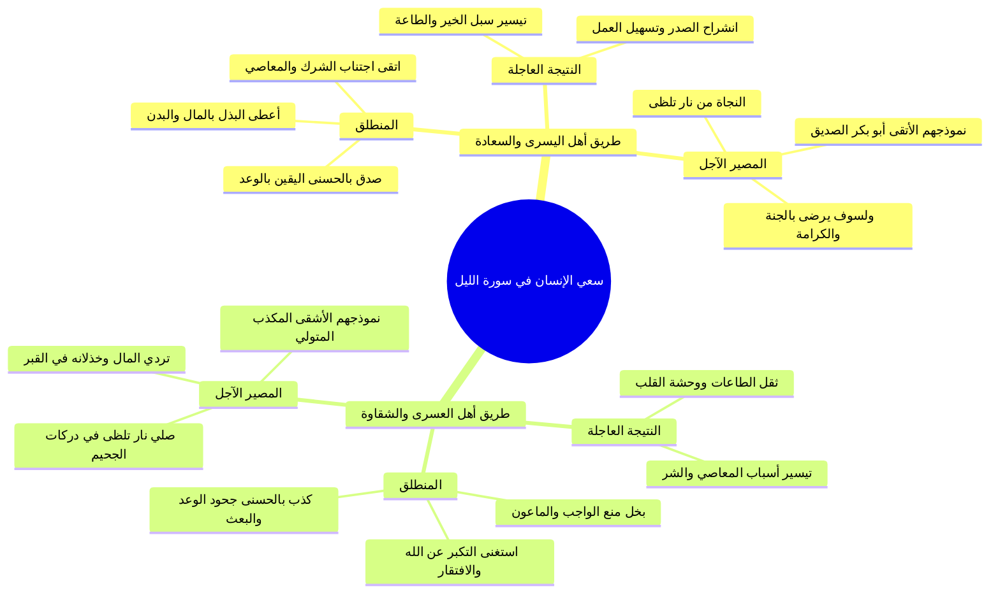

# ملخص المراجعة السريعة - سورة الليل

> [!abstract] بطاقة تعريف السورة
> - **اسم السورة:** سورة الليل.
> - **عدد آياتها:** 21 آية.
> - **ترتيب النزول:** نزلت بعد سورة الأعلى وقبل سورة الفجر.
> - **المحور العام:** تباين سعي المكلفين وغاياتهم في الحياة، وانقسامهم إلى فريقين: (أهل البذل والتقوى والتصديق وجزاؤهم التيسير لليسرى)، و(أهل الشح والاستغناء والتكذيب وجزاؤهم التيسير للعسرى والتردي في النار)، مع إبراز منزلة الصديق رضي الله عنه وكمال إخلاصه.

---

## ⚡ جدول الضوابط والمفاهيم الكبرى بالسورة

| الموضوع / الآية | المعنى والضابط الشرعي | الدلالة التفسيرية والتربوية |
|:---|:---|:---|
| **شرف الليل** | وقت النزول الإلهي في الثلث الأخير واستجابة الدعاء | شرف الزمان لشرف ما يقع فيه من تنزل الرحمات والملائكة |
| **مفهوم الترجمة** | تجسيد معاني القرآن في حركة وسلوك بشري واقعي | تحويل القرآن إلى رجال وأفعال يراهم الناس فيرون الإسلام |
| **الحروف اللثوية** | الذال والثاء والظاء (تخرج من طرف اللسان مع الثنايا العليا) | وجوب إخراج اللسان عند قراءة ﴿الذَّكَرَ وَالأُنْثَىٰ﴾ |
| **فن المقابلات** | ذكر المعاني المتضادة على سبيل الترتيب | بلاغة القرآن وإبراز الفروق بالضد: «وبضدها تتبين الأشياء» |
| **﴿يَغْشَىٰ﴾** | يعم الخلق بظلامه فيسكن كل إلى مأواه | جعل الليل سكناً ولباساً وذم قلب الفطرة بالسهر العابث |
| **﴿تَجَلَّىٰ﴾** | استنار وظهر ضياؤه للخلق فانتشروا لمعاشهم | جعل النهار معاشاً وابتغاءً لفضل الله وبركة البكور |
| **﴿إِنَّ سَعْيَكُمْ لَشَتَّىٰ﴾** | متفاوت تفاوتاً هائلاً في الأعمال والغايات | ما كان لوجه الله الأعلى يبقى، وما كان لغيره يضمحل ويبطل |
| **رابط سورة الشمس** | ﴿قَدْ أَفْلَحَ مَن زَكَّاهَا﴾ إلهام فجور وتقوى | التزكية تفتقر إلى سعي العبد في طاعة الله لتنمية التقوى |
| **حديث التيسير** | «اعملوا فكل ميسر لما خلق له» | نفي الجبر وثبوت اختيار العبد، والسعي سبب التيسير |
| **﴿أَعْطَىٰ﴾** | بذل العبادات المالية والبدنية والمركبة | جمع الصلاة والصوم والزكاة والصدقة والحج والإنفاق |
| **﴿وَاتَّقَىٰ﴾** | اجتناب الشرك والمعاصي والذنوب | اتخاذ الوقاية من عذاب الله بفعل الأوامر واجتناب النواهي |
| **﴿وَصَدَّقَ بِالْحُسْنَىٰ﴾** | 6 أوجه: الخلف، التوحيد، الشرائع، الجزاء، الإسلام، الجنة | اتساع دلالات القرآن المعجز واختلاف التنوع لا التضاد |
| **﴿فَسَنُيَسِّرُهُ لِلْيُسْرَىٰ﴾** | تسهيل أمور الخير وترك الشر وانشراح الصدر والجنة | الجزاء من جنس العمل وثمرة الصدق في البذل والتقوى |
| **﴿بَخِلَ﴾** | ترك الإنفاق الواجب والمستحب ومنع الماعون | الشح بالمال وبالطاعة البدنية ومنع الحوائج اليسيرة |
| **﴿وَاسْتَغْنَىٰ﴾** | الاستغناء عن الله بالحال والقال وبالدنيا والمال | انقطاع الافتقار والدعاء، والفقر وصف ذاتي للإنسان |
| **قصة أيوب** | «لا غنى لي عن بركتك» حين حثا جراد الذهب | كمال افتقار الأنبياء لبركة الله وفضله ونفي الاستغناء |
| **آفات المال** | كامنة كالنار تحت الرماد تهيج مع الغنى | وجوب تزكية النفس بالصدقات خشية الطغيان والكبر |
| **﴿فَسَنُيَسِّرُهُ لِلْعُسْرَىٰ﴾** | تيسير خصال الشر والمعاصي وصعوبة الطاعات | خذلان العبد وعقابه بحرمانه من التوفيق للطاعة |
| **«مَنَّاعٍ لِّلْخَيْرِ»** | صيغة فعال تدل على كثرة المنع لنفسه ولغيره | اقتران الشح بأمر الناس بالبخل وعدم الحض على الإطعام |
| **﴿إِذَا تَرَدَّىٰ﴾** | 4 معانٍ: مات، كُفِّن، سقط في القبر، هوى في جهنم | بطلان نفع المال وانقطاع حيلته والفداء به يوم القيامة |
| **﴿إِنَّ عَلَيْنَا لَلْهُدَىٰ﴾** | تكفل الله ببيان طريقي الخير والشر بالرسل والعقل | انقطاع الحجة على الله واستقامة طريق الهدى لرضوانه |
| **﴿وَإِنَّ لَنَا لَلآخِرَةَ وَالأُولَىٰ﴾** | ملك الله المطلق وتصرفه التام في الدارين | انقطاع رجاء المخلوقين وتجريد الطلب والدعاء لله وحده |
| **﴿نَاراً تَلَظَّىٰ﴾** | تستعر وتتوقد وتلتهب شواظاً | إنذار نبوي شفيق للتحذير من أسباب سخط الله |
| **صفة «الأشقى»** | من لا يعمل بطاعة الله ولا يترك لله معصية | كذب بقلبه وتولى بجوارحه فأعرض عن الشرع |
| **صفة «الأتقى»** | أبو بكر الصديق وكل من سلك مسلكه | عتق المعذبين وبذل المال الخالص لوجه الله |
| **﴿يَتَزَكَّىٰ﴾** | 7 معانٍ: أداء الزكاة، طهارة النفس، إطفاء الخطايا... | التطهر من داء الشح والرياء، وتفضيل الواجب على النفل |
| **﴿وَمَا لأَحَدٍ عِندَهُ مِن نِّعْمَةٍ﴾** | نفي المنن ورد الجميل عن بذل الأتقى | كمال الإخلاص لله دون انتظار مكافأة أو نفع مستقبلي |
| **﴿وَلَسَوْفَ يَرْضَىٰ﴾** | وعد الله الصادق بإرضائه في الجنة بالكرامات | كمال الجزاء والنعيم المقيم ورضوان الله الأكبر |
| **سنة التوفيق** | التوفيق متوقف على رغبة العبد وطلبه وتسخير جوارحه | «عاوز ولا مانتش عاوز؟» الله ييسر الصادق لليسرى |
| **منزلة الصديق** | خير الأمة وأفضل الخلق بعد الأنبياء | خرج من ماله مرتين: «أبقيت لهم الله ورسوله» |
| **اعرف سكتك وثغرك** | توظيف الميزة الفردية التي اختصك الله بها لدينه | كما وظف أبو بكر تجارته وأسرته لخدمة الهجرة والإسلام |
| **سر سبْق الصديق** | كلام بكر المزني: «بشيء وقر في قلبه» | كمال اليقين والإخلاص والتسليم التام لله ورسوله |

---

## 🧭 المقابلة الشاملة بين طريقي السعي في سورة الليل

