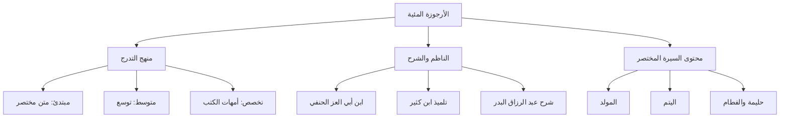

# 00 - الفهرس والخطة

> [!info] موقع المجلس
> المجلس الأول في دراسة **[[الأرجوزة المئية]]** لابن أبي العز الحنفي — دراسة سريعة لسيرة النبي ﷺ عبر متنٍ منظوم (100 بيت).

> [!note] المرجع
> المصدر: [[تفريغ سيرة 1]] — لا توجد توقيتات زمنية؛ المرجع بأرقام الأسطر.

---

## 📋 خطة الأجزاء

| الجزء | العنوان | الأسطر |
|:------:|:--------|:------:|
| 01 | لماذا الأرجوزة؟ ومراحل طلب العلم | 1–28 |
| 02 | الناظم: ابن أبي العز وكتاب الفصول | 29–79 |
| 03 | فضل حفظ المتون والشرح المعتمد | 80–123 |
| 04 | شرح الأبيات: الحمد والمختار وتعريف السيرة | 124–152 |
| 05 | المولد واليتم وحليمة (مع قراءة 15 بيتًا) | 153–216 |

---

## 🗺️ خريطة المفاهيم

---

## 🔑 المفاهيم الرئيسية

- [[الأرجوزة المئية]]
- [[ابن أبي العز الحنفي]]
- [[ابن كثير]]
- [[الفصول في سيرة الرسول]]
- [[مراحل طلب العلم]]
- [[النظم والنثر]]
- [[حفظ المتون]]
- [[السيرة النبوية]]
- [[عام الفيل]]
- [[حليمة السعدية]]
- [[اليتم]]

---

## 📊 محاور المجلس

| المحور | الخلاصة |
|:-------|:--------|
| المنهج | متن مختصر أولاً ثم التوسع ثم التخصص |
| الكتاب | 100 بيت نظمًا في سيرة أشرف البرية |
| الناظم | علي بن علي بن محمد بن أبي العز الدمشقي الحنفي (ت 792هـ) |
| العلاقة بشيخه | إشارة محتملة لاختصار [[الفصول في سيرة الرسول]] لابن كثير |
| الشرح | الشيخ عبد الرزاق بن عبد المحسن البدر |
| من المولد | عام الفيل — الاثنين — خلاف في يوم الشهر — يتم قبل الولادة — حليمة — فطام بعد عامين |

---

## 🔗 التنقل

- **التالي:** [[01 - لماذا الأرجوزة ومراحل طلب العلم]]
- **المصدر:** [[تفريغ سيرة 1]]
