# 00 - الفهرس والخطة: المجلس الثاني من شرح الأرجوزة المئية

> [!info] بيانات المجلس
> - **المادة:** دراسة وشرح **[[الأرجوزة المئية]]** في ذكر حال أشرف البرية للعلامة [[ابن أبي العز الحنفي]].
> - **الموضوع العام:** من حادثة شق الصدر ورضاع بني سعد، إلى وفاة الأم بالأبواء، ووفاة الجد عبد المطلب، وكفالة عمه أبي طالب والرحلة للشام.
> - **المصدر المعتمد:** [[تفريغ المحاضرة 2 الارجوزة ]] — لا توجد توقيتات زمنية مسجلة بالتفريغ، المرجع المعتمد هو أرقام الأسطر.

---

## 📋 خطة الأجزاء وتوزيع الأسطر

| رقم الجزء | عنوان الجزء | نطاق الأسطر بالتفريغ | المحاور الأساسية |
|:---:|:---|:---:|:---|
| **01** | [[01 - الواقع وتوجيه الخطاب وأدب مجلس العلم]] | 1 – 195 | معرفة الواقع دون لغو، توجيه خطبة الجمعة ومراعاة حال المخاطبين، أدب مجلس العلم |
| **02** | [[02 - حادثة شق الصدر وسنة المجاهدة]] | 196 – 376 | رضاع بني سعد، حادثة شق الصدر ورواياتها، دلالة الشق الحسي وسنة المجاهدة، بركة الكتابة بالقلم |
| **03** | [[03 - تكرار شق الصدر ومراتب الإرادة وعافية القلب]] | 377 – 540 | عدد مرات شق الصدر وأسبابها، مركزية القلب، مراتب القصد، تربية الأبناء، إيثار العافية والسلامة |
| **04** | [[04 - وفاة الأم بالأبواء وحقيقة الشفاعة والأدب مع القدر]] | 541 – 673 | وفاة آمنة بالأبواء، زيارة القبر والبكاء والمنع من الاستغفار، شروط الشفاعة وهيبة العرض، الأدب مع القدر |
| **05** | [[05 - وفاة عبد المطلب وكفالة أبي طالب وبداية السعي والرحلة]] | 674 – 733 | وفاة الجد عبد المطلب، كفالة أبي طالب الشقيق ومكانة عبد الله، رعي الغنم وشهامة النبي ﷺ، رحلة الشام وبحيرى |
| **06** | [[06 - خطة تطبيق الدروس]] | ملحق تطبيقي | خطة عمل تنفيذية بمربعات اختيار للمهام التربوية والإيمانية والسلوكية المستفادة من المحاضرة |
| **—** | [[ملخص المراجعة السريعة]] | مراجعة شاملة | جداول مكثفة وخلاصات سريعة لمذاكرة المجلس بالكامل |
| **—** | [[أسئلة المراجعة والاختبار الذاتي]] | تقييم الفهم | بنك أسئلة موضوعية ومقالية واختبارات ذاتية لقياس الاستيعاب |
| **—** | [[سيرة_2_الارجوزة_المئية_ملف_مجمع]] | ملف شامل | الجمع الكامل لجميع الأجزاء مع نص المتحدث الحرفي كاملاً وبدون حذف |

---

## 🗺️ خريطة المفاهيم العامة للمجلس

```mermaid
graph TD
    A["المجلس الثاني: الأرجوزة المئية"] --> B["المقدمة والمنهجية"]
    A --> C["المحطة الأولى: شق الصدر"]
    A --> D["المحطة الثانية: وفاة الأم"]
    A --> E["المحطة الثالثة: كفالة الجد والعم"]

    B --> B1["فقه الواقع وتوجيه الخطاب"]
    B --> B2["الكتابة بالقلم وحفظ الفكر"]

    C --> C1["الرضاع في بني سعد"]
    C --> C2["شق الصدر وإخراج حظ الشيطان"]
    C --> C3["تكرار الحادثة 3 أو 4 مرات"]
    C --> C4["سنة المجاهدة ومراتب القصد"]

    D --> D1["الوفاة بالأبواء سن 6 سنوات"]
    D --> D2["زيارة القبر والبكاء الشريف"]
    D --> D3["شروط الشفاعة وهيبة القيامة"]
    D --> D4["الأدب مع القدر وقاعدة الطحاوي"]

    E --> E1["وفاة عبد المطلب سن 8 سنوات"]
    E --> E2["كفالة أبي طالب الشقيق"]
    E --> E3["الرعي والكسب المبكر ومساندة الأهل"]
    E --> E4["رحلة الشام في سن 12 سنة"]
```

---

## 🔑 المفاهيم والكلمات المفتاحية (WikiLinks)

- [[الأرجوزة المئية]]
- [[ابن أبي العز الحنفي]]
- [[حليمة السعدية]]
- [[شق الصدر]]
- [[حظ الشيطان]]
- [[ماء زمزم]]
- [[المجاهدة والسنن الكونية]]
- [[مراتب القصد]] (الخاطر - الهاجس - الهم - العزم - النية)
- [[العصمة النبوية]]
- [[الإمام أحمد بن حنبل]]
- [[آمنة بنت وهب]]
- [[الأبواء]]
- [[زيارة القبور]]
- [[شروط الشفاعة]]
- [[القدر سر الله في خلقه]]
- [[العقيدة الطحاوية]]
- [[عبد المطلب]]
- [[أبو طالب]]
- [[رعي الغنم]]
- [[بحيرى الراهب]]

---

## 🔗 التنقل السريع

- **البدء بالجزء الأول:** [[01 - الواقع وتوجيه الخطاب وأدب مجلس العلم]]
- **الملف المجمع الكامل:** [[سيرة_2_الارجوزة_المئية_ملف_مجمع]]
- **ملخص المراجعة:** [[ملخص المراجعة السريعة]]
- **الاختبار الذاتي:** [[أسئلة المراجعة والاختبار الذاتي]]
