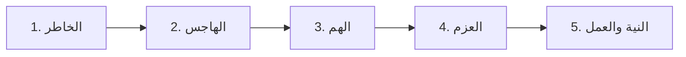

# ⚡ ملخص المراجعة السريعة: المجلس الثاني من شرح الأرجوزة المئية

> [!tip] الغرض من هذا الملف
> مراجعة سريعة وشاملة لأبرز وقائع وأبيات وقواعد المجلس الثاني، مصممة للمذاكرة المركزة واستحضار المعلومات في دقائق معدودة.

---

## 📜 أبيات الأرجوزة المشروحة في المجلس

```text
فَبَعْدَ شَهْرَيْنِ انْشِقَاقُ بَطْنِهِ ... وَقِيلَ بَعْدَ أَرْبَعٍ مِنْ سِنِّهِ
وَبَعْدَ سِتٍّ مَعْ شَهْرٍ جَاءْ ... وَفَاةُ أُمِّهِ عَلَى الْأَبْوَاءِ
وَجَدُّهُ لِلْأَبِ عَبْدُ الْمُطَّلِبْ ... بَعْدَ ثَمَانٍ مَاتَ مِنْ غَيْرِ كَذِبْ
ثُمَّ أَبُو طَالِبٍ الْعَمُّ كَفَلْ ... خِدْمَتَهُ ثُمَّ إِلَى الشَّامِ رَحَلْ
فَذَاكَ بَعْدَ عَامِ اثْنَيْ عَشَرْ ... مِنْ أَمْرِهِ بَحِيرَى مَا اشْتَهَرْ
```

---

## 📊 الخط الزمني للوقائع الشريفة في المجلس

| العمر الشريف | الحدث التاريخي | المكان | الأطراف ذات الصلة |
|:---:|:---|:---:|:---|
| **4 سنوات** (أو بعد شهرين) | حادثة [[شق الصدر]] الأولى واستخراج علقة حظ الشيطان | ديار بني سعد | جبريل عليه السلام، حليمة السعدية، الغلمان |
| **6 سنوات وشهر** | وفاة أمه [[آمنة بنت وهب]] | [[الأبواء]] (بين مكة والمدينة) | جده عبد المطلب، أم أيمن حاضنته |
| **6 إلى 8 سنوات** | كفالة جده [[عبد المطلب]] | مكة المكرمة | عبد المطلب (مات وعمر النبي ﷺ 8 سنوات) |
| **8 سنوات فما بعد** | كفالة عمه [[أبو طالب]] وبدء رعي الغنم | مكة المكرمة | أبو طالب (شقيق أبيه)، حمزة، علي بن أبي طالب |
| **12 سنة** | الخروج في تجارة الشام ولقاء [[بحيرى الراهب]] | بصرى (الشام) | عمه أبو طالب، الراهب بحيرى |

---

## 🗂️ جداول المقارنات والتقسيمات العلمية

### 1. مرات شق الصدر الشريف وأسبابها

| الموضع | السن / المناسبة | الثبوت العلمي | الحكمة والغرض |
|:---|:---|:---:|:---|
| **الأولى** | في طفولته (سن 4 سنوات ببني سعد) | صحيح متفق عليه | العصمة من الشيطان منذ النشأة |
| **الثانية** | وهو ابن 10 سنوات بجبال مكة | رواه الصالحي في سبل الهدى | إعداد قلبي مبكر |
| **الثالثة** | عند البعثة ونزول الوحي | ذكرها الحافظ ابن حجر | تلقي الوحي بقلب قوي ثابت |
| **الرابعة** | ليلة الإسراء والمعراج | صحيح متفق عليه | التأهب للمناجاة والعروج للسماء |

---

### 2. مراتب الإرادة والقصد الإنساني



- **الخاطر:** ومضة عابرة في الذهن.
- **الهاجس:** استقرار الفكرة وتداولها في النفس.
- **الهم:** التخطيط وبذل وسع الأسباب (وهو مناط كتابة الحسنة إن حال عائق).
- **العزم:** الجزم الذي لا تردد فيه قبل المباشرة.
- **النية والفعل:** الإخلاص ومباشرة الجوارح.

---

### 3. شروط الشفاعة المقبولة

| الشرط | الدليل القرآني | الأثر المترتب |
|:---|:---|:---|
| **إذن الله للشافع** | ﴿مَن ذَا الَّذِي يَشْفَعُ عِندَهُ إِلَّا بِإِذْنِهِ﴾ | قطع دعاوى الشفاعة الذاتية المجردة |
| **رضى الله عن المشفوع له** | ﴿وَلَا يَشْفَعُونَ إِلَّا لِمَنِ ارْتَضَىٰ﴾ | حرمان أهل الشرك والتبديل والإحداث في الدين |

---

### 4. قواعد ومقولات ذهبية من المجلس

1. **في سنن المجاهدة:** «البداية والمجاهدة من العبد، والمعونة والتوفيق والمدد من الله».
2. **كلام الحسن البصري في الأماني:** «إن قوماً غرتهم الأماني فقالوا نحسن الظن بالله، وكذبوا لو أحسنوا الظن لأحسنوا العمل».
3. **كلام الإمام أحمد في العافية:** «لا أعدل بالعافية والسلامة شيئاً».
4. **كلام الإمام الطحاوي في القدر:** «وأصل القدر سر الله تعالى في خلقه، لم يطلع على ذلك ملك مقرب ولا نبي مرسل، والتعمق والنظر في ذلك ذريعة الخذلان وسلم الحرمان».
5. **في بركة القلم:** «الكتابة بالقلم سيالة للأفكار، وتدر در الأفهام».

---

## 🔗 روابط التنقل

- **الفهرس الكامل:** [[00 - الفهرس والخطة]]
- **الاختبار الذاتي:** [[أسئلة المراجعة والاختبار الذاتي]]
- **الملف المجمع:** [[سيرة_2_الارجوزة_المئية_ملف_مجمع]]
