# 00 - الفهرس والخطة: المجلس الثالث من شرح الأرجوزة المئية

> [!info] بيانات المجلس
> - **المادة:** دراسة وشرح **[[الأرجوزة المئية]]** في ذكر حال أشرف البرية للإمام [[ابن أبي العز الحنفي]].
> - **الموضوع العام:** من رحلة الشام التجارية الثانية وزواج السيدة خديجة وخصائصها، إلى أولاد النبي ﷺ ووفاتهم، ثم إعادة بناء الكعبة وحادثة وضع الحجر الأسود في سن 35 سنة.
> - **المصدر المعتمد:** [[تفريغ المحاضرة 3 الاورجوزه ]] — لا توجد توقيتات زمنية مسجلة بالتفريغ، المرجع المعتمد هو أرقام الأسطر.

---

## 📋 خطة الأجزاء وتوزيع الأسطر

| رقم الجزء | عنوان الجزء | نطاق الأسطر بالتفريغ | المحاور الأساسية |
|:---:|:---|:---:|:---|
| **01** | [[01 - رحلة الشام الثانية وتجارة البركة وعقد المضاربة]] | 1 – 178 | حرب الفجار، حلف الفضول، فقه المضاربة بمال خديجة، إرهاصات النبوة (الراهب، الغمامة، مضاعفة الأرباح) |
| **02** | [[02 - الزواج المبارك من خديجة ومناقبها العظيمة]] | 179 – 334 | عقد الزواج في سن 25 سنة، مناقب خديجة الفريدة، وفاء النبي ﷺ وحفظ الود، فقه إنزال الناس منازلهم |
| **03** | [[03 - أسرار الأسرة النبوية وآيات التخيير وفقه الوضوح]] | 335 – 475 | وقار النبوة، اعتزال نساء النبي شهراً ونزول آيات التخيير، منهجية صدق التوجه للآخرة، امتحان السرائر والوفاء |
| **04** | [[04 - أولاد النبي ﷺ ووفاة فاطمة رضي الله عنها]] | 476 – 510 | تفصيل البنين والبنات، حسم خلاف عبد الله الطيب الطاهر، وفاة الأولاد في حياته، وفاة فاطمة بعده بستة أشهر وأدب حفظ السر |
| **05** | [[05 - إعادة بناء الكعبة والتحكيم النبوي والحجر الأسود]] | 511 – 575 | إعادة بناء الكعبة في سن 35 سنة، دلالة قواعد إبراهيم، المشاركة المجتمعية للداعية، حكمة وضع الحجر الأسود وحقن الدماء |
| **06** | [[06 - خطة تطبيق الدروس]] | ملحق تطبيقي | خطة عمل تنفيذية بمربعات اختيار للمهام التربوية والأسرية والدعوية المستفادة من المحاضرة |
| **—** | [[ملخص المراجعة السريعة]] | مراجعة شاملة | جداول مكثفة وخلاصات سريعة لمذاكرة المجلس بالكامل في دقائق |
| **—** | [[أسئلة المراجعة والاختبار الذاتي]] | تقييم الفهم | بنك أسئلة موضوعية ومقالية واختبارات ذاتية لقياس الاستيعاب |
| **—** | [[سيرة_3_الارجوزة_المئية_ملف_مجمع]] | ملف شامل | الجمع الكامل لجميع الأجزاء مع نص المتحدث الحرفي كاملاً وبدون حذف |

---

## 🗺️ خريطة المفاهيم العامة للمجلس

```mermaid
graph TD
    A["المجلس الثالث: الأرجوزة المئية"] --> B["الرحلة الثانية والشام"]
    A --> C["الزواج المبارك والبيت النبوي"]
    A --> D["أولاد النبي ﷺ ووفاتهم"]
    A --> E["بناء الكعبة والحجر الأسود"]

    B --> B1["حرب الفجار وحلف الفضول"]
    B --> B2["عقد المضاربة بمال خديجة"]
    B --> B3["كرامات الطريق والراهب والغمامة"]

    C --> C1["زواج سن 25 سنة"]
    C --> C2["خصائص أم المؤمنين خديجة"]
    C --> C3["آيات التخيير ووضوح قصد الآخرة"]
    C --> C4["الوفاء لخلائل خديجة"]

    D --> D1["البنون: القاسم وعبد الله وإبراهيم"]
    D --> D2["البنات: زينب ورقية وفاطمة وأم كلثوم"]
    D --> D3["وفاة الجميع في حياته إلا فاطمة"]
    D --> D4["بشارة فاطمة وأدب كتمان السر"]

    E --> E1["سن 35 سنة وقواعد إبراهيم"]
    E --> E2["المشاركة المجتمعية الإيجابية"]
    E --> E3["حكمة التحكيم ورداء الحجر الأسود"]
```

---

## 🔑 المفاهيم والكلمات المفتاحية (WikiLinks)

- [[الأرجوزة المئية]]
- [[ابن أبي العز الحنفي]]
- [[حرب الفجار]]
- [[حلف الفضول]]
- [[عقد المضاربة]]
- [[ميسرة]]
- [[بحيرى الراهب]]
- [[خديجة بنت خويلد]]
- [[عائشة بنت أبي بكر]]
- [[آيات التخيير]]
- [[القاسم بن محمد]]
- [[عبد الله بن محمد]] (الطيب الطاهر)
- [[فاطمة الزهراء]]
- [[إبراهيم بن محمد]]
- [[مارية القبطية]]
- [[بناء الكعبة]]
- [[قواعد إبراهيم]]
- [[الحجر الأسود]]
- [[المشاركة المجتمعية]]

---

## 🔗 التنقل السريع

- **البدء بالجزء الأول:** [[01 - رحلة الشام الثانية وتجارة البركة وعقد المضاربة]]
- **الملف المجمع الكامل:** [[سيرة_3_الارجوزة_المئية_ملف_مجمع]]
- **ملخص المراجعة:** [[ملخص المراجعة السريعة]]
- **الاختبار الذاتي:** [[أسئلة المراجعة والاختبار الذاتي]]
