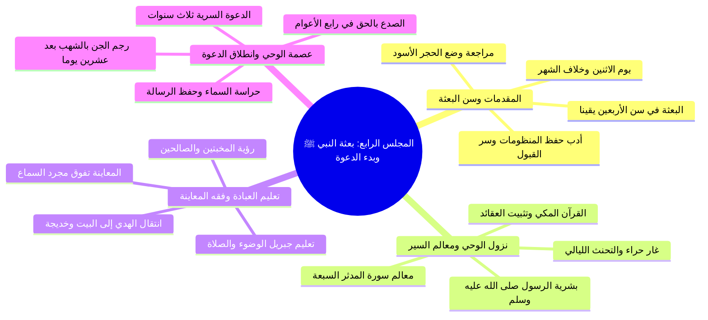

# 00 - الفهرس والخطة: المجلس الرابع من شرح الأرجوزة المئية

> [!info] بيانات المجلس
> - **المادة:** دراسة وشرح **[[الأرجوزة المئية]]** في ذكر حال أشرف البرية للإمام [[ابن أبي العز الحنفي]].
> - **الموضوع العام:** من مراجعة بناء الكعبة وسن الأربعين ومبعث النبي ﷺ يوم الاثنين، إلى خلوة غار حراء ونزول سورتي اقرأ والمدثر ومعالم السير إلى الله، ثم تعليم جبريل الوضوء والصلاة وفقه المعاينة، ورجم الشياطين بالشهب وحراسة السماء، وانتهاءً ببدء الدعوة الجهرية في السنة الرابعة ومقدمات الهجرة إلى الحبشة.
> - **المصدر المعتمد:** [[تفريغ المحاضرة 4]] — لا توجد توقيتات زمنية مسجلة بالتفريغ، المرجع المعتمد هو أرقام الأسطر.

---

## 📋 خطة الأجزاء وتوزيع الأسطر

| رقم الجزء | عنوان الجزء | نطاق الأسطر بالتفريغ | الأبيات المشروحة والمحاور الأساسية |
|:---:|:---|:---:|:---|
| **01** | [[01 - حفظ المتون وسن الأربعين ويوم البعثة]] | 1 – 102 | مراجعة بيت الحجر الأسود، أدب وطريقة حفظ المتون (تطبيق حفاظ المتون، نموذج الإمام النووي وسر القبول)، البيت 15-16: البعثة في سن 40 سنة، ثبوت يوم الاثنين يقيناً، والخلاف في رمضان أو ربيع الأول |
| **02** | [[02 - غار حراء ومعالم طريق السير في سورة المدثر]] | 103 – 151 | البيت 16 (وسورة اقرأ أول المنزل)، خلوة غار حراء والتحنث، حكمة بشرية الرسل، منازل السير والفرق بين المكي والمدني، فزع النبي ﷺ ومواساة خديجة وورقة بن نوفل، معالم السير السبعة من سورة المدثر |
| **03** | [[03 - تعليم جبريل الوضوء والصلاة وفقه المعاينة]] | 152 – 210 | البيت 17: نزول جبريل وتعليمه الوضوء والصلاة ركعتين، فقه المعاينة والمشاهدة («صلوا كما رأيتموني أصلي»)، الفارق بين فقه الأداء وإقامة الصلاة، ملازمة الصالحين والمخبتين (الإمام مالك، نموذج المؤذن الصالح الشيخ عبد الفتاح) |
| **04** | [[04 - بركة الإسناد وحراسة السماء بالشهب]] | 211 – 256 | البيت 17-18: تعليم النبي ﷺ لخديجة الوضوء والصلاة، بركة الإسناد العملي وتربية الأبناء برؤية أهل الصلاح، التخريج الحديثي لبدء الوضوء (حديث زيد بن حارثة في السلسلة الصحيحة)، البيت 18: رجم الجن بالشهب بعد 20 يوماً، حراسة السماء ودلالة أمية النبي ﷺ |
| **05** | [[05 - الجهر بالدعوة وفقه المراحل ومقدمات الهجرة]] | 257 – 294 | البيت 19: الدعوة الجهرية في السنة الرابعة بعد ثلاث سنوات سرية، الصدع على الصفا وموقف قريش وأبي لهب، أثر التصحيف في الفهم («سكينة ووقار»)، اشتداد الأذى، مقدمات الهجرة إلى الحبشة وقراءة أبيات المجلس القادم |
| **06** | [[06 - خطة تطبيق الدروس]] | ملحق تطبيقي | خطة عمل تنفيذية بمربعات اختيار للمهام التربوية والمنهجية والتعبدية المستفادة من المحاضرة |
| **—** | [[ملخص المراجعة السريعة]] | مراجعة شاملة | جداول مكثفة وخلاصات مركزة لمذاكرة المجلس بالكامل في دقائق معدودة |
| **—** | [[أسئلة المراجعة والاختبار الذاتي]] | تقييم الفهم | بنك أسئلة موضوعية ومقالية واختبارات ذاتية لقياس الاستيعاب وضبط المسائل |
| **—** | [[سيرة_4_الارجوزة_المئية_ملف_مجمع]] | ملف شامل | الجمع الكامل لكافة الأجزاء مع نص المتحدث الحرفي كاملاً وبدون حذف |

---

## 🗺️ خريطة المفاهيم العامة للمجلس

---

## 🔑 المفاهيم والكلمات المفتاحية (WikiLinks)

- [[الأرجوزة المئية]]
- [[ابن أبي العز الحنفي]]
- [[بناء الكعبة]]
- [[الحجر الأسود]]
- [[الإمام النووي]]
- [[البعثة النبوية]]
- [[غار حراء]]
- [[سورة اقرأ]]
- [[سورة المدثر]]
- [[خديجة بنت خويلد]]
- [[ورقة بن نوفل]]
- [[جبريل عليه السلام]]
- [[الوضوء والصلاة]]
- [[زيد بن حارثة]]
- [[فقه المعاينة]]
- [[حراسة السماء]]
- [[شهابا رصدا]]
- [[الدعوة السرية]]
- [[الدعوة الجهرية]]
- [[جبل الصفا]]
- [[الهجرة إلى الحبشة]]

---

## 🔗 التنقل السريع

- **البدء بالجزء الأول:** [[01 - حفظ المتون وسن الأربعين ويوم البعثة]]
- **الملف المجمع الكامل:** [[سيرة_4_الارجوزة_المئية_ملف_مجمع]]
- **ملخص المراجعة:** [[ملخص المراجعة السريعة]]
- **الاختبار الذاتي:** [[أسئلة المراجعة والاختبار الذاتي]]
