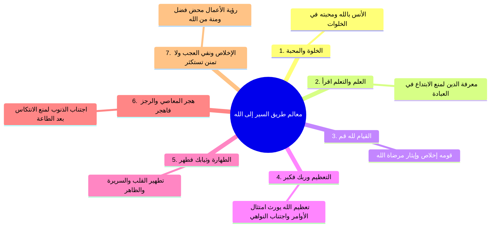

# 02 - غار حراء ومعالم طريق السير في سورة المدثر

> [!info] الفترة المرجعية
> الأسطر: 103 – 151 من [[تفريغ المحاضرة 4]] (المرجع المعتمد أرقام الأسطر لعدم وجود توقيت زمني بالتفريغ).

---

## 📝 الملخص العلمي المنظم

### 1. خلوة غار حراء وبدء نزول الوحي

- ا عجز بيت الأرجوزة:
> ... وَسُورَةُ اقْرَأْ أَوَّلُ الْمُنَزَّلِ

- **خصائص وميزات [[غار حراء]]:**
  1. **الخلوة التامة:** مكان بعيد عن ضوضاء الناس وشواغلهم للتعبد والتحنث الليالي ذوات العدد.
  2. **انفتاح النظر إلى السماء:** يوفر فضاءً مفتوحاً للتأمل في ملكوت السماوات والأرض.
  3. **رؤية الكعبة:** كان الجالس في الغار قديماً يرى الكعبة المشرفة مباشرة قبل أن تحجبها الأبنية المرتفعة حديثاً.

---

### 2. الحكمة من بشرية الرسول ﷺ ومنهجية التلقي القرآني

| المحور | البيان والتأصيل الشرعي |
|:---|:---|
| **خصيصة البشرية** | قال تعالى: {قُلْ إِنَّمَا أَنَا بَشَرٌ مِّثْلُكُمْ يُوحَىٰ إِلَيَّ}؛ جعل الله النبي ﷺ بشراً يأكل ويمشي في الأسواق ويتزوج ويمرض ويصحو ليكون قدوة عملية يمكن للبشر اقتفاء أثره، والفرق الجوهري أنه ﷺ يُوحى إليه فيُشرِّع، بينما واجب الأمة هو **الاتباع المحض واقتفاء الأثر دون ابتداع**. |
| **طبيعة القران المكي** | نزل لغرس **العقائد، وتثبيت الإيمان باليوم الآخر والبعث والنشور، والنظر في آيات الله**، ليكون قاعدة صلبة تبنى عليها التكاليف. |
| **طبيعة القران المدني** | اختص بإنزال **الشرائع والتكاليف والأحكام** (الجمعة، الأذان، الزكاة، الجهاد) بعد أن رسخ الإيمان في النفوس بمكة. |
| **قانون السير والابتلاء** | الابتلاءات والعثرات تزيد المؤمن ثقة ويقيناً: {هَٰذَا مَا وَعَدَنَا اللَّهُ وَرَسُولُهُ وَصَدَقَ اللَّهُ وَرَسُولُهُ وَمَا زَادَهُمْ إِلَّا إِيمَانًا}؛ وطريق السير سلكه الأنبياء والعشرة المبشرون بالجنة، فمن لزم طريقهم أفلح. |

> ⚠️ تنبيه
> قانون السير إلى الله لا يعرف الوقوف في المنتصف: {لِمَن شَاءَ مِنكُمْ أَن يَتَقَدَّمَ أَوْ يَتَأَخَّرَ}؛ إما تقدم بعمل الطاعات فيمدك الله بغيرها، أو نكوص وفتور فتُسلب حلاوة الطاعة وتُستبدل.

---

### 3. فزع النبوة وتثبيت خديجة رضي الله عنها

- فزع النبي ﷺ بعد لقاء جبريل إلى زوجه [[خديجة بنت خويلد]] رضي الله عنها قائلاً: «ا دثِّروني دثِّروني، والله لقد خشيتُ على نفسي».
- **الظاهرة الفسيولوجية:** عند الفزع والهلع يصاب الإنسان برجفة وقشعريرة برد شديدة تجعله يطلب الدثار والغطاء حتى في قيظ الصيف.
- **تثبيت خديجة التاريخي بالنبل ومكارم الأخلاق:**
  - قالت له: «ا كلا والله لا يخزيك الله أبداً؛ إنك لتصل الرحم، وتحمل الكلَّ، وتكسب المعدوم، وتُقري الضيف، وتُعين على نوائب الحق».
  - انطلقت به إلى ابن عمها [[ورقة بن نوفل]]، وكان شيخاً حنيفياً يقرأ الكتب السابقة، فبشره بناموس النبوة.

---

### 4. معالم طريق السير إلى الله المستنبطة من سورتي اقرأ والمدثر

---

## 🗣️ نص المتحدث الكامل

> **[غار حراء وبشرية النبي ﷺ والفرق بين المكي والمدني - الأسطر 103 - 137]:**
> قال في رمضان او ربيع الاول وسوره اقرا اول المنزل قال وسوره تقرا هي ايه اول ما انزل على رسول الله صلى الله عليه وسلم ايه
> سوره اقرا لما جاءه جبريل
> عليه السلام في غار حراء وكان النبي صلى الله عليه وسلم يتعبد الليالي ذوات العدد في غار حراء وغار حراء ده يعني ايه مكان كده ايه يعني صح تلاقي في اا خلوه بعيد عن الناس وفيه ا نظر الى السماء مفتوح وكان في ميزه ثالثه اللي هو
> قديم ايه
> في فتحه بتطلع كعبه
> اه كان قديما لما تقعد في غار حراء ترى الكعبه لكن دلوقتي طبعا ايه ا الابنيه حجبت كل هذا فالشاهد ان النبي صلى الله عليه وسلم كان يتحنف الليالي ذوات العدد يتحنف الليالي دوات العبد وقلنا ايه وقلنا اذا اردت النجاه وان تنساب الى الله عز وجل بسهوله ويسر ف فالزم غرز رسول الله
> صلى الله عليه وسلم
> صلى الله عليه وسلم انت انك تعرف ان تسير على نهجه
> صلى الله عليه وسلم
> ان النبي صلى الله عليه وسلم بشر ولكنه يوحى
> اليه فالله عز وجل جعل في خصيصه البشريه عشان ما تقولش ان الكلام ده ايه معجز
> لا قل انما انا بشر مثلكم
> ولكن هو ايه
> يوحى الي بشر مثلكم يعني اللي انا هعمله انت تقدر تعمله
> اللي انا هعيش عليه انت
> تقدر تعيش عليه بل بالعكس النبي صلى الله عليه وسلم عان وعايش احداث ومواقف انت ما تقدرش عليه ولكن جعله الله عز وجل بشرا رسولا عشان تقتفي اثره وتسير على نهجه يبقى مش مستحيل ياكل الطعام ويمشي في الاسواق ويتزوج النساء ويصلي ويقوم وينقض ويمرض ويشفى ويتعب و يبقى كل الاحوال هو بشر قل انما انا بشر مثله طيب نعمل زيه لا تتبع تسير على نهجه لكن هو يوحى اليه فله حق الايه تش ان هو بيوحى اليه فبيشرع لكن انت ما ينفعش ايه تجتهد وتشرع وانما انت تقلده تتبع اثره وتسير على نفسه
> فكان من اول ما انزل عليه سوره اقرا وقلنا لابد ان تستفيد من هذه الفواتح والبواكير من نزول القران ان مثلا ربنا عز وجل قدر ان ياتي القران المكي دائما ايه بيغرز العقائد ويثبت العقائد والايمان باليوم الاخر والايمان بالبعث والنشور وارسال الرسل والنظر في الايات كل ده تعميق للايمان تعميق للايمان الشرائع جت فين
> في المدينه كل الشرائع جت في المدينه حتى الجمعه اول جمعه اقيمت في المدينه الصلاه النداء الاذان للصلاه ا الزكاه الجهاد كل الشرائع دي فرضت فين؟
> في المدينه بعد ان هاجر النبي صلى الله عليه وسلم الى المدينه فتلاقي طابع القران المكي طابعه تثبيت العقائد وزياده الايمان بالله عز وجل والنظر في الايات طابع القران المدني انذار الشرائع فهي دي منازل السير الى الله عز وجل ان انت لما تبدا التزام لما تبدا سرير الى الله عز وجل لا عايز تسير صح امشي ورا سيدنا النبي صلى الله عليه وسلم صلى الله عليه وسلم
> اما ان تتفرق بك السبل وتيجي بعد كده تستطيل الطريق يجي واحد يمشي على مزاجه ويختار بهواه وبعد كده يقول لك ايه
> الطريق ما ما بيوصلش لا ما انت اللي مشيت غلط انت اللي مشيت في اتجاه لا يوصل وانما اما تمشي على طريق الحق الذي رسمه الله عز وجل وارتضاه لنبيه تلاقي نفسك ايه؟ منارات الطريق ولما راى المؤمنون الاحزاب قالوا
> هذا ما وعدنا الله ورسوله وصدق الله ورسوله وما زادهم الا ايمانا
> فعشان كده انت وانت ماشي لربنا حتى الابتلاءات بتزيدك ايمان
> حتى العثرات بتزيدك ثقه في الله عز وجل حتى العقبات بتزقك لربنا عز وجل ليه؟ عشان ربنا راسم طريق ليك وانت شايفه قدامك انت شايفه قدامك وسلكه السابقون وحطوا رحالهم في الجنه انت ماشي ورا ناس ايديك على كتاف ناس فين؟ في الجنه في الجنه لما سيدنا النبي
> صلى الله عليه
> صلى الله عليه وسلم سيد الاولين والاخرين اول من يحرق حلق الجنه
> صلى الله عليه وسلم
> وتيجي تلاقي وراه سيدنا ابو بكر في الجنه وعمر في الجنه وعثمان في الجنه
> وعلي في الجنه وطلحه في الجنه والزبير وزيد كل دول كل العشره المبشرين بالجنه وغيرهم من المبشرون بالجنه كل دول قدامك ومشوا على الطريق ده فانت لما تمشي الطريق ده وتشوف الطريق ده وتلاقي منارات الطريق قدامك تعرف ان انت ماشي صح فعشان كده لما تيجي تتربى على مائده الوحي تربي نفسك بقى تربي نفسك ان اول ما بدئ به النبي صلى الله عليه وسلم ايه
> حب الخلوه لا اقرا دي دي هتيجي فتح من الله عز وجل بعد ما تاوي الي عبدي قم الي امشي وامشي الي وهك ما تقرب مني عبدي شبرا تقربت منه
> ذراعا فانت عليك البدايه وعلى الله ايه
> تمام
> تمام انت ابدا بس وربنا هيعينك بعد ما ربنا يعينك عليك الصدق والثبات ربنا انت كان نفسك تلتزم ربنا هداك والتزمت كان نفسك تطلب العلم ربنا رزقك بشيخ او ا حد تسمعه فبدات اطلب اصدق مع الله عز وجل بس واذل وربنا ايه هينقلك هيرفعك هيمدك هيعينك هتلاقيه ربنا عز وجل لكن انت مثلا نفسي التزم التزمت نفسي احفظ القران ربنا رزقك بشخيحفظك جيت انت متخلف وراجعك خلاص فمن اهتدى فلنفسه ومن عمي
> خلاص على نفسك هتلاقي ربنا سلب منك بقى بعد ما كنت بتحب المسجد بقيت انت مشغول بالدنيا بعد ما كنت بدانس بالقران بقيت ا يعني جسمك بياكلك وانت ماسك المصحف بعد ما كنت بتحب الخلوه بقت بتاخد تليفونك معاك وتلاقي الشواغل والقواطع بعد ما كنت بتحتكف رمضان كله بقيت بتوه لحد ليله 27 بعد ما كنت بتحضر المدارس والدروس واللقاءات وكل حاجه بقيت بتيجي المدرسه متاخر وتغيب يوم وتيجي ثلاثه وتغيب عن اغلب اللقاءات الايمانيه هتلاقي بتسلم تسلم ما انت ايه لمن شاء منكم ان يتقدم او اه يا انت بتتقدم يا ايه؟
> ما فيش حاجه اسمها واقف في النص ده بتعمل حاجه ربنا بيمدك ويعينك بحاجه ثانيه فتعمل الحاجه الثانيه ربنا يكافئك عليها بحاجه ثالثه يا اما انت ما عملتش حاجه فتسلب وتستبدل نعوذ بالله من ذلك

> **[فزع الوحي ومواقف خديجة وتفصيل سورة المدثر - الأسطر 138 - 151]:**
> فكان اول ما انزل على رسول الله صلى الله عليه وسلم اقرا ثم بعدها يا ايها المدثر قم فانذر لما بدئ النبي صلى الله عليه وسلم الوحي وجاءه جبريل ففزع النبي صلى الله عليه وسلم الى السيده خديجه وقال دثروني دثروني والله لقد خشيت على نفسي فدسرته السيده عائشه وغطته يعني الانسان دايما لما بيفزح او يصيبه يحس ايه ان هو بردان كده كل مره في الصيف وحدثت حادثه قدامه حد بيجري الموتوسيكل كده والمهم يعني عمل حادثه وكان عمال يرتجف كده من البرد كده وايه وانا مستغرب ده احنا في الصيف والظهر ازاي ده بردان فهسان اضعف ما فالنبي صلى الله عليه وسلم حول الى خديجه زوجه ا رضي الله عنها وقال دثروني دثروني فدثرته فقال والله لقد خشيت على نفسي فقالت له كلا والله لا يخزيك الله ابدا انك لتصل الرحم وتحمل الكلى وتكسب المعدوم وتعين على نوائم الخير ثم ذهبت به الى ابن عمها ورقه بن نوفل وكان ا راهبا ا على الحنيفيه ثم بعد ذلك نزل القران يا ايها المدثر قم فانذر وربك فكبر وثيابك فطهر والرجز فاهر ولا تمن تس قلنا هي دي معالم الطريق اول حاجه حب الخلوه انك تعرف ربنا مع المحب تعرف ربنا فتحبه فتانس بالخلوه اليه فربنا يفتح لك بقى اول حاجه محبه الله عز وجل اذا نزلت في قلبك ثم عملت اعمالا تتقرب بها الله عز وجل يفتح الله عز وجل عليك بعد كده عشان بقى ما تبتدعش في العباده اقرا المعلم الثاني من المعالم الثاني اقرا انك تتعلم دينك انك تسمع وتق تقرا وتذاكر عشان تعبد ربنا صح المعلم الثالث بقى من معالم السير بعد ما تقرا وتخلو وتتعبد
> قم
> قم انك تقوم لله عز وجل قومه اخلاص قل انما اعذ بواحده ان ايه
> ان تقوموا لله انك تشتغل لربنا عز وجل وتؤثر الله عز وجل على هواك وعلى مصالحك قم فانذر وربك فكبر اول حاجه معرفه الله بالمحبه بعد كده معرفه بالتعظيم ان يعظم الله عز وجل في قلبك وان تقدر الله عز وجل حق قدره ليه تعظيم الله عز وجل في القلب هيحملك على ا اجتناب النواهي وعلى فعل الواجبات انك لما تعظم ربنا ويقول لك الصلاه خير من النوم تقوم وانت بتجري على المسجد لما ربنا ينهاك هتقول ايه؟ سمعنا واطعنا غفرانك ربنا واليك المصير هو ده اللي بيعامل ربنا بالتعظيم مش يقعد يجادل ويناظر ويفصص ويلتف حوالين النصوص عشان يوصل لهواه ومراده يقعد يقول لك قال فلان وسمعت علان وهو اصلا مش مقتنع لاب فلان وانما هو يتبع هواه فمعرفه عز وجل بالتعظيم تعينك على اداء الواجبات واجتناب النوايا عشان كده ربنا قال ايه وربك فكبر وثيابك ايهطهر
> طهر طهر قلبك طهر نفسك طهر ثيابك عشان تخش على ربنا عز وجل وانت ايه طاهر والرجز فاهر لما تتطهر ما تروحش ايه تحط طينه ثاني على راسك لا اجتنب المعاصي لان المعاصي هتجرج للانتكاس مره اخرى تمشي لربنا عز وجل وتعمل الطاعات يا اما المعاصي هتاخرك عن ربنا عز وجل والرجز فاهجر ولا تمن تستكسر بعد ما عملت كل ده خلوه وعباده ومعرفه وذكر وصلاه واعمال ما تمنش على الله عز وجل وانما هذا محض فضل من الله عز وجل محبه عز وجل تبدا بالمحبه العظيم اه حدث
> لا لا يا س افتح يا سيدي افتح بالله عليك بالله عليك الميكروفون شغال الميكروفون لا ما شغلوش بالله عليك والله
> حلفت حلفت
> طب هو يقعد
> لا ولا اي حاجه
> طب اي حاجه كفايه ان انت موجود
> ماشي
> انت تحلل المكان والزمان هناكل
> لا انا ناكل لوحده
> ماشي حتى لما قش كويس جوو حلو جميل

---

## 🔍 المراجعة الداخلية (5 نقاط عشوائية)

1. **البداية (سطر 103 - 110):** مطابقة تامة لذكر سورة اقرأ وغار حراء وميزاته الثلاث (الخلوة، النظر للسماء، رؤية الكعبة).
2. **منتصف البداية (سطر 111 - 121):** مطابقة تامة لتأصيل بشرية النبي ﷺ («قل إنما أنا بشر مثلكم»)، والفرق بين المكي والمدني في تعميق العقيدة وفرض الشرائع.
3. **المنتصف (سطر 122 - 137):** مطابقة تامة لضرب المثل بقدوات الصحابة المبشرين بالجنة وقانون التقدم والتأخر والسلب والاستبدال عند التراجع.
4. **منتصف النهاية (سطر 138 - 142):** مطابقة تامة لحادثة فزع النبي ﷺ إلى خديجة ومواساتها الكريمة والذهاب لورقة بن نوفل ونزول سورة المدثر.
5. **النهاية (سطر 143 - 151):** مطابقة تامة لاستخراج المعالم السبعة من سورة المدثر وختام الفقرة بالملاطفة مع الحضور.

---

## 🔗 التنقل

- **السابق:** [[01 - حفظ المتون وسن الأربعين ويوم البعثة]]
- **التالي:** [[03 - تعليم جبريل الوضوء والصلاة وفقه المعاينة]]

> [!success] حالة الإنجاز: الجزء 2 من 5 مكتمل | المتبقي: 3 أجزاء وملحقاتها.
