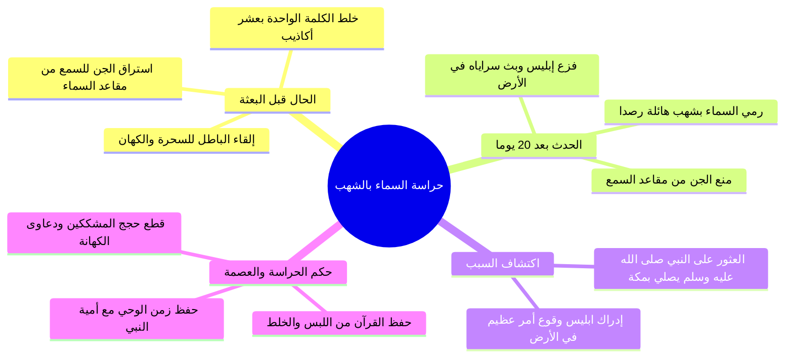

# 04 - بركة الإسناد وحراسة السماء بالشهب

> [!info] الفترة المرجعية
> الأسطر: 211 – 256 من [[تفريغ المحاضرة 4]] (المرجع المعتمد أرقام الأسطر لعدم وجود توقيت زمني بالتفريغ).

---

## 📝 الملخص العلمي المنظم

### 1. بركة الإسناد العملي ونقل الهدي إلى البيت

- **الواجب التربوي تجاه الأبناء:**
  - في زمن غزت فيه الشاشات والأجهزة البيوت، أصبح حتماً على المربي أن «ا يملأ عيني ولده برؤية الصالحين» ومجالستهم في المساجد ومجالس العلم؛ لتحصينه قبل أن يتخطفه رفقاء السوء وأهل الفساد.
  - **شاهد معاصر على الخشوع في الوضوء:** نموذج الشيخ [[أسامة عبد العظيم]] رحمه الله؛ كان يجلس على كرسي صغير عند الوضوء ويغسل أعضاءه بتأنٍّ ومراقبة وخشوع مهيب يفوق ما يفعله كثير من الناس داخل صلاتهم.
- **سلسلة التلقي المباركة (بركة الإسناد):**
  1. جبريل عليه السلام توضأ وصلّى ركعتين أمام النبي ﷺ ليريه هيئة الطهور والصلاة بالمعاينة.
  2. توضأ النبي ﷺ وصلى كما رأى جبريل.
  3. انطلق النبي ﷺ مباشرة إلى بيته فتوضأ لزوجه [[خديجة بنت خويلد]] رضي الله عنها ليريها كيفية الطهور، فتوضأت كما توضأ، ثم صلى بها فصلت بصلاته.
  4. انتقال الهدي بالتسلسل العملي من الوحي إلى الأهل والأصحاب والأمة.

---

### 2. التخريج والتحقيق الحديثي لبدء فرض الوضوء

| الرواية | المصدر والتخريج | الحكم والتحقيق |
|:---|:---|:---|
| **رواية ابن إسحاق** | ذكرها في السيرة ونقلها [[السهيلي]] في «الروض الأنف» | **مقطوعة (مرسلة):** ومثلها لا يستقل أصلاً في بناء الأحكام الشرعية لذاته. |
| **حديث زيد بن حارثة** | رواه أحمد، وابن ماجه، والحاكم، وفيه: «ا أن جبريل أتاه في أول ما أوحي إليه فعلمه الوضوء والصلاة، فلما فرغ من الوضوء أخذ غرفة من ماء فنضح بها فرجه». | **صحيح بمجموع طرقه:** أورده الشيخ [[الألباني]] في «السلسلة الصحيحة»؛ لأن إسناده وإن كان فيه مقال فقد توبع وله شواهد يقوي بعضها بعضاً. |

---

### 3. حادثة رجم الجن بالشهب وحراسة السماء

- ا قول ابن أبي العز الحنفي في الأرجوزة:
> ثُمَّ مَضَتْ عِشْرُونَ يَوْماً كَامِلَهْ ... فَرَمَتِ الْجِنَّ نُجُومٌ هَائِلَهْ

- **التأصيل الشرعي من سورة الجن:**
  - قال تعالى مخبراً عن الجن: {وَأَنَّا لَمَسْنَا السَّمَاءَ فَوَجَدْنَاهَا مُلِئَتْ حَرَسًا شَدِيدًا وَشُهُبًا * وَأَنَّا كُنَّا نَقْعُدُ مِنْهَا مَقَاعِدَ لِلسَّمْعِ ۖ فَمَن يَسْتَمِعِ الْآنَ يَجِدْ لَهُ شِهَابًا رَّصَدًا}.
- **الحكمة الإلهية في حراسة الوحي وأمية الرسول ﷺ:**
  - اقترنت حراسة السماء من استراق السمع بأمية النبي ﷺ (لا يقرأ ولا يكتب)، لقطع كل شبهة أو فرية يدعيها المشركون واليهود بأنه تلقى الوحي من الكهان أو بحيرى أو كتب الأقدمين: {وَمَا كُنتَ تَتْلُو مِن قَبْلِهِ مِن كِتَابٍ وَلَا تَخُطُّهُ بِيَمِينِكَ ۖ إِذًا لَّارْتَابَ الْمُبْطِلُونَ}.

---

## 🗣️ نص المتحدث الكامل

> **[تربية الأبناء برؤية الصالحين ونموذج الشيخ أسامة - الأسطر 211 - 238]:**
> فالشاهد ا
> ثم الوضوء ان انت لازم تشوف مين لازم تشوف الناس اهل الصلاح
> لازم تشوف اهل الصلاح وان تري ولدك هؤلاء الصالحين خلع ابنك يملي عينيه من الصالحين املى عينيه دلوقتي اهل الفساد بيصلوا له لحد جوه بيتك في التليفون والشاشات والاجهزه ولو انت ما وصلتلوش هيوصل له من الشارع ومن اصحابه ومن المدارس كل حته فانت تعمل ايه املى عيه املى عيه خليه يشوف الصالحين جيبوا هذه المجالس طبعا يكون يعني ايه مميز كبير فاهم جيبه مره وسيبه مره ولما تجيبه كافوا على الت و وخد وعود الشاهد يعني ان انت رؤيه الصالحين مهمه جدا ان سيدنا جبريل علم سيدنا النبي صلى الله عليه وسلم
> فكان يتوضا والنبي ايه
> يبص له كنت تشوف سيدنا الشيخ اسامه الله يرحمه
> سيدنا
> ايه اتفضل يا افضل
> كان الشيخ اسامه عبد العظيم الله يرحمه كنا مر عنده في المسجد فراح يتوضى كده يعني تحس انت بتوضى ولا بتعمل حاجه كان يقعد يتوضى كده ويبص لل يعني يغسل ايده كده بطريقه ويقعد يغسل رجله كان بيقعد على كرسي كده
> عشان يغسل رجليه ويبص ليها وهو بيغسلها مش اللي هو
> اللي بينزل
> لا يعني بيغسلها بطريقه
> بيستشعر
> وانا واقف ورا الحيطه كده هو بيعمل ايه هو
> هو ده الوضوء اللي احنا بنتوضاه لا طريقته في الوضوء نفسهاشوع
> كانت غريبه بقول لك كان بياخد كرسي كده صغير يحطه عند الحنفيه ويقعد عليه ويقعد يتوضى يعني انت تشوف الخشوع بس هو بيتوضى يعني خشوع احنا ما بنعملوش في الصلاه
> خشوع بيض
> اي هو ده
> والله بقول لك تحس ان هو بيعمل حاجه مش بيتوضى بيعمل فيه حاجه ايه هي هو ده بقى رؤيه اهل الاخبات اهل الصلاح فسيدنا جبريل بيتوضى والنبي ايه
> ينظر
> ينظر
> صلى الله
> مش جه قال له يا محمد اتوضى كذا وكذا وكذا كذا وكذا وكذا ده مهم ومهم جدا بس مش هو ده لب الموضوع
> نب الموضوع كما رايتموني ليه بقى عشان النبي عمل ايه
> خدها بالرؤيه خدها بالتسلسل بالاسناد ف قال ان الصلاه حين افترضت على رسول الله صلى الله عليه وسلم اتاه جبريل وهو باعلى مكه فهمز له بعقبه في ناحيه الوادي فانفجرت منه عين فتوضا جبريل ورسول الله ينظر
> اليه ليريه كيف الطهور للصلاه ثم توضا رسول الله كما راى جبريل توضا ثم قام به جبريل فصلى وصلى رسول الله بصلاته ثم انصرف جبريل فجاء رسول الله خديجه صلى الله عليه وسلم فتوضا لها ليريها الوضوء
> الله اكبر
> يبقى سيدنا جبريل اتوضى قدام النبي والنبي ينظر
> بعد كده توضى بعديه صلى قدامه والنبي ايه ينظر ويصلي بصلاته خلاص بقى اتعلم يلا بقى روح ايه
> روح علم بقى زوجتك واولادك وعلم اهل حارتك وعلم الجيران وعلم اصحابك انشر هذا العلم ليكون ايه ليكون لك بركه الاسناد ان انت تبقى في اسناد كده من ضمن جبريل وسيدنا النبي صلى الله عليه وسلم والعلماء والصالح فجاء رسول الله صلى الله عليه وسلم خديجه فتوضا لها ليريها كيف الطهور للصلاه كما اراه جبريل فتوضات كما توضا لها رسول الله عليه الصلاه والسلام ثم صلى بها رسول الله كما صلى به جبريل فصلت بصلاته

> **[تحقيق حديث الوضوء لزيد ورجم الجن بالشهب وحراسة السماء - الأسطر 239 - 256]:**
> قال السهيلي في الروض الالف وهذا الحديث مقطوع في السيره ومثله لا يكون اصلا في الاحكام الشرعيه ولكنه قد روي مسندا الى زيد بن حارثه يرفعه غير ان هذا الحديث المسند يدور على الجماعه وقطع قال وحديث زيد المشار اليه رواه الامام احمد ابن ماجه والحاكم وغيرهم عن زيد بن حارثه مولى النبي عليه الصلاه والسلام
> ان جبريل اتاه في اول ما اوحي اليه فعلمه الوضوء والصلاه فلما فرغ من الوضوء اخذ غرفه من ماء فنضح بها فرجه قال ثم مضت 20 يوماك الحديث السابق حديث ليس صحيح على الرسول وضوء وتعلم
> اي اه في اسناد الكلام اه
> قال ولكن انه توبع ولهذا اوراده الالباني في السلسله الصحيحه يعني قد يكون الاسناد فيه مقال ولكن يكون له توابع وشواهد من احاديث اخرى يقوي بعضها بعض الحديث سيدنا زيد هو اللي صحيح
> اه
> اللي هو اتاه جبريل فول الوحي وعلم الوضوء والصلاه
> ايوه
> وده صح
> قال ثم مضت 20 يوما كامله فرمت الجن نجوم هائله النجوم هي الشهب قال الله تعالى مخبرا عن الجن بعد حراسه السماء بالشهب وانا لمسنا السماء فوجدناها
> ملئت حرسا شديدا وشهبا وانا كنا نقعد منها مقاعد للسمع فمن يستمع الان يجد له شهابا رصدا هائلا اي الهول وهو المخافه من الامر لا يدري ما يهجم عليه منه قال ابن الجوزي قال العلماء بالسير رات قريش النجوم يرمى بها بعد 20 يوما من مبعث رسول صلى الله عليه وسلم
> وقال ابن عباس كان الجن يصعدون الى السماء يسمعون الوحي فاذا سمعوا الكلمه زادوا فيها تسعا فاما الكلمه فتكون حقا واما ما زادوا فيكون باطلا فلما بعث رسول الله
> صلى
> صلى الله عليه وسلم منعوا مقاعدهم فذكروا ذلك لابليس ولم تكن النجوم يرمى بها قبل ذلك فقال لهم ابليس ما هذا الا من امر قد حدث في الارض فبعث جنوده فوجدوا رسول الله صلى الله عليه وسلم قائما يصلي بين بين جبلين اراه قال بمكه فاتوه فاخبروه فقال هذا الحدث الذي حدث في الارض يعني كان الجن لهم مقاعد يسترقون السمع من السماء الاخبار التي تقال في السماء الملائكه يتناقلونها فكانوا يسترقون السمع ويلقنونها للسحره والدجالين فياتون بالكلمه من الحق يزيدون عليها عشرا من الباطل ا ليفتنوا الناس عن دين فلما بعث رسول الله صلى الله عليه وسلم
> ا ا قالوا وانا كنا نقعد منها مقاعد
> للسمع
> بالسمع فمن يستمع الان يجد له
> شهابا رص
> شهابا رصدا ليه بقى لحفظ الله عز وجل وحيه من ان يعني يحدث له تلفيق او ا تدث فيه الشبهات او ان تكون عليه هذه التهمه ان الوحي معصوم عصمه الله عز وجل وتولى رعايته وحفظه بنفسه سبحانه وتعالى فبعث نبيا اميا لا يقرا ولا يكتب ليه عشان ما يقول لا يقولون تعلم من يهود او تعلم من بحير الرهب كما قالت اليهود او تعلم من كذا او هذه اساطير الاولين اكتتبها فهي تملى عليه خلاص هو لا يكتب ولا يملى عليه ثم كانت النجوم الجن يسترقون السمع ف عصم زمن الوحي من استراق السمع ان ان الجن يصلون الى شيء من ذلك حتى انه العلماء بقى تكلموا بعد كده هل بعد موت النبي صلى الله عليه وسلم
> ا الجن تمكنوا مره اخرى من مقاعدهم على خلاف في ذلك وقيل ان انه كانت الشهب هذه يقذف بها الجن حين يسترقون السمع ولكن ازدادت شده بعد بعث النبي صلى الله عليه وسلم اللي هو شهابا رصدا رصدا يعني يتبع الجن حتى يحرقه فلما حدث هذا الرمي هذا الرصد للجن ا شكوا الى ابليس انه حدث امر جديد فقال لعله حدث امر فجعلوا يتباحثون فوجد النبي صلى الله عليه وسلم قائما يصلي ا في وادي مكه فعلموا انه ايه بعث رسول الله صلى الله عليه وسلم

---

## 🔍 المراجعة الداخلية (5 نقاط عشوائية)

1. **البداية (سطر 211 - 215):** مطابقة تامة للتوجيه بملء أعين الأبناء برؤية الصالحين في مواجهة طوفان الشاشات ومجالستهم.
2. **منتصف البداية (سطر 216 - 227):** مطابقة تامة لوصف خشوع الشيخ أسامة عبد العظيم في الوضوء وجلوسه وتأمله في غسل الأعضاء.
3. **المنتصف (سطر 228 - 238):** مطابقة تامة لتعليم جبريل بالمعاينة وانتقال النبي ﷺ لتعليم خديجة الوضوء والصلاة بصلاته وتحقيق بركة الإسناد.
4. **منتصف النهاية (سطر 239 - 245):** مطابقة تامة لقول السهيلي في انقطاع حديث السيرة ومتابعة حديث زيد بن حارثة في السلسلة الصحيحة.
5. **النهاية (سطر 246 - 256):** مطابقة تامة لبيت الأرجوزة في رجم الجن بالشهب بعد 20 يوماً واستشهاد سورة الجن وقصة بحث إبليس وجنوده وعصمة الوحي وأمية النبي ﷺ.

---

## 🔗 التنقل

- **السابق:** [[03 - تعليم جبريل الوضوء والصلاة وفقه المعاينة]]
- **التالي:** [[05 - الجهر بالدعوة وفقه المراحل ومقدمات الهجرة]]

> [!success] حالة الإنجاز: الجزء 4 من 5 مكتمل | المتبقي: جزء واحد وملحقاته.
