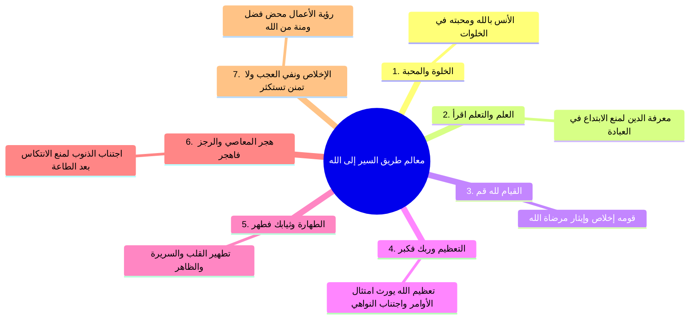
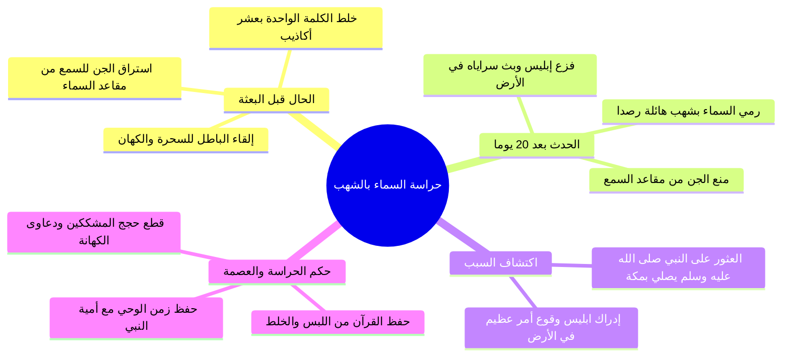

# سيرة 4: الأرجوزة المئية في ذكر حال أشرف البرية — الملف المجمع الكامل

> [!abstract] محتوى الملف المجمع
> يجمع هذا الملف جميع أجزاء المجلس الرابع من شرح [[الأرجوزة المئية]] للإمام [[ابن أبي العز الحنفي]] بالتتابع الكامل:
> الملخصات العلمية المنظمة، والجداول، والتقسيمات، والمقارنات، والتحذيرات، متبوعة بـ **نص المتحدث كاملاً حرفياً بنصه الأصلي** دون حذف أي كلمة، ومجرداً من أقسام المراجعة والاختبارات والتوقيتات.

---

## 📑 فهرس الأجزاء المجمعة

1. **الجزء الأول:** حفظ المتون وسن الأربعين ويوم البعثة (الأسطر 1 – 102)
2. **الجزء الثاني:** غار حراء ومعالم طريق السير في سورة المدثر (الأسطر 103 – 151)
3. **الجزء الثالث:** تعليم جبريل الوضوء والصلاة وفقه المعاينة (الأسطر 152 – 210)
4. **الجزء الرابع:** بركة الإسناد وحراسة السماء بالشهب (الأسطر 211 – 256)
5. **الجزء الخامس:** الجهر بالدعوة وفقه المراحل ومقدمات الهجرة (الأسطر 257 – 294)

---

# الجزء الأول: حفظ المتون وسن الأربعين ويوم البعثة

## 📝 الملخص العلمي المنظم

### 1. منهجية حفظ المنظومات العلمية وسر القبول

| العنصر المنهجي | التفاصيل العملية من كلام الشيخ |
|:---|:---|
| **المنهج الأسبوعي المقترح** | حفظ **5 أبيات أسبوعياً** بمعدل بيت واحد يومياً (من السبت للأربعاء)، وتخصيص يومي الخميس والجمعة للمراجعة والتثبيت. |
| **آلية الحفظ المثلى** | الجمع بين **القراءة بالعين صباحاً** و**الاستماع الصوتي**؛ لأن رنين المنظومات والمقامات الصوتية يثبت الكلمات في الأذن ويسعف الذاكرة عند النسيان. |
| **الأداة التقنية المساعدة** | تطبيق **«حفاظ المتون»**: يتيح استماع المتون مقطعة ومسجلة بأصوات شيوخ محققين، مع إمكانية تحديد مقطع وتكراره (مثلاً 100 مرة) تلقائياً. |
| **سر القبول والانتشار** | السر يكمن في صدق ما بين العبد وربه؛ ونموذجه الفذ [[الإمام النووي]]: كتب للأطفال والمبتدئين ([[الأربعون النوووية]])، ثم لعامة الناس وطالبي الفضائل ([[رياض الصالحين]])، ثم لأهل التخصص ([[شرح صحيح مسلم]] و[[المجموع شرح المهذب]])، فرُزقت كتبه قبولاً لم يسبق له نظير. |
| **أثر المعايشة والمجالسة** | معايشة أنفاس الصالحين تُعدي؛ وصاحبك ساحبك، كما قال ﷺ: «ا الكِبرُ والخُيَلاءُ في أهلِ الخَيلِ، والتَّواضُعُ في أهلِ الغَنَمِ»، فكثرة ملامسة الشيء تُورث طباعه. |

---

### 2. مراجعة وتأصيل: وضع الحجر الأسود في سن 35 سنة

- ا بيت الأرجوزة محل المراجعة:
> وَحَكَّمُوهُ وَرَضُوا بِمَا حَكَمْ ... فِي وَضْعِ ذَاكَ الْحَجَرِ الأَسْوَدِ ثُمّ

- **الدلالات واللفتات الإيمانية في بناء الكعبة:**
  1. **إزالة رواسب الجاهلية:** تصدع الكعبة وإعادة بنائها إيذان بانقضاء عهد البدع والأصنام المحدثة وعودة البيت إلى مله إبراهيم الحنيفية، كما لفت الله أنظارهم مسبقاً بتعظيم البيت بحادثة عام الفيل.
  2. **الريادة والقيادة النبوية:** تولى النبي ﷺ هدم البيت معهم وبناءه، ولما اختلفوا فيمن يضع الحجر قدر الله أن يؤول التحكيم إليه ليضعه بيده، ترسيخاً لريادته وقيادته للتجديد القادم.

---

### 3. مبعث النبي ﷺ في سن الأربعين ويوم الاثنين

- ا قول ابن أبي العز الحنفي في الأرجوزة:
> وَبَعْدَ عَامِ أَرْبَعِينَ أُرْسِلاَ ... فِي يَوْمِ الاِثْنَيْنِ يَقِيناً فَانْقُلاَ
> فِي رَمَضَانَ أَوْ رَبِيعٍ الأَوَّلِ ... وَسُورَةُ اقْرَأْ أَوَّلُ الْمُنَزَّلِ

- **التأصيل العلمي لوقت البعثة:**

| المسألة | الحكم والتحقيق | الدليل والتعليل |
|:---|:---|:---|
| **سن البعثة (40 سنة)** | مقطوع به عادة ويقيناً | عادة الأنبياء أن يبعثوا على رأس الأربعين لتمام النضج؛ لحديث ابن عباس: «ا بُعث رسولُ الله ﷺ لأربعين سنة، فمكث بمكة ثلاث عشرة سنة يوحى إليه، ثم أمر بالهجرة فهاجر عشر سنين، ومات وهو ابن ثلاث وستين». |
| **يوم البعثة** | **يوم الاثنين يقيناً** | ثابت بالنص القطعي ولا مجال فيه للاجتهاد. |
| **شهر البعثة** | محل خلاف واجتهاد بين العلماء | - **القول الأول (شهر رمضان):** استدلوا بقوله تعالى: {شَهْرُ رَمَضَانَ الَّذِي أُنزِلَ فِيهِ الْقُرْآنُ} وقوله: {إِنَّا أَنزَلْنَاهُ فِي لَيْلَةِ الْقَدْرِ}. - **القول الثاني (شهر ربيع الأول):** وجّهوا آية رمضان بأنها نزول القران جملة من اللوح المحفوظ إلى بيت العزة في السماء الدنيا، ثم نزل مفرقاً منجماً حسب الحوادث في 23 سنة. |

> ⚠️ تنبيه
> ما ورد فيه نص صحيح صريح كسن الأربعين ويوم الاثنين يُقال فيه **«يقيناً»**، أما ما لم يرد فيه نص قطعي فشهر المولد وشهر المبعث يكون للاجتهاد فيه مسرح.

---

## 🗣️ نص المتحدث الكامل (الجزء الأول)

> **[مذاكرة حفظ المتون وتطبيق حفاظ المتون وسر النووي - الأسطر 1 - 75]:**
> نا فين فين المره
> اه مكتوب عند الكعبه
> عند الكعبه
> حجره سيدنا
> بناء الكعبه
> سيدنا محمد صلى الله عليه وسلم هو اللي وضع حكموضع حجره البيت اللي بعده
> اللي هو 22 السلام عليكم
> وعليكم السلام سمعوا لك الاسبوع اللي فات يا شيخ سمعوا لك الاسبوع اللي فات
> اه قناه بتاع الشيخ مصطفى
> اه اتصلت على الشيخ احمد يوم الاربعا قلت لهم
> ايوه ما انا عشان كل شويه بقى سايبني هو
> ان شاء الله نسمعه في التليفون ان شاء الله ونجهز الاجازه
> حاول اجهزها ان شاء الله
> فيش حد هيبشرنا كده نختمهم مع بعض
> ان شاء الله ان شاء الله يا س
> ان شاء الله ننزل الحفظ
> انا ممكن كمان اجيبها لكم من شيخ عار شدوا حيلكم ان شاء الله تبقى تبقى اجازه بالاسناب يعني
> ان شاء الله ان شاء الله احنا قدامنا كم مره بنختم
> كم مره وايه
> كم درس بنختم
> نختم السيره
> اه نختم
> لا لسه شويه عشان ا
> طب جميل لسه معاه وقت
> اه الفتره المدنيه الغزوات بتاخد وقت يعني ممكن تيجي في في لقاء كده وتلاقي خدنا شطر من البيت
> شطر من البيت
> اه ما هو اصلا ممكن يذكر لك ثلاث ا سريتين وغزوه كده في بيت واحد انت عبال ما تقول ايه ايه هي السريه دي وايه سببها وايه اللي حصل وبعد كده رجعوا بعد كده راحوا الغزوه
> يكون الشيخ احمد ج
> يكون الشيخ احمد ج فهي اخر 40 بيت او 45 بيت هتلاقيهم ايه
> ماشيين تاتا تاتا
> طب اسهل طريقه للحفظ يا ش
> اسهل طريقه في الحفظ انك تسمع
> اه هي
> وتقرا بعينيهين يعني تقرا الصبح بعينيكين وتسمع حد
> كل يوم اخد ثلاث ابيات
> اه بيتين بيتين بس ده هم 100 بيت انا كنت مين كان زمان خلص
> اه والله لو بدات كل احنا اتفقنا اصلا اول ما بدانا في الاوبجوز قلنا ايه
> هتحفظ في الاسبوع كله خمس ابيات يعني كل يوم بيت وفي يومين اجازه تراجع فيه تخيل كده خمس ابيات اصلا انت تقدر تحفظهم في يوم واحد صحيح
> لا احنا نقول لك احفظ بيت النهارده وبيت بكره وبيت يعني سبت واحد واثنين وثلاث واربع وقدامك الجمعه اجازه والخميس اجازه بت تراجع فيهم فانت اقراهم اقرا الخمس ابيات مثلا وبعد كده اسمعهم حد يعني فايده الارجوزه او المنظومات عموما ان هي بتبقى ا يعني ايه ليها مقامات كده صوتيه ف الحاجات دي بتثبت الكلام في في الاذن تخليك انت حتى لو وقعت منك كلمه تيجي جايه في النص تلاقي نفسك ايه جبتها نصيحه على سيدنا العل حد يندفع فيه تطبيق اسمه حفاظ المتولي
> اه اه بتنزل عليه المتون مسجله صوتيا ومقطعه يعني
> تطبيق اسمه حفاظ المتون
> نعم
> ده هتلاقي فيه ا كتب كتيره ومنظومات كتيره ا مقروءه مقروءه بالصوت وهتلاقي كذا صوت كمان يعني هتلاقي كذا اختيار من الاصوات والناس اللي مسجلين الاصوات دي يعني ناس محققين يعني انا كنت بحفظ عليه متن زاد المستنعى كانوا مسجلين الشيخ عامر بهجت وحد تاني كده المهم يعني ناس اصلا بيشرحوا هذه المتون وعلماء وناس محققين ناس كبار يعني هتلاقي في الغالب يعني الناس اللي مسجلين عليهم ناس فالشاهد ان انت اسمع اسمع وتغنى بها تغنى بها كده اجعل لها رنينا في اذنك هي اصلا يعني في متون كده يعني ايه جميله اصلا لطيفه كده يعني زي ما مثلا العقيده الطحويه انت حتى لو مش عايز تدرسه هتحفظه يعني ايه هو في في كلام كده جميل وعظيم وبطريقه سلسه وسهله ووضع له القبول الله عز وجل يعني لعل الكاتب كان بينه وبين الله عز وجل سرع
> كنت بتكلم انا واهلي يعني وزوجتي عن رياض الصالحين فقلت سبحان الله الامام النووي ده يعني الف متنا صغيرا في الاحاديث الاربعون النوويه فاشتهرت وصار يعني ايه لها صيط وقبول لم يكتب لمثلها ثم ترقى لرياض الصالحين فكتب كتاب رياض الصالحين في الفضائل وال فاشتهر يعني وصار له صيط لم يكن لمثله ثم ترقى تخصص بقى يعني اهو المبتدئين والاطفال وبعد كده طالب العلم وبعد كده اهل التخصص ا شرح مسلم ا شرح مسلم الامام النووي فلم يكتب مثله فهو السر فين الشخص
> الشخص نفسه فيه سر بينه وبين
> في سر بينه وبين كمان الالماني والانجليزي
> يا باشا
> انت انت
> الاربعين والرياض الصالحين ده الرياض الصالحين يعني في ناس عاملينه زي القران كده فطروا على ذلك بعيد عن بتوع التبليغ كمان ان هم لا في ناس كده من الناس الطين لما يحب يقرا في الدين
> يقرا رياض الصلا يعني في الدين عموما هو ده كتاب الدين بالنسبه له عايز يقرا في الدين القران ورياض الصلاح اروع كتب والله
> فهو يعني ايه ا حتى برض تلاقيه في الفقه برض كتب في الفقه الامام النووي ما حدش كتب زي اه كتاب المجموع شرح
> فق الشرح فالشاهد يعني ان ايه ان اسمع يا شيخ شعب اسمع فهي دي ولا الجامع
> فايه
> مجموع ولا الجامع
> اللي هو ايه
> كتاب
> مجموع شرح المهند جام
> مجموع شرح المهند
> انتقل بقى سيره الامام النووي كامله وستفيد بقى فان معايشه انفاسه تعدي معايشه انفاس الصالحين تعدي اللي بيصاحب ا صاحبك ساحبك دايما كده لما ا لما تعايش حد بيصبع عليك مش حد مش لازم بشر اي حاجه انت بتكثر من معايشتها ا يعني تاخذ انطباعا منها زي ما النبي صلى الله عليه وسلم قال ايه
> فالكبر وال الخيلاء في اهل ال الخير
> الخيل
> والتواضع في اهل الغنم هي كده كل ما تكتر من ملامسه حاجه او معايشه حاجه تاخذ منتجعات الشاهد صلوا على سيدنا صل على اهل البطل بيردوا على طول اهل يعني في ناس
> اه حتى المتن ده يا شيخ شعبان
> ال البرنامج دهساكن
> لا لا ده لي انا
> البرنامج ده يا شيخ شعمك الله
> في فايده ان انت ممكن تحدد جزء معين وتكرره بعدد محدد
> يعني ممكن تحدد من بيت كذا لبيت كذا وتقول له كرره 100 مره
> يعني مثلا من بيت واحد لبيت خمسه كرره 100 مره وتيجي مشغله في
> اللي هو البرنامج بتاع حفظ المتون
> حفاظ المتون اهي تيجي تاني يوم تحدد مثلا من واحد ل 10 تث من واحد ل 15 بعد كده مثلا تحدد من 10 ل 15 يعني بتحدد المكان والصوت ومرات التكرار اللي انت هتكرر يعني جميل جدا انا استفدت منه كثيرا
> ده يا شيخنا المتون دي اصلا في متون يعني انت تقراها كده لا غنى عنها لا
> ايه
> لا غنى عنها
> ما انا بقول لك في متون كده لطيفه من ضمنها المتن ده متن الارجوزه ومتن العقيده الطحويه متون لطيفه حتى انت لو مش طالب علم تحب تقراها تحب تحفظها

> **[مراجعة حادثة الكعبة ودلالتها - الأسطر 76 - 90]:**
> بسم الله الرحمن الرحيم
> بسم الله الرحمن الرحيم ان الحمد لله تعالى نحمده ونستعين به ونستغفر ونعوذ بالله تعالى من شرور انفسنا ومن سيئات اعمالنا من يهدي الله ازيك يا سيدي افضل يا سيدي على راسي يا سيدي
> من يهده الله فلا مضل له ومن يضلل فلا هادي له واشهد ان لا اله الا الله وحده لا شريك له واشهد ان محمدا عبده ورسوله صلى الله عليه وعلى اله وصحبه وسلم ثم اما بعد ايها الاحباب الكرام طبتم وطيب الله قلوبكم ونظوه ونسال الله عز وجل ان يجمعنا في ظل عرشه يوم اظل الا اظله
> وان يردنا حوض نبيه وان يرزقنا النظر الى وجهه بغير حساب ولا سابقه عذاب ثم اما بعد لازال الحديث موصولا مع سيره الحبيب
> صلى الله عليه
> المصطفى صلى الله عليه وعلى اله وصحبه وسلم ومع شرح الارجوزه المائيه للامام ابن ابي العز الحنفي عليه رحمه الله تعالى ووقفنا في اللقاء الماضي عند قول به وحكموه ورضوا ورضوا بما حكم في وضع ذاك الحجر الاسود ثم وهذا يشير الى حادثه بناء الكعبه ا قبل مبعث النبي صلى الله عليه وسلم بخمسيه
> بخمس سنوات يعني والنبي صلى الله عليه وسلم عنده 35 سنه ا هم اهل مكه ا بهدم الكعبه واعاده بنائها لما اصابها من الوهم في في البناء وقلنا اشرنا الى ان في ذلك اشاره لطيفه وهي انه قد انقضى عهد رواسب الجاهليه وستزال هذه الرواسب عن هذا البيت وسيعاد الى الدين الاصل مله ابيكم ابراهيم ثم اوحينا اليك ان اتبع مله ابراهيم حنيفا ولم يكن من المشرك فدي اشاره اولا لفت الله عز وجل انتباههم الى تعظيم هذا البيت حادثه ايه؟ حادثه امرهه حادثه الفيل في عام ولاده النبي صلى الله عليه وسلم حدثت حادثه الفيل فكانه جاء عهد جديد عهد جديد سيقضي على ما فات وسيزيل كل رواسب الجاهليه التي ا تكاثرت وا وجاءت محدثه على دين ابراهيم الذي اقام هذا البيت فكما ا يعني اندثر هذا البيت وجاء ابراهيم عليه السلام ورفع البناء رفع هذا الدين واظهره بين الناس ثم ا يعني تكاثرت الرواسب والبدع والاصنام حول الكعبه وما ابتدعوه في دين الله عز وجل فاندثرت مله ابراهيم جاء محمد
> صلى الله عليه وسلم
> عليه الصلاه والسلام ليعيد اقامه هذا الدين مره اخرى ليهدم كل ما جاء من رواسب الجاهليه ثم يعيد اقامه هذا الدين على على ايه على قواعد ايه
> ابراهيم
> ابراهيم فلفت الله عز وجل انتباههم لتعظيم البيت ثم جاء النبي صلى الله عليه وسلم
> فهدم البيت والذي تولى زياده هذا البناء مين؟
> النبي
> النبي صلى الله عليه وسلم
> كان يبني معهم ثم لما ا اختلفوا على وضع الحجر قدر الله عز وجل له ان يكون في القياده والرياده ليضع الحجر الاسود مكانه ليعلم الناس انه سيكون له شان
> وانه ا يعني هو قائد هذا التجديد الذي سيحدث في هذا المكان صلى الله

> **[سن الأربعين ويوم الاثنين واختلاف شهر البعثة - الأسطر 91 - 102]:**
> قال وبعد عام 4عين ارسلا في يوم الاثنين يقينا فانقلا يعني بعد مضي 40 سنه من حياه النبي صلى الله عليه وسلم
> كما هي عاده الانبياء يبعثون على راس الاربعين فارسل النبي عليه الصلاه والسلام بعد 40 سنه يقينا ليه؟ لان في ذلك حديث صحيح عن ابن عباس رضي الله عنه عنهما قال بعث رسول رسول الله صلى الله عليه وسلم لارين سنه فمكث بمكه 13 سنه يوحى اليه ثم امر بالهجره فهاجر عشر سنين ومات وهو ابن 63
> فالحاجه اللي تجينا فيها نص الشيخ رشاد الحاجه اللي تجيلنا فيها نص دي تقول ايه
> يقينا طب حاجه ما فيهاش نص
> يبقى خلاص يكون للاجتهاد فيها مسرح لما حد يقول مثلا ولد النبي صلى الله عليه وسلم
> في شهر ربيع الاول ربيع الاخر شهر كذا خلاص هو الكلام كله اجتهادات وكل يدلو بدليل لما بعث النبي صلى الله عليه وسلم بعث يوم يوم الاثنين يقينا ا في شهر ايه بقى اختلف العلماء بعضهم قال في شهر رمضان ليه
> عشان ايه انزلناه في القدر
> انا انزلناه في ليله الق ده عشان ايه؟
> اه عشان ربنا قال شهر هم استدلوا بكده ان ربنا قال شهر رمضان الذي انزل فيه الايه؟
> القران
> القران فكانت اول حاجه من من بحثه النبي صلى الله عليه وسلم نزول الوحي اقرا اقرا باسم ربك فاستدلوا بهذا الدليل ولكن العلماء اللي خالفوهم قالوا لا ده ا بدايه الوحي والبحثه كانت في ايه؟
> اه كانت في شهر ربيع طب والايه دي تعملوا فيها ايه؟ قالوا لا نزول القران من السماء الى بيت العزه بعد كده نزل منجما مفرقا على حسب النوازل والاحداث في في 23 سنه بعد البعث فالشاهد يعني ان اليقين الثابت ان النبي صلى الله عليه وسلم بعث يوم ايه
> يوم الاثنين

---

# الجزء الثاني: غار حراء ومعالم طريق السير في سورة المدثر

## 📝 الملخص العلمي المنظم

### 1. خلوة غار حراء وبدء نزول الوحي

- ا عجز بيت الأرجوزة:
> ... وَسُورَةُ اقْرَأْ أَوَّلُ الْمُنَزَّلِ

- **خصائص وميزات [[غار حراء]]:**
  1. **الخلوة التامة:** مكان بعيد عن ضوضاء الناس وشواغلهم للتعبد والتحنث الليالي ذوات العدد.
  2. **انفتاح النظر إلى السماء:** يوفر فضاءً مفتوحاً للتأمل في ملكوت السماوات والأرض.
  3. **رؤية الكعبة:** كان الجالس في الغار قديماً يرى الكعبة المشرفة مباشرة قبل أن تحجبها الأبنية المرتفعة حديثاً.

---

### 2. الحكمة من بشرية الرسول ﷺ ومنهجية التلقي القرآني

| المحور | البيان والتأصيل الشرعي |
|:---|:---|
| **خصيصة البشرية** | قال تعالى: {قُلْ إِنَّمَا أَنَا بَشَرٌ مِّثْلُكُمْ يُوحَىٰ إِلَيَّ}؛ جعل الله النبي ﷺ بشراً يأكل ويمشي في الأسواق ويتزوج ويمرض ويصحو ليكون قدوة عملية يمكن للبشر اقتفاء أثره، والفرق الجوهري أنه ﷺ يُوحى إليه فيُشرِّع، بينما واجب الأمة هو **الاتباع المحض واقتفاء الأثر دون ابتداع**. |
| **طبيعة القران المكي** | نزل لغرس **العقائد، وتثبيت الإيمان باليوم الآخر والبعث والنشور، والنظر في آيات الله**، ليكون قاعدة صلبة تبنى عليها التكاليف. |
| **طبيعة القران المدني** | اختص بإنزال **الشرائع والتكاليف والأحكام** (الجمعة، الأذان، الزكاة، الجهاد) بعد أن رسخ الإيمان في النفوس بمكة. |
| **قانون السير والابتلاء** | الابتلاءات والعثرات تزيد المؤمن ثقة ويقيناً: {هَٰذَا مَا وَعَدَنَا اللَّهُ وَرَسُولُهُ وَصَدَقَ اللَّهُ وَرَسُولُهُ وَمَا زَادَهُمْ إِلَّا إِيمَانًا}؛ وطريق السير سلكه الأنبياء والعشرة المبشرون بالجنة، فمن لزم طريقهم أفلح. |

> ⚠️ تنبيه
> قانون السير إلى الله لا يعرف الوقوف في المنتصف: {لِمَن شَاءَ مِنكُمْ أَن يَتَقَدَّمَ أَوْ يَتَأَخَّرَ}؛ إما تقدم بعمل الطاعات فيمدك الله بغيرها، أو نكوص وفتور فتُسلب حلاوة الطاعة وتُستبدل.

---

### 3. فزع النبوة وتثبيت خديجة رضي الله عنها

- فزع النبي ﷺ بعد لقاء جبريل إلى زوجه [[خديجة بنت خويلد]] رضي الله عنها قائلاً: «ا دثِّروني دثِّروني، والله لقد خشيتُ على نفسي».
- **الظاهرة الفسيولوجية:** عند الفزع والهلع يصاب الإنسان برجفة وقشعريرة برد شديدة تجعله يطلب الدثار والغطاء حتى في قيظ الصيف.
- **تثبيت خديجة التاريخي بالنبل ومكارم الأخلاق:**
  - قالت له: «ا كلا والله لا يخزيك الله أبداً؛ إنك لتصل الرحم، وتحمل الكلَّ، وتكسب المعدوم، وتُقري الضيف، وتُعين على نوائب الحق».
  - انطلقت به إلى ابن عمها [[ورقة بن نوفل]]، وكان شيخاً حنيفياً يقرأ الكتب السابقة، فبشره بناموس النبوة.

---

### 4. معالم طريق السير إلى الله المستنبطة من سورتي اقرأ والمدثر

---

## 🗣️ نص المتحدث الكامل (الجزء الثاني)

> **[غار حراء وبشرية النبي ﷺ والفرق بين المكي والمدني - الأسطر 103 - 137]:**
> قال في رمضان او ربيع الاول وسوره اقرا اول المنزل قال وسوره تقرا هي ايه اول ما انزل على رسول الله صلى الله عليه وسلم ايه
> سوره اقرا لما جاءه جبريل
> عليه السلام في غار حراء وكان النبي صلى الله عليه وسلم يتعبد الليالي ذوات العدد في غار حراء وغار حراء ده يعني ايه مكان كده ايه يعني صح تلاقي في اا خلوه بعيد عن الناس وفيه ا نظر الى السماء مفتوح وكان في ميزه ثالثه اللي هو
> قديم ايه
> في فتحه بتطلع كعبه
> اه كان قديما لما تقعد في غار حراء ترى الكعبه لكن دلوقتي طبعا ايه ا الابنيه حجبت كل هذا فالشاهد ان النبي صلى الله عليه وسلم كان يتحنف الليالي ذوات العدد يتحنف الليالي دوات العبد وقلنا ايه وقلنا اذا اردت النجاه وان تنساب الى الله عز وجل بسهوله ويسر ف فالزم غرز رسول الله
> صلى الله عليه وسلم
> صلى الله عليه وسلم انت انك تعرف ان تسير على نهجه
> صلى الله عليه وسلم
> ان النبي صلى الله عليه وسلم بشر ولكنه يوحى
> اليه فالله عز وجل جعل في خصيصه البشريه عشان ما تقولش ان الكلام ده ايه معجز
> لا قل انما انا بشر مثلكم
> ولكن هو ايه
> يوحى الي بشر مثلكم يعني اللي انا هعمله انت تقدر تعمله
> اللي انا هعيش عليه انت
> تقدر تعيش عليه بل بالعكس النبي صلى الله عليه وسلم عان وعايش احداث ومواقف انت ما تقدرش عليه ولكن جعله الله عز وجل بشرا رسولا عشان تقتفي اثره وتسير على نهجه يبقى مش مستحيل ياكل الطعام ويمشي في الاسواق ويتزوج النساء ويصلي ويقوم وينقض ويمرض ويشفى ويتعب و يبقى كل الاحوال هو بشر قل انما انا بشر مثله طيب نعمل زيه لا تتبع تسير على نهجه لكن هو يوحى اليه فله حق الايه تش ان هو بيوحى اليه فبيشرع لكن انت ما ينفعش ايه تجتهد وتشرع وانما انت تقلده تتبع اثره وتسير على نفسه
> فكان من اول ما انزل عليه سوره اقرا وقلنا لابد ان تستفيد من هذه الفواتح والبواكير من نزول القران ان مثلا ربنا عز وجل قدر ان ياتي القران المكي دائما ايه بيغرز العقائد ويثبت العقائد والايمان باليوم الاخر والايمان بالبعث والنشور وارسال الرسل والنظر في الايات كل ده تعميق للايمان تعميق للايمان الشرائع جت فين
> في المدينه كل الشرائع جت في المدينه حتى الجمعه اول جمعه اقيمت في المدينه الصلاه النداء الاذان للصلاه ا الزكاه الجهاد كل الشرائع دي فرضت فين؟
> في المدينه بعد ان هاجر النبي صلى الله عليه وسلم الى المدينه فتلاقي طابع القران المكي طابعه تثبيت العقائد وزياده الايمان بالله عز وجل والنظر في الايات طابع القران المدني انذار الشرائع فهي دي منازل السير الى الله عز وجل ان انت لما تبدا التزام لما تبدا سرير الى الله عز وجل لا عايز تسير صح امشي ورا سيدنا النبي صلى الله عليه وسلم صلى الله عليه وسلم
> اما ان تتفرق بك السبل وتيجي بعد كده تستطيل الطريق يجي واحد يمشي على مزاجه ويختار بهواه وبعد كده يقول لك ايه
> الطريق ما ما بيوصلش لا ما انت اللي مشيت غلط انت اللي مشيت في اتجاه لا يوصل وانما اما تمشي على طريق الحق الذي رسمه الله عز وجل وارتضاه لنبيه تلاقي نفسك ايه؟ منارات الطريق ولما راى المؤمنون الاحزاب قالوا
> هذا ما وعدنا الله ورسوله وصدق الله ورسوله وما زادهم الا ايمانا
> فعشان كده انت وانت ماشي لربنا حتى الابتلاءات بتزيدك ايمان
> حتى العثرات بتزيدك ثقه في الله عز وجل حتى العقبات بتزقك لربنا عز وجل ليه؟ عشان ربنا راسم طريق ليك وانت شايفه قدامك انت شايفه قدامك وسلكه السابقون وحطوا رحالهم في الجنه انت ماشي ورا ناس ايديك على كتاف ناس فين؟ في الجنه في الجنه لما سيدنا النبي
> صلى الله عليه
> صلى الله عليه وسلم سيد الاولين والاخرين اول من يحرق حلق الجنه
> صلى الله عليه وسلم
> وتيجي تلاقي وراه سيدنا ابو بكر في الجنه وعمر في الجنه وعثمان في الجنه
> وعلي في الجنه وطلحه في الجنه والزبير وزيد كل دول كل العشره المبشرين بالجنه وغيرهم من المبشرون بالجنه كل دول قدامك ومشوا على الطريق ده فانت لما تمشي الطريق ده وتشوف الطريق ده وتلاقي منارات الطريق قدامك تعرف ان انت ماشي صح فعشان كده لما تيجي تتربى على مائده الوحي تربي نفسك بقى تربي نفسك ان اول ما بدئ به النبي صلى الله عليه وسلم ايه
> حب الخلوه لا اقرا دي دي هتيجي فتح من الله عز وجل بعد ما تاوي الي عبدي قم الي امشي وامشي الي وهك ما تقرب مني عبدي شبرا تقربت منه
> ذراعا فانت عليك البدايه وعلى الله ايه
> تمام
> تمام انت ابدا بس وربنا هيعينك بعد ما ربنا يعينك عليك الصدق والثبات ربنا انت كان نفسك تلتزم ربنا هداك والتزمت كان نفسك تطلب العلم ربنا رزقك بشيخ او ا حد تسمعه فبدات اطلب اصدق مع الله عز وجل بس واذل وربنا ايه هينقلك هيرفعك هيمدك هيعينك هتلاقيه ربنا عز وجل لكن انت مثلا نفسي التزم التزمت نفسي احفظ القران ربنا رزقك بشخيحفظك جيت انت متخلف وراجعك خلاص فمن اهتدى فلنفسه ومن عمي
> خلاص على نفسك هتلاقي ربنا سلب منك بقى بعد ما كنت بتحب المسجد بقيت انت مشغول بالدنيا بعد ما كنت بدانس بالقران بقيت ا يعني جسمك بياكلك وانت ماسك المصحف بعد ما كنت بتحب الخلوه بقت بتاخد تليفونك معاك وتلاقي الشواغل والقواطع بعد ما كنت بتحتكف رمضان كله بقيت بتوه لحد ليله 27 بعد ما كنت بتحضر المدارس والدروس واللقاءات وكل حاجه بقيت بتيجي المدرسه متاخر وتغيب يوم وتيجي ثلاثه وتغيب عن اغلب اللقاءات الايمانيه هتلاقي بتسلم تسلم ما انت ايه لمن شاء منكم ان يتقدم او اه يا انت بتتقدم يا ايه؟
> ما فيش حاجه اسمها واقف في النص ده بتعمل حاجه ربنا بيمدك ويعينك بحاجه ثانيه فتعمل الحاجه الثانيه ربنا يكافئك عليها بحاجه ثالثه يا اما انت ما عملتش حاجه فتسلب وتستبدل نعوذ بالله من ذلك

> **[فزع الوحي ومواقف خديجة وتفصيل سورة المدثر - الأسطر 138 - 151]:**
> فكان اول ما انزل على رسول الله صلى الله عليه وسلم اقرا ثم بعدها يا ايها المدثر قم فانذر لما بدئ النبي صلى الله عليه وسلم الوحي وجاءه جبريل ففزع النبي صلى الله عليه وسلم الى السيده خديجه وقال دثروني دثروني والله لقد خشيت على نفسي فدسرته السيده عائشه وغطته يعني الانسان دايما لما بيفزح او يصيبه يحس ايه ان هو بردان كده كل مره في الصيف وحدثت حادثه قدامه حد بيجري الموتوسيكل كده والمهم يعني عمل حادثه وكان عمال يرتجف كده من البرد كده وايه وانا مستغرب ده احنا في الصيف والظهر ازاي ده بردان فهسان اضعف ما فالنبي صلى الله عليه وسلم حول الى خديجه زوجه ا رضي الله عنها وقال دثروني دثروني فدثرته فقال والله لقد خشيت على نفسي فقالت له كلا والله لا يخزيك الله ابدا انك لتصل الرحم وتحمل الكلى وتكسب المعدوم وتعين على نوائم الخير ثم ذهبت به الى ابن عمها ورقه بن نوفل وكان ا راهبا ا على الحنيفيه ثم بعد ذلك نزل القران يا ايها المدثر قم فانذر وربك فكبر وثيابك فطهر والرجز فاهر ولا تمن تس قلنا هي دي معالم الطريق اول حاجه حب الخلوه انك تعرف ربنا مع المحب تعرف ربنا فتحبه فتانس بالخلوه اليه فربنا يفتح لك بقى اول حاجه محبه الله عز وجل اذا نزلت في قلبك ثم عملت اعمالا تتقرب بها الله عز وجل يفتح الله عز وجل عليك بعد كده عشان بقى ما تبتدعش في العباده اقرا المعلم الثاني من المعالم الثاني اقرا انك تتعلم دينك انك تسمع وتق تقرا وتذاكر عشان تعبد ربنا صح المعلم الثالث بقى من معالم السير بعد ما تقرا وتخلو وتتعبد
> قم
> قم انك تقوم لله عز وجل قومه اخلاص قل انما اعذ بواحده ان ايه
> ان تقوموا لله انك تشتغل لربنا عز وجل وتؤثر الله عز وجل على هواك وعلى مصالحك قم فانذر وربك فكبر اول حاجه معرفه الله بالمحبه بعد كده معرفه بالتعظيم ان يعظم الله عز وجل في قلبك وان تقدر الله عز وجل حق قدره ليه تعظيم الله عز وجل في القلب هيحملك على ا اجتناب النواهي وعلى فعل الواجبات انك لما تعظم ربنا ويقول لك الصلاه خير من النوم تقوم وانت بتجري على المسجد لما ربنا ينهاك هتقول ايه؟ سمعنا واطعنا غفرانك ربنا واليك المصير هو ده اللي بيعامل ربنا بالتعظيم مش يقعد يجادل ويناظر ويفصص ويلتف حوالين النصوص عشان يوصل لهواه ومراده يقعد يقول لك قال فلان وسمعت علان وهو اصلا مش مقتنع لاب فلان وانما هو يتبع هواه فمعرفه عز وجل بالتعظيم تعينك على اداء الواجبات واجتناب النوايا عشان كده ربنا قال ايه وربك فكبر وثيابك ايهطهر
> طهر طهر قلبك طهر نفسك طهر ثيابك عشان تخش على ربنا عز وجل وانت ايه طاهر والرجز فاهر لما تتطهر ما تروحش ايه تحط طينه ثاني على راسك لا اجتنب المعاصي لان المعاصي هتجرج للانتكاس مره اخرى تمشي لربنا عز وجل وتعمل الطاعات يا اما المعاصي هتاخرك عن ربنا عز وجل والرجز فاهجر ولا تمن تستكسر بعد ما عملت كل ده خلوه وعباده ومعرفه وذكر وصلاه واعمال ما تمنش على الله عز وجل وانما هذا محض فضل من الله عز وجل محبه عز وجل تبدا بالمحبه العظيم اه حدث
> لا لا يا س افتح يا سيدي افتح بالله عليك بالله عليك الميكروفون شغال الميكروفون لا ما شغلوش بالله عليك والله
> حلفت حلفت
> طب هو يقعد
> لا ولا اي حاجه
> طب اي حاجه كفايه ان انت موجود
> ماشي
> انت تحلل المكان والزمان هناكل
> لا انا ناكل لوحده
> ماشي حتى لما قش كويس جوو حلو جميل

---

# الجزء الثالث: تعليم جبريل الوضوء والصلاة وفقه المعاينة

## 📝 الملخص العلمي المنظم

### 1. تعليم جبريل للنبي ﷺ الوضوء والصلاة

- ا قول ابن أبي العز الحنفي في الأرجوزة:
> ثُمَّ الْوُضُوءَ وَالصَّلاَةَ عَلَّمَا ... جِبْرِيلُ وَهْيَ رَكْعَتَانِ حُكِمَا

- **صفة الحدث:** نزل جبريل عليه السلام بأعلى مكة في بداية أمر البعثة، فهمز بعقبه في ناحية الوادي فانفجرت عين ماء عذبة، فتوضأ جبريل ورسول الله ﷺ ينظر إليه ليريه كيفية الطهور، ثم قام فصلى ركعتين والنبي ﷺ يصلي بصلاته.

---

### 2. الفارق المنهجي بين فقه الأداء وإقامة الصلاة (فقه المعاينة)

| وجه المقارنة | فقه الأداء والشروط (التعلم النظري) | فقه الإقامة والخشوع (التلقي بالمعاينة والمشاهدة) |
|:---|:---|:---|
| **طبيعة التعلم** | قراءة الأحكام من الكتب المجردة (أركان، شروط صحة، واجبات، مبطلات). | رؤية المخبتين والصالحين والعيش في رحاب سمتهم وهديهم ودلهم. |
| **الأثر والنتيجة** | أداء الحركات الظاهرة وإبراء الذمة الفقهية دون استشعار روح العبادة. | سريان الخشوع، وحضور القلب، وسكينة الجوارح، والاستغراق الكامل في الحال. |
| **المثال التوضيحي** | كمثل من اشترى كتاباً لتعلم السباحة بالقراءة ثم قفز في الماء فغرق. | امتثال الأمر النبوي: «ا صلُّوا كَمَا رَأَيْتُمُونِي أُصَلِّي» و«ا خُذُوا عَنِّي مَنَاسِكَكُمْ». |

---

### 3. شواهد أثر المعاينة وشهود المخبتين

- **منهج [[الإمام مالك]] في الرواية:** كان لا يروي عن شيخ حتى يعايشه وينظر إلى هديه ودله وسمته؛ وقال إنه لم يكتب عن أحد مشايخه حتى شهد له مجالس ورآه إذا ذكر حديث رسول الله ﷺ ارتجف وبكى إجلالاً.
- **الصلاة الخاطفة للقلوب:**
  - صلاة النبي ﷺ عند الكعبة التي خضعت لها قريش حتى سجد المشركون من عظمة تلاوته لسورة النجم.
  - صلاة [[أبو بكر الصديق]] بفناء داره التي كانت تحبس أنفاس نساء وأطفال المشركين بكاءً وتأثراً.
- **نموذج المؤذن الصالح (الشيخ عبد الفتاح):**
  - نموذج لرجل عامي على الفطرة، استغرق عمره كله في خدمة بيت الله (أذان، وكنس، وتنظيف) قبل التعيين وبعده حتى وفاته.
  - برنامج ليله اليومي: قيام الليل لثلاث ساعات ونصف اعتماداً على فقرات الراديو دون ساعات، ثم التجوال ساعة ونصف لإيقاظ الناس للفجر، ثم الذهاب للمسجد مبكراً بالدعاء والقرآن حتى شروق الشمس.
  - تدبره البسيط الباكي للقرآن يجسد حقيقة «الإخبات» و«العزلة الشعورية عمن حوله» في عبادة الله.

---

## 🗣️ نص المتحدث الكامل (الجزء الثالث)

> **[نزول جبريل وانفجار العين وفقه المعاينة - الأسطر 152 - 173]:**
> قال ثم الوضوء والصلاه علم جبريل وهي ركعتان محكم هذا في مبدا الامر وفي اول المبعث قال ابن اسحاق وحدثني بعض اهل العلم ان الصلاه حين افترضت على رسول الله صلى الله عليه وسلم
> اتاه جبريل وهو باعلى مكه فهمز له بعقبه في ناحيه الوادي فانفجرت منه عين فتوضا جبريل ورسول الله ينظر اليه
> صلى الله عليه وسلم
> وقلنا عند حته دي ايه ان انت محتاج حدشوف
> تشوفه خذوا عني مناسككم صلوا كما انك تشوف حد شاف النبي صلى ازاي وبيصلي زي
> تشوف الصلاه مش مش تسمع زي ما كان حد كده حد يعني من بلاد حد اسلم يعني او التزم جديد فما كانش يعرف حاجه خالص عن الدين فقال لهم انا عايز اتعلم الصلاه يعني قالوا له في كتاب كذا من كتب الفقه فراح جاب
> عشان يتعلم
> ايه فراح جاب الكتاب وحطه قدامه على الحنفيه كده اغسل يديك ثلاثا يغسل ايدي تمضمض اتمضمض ماعرفش ايه وج واخد الكتاب وراح حطه على السجاده صلي اصلي ازاي قم يجي واقف الله اكبر ويقرا الفاتحه فالاللي هو ايه دي كده التعليم يجعلك تؤدي ايه الفرائض والاركان والشروط وحفظ ده فقه الصلاه لكن اقامه الصلاه دي شيء اخر شيخنا
> اداء الصلاه حاجه وان انت تعرف شروط الصلاه شروط صحه الصلاه مبطلات الصلاه اركان الصلاه كل واجبات الصلاه دي كلها حاجه واقامه الصلاه دي حاجه تانيه خالص
> كانشرنا كتاب كيف تعلم السباحه بالمهاره والقراء كله نط من كور الدين لو تعرف
> الواحد بيبقىسمعلم
> فالشاهد ان انت لما شوف المخبتين هتعرف معنى الاخ
> لكن تبحر في الكتب كده وتعال قو لي معنى الاخبات ايه معنى الخشوع ايه معنى السكينه ايه معناه اقرا كده الكتب ما تخليش حد يشرح لك روح اقرا الكتب وقول قول يعني ايه نخبات حد يعرف لي كده
> ربنا يضع الروحاني القلب
> شوف بقى
> هو ده انك ترى المخبين مش مش
> ما خلاص بقى هي طلعت بقى عزم الشيخ سمير فالشاهد ان انت لازم تشوف لازم تشوف الصالحين لازم تنظر في وجوه المخبتين لازم ترى افعال المخلصين لازم تشوفهم انك تسافر ليهم الامام مالك كان لا يكتب عن شيخ حتى يعايشه وينظر الى هديه ودله وسبله يفضل يبص له كده يعني قال ما كتبت عن فلان احد مشايخه حتى حضرت له مجلسا ومجالس فكان اذا ذكر الحديث عن رسول الله صلى الله عليه وسلم ارتجف وبكى فكتبت عنه فكان الامام مالك ايه بينتقي من الشيوخ مش اي شيخ يكتب عنه لا الشيخ اللي ليه سمت وهدي ودل فعشان كده دور بقى شوف شوف م مين و شوف يا يا احباب مش لازم يبقى لك شيخ واحد هو كامل في كل حاجه يعني هتلاقي شيخ ربنا فتح عليه في الصلاه مثلا
> بيصلي صلاه تاثر القلب صلاه تخطف قلبك كده زي سيدنا ابو بكر كده لما كان يقف يصلي كان نساء المشركين واطفالهم يقعدوا يتفرجوا عليه
> سيدنا النبي لما وقف عند الكعبه يصلي المشركين يعني خاضعوا له لدرجه ان هو لما قرا سجده النزل سجدوا خلفهم
> ليه هم يعني في ذهول عما هم فيهعم
> خطف قلبهم عارف كده لما يبقى مثلا ابنك ولا واحد شاب ماسك التليفون كده ومشاغل جدا فتقعد تند عليه وهو
> مش معاك خالص كل ذهنه وتركيزه فين في الحاجه اللي هو بيعملها او بيشاهدها او بيتابعها كل اخذ كل تركيزه فانت تند عليه وتكلمه وممكن يعني ايه بيحصل له حاجه ولا حد وهو مش واخد باله خالص فهو ده بقى ايه هو ده يعني ايه ال المعايشه في الحال ان انت تستغرق في الحال لكن لما تقرا قران تحصل لك عزله شعوريه عن من حولك

> **[قصة الشيخ عبد الفتاح المؤذن الصالح ونموذج الإخبات - الأسطر 174 - 210]:**
> كان في راجل كده من الطيبين زي عم الشيخ سمير كده كان الراجل مؤذن عندنا في ال في القريه الله يرحمه يا رب ويوسع في قبره اسكنه فسيح الجنه كان الراجل طيب جدا على الفطره راجل نحسبه من الصالحين
> ا الراجل ده يعني من يوم ما ما خرج على الدنيا لحد ما خرج من الدنيا وهو خادم في بيت الله
> ما يعرفش حاجه عن العالم الخارجي
> الا ان هو بيخدم في بيت ربنا
> يكنس وياذن
> ينظف وياذن بس هو خرج لقي ابوه موظف في الاوقاف فكان يروح يساعد ابوه وياذن في المسجد جه بعد كده هو اتعين في الاواب يعني هو من يوم ما اتولد وهو بيعمل الحاجات دي من غير تعيين اتعين في الاوقاف فكان بيخدم وياذن
> طلع على المعاش برده كان بيخدم وياذن
> لحد ما مات وهو ينظف وياذن
> كان راجل من المخبتين الصالحين اللي هو ايه يعني كان يطلع هو في شارعنا
> فكنت اقول له يا عم الشيخ عبد الفتاح الله يرحمه
> يبقى تعالى صحينا قبل الفجر
> فلقيته جاي قبل الفجر بساعتين الا ربع
> ما شاء الله طيبيني
> كده بعد العشاء
> ايه
> كده بعد العشاء
> فطبعا ايه انا قمت وصليت قيام الليل وقرات قران ذكرت الله وجيت نايم تاني ورضعت عليا صلاه الفجر
> قلت له يا عم الشيخ عبد الفتاح انت جاي لي قبل الفجر بثلاث ساعات
> يا عم لا يعني بقى تعال ايه يعني تعال قبل الفجر مثلا بساعه ساعه وربع ساعه كده يعني عشان ما ايه ما ماانامش ثاني انا فالمهم قال لي يا ابني ما هو ايه هو مرتب ايه ليله ان هو بيصلي العشاء ويجي رايح يزور حد في الله ويجي مروح ينام على طول
> وما يعرفش حاجه عن الساعه هو مشغل الراديو في البيت
> فايه عامل الراديو فقرات لما تيجي فقره معينه يقوم يصلي قيام ده التث الاخير
> اه ايوه هو كده فبيقوم قبل الفجر مثلا بثلاث ساعات ونص اربع ساعات يصلي
> يقعد يصلي ساعه ونص
> ويجي خارج قبل الصلاه بساعه ونص يروح يلف يصحي ناس في البلد
> في انحاء البلد يروح كده ناس معينين يخبط بعد المسجد خبط عليهم ساعه كامله يصح في الناس يجي رايح المسجد قبل الاذان بنص ساعه
> يجي يجي ماسك الميكروفون يا رب
> افتح لنا الباب اللي ما عليه بوابه يا الله
> يا
> يصحي الناس ويشغل القران ويقعد يصلي ويدعي ربنا لحد الفجر ما يروحش الا بعد الشروق بساعه
> ما شاء الله
> يجي راجع قبل الظهر ساعه
> ما شاء الله
> ويرجع ب وتلاقيه مروح اخر واحد يروح المسجد قبل العصر مثلا يعني ساعات كان يعدي من قدام البيت كده اعرف انه فاضل نص ساعه على الاذان
> فالله يرحمه الدنيا ده
> الله يرحمه ورحمه
> الراجل ده بقى كان احتكفت معاه كذا احتكاف كده كان ليه حال كده يقعد يقرا القران هو طبعا راجل يعني من الاميين طيبين على الفطره كده فكان يقعد يفسر القران بطريقه يعني بطريقه كده ايه بسيطه خالص يعني يقعد يقرا و مش بيفسر بيتدبر القران يبكي و ف سبحان الله سبحان وز
> سبحانك يا رب
> فالشاهد ا

---

# الجزء الرابع: بركة الإسناد وحراسة السماء بالشهب

## 📝 الملخص العلمي المنظم

### 1. بركة الإسناد العملي ونقل الهدي إلى البيت

- **الواجب التربوي تجاه الأبناء:**
  - في زمن غزت فيه الشاشات والأجهزة البيوت، أصبح حتماً على المربي أن «ا يملأ عيني ولده برؤية الصالحين» ومجالستهم في المساجد ومجالس العلم؛ لتحصينه قبل أن يتخطفه رفقاء السوء وأهل الفساد.
  - **شاهد معاصر على الخشوع في الوضوء:** نموذج الشيخ [[أسامة عبد العظيم]] رحمه الله؛ كان يجلس على كرسي صغير عند الوضوء ويغسل أعضاءه بتأنٍّ ومراقبة وخشوع مهيب يفوق ما يفعله كثير من الناس داخل صلاتهم.
- **سلسلة التلقي المباركة (بركة الإسناد):**
  1. جبريل عليه السلام توضأ وصلّى ركعتين أمام النبي ﷺ ليريه هيئة الطهور والصلاة بالمعاينة.
  2. توضأ النبي ﷺ وصلى كما رأى جبريل.
  3. انطلق النبي ﷺ مباشرة إلى بيته فتوضأ لزوجه [[خديجة بنت خويلد]] رضي الله عنها ليريها كيفية الطهور، فتوضأت كما توضأ، ثم صلى بها فصلت بصلاته.
  4. انتقال الهدي بالتسلسل العملي من الوحي إلى الأهل والأصحاب والأمة.

---

### 2. التخريج والتحقيق الحديثي لبدء فرض الوضوء

| الرواية | المصدر والتخريج | الحكم والتحقيق |
|:---|:---|:---|
| **رواية ابن إسحاق** | ذكرها في السيرة ونقلها [[السهيلي]] في «الروض الأنف» | **مقطوعة (مرسلة):** ومثلها لا يستقل أصلاً في بناء الأحكام الشرعية لذاته. |
| **حديث زيد بن حارثة** | رواه أحمد، وابن ماجه، والحاكم، وفيه: «ا أن جبريل أتاه في أول ما أوحي إليه فعلمه الوضوء والصلاة، فلما فرغ من الوضوء أخذ غرفة من ماء فنضح بها فرجه». | **صحيح بمجموع طرقه:** أورده الشيخ [[الألباني]] في «السلسلة الصحيحة»؛ لأن إسناده وإن كان فيه مقال فقد توبع وله شواهد يقوي بعضها بعضاً. |

---

### 3. حادثة رجم الجن بالشهب وحراسة السماء

- ا قول ابن أبي العز الحنفي في الأرجوزة:
> ثُمَّ مَضَتْ عِشْرُونَ يَوْماً كَامِلَهْ ... فَرَمَتِ الْجِنَّ نُجُومٌ هَائِلَهْ

- **التأصيل الشرعي من سورة الجن:**
  - قال تعالى مخبراً عن الجن: {وَأَنَّا لَمَسْنَا السَّمَاءَ فَوَجَدْنَاهَا مُلِئَتْ حَرَسًا شَدِيدًا وَشُهُبًا * وَأَنَّا كُنَّا نَقْعُدُ مِنْهَا مَقَاعِدَ لِلسَّمْعِ ۖ فَمَن يَسْتَمِعِ الْآنَ يَجِدْ لَهُ شِهَابًا رَّصَدًا}.
- **الحكمة الإلهية في حراسة الوحي وأمية الرسول ﷺ:**
  - اقترنت حراسة السماء من استراق السمع بأمية النبي ﷺ (لا يقرأ ولا يكتب)، لقطع كل شبهة أو فرية يدعيها المشركون واليهود بأنه تلقى الوحي من الكهان أو بحيرى أو كتب الأقدمين: {وَمَا كُنتَ تَتْلُو مِن قَبْلِهِ مِن كِتَابٍ وَلَا تَخُطُّهُ بِيَمِينِكَ ۖ إِذًا لَّارْتَابَ الْمُبْطِلُونَ}.

---

## 🗣️ نص المتحدث الكامل (الجزء الرابع)

> **[تربية الأبناء برؤية الصالحين ونموذج الشيخ أسامة - الأسطر 211 - 238]:**
> فالشاهد ا
> ثم الوضوء ان انت لازم تشوف مين لازم تشوف الناس اهل الصلاح
> لازم تشوف اهل الصلاح وان تري ولدك هؤلاء الصالحين خلع ابنك يملي عينيه من الصالحين املى عينيه دلوقتي اهل الفساد بيصلوا له لحد جوه بيتك في التليفون والشاشات والاجهزه ولو انت ما وصلتلوش هيوصل له من الشارع ومن اصحابه ومن المدارس كل حته فانت تعمل ايه املى عيه املى عيه خليه يشوف الصالحين جيبوا هذه المجالس طبعا يكون يعني ايه مميز كبير فاهم جيبه مره وسيبه مره ولما تجيبه كافوا على الت و وخد وعود الشاهد يعني ان انت رؤيه الصالحين مهمه جدا ان سيدنا جبريل علم سيدنا النبي صلى الله عليه وسلم
> فكان يتوضا والنبي ايه
> يبص له كنت تشوف سيدنا الشيخ اسامه الله يرحمه
> سيدنا
> ايه اتفضل يا افضل
> كان الشيخ اسامه عبد العظيم الله يرحمه كنا مر عنده في المسجد فراح يتوضى كده يعني تحس انت بتوضى ولا بتعمل حاجه كان يقعد يتوضى كده ويبص لل يعني يغسل ايده كده بطريقه ويقعد يغسل رجله كان بيقعد على كرسي كده
> عشان يغسل رجليه ويبص ليها وهو بيغسلها مش اللي هو
> اللي بينزل
> لا يعني بيغسلها بطريقه
> بيستشعر
> وانا واقف ورا الحيطه كده هو بيعمل ايه هو
> هو ده الوضوء اللي احنا بنتوضاه لا طريقته في الوضوء نفسهاشوع
> كانت غريبه بقول لك كان بياخد كرسي كده صغير يحطه عند الحنفيه ويقعد عليه ويقعد يتوضى يعني انت تشوف الخشوع بس هو بيتوضى يعني خشوع احنا ما بنعملوش في الصلاه
> خشوع بيض
> اي هو ده
> والله بقول لك تحس ان هو بيعمل حاجه مش بيتوضى بيعمل فيه حاجه ايه هي هو ده بقى رؤيه اهل الاخبات اهل الصلاح فسيدنا جبريل بيتوضى والنبي ايه
> ينظر
> ينظر
> صلى الله
> مش جه قال له يا محمد اتوضى كذا وكذا وكذا كذا وكذا وكذا ده مهم ومهم جدا بس مش هو ده لب الموضوع
> نب الموضوع كما رايتموني ليه بقى عشان النبي عمل ايه
> خدها بالرؤيه خدها بالتسلسل بالاسناد ف قال ان الصلاه حين افترضت على رسول الله صلى الله عليه وسلم اتاه جبريل وهو باعلى مكه فهمز له بعقبه في ناحيه الوادي فانفجرت منه عين فتوضا جبريل ورسول الله ينظر
> اليه ليريه كيف الطهور للصلاه ثم توضا رسول الله كما راى جبريل توضا ثم قام به جبريل فصلى وصلى رسول الله بصلاته ثم انصرف جبريل فجاء رسول الله خديجه صلى الله عليه وسلم فتوضا لها ليريها الوضوء
> الله اكبر
> يبقى سيدنا جبريل اتوضى قدام النبي والنبي ينظر
> بعد كده توضى بعديه صلى قدامه والنبي ايه ينظر ويصلي بصلاته خلاص بقى اتعلم يلا بقى روح ايه
> روح علم بقى زوجتك واولادك وعلم اهل حارتك وعلم الجيران وعلم اصحابك انشر هذا العلم ليكون ايه ليكون لك بركه الاسناد ان انت تبقى في اسناد كده من ضمن جبريل وسيدنا النبي صلى الله عليه وسلم والعلماء والصالح فجاء رسول الله صلى الله عليه وسلم خديجه فتوضا لها ليريها كيف الطهور للصلاه كما اراه جبريل فتوضات كما توضا لها رسول الله عليه الصلاه والسلام ثم صلى بها رسول الله كما صلى به جبريل فصلت بصلاته

> **[تحقيق حديث الوضوء لزيد ورجم الجن بالشهب وحراسة السماء - الأسطر 239 - 256]:**
> قال السهيلي في الروض الالف وهذا الحديث مقطوع في السيره ومثله لا يكون اصلا في الاحكام الشرعيه ولكنه قد روي مسندا الى زيد بن حارثه يرفعه غير ان هذا الحديث المسند يدور على الجماعه وقطع قال وحديث زيد المشار اليه رواه الامام احمد ابن ماجه والحاكم وغيرهم عن زيد بن حارثه مولى النبي عليه الصلاه والسلام
> ان جبريل اتاه في اول ما اوحي اليه فعلمه الوضوء والصلاه فلما فرغ من الوضوء اخذ غرفه من ماء فنضح بها فرجه قال ثم مضت 20 يوماك الحديث السابق حديث ليس صحيح على الرسول وضوء وتعلم
> اي اه في اسناد الكلام اه
> قال ولكن انه توبع ولهذا اوراده الالباني في السلسله الصحيحه يعني قد يكون الاسناد فيه مقال ولكن يكون له توابع وشواهد من احاديث اخرى يقوي بعضها بعض الحديث سيدنا زيد هو اللي صحيح
> اه
> اللي هو اتاه جبريل فول الوحي وعلم الوضوء والصلاه
> ايوه
> وده صح
> قال ثم مضت 20 يوما كامله فرمت الجن نجوم هائله النجوم هي الشهب قال الله تعالى مخبرا عن الجن بعد حراسه السماء بالشهب وانا لمسنا السماء فوجدناها
> ملئت حرسا شديدا وشهبا وانا كنا نقعد منها مقاعد للسمع فمن يستمع الان يجد له شهابا رصدا هائلا اي الهول وهو المخافه من الامر لا يدري ما يهجم عليه منه قال ابن الجوزي قال العلماء بالسير رات قريش النجوم يرمى بها بعد 20 يوما من مبعث رسول صلى الله عليه وسلم
> وقال ابن عباس كان الجن يصعدون الى السماء يسمعون الوحي فاذا سمعوا الكلمه زادوا فيها تسعا فاما الكلمه فتكون حقا واما ما زادوا فيكون باطلا فلما بعث رسول الله
> صلى
> صلى الله عليه وسلم منعوا مقاعدهم فذكروا ذلك لابليس ولم تكن النجوم يرمى بها قبل ذلك فقال لهم ابليس ما هذا الا من امر قد حدث في الارض فبعث جنوده فوجدوا رسول الله صلى الله عليه وسلم قائما يصلي بين بين جبلين اراه قال بمكه فاتوه فاخبروه فقال هذا الحدث الذي حدث في الارض يعني كان الجن لهم مقاعد يسترقون السمع من السماء الاخبار التي تقال في السماء الملائكه يتناقلونها فكانوا يسترقون السمع ويلقنونها للسحره والدجالين فياتون بالكلمه من الحق يزيدون عليها عشرا من الباطل ا ليفتنوا الناس عن دين فلما بعث رسول الله صلى الله عليه وسلم
> ا ا قالوا وانا كنا نقعد منها مقاعد
> للسمع
> بالسمع فمن يستمع الان يجد له
> شهابا رص
> شهابا رصدا ليه بقى لحفظ الله عز وجل وحيه من ان يعني يحدث له تلفيق او ا تدث فيه الشبهات او ان تكون عليه هذه التهمه ان الوحي معصوم عصمه الله عز وجل وتولى رعايته وحفظه بنفسه سبحانه وتعالى فبعث نبيا اميا لا يقرا ولا يكتب ليه عشان ما يقول لا يقولون تعلم من يهود او تعلم من بحير الرهب كما قالت اليهود او تعلم من كذا او هذه اساطير الاولين اكتتبها فهي تملى عليه خلاص هو لا يكتب ولا يملى عليه ثم كانت النجوم الجن يسترقون السمع ف عصم زمن الوحي من استراق السمع ان ان الجن يصلون الى شيء من ذلك حتى انه العلماء بقى تكلموا بعد كده هل بعد موت النبي صلى الله عليه وسلم
> ا الجن تمكنوا مره اخرى من مقاعدهم على خلاف في ذلك وقيل ان انه كانت الشهب هذه يقذف بها الجن حين يسترقون السمع ولكن ازدادت شده بعد بعث النبي صلى الله عليه وسلم اللي هو شهابا رصدا رصدا يعني يتبع الجن حتى يحرقه فلما حدث هذا الرمي هذا الرصد للجن ا شكوا الى ابليس انه حدث امر جديد فقال لعله حدث امر فجعلوا يتباحثون فوجد النبي صلى الله عليه وسلم قائما يصلي ا في وادي مكه فعلموا انه ايه بعث رسول الله صلى الله عليه وسلم

---

# الجزء الخامس: الجهر بالدعوة وفقه المراحل ومقدمات الهجرة

## 📝 الملخص العلمي المنظم

### 1. البيت المنظوم ومراحل انطلاق الدعوة الإسلامية

- ا قول ابن أبي العز الحنفي في الأرجوزة:
> ثُمَّ دَعَا فِي أَرْبَعِ الأَعْوَامِ ... بِالأَمْرِ جَهْرَةً إِلَى الإِسْلاَمِ

| المرحلة | المدة الزمنية | المنهج وطبيعة التحرك | الثمرة والنتائج |
|:---|:---|:---|:---|
| **الدعوة السرية** | **3 سنوات** (من السنة 1 إلى نهاية السنة 3 من البعثة) | دعوة خاصة القوم وأهل البيت والمقربين فرادى في خفاء وسرية تامة: قال تعالى: {وَأَنذِرْ عَشِيرَتَكَ الْأَقْرَبِينَ}. | إسلام الرعيل الأول: [[علي بن أبي طالب]]، [[خديجة بنت خويلد]]، [[أبو بكر الصديق]]، [[زيد بن حارثة]]، وتأسيس النواة الصلبة. |
| **الدعوة الجهرية** | بدأت في **السنة الرابعة من البعثة** | الجهر بالدعوة والصدع بالحق أمام عموم قريش والعرب: قال تعالى: {فَاصْدَعْ بِمَا تُؤْمَرُ وَأَعْرِضْ عَنِ الْمُشْرِكِينَ ۚ إِنَّا كَفَيْنَاكَ الْمُسْتَهْزِئِينَ}. | صعود النبي ﷺ على جبل [[الصفا]]، مجاهرة قريش بالعداوة، واشتداد الأذى والتنكيل بالمستضعفين. |

---

### 2. الصدع على الصفا وموقف أبي لهب

- صعد النبي ﷺ على [[جبل الصفا]] ونادى بطون قريش فاجتمعوا إليه، فقال: «ا يا معشر قريش... قولوا لا إله إلا الله تفلحوا، كلمة أحاجّ لكم بها عند ربي».
- **موقف أبي لهب:** قاطعه معانداً ومستكبراً وقال: «تباً لك سائر اليوم! ألهذا جمعتنا؟»، فأنزل الله رداً حاسماً: {تَبَّتْ يَدَا أَبِي لَهَبٍ وَتَبَّ}.

---

### 3. لطائف تربوية: التصحيف وأثره في فساد الفهم

- ا التحذير من أخذ العلم بلا ضبط أو شيخ محقق:
  - قديماً كان الخط العربي مجرداً من النقط والشكل، فكان من يقرأ دون تلقٍّ يقع في التصحيف القبيح (المذكور في كتب مثل «أخبار الحمقى والمغفلين» لابن الجوزي):
    1. قراءة حديث: «ا فأتوها بسَكِينةٍ ووَقَارٍ» إلى «**بسِكِّينَةٍ وفَأْرٍ**»، فكان الرجل يأتي المسجد حاملاً سكيناً وفأراً ظناً منه أنه يمتثل السنة!
    2. قراءة عبارة: «نشكر الطالب على حسنِ سلوكه» ظناً منه أن اسم الطالب: «علي حسن سلوكه»!

---

### 4. اشتداد الأذى ومقدمات الهجرة إلى الحبشة (تمهيد المجلس القادم)

- بعد الجهر بالدعوة اشتد أذى قريش وتكذيبهم للمؤمنين حتى أذن الله بالهجرة إلى أرض [[الحبشة]] مرتين:
  - **الهجرة الأولى (الرجبية):** في رجب من السنة **الخامسة من البعثة** (عشرة رجال وأربع نسوة، وقيل 12 رجلاً و4 نسوة).
  - **الهجرة الثانية الكبرى:** وضمت 83 رجلاً و18 امرأة حتى كملوا.
  - إسلام حمزة بن عبد المطلب رضي الله عنه أسد الله في السنة السادسة من البعثة.

---

## 🗣️ نص المتحدث الكامل (الجزء الخامس)

> **[الدعوة السرية والجهرية والصدع على الصفا - الأسطر 257 - 264]:**
> ثم قال ثم دعا في اربع الاعوام بالامر جهره الى الاسلام طبعا هو قفز على حته ايه بدء الدعوه هو بيقوللك ثم دعا في رابع الاعوام او في في اربع الاعوام يعني في السنه الرابعه من البعثه دعا بالامر جهره الى الاسلام يبقى كده في ايه
> في ثلاث في ايه
> كان في ايام
> في ثلاث سنوات سريه
> اللي هي بدايه الدعوه
> لما ا بعث الله عز وجل نبيه صلى الله عليه وسلم وقال
> وانذر عشيرتك الاقربين بعد كده بدا النبي صلى الله عليه وسلم يدعو خاصه قومه فدعا علي وابو بكر و وخديجه و زيد واسلموا بدا بقى يوسع مجال الدعوه بعد كده دعا قومه اهله يعني وقام ابو لهب وقاطعه وقال تبا لك فنزلت تبت يد ابي لهب وتب وبدا بقى النبي صلى الله عليه وسلم صعد على الصفا بعد ما كان ا يجتمع بخاصه قومه يدعوهم الى الله عز وجل يا قوم قولوا لا اله الا الله تسلموا يا قوم كلمه احاج لكم بها عند ربي يا قوم يا قوم بعد كده بدا يصعد على ايه يا عم رشاد؟
> على الصفا يوسع دائره الدعوه وياتيه الناس فرادا فراده فيدعوهم الى الله عز وجل

> **[طرفة التصحيف وسكينة وفأر - الأسطر 265 - 284]:**
> لو عايز تتوضى يا شيخ
> عشان النوم يسري والملائكه حولنا لما
> لو سبتك تنام هتلاقي اللي جنبك ترك الساكينه
> ايوه تتنزل طب حاسب لا تعو بس
> اه فاتها بسكينه ووقار
> اه
> جاب سكينه
> اه فبعض المصحف المصحفين فارعها فقتوها بسكينه وفار فكان كل ما يجي يصلي في المسجد يجيب معاه سكينه
> وفار
> اللي على الباب
> فالناس قالوا له ايه ده انت ليه بتيجي كل ما تيجي تصلي جايب فار سكينه قال لهم مش النبي صلى الله عليه وسلم قال فاتها بسكينه وفار سكينه
> فاروقار
> هي بسكينه ووقار شاب النقطه بتاعت
> هو ما كانش فيه نقط اصلا زمان
> هو ده ماشي على نهج حسن سلوكه
> اه ايوه
> والله ابن الجوزي ما ذكرش حسن سلو
> لكن نشكر حسن سلوكه ف
> نشكر الطالب على حسن سلوكه هو قراها
> نشكر الطالب علي حسن سلو علي حسن سل
> بس ابن الجوزي يعني ذكر القصه الاولى في اخبار الحمقه والمغفلين ما كانش يعرف ان في سلوكي ان حسن سلوكي هيجي بعديه لو يعرف كان كده

> **[كلام ابن القيم في زاد المعاد وأبيات الهجرة للحبشة - الأسطر 285 - 294]:**
> قال ثم دعا في اربع الاعوام بالامر جهره الى الاسلام يشير الى بدء دعوه جهريه وانها في السنه الرابعه من المبعث وقبل ذلك كان عليه الصلاه والسلام يدعو الى الاسلام سرا قال ابن القيم رحمه الله في زياد المعاد واقام بعد ذلك ثلاث سنين يدعو الى الله سبحانه وتعالى مستقفيا ثم نزل عليه فاصدع بما تؤمر واعرض عن المشركين انا كفيناك المستهزئين فاعلن صلى الله عليه وسلم بالدعوه وجاهر قومه بالعداوه واشتد الاذى عليه وعلى المسلمين حتى اذن الله لهم بالهجرتين هجره ولا هجرتين الحبشه
> الحبشه مرتين الحبش مرتين
> اختلف العلماء باسه وسبعه باسه
> خمسه ايه
> خمسه باسه وسبعه باسه اصل احنا في الباسه مش في الهبره
> ايوه ايوه
> الهبره الحبشه مرتين
> اه
> خمسه بعثه وسبعه بفه
> يبقى ح حتى اذن الله لهم بالهجرتين اللي هو الهجره الى ايه قبل حتى بيت العقبه الاولى وبيه العقبه
> اه اللي هي الهجره الى الى ارض الحبشه قال ورابع من النساء وث من الرجال الصحفي كل قد هجر الى بلاد الحبش في خامس عام وفيه عادوا ثم عادوا لا ملام ثلاثه هم وث رجل ومعهم جماعه حتى كمل وهن عشر وثمان ثم قد اسلم في السادس حمزه الاسد هذا ما نذكره في اللقاء القادم ان شاء الله عز وجل وقدم سبحانك اللهم وبحمدك نشهد ان لا اله الا انت نستغفرك ونتوب اليك وجزاك الله هم اللي شايفيننا هم اللي شايفيننا يعني مثلا حد يفتح كده
