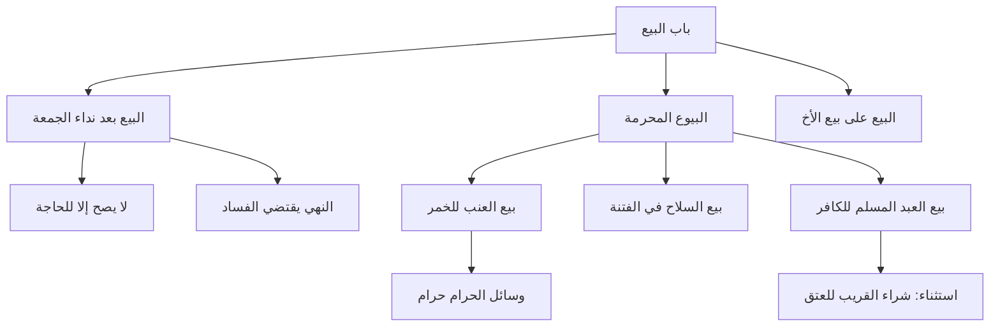

# 00 - الفهرس والخطة

> [!info] موقع المحاضرة
> هذه المحاضرة الثانية في شرح **باب البيع** من كتاب **أخصر المختصرات** للشيخ العثيمين رحمه الله.

---

## 📋 خطة الأجزاء

| الجزء | العنوان | الأسطر |
|:------:|:--------|:------:|
| 01 | الافتتاحية والتأخير عن الدرس | 1-32 |
| 02 | البيع بعد نداء الجمعة الثاني | 33-58 |
| 03 | بيع العنب للخمر وبيع السلاح في الفتنة | 59-95 |
| 04 | بيع العبد المسلم للكافر | 96-120 |
| 05 | البيع على بيع الأخ والخاتمة | 121-130 |

---

## 🗺️ خريطة المفاهيم

---

## 🔑 المفاهيم الرئيسية

- [[البيع]]
- [[الجمعه]]
- [[النداء الثاني]]
- [[الفتنه]]
- [[الخمر]]
- [[السلاح]]
- [[الرق]]
- [[العبد المسلم]]
- [[الذمي]]
- [[مجلس الخيار]]
- [[النهي يقتضي الفساد]]
- [[وسائل الحرام حرام]]

---

## 📊 الأحكام الفقهية في المحاضرة

| الحكم | التفصيل |
|:------|:--------|
| لا يصح | البيع بعد النداء الثاني إلا للحاجة |
| لا يصح | بيع العنب للخمر |
| لا يصح | بيع السلاح في الفتنة بين المسلمين |
| لا يصح | بيع العبد المسلم للكافر إلا للعتق |
| يحرم | البيع على بيع الأخ |

---

## ⚠️ التحذيرات المهمة

> [!warning] من أخطر الأمور
> إراقة دماء المسلمين من أعظم الكبائر، والمشاركة في بيع السلاح للفتن مشاركة في هذا الإثم.

> [!warning] لا يجوز الفتيا في هذه المرحلة
> الطالب لا يجوز له أن يفتي أو يقضي، بل ينقل ما يعرفه من المذهب فقط.

> [!warning] لا تسأل عن ما لم تُؤمر بالسؤال عنه
> ليس من حقك أن تسأل المشتري ماذا سيفعل بالسلعة، إلا إذا صرح بالقصد المحرم.

---

## 📚 الأدلة الشرعية

| الدليل | النص |
|:-------|:-----|
| آية | {يَا أَيُّهَا الَّذِينَ آمَنُوا إِذَا نُودِيَ لِلصَّلَاةِ مِن يَوْمِ الْجُمُعَةِ فَاسْعَوْا إِلَىٰ ذِكْرِ اللَّهِ وَذَرُوا الْبَيْعَ} |
| آية | {وَلَن يَجْعَلَ اللَّهُ لِلْكَافِرِينَ عَلَى الْمُؤْمِنِينَ سَبِيلًا} |
| حديث | «من عمل عملاً ليس عليه أمرنا فهو رد» |
| حديث | «لا يبع أحدكم على بيع أخيه» |

---

## 🔗 التنقل

- **التالي:** [[01 - الافتتاحية والتأخير عن الدرس]]