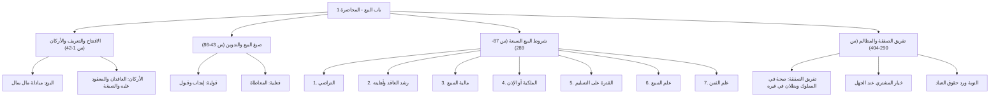

# 00 - الفهرس والخطة

> [!info] موقع المحاضرة
> هذه المحاضرة الأولى في شرح **باب البيع وسائر المعاملات** من كتاب **أخصر المختصرات** للعلامة ابن بلبان الحنبلي رحمه الله.
> تفتتح المحاضرة بوصايا تزكوية في البدايات المحرقة وفقه القلوب، ثم تبين حقيقة **[[البيع]]** لغة واصطلاحاً، وأركانه، وأدلته، وصيغه (القولية والمعاطاة)، وتفصل في **شروط البيع السبعة**، وتختم بمسألة **تفريق الصفقة** والتوبة من المعاملات المحرمة ورد المظالم.

> [!note] المرجع
> المصدر: [[تفريغ المحاضرة 1]] — لا توجد توقيتات زمنية بالدقائق والثواني في المصدر؛ المرجع معتمد بدقة على أرقام الأسطر (1–404).

---

## خطة الأجزاء

| الجزء | العنوان | الأسطر المرجعية | المحتوى الرئيسي |
|:------:|:--------|:---------------:|:----------------|
| **01** | [[01 - الافتتاح وحقيقة البيع وأركانه]] | 1–42 | فقه القلوب والبداية المحرقة، تعريف الكتاب والبيع لغة واصطلاحاً، أركان البيع الثلاثة، وأدلة مشروعيته، وتحرير قيود التعريف |
| **02** | [[02 - صيغ البيع وأدب التدوين]] | 43–86 | الصيغة القولية (الإيجاب والقبول) والصيغة الفعلية (المعاطاة)، وأدب طالب العلم في تقييد العلم بالقلم وخطورة الاتكال على التسجيل |
| **03** | [[03 - شرطا التراضي وجواز تصرف العاقد]] | 87–192 | الشرط الأول: الرضا وحكم الإكراه بحق وبغير حق وشراء سلعة المضطر، الشرط الثاني: جواز تصرف العاقد (حر بالغ عاقل رشيد) وتصرف الصبي والسفيه |
| **04** | [[04 - شروط المبيع والثمن وأثر أكل الحلال]] | 193–289 | الشرط الثالث: كون المبيع مالاً، الشرط الرابع: الملك أو الإذن، الشرط الخامس: القدرة على التسليم، الشرط السادس والسابع: علم المبيع والثمن، وموعظة أكل الحلال |
| **05** | [[05 - تفريق الصفقة ورد المظالم والخاتمة]] | 290–404 | مسألة تفريق الصفقة في صورها الأربع وحكمها وخيار المشتري، التوبة من كسب الحرام ورد مظالم العباد، ووصية التعاطف الأخوي |
| **06** | [[06 - ملخص المراجعة السريعة]] | كامل المحاضرة | بطاقة شاملة، جداول الفروق الجوهرية، والقواعد المركزية والأدلة |
| **07** | [[07 - أسئلة المراجعة والاختبار الذاتي]] | كامل المحاضرة | بنك أسئلة تطبيقي وفقهي للمراجعة والتقييم الذاتي مع إجابات نموذجية مطوية |
| **08** | [[08 - خطة تطبيق الدروس]] | خطة عملية | خطة تنفيذية من 5 مراحل وجداول وبدائل شرعية وقسم حل المشكلات |

---

## خريطة المفاهيم

---

## المفاهيم الرئيسية

- [[البيع]]
- [[المعاملات المالية]]
- [[الإيجاب والقبول]]
- [[المعاطاة]]
- [[التراضي]]
- [[جائز التصرف]]
- [[المال الشرعي]]
- [[بيع ما لا يملك]]
- [[القدرة على التسليم]]
- [[بيع السلم]]
- [[البيع بما ينقطع به السعر]]
- [[تفريق الصفقة]]
- [[رد المظالم]]

---

## جدول الأحكام الفقهية المقررة بالمحاضرة

| المسألة | الحكم الفقهي | العلة / المستند الشرعي |
|:--------|:------------|:-----------------------|
| أصل عقد البيع | جائز ومشروع | الكتاب: «وأحل الله البيع»، والسنة: «البيعان بالخيار»، والإجماع |
| انعقاد البيع بالمعاطاة | صحيح وينعقد به البيع | جريان العرف وتحقق الدلالة على الرضا بالفعل |
| بيع المكره بغير حق | باطل لا يصح | انعدام شرط التراضي لقوله ﷺ: «إنما البيع عن تراض» |
| بيع المكره بحق (المفلس بطلب القاضي) | صحيح ونافذ | قيام ولاية الحاكم لإيصال الحقوق لأربابها |
| شراء سلعة المضطر المستعجل بدون قيمتها | صحيح مع الكراهة | العقد تم برضاه لكن فيه استغلال لحاجة الأخ |
| بيع وشراء الصبي غير المميز | باطل لا يصح قولا واحداً | انعدام التمييز والأهلية |
| تصرف الصبي المميز في المحقرات | صحيح وجائز عرفاً | الإذن العرفي وتيسير المعاملات اليومية اليسيرة |
| بيع ما ليس في ملك العاقد ولا أذن له فيه | فاسد ولا يصح | حديث النبي ﷺ: «لا تبع ما ليس عندك» |
| بيع غير المقدور على تسليمه (سمك في ماء) | باطل ومحرم | اشتماله على الغرر والجهالة العظيمة |
| البيع بما ينقطع به السعر في السوق لاحقاً | لا يصح | جهالة الثمن وقت إبرام العقد |
| تفريق الصفقة (جمع حلال وحرام أو ملك وغيره) | يصح في المملوك بقسطه ويبطل في غيره | تصحيح العقد فيما استوفى شروطه، وثبوت الخيار للمشتري الجاهل |

---

## التنقل السريع

- **التالي:** [[01 - الافتتاح وحقيقة البيع وأركانه]]
- **الملف المجمع:** [[باب_البيع_المحاضرة_1_ملف_مجمع]]
- **المصدر الأصلي:** [[تفريغ المحاضرة 1]]
- **المحاضرة التالية:** [[باب_البيع_المحاضرة_2_ملف_مجمع]]
