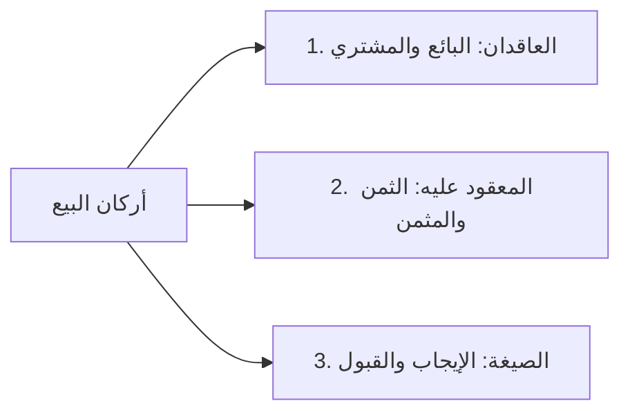

# 01 - الافتتاح وحقيقة البيع وأركانه

> [!info] الفترة المرجعية
> الأسطر: 1–42 من [[تفريغ المحاضرة 1]]

---

## خطة الأجزاء

- **الجزء 01:** الافتتاح وحقيقة البيع وأركانه (الأسطر 1–42) — *[الحالي]*
- **الجزء 02:** صيغ البيع وأدب التدوين (الأسطر 43–86)
- **الجزء 03:** شرطا التراضي وجواز تصرف العاقد (الأسطر 87–192)
- **الجزء 04:** شروط المبيع والثمن وأثر أكل الحلال (الأسطر 193–289)
- **الجزء 05:** تفريق الصفقة ورد المظالم والخاتمة (الأسطر 290–404)

---

## الملخص العلمي المنظم

### افتتاح المجلس والدعاء (س 1–9)
افتتح الشيخ المجلس بالصلاة والسلام على خير خلق الله نبينا محمد ﷺ وبالدعاء:
> ا «اللهم أحيِ قلوبنا، اللهم أصلح قلوبنا، اللهم نوّر قلوبنا، اللهم جدّد الإيمان في قلوبنا، اللهم إنا نعوذ بك أن نشرك بك شيئاً نعلمه ونستغفرك لما لا نعلمه، آمين».

---

### فقه القلوب والبداية المحرقة (س 10–11)
- **القاعدة السلوكية:** ذكر الشيخ كلمة الشيخ محمد حسين يعقوب حفظه الله: «من كانت له بداية محرقة، كانت له نهاية مشرقة»؛ فالانطلاقة الجادة الصادقة في نصرة الدين وطلب العلم تورث الإمامة والربانية والمرافقة للنبيين والصديقين.
- **إصلاح النية وهضم النفس:** حذر الشيخ من آفات العجب ورؤية النفس والجفاء في مخاطبة الإخوان والمشايخ، مؤكداً أن أول ما يتعلمه الفقيه هو **فقه القلوب**؛ بأن يسيء الظن بنفسه ويحسن الظن بغيره، ويتكلم لله ويسكت لله.

---

### مدخل ربع المعاملات (س 11)
- **الأهمية:** تصحيح المعاملات شرط لصحة العبادات وإجابة الدعاء؛ إذ قد يصلي العبد ويصوم ثم يدخل النار أو يُحجب دعاؤه بسبب أكل الحرام ومظالم العباد المالية.
- **المنهجية:** دراسة ربع المعاملات لا تكفي بمجرد السماع؛ بل بقراءة المتن، ومطالعة شروحه، وتكرار المذاكرة واكتساب الملكة الفقهية.

---

### تعريف الكتاب والبيع لغة واصطلاحاً (س 11–20)

| المصطلح | المعنى اللغوي | المعنى الاصطلاحي الفقهي |
|:--------|:--------------|:------------------------|
| الكِتَاب | مصدر كَتَبَ يكتب كتاباً، ومادته تدل على **الجمع والضم**، وهو بمعنى «مكتوب». | جَمْعُ مسائل فقهية مخصوصة وضَمُّها في موضع واحد (كتاب البيع وسائر المعاملات). |
| البَيْع | مأخوذ من **البَاع**؛ لأن كل واحد من المتبايعين يمد باعه ليصافح صاحبه عند إتمام العقد (الصفقة). | **«مبادلة مال ولو في الذمة، أو منفعة مباحة مطلقاً بمثل أحدهما على التأبيد، غير ربا وقرض»**. |

---

### أركان البيع الثلاثة (س 11–15)

1. **العاقدان:** البائع والمشتري.
2. **المعقود عليه:** الثمن (العوض) والمثمن (السلعة المبيعة).
3. **الصيغة:** الإيجاب الصادر من البائع، والقبول الصادر من المشتري.

---

### أدلة مشروعية البيع (س 16–19)
- **من الكتاب:** قوله تعالى: ﴿وَأَحَلَّ اللَّهُ الْبَيْعَ وَحَرَّمَ الرِّبَا﴾.
- **من السنة:** قوله ﷺ: «الْبَيِّعَانِ بِالْخِيَارِ مَا لَمْ يَتَفَرَّقَا»، ومباشرته ﷺ للبيع والشراء هو وأصحابه.
- **من الإجماع:** إجماع الأمة القطعي على جواز البيع والتعامل به بلا نكير.

---

### قيود التعريف وشرح محترزاته (س 20–34)

| القيد في التعريف | محترز القيد وفائدته | المثال التوضيحي من الدرس |
|:----------------|:--------------------|:-------------------------|
| **مبادلة مال** | المال شرعاً هو: كل ما فيه منفعة مباحة لغير حاجة، وليس مقصوراً على النقدين (الذهب والفضة). | الأراضي، الثمار، السيارات، الأثاث. |
| **ولو في الذمة** | يصح أن يكون الثمن أو المثمن مؤجلاً في الذمة غير حاضر بالمجلس. | الشراء بـ 100 ألف جنيه مؤجلة إلى أجل معلوم. |
| **أو منفعة مباحة** | شمول المعاوضة على المنافع المستقرة الدائمة. | شراء حق المرور في ممر دار، أو شراء رصيد الاتصالات. |
| **على التأبيد** | احتراز من **[[الإجارة]]**؛ فإن الإجارة تمليك للمنفعة مؤقتاً لا على التأبيد. | استئجار دار شهراً أو سنة لا يسمى بيعاً. |
| **غير ربا** | احتراز من مبادلة الأموال الربوية المحرمة؛ فإنها وإن كانت مبادلة مال بمال لكنها منهي عنها باسم خاص. | مبادلة درهم بدرهمين، أو بيع جنس ربوي بزيادة. |
| **غير قرض** | احتراز من **[[القرض]]**؛ لأن القرض عقد إرفاق وإحسان وتبرع ابتداءً وليس معاوضة ربحية. | إقراض 10 آلاف جنيه لرد مثلها بلا منفعة. |

---

## نص المتحدث الكامل

> **[افتتاح المجلس والوصية بالبدايات المحرقة وفقه القلوب]:**
> نبينا وحبيبنا محمد وعلى اله وصحبه ومن والاه، **اللهم احي قلوبنا**، اللهم اصلح قلوبنا، امين، اللهم نور قلوبنا، اللهم جدد الايمان في قلوبنا، امين، **اللهم انا نعوذ بك ان نشرك بك شيئا نعلمه ونستغفرك لما لا نعلمه**، امين.
> والدنا الشيخ يعقوب ربنا يحفظه ويحسن ختامنا وختامه قال ان اهل السلوك وعلماء القلوب والتربيه عندهم قاعده وهي: **ان من كانت له بدايه محرقه كانت له نهايه مشرقه**، يعني اذا بدايه كده يعني بدايه رجاله، بدايه ناس بتبيع نفسها الى الله عز وجل، بدايه ناس عايزه تنصر دين الله تبارك وتعالى لا تؤثر الدنيا على الاخره، عاقبه ذلك نهايه مشرقه.
> الاشراق والنهايه المشرقه في الدنيا: تبقى من العلماء الربانيين وتبقى من القاده والائمه اللي ربنا يستعملهم في طاعته فتحشر مع النبيين والصديقين والشهداء والصالحين، وفي الاخره ترفع الدرجات فينار لك الطريق وتمر على الصراط مع من يمر كالبرق او الريح او الجواد.
> لكن من يبدا وجاي يجرب، او اللي بيجي جاي كل ثلاث اربع اشهر جاي يحضر محاضره، او اللي مجرد بس ايه شاف حاجه جديده ده في الازهريه ما شاء الله عليها انا هاجي احضر الازهريه ده مش عارف احنا ممكن ناخد ايه ده احنا ناخد فقه بالطريقه الفلانيه، فيجي يجرب مره وبتاع وبعد كده عامل ايه؟ يتساقط، هذا لم يبدأ بدايه محرقه، انما بدا لنفسه بدا اتباع لشهوته ولهدفه ولغرضه.
> ولذلك لابد اول شيء انك **تحرر نيتك**، الكلام مكرر لكن المكرر ان لم يعمل ولا يؤثر في القلب يبقى انت لم تستفد من ذلك الكثير. ولذلك يجي اخ بعض الاخوه بعت رساله كده امبارح على الواتس الكلمه دي يعني فيها كده رائحه رؤيه النفس وفيها شيء من العجب وفيها ايضا من الجراه وهذا ما ينبغي اصلا، اصل المدرسه الربانيه انك **تهضم نفسك وانك لا ترى نفسك**، وانك اذا رايت شيء حتى اذا اردت ان تعرضه انك تعرض هذا بادب وانه يكون بينك وبين اخيك الكبير، لكن انت تاتي وتتكلم وكانك يعني القيم على الشباب والاخوه ده ده شيء في علامه علامه على مرض في القلب هذا ما ينبغي ابدا.
> ولذلك اول شيء تتعلمه في الفقه هي **فقه القلوب**، انك تنظر الكلمه التي تتكلمها تتكلمها لله ام لغير الله، وانت تجلس وتسكت وتتحرك لله ولا لغير الله، عشان كده اول شيء انك تسيء الظن بنفسك وتحسن الظن بغيرك، اول شيء انك لما تيجي تحب تذكر رايا تقوله وانت منكسر لا بهذه الطريقه التي فيها رؤيه للنفس وهذا امر خطير خلي بالك منه.

> **[أهمية ربع المعاملات ومنهجية دراسته]:**
> هنبدا العام دوت بربع المعاملات، المفروض السنه دي نخلص ربع المعاملات، بس نخلص ربع المعاملات واحنا بنتقنه واحنا فاهمينه، وده لا يكفي فقط انك تجلس في الدرس تسمع من الاستاذ وتروح، لا ده محتاج انك تقرا المتن، تروح تقرا شرح له، تسمع كلام المعلم وهو بيشرح، وبعد كده نيجي لو في اشكاليه في مساله غامضه نبدا نبينها.
> قال المصنف رحمه الله: طبعا السؤال يكون على قدر ما ناخذه في الدرس، اذا كانت في مساله مشكله يبقى اخر الدرس ان شاء الله تبارك وتعالى.
> **كتاب البيع وسائر المعاملات**: في هذا الربع سيتكلم عن البيع وسائر المعاملات، المعاملات بتشمل البيوع، الاجاره، الشركه، الصرف، الهبه، نتكلم فيه على المزارعه والمساقاه، الوكاله، نتكلم فيه عن بيع الاصول والثمار، كل المعاملات التي نحتاج اليها، ونحن نحتاج ان نتقن هذا لان قد ياتي الواحد يعبد الله عز وجل يصلي ويصوم ولكن لا يراعي محارم الله عز وجل، ياكل الحرام وهو لا يدري او لا يبالي الحرام ام لا بل قد يظلم غيره.

> **[معنى كتاب والبيع لغة واصطلاحاً]:**
> عشان كده بنقول **كتاب البيع**، كتاب يعني ايه؟ كتب يكتب كتابا، فالكتاب ده مصدر كتب، والكتب والكتاب ماخوذ من **الجمع والضم**، فهو كانه سيقول لك: ساجمع لك واضم لك مسائل المعاملات في هذا المكان والموضع، وكتاب مصدر بمعنى مفعول اي هذا مكتوب في مسائل البيع وسائر المعاملات، فهو كانه يقول لك ايها الطالب اذا اردت ان تعرف مسائل المعاملات من البيع والاجاره وغيرها فقد جمعت لك هذا في هذا الموضع في كتاب ماذا؟ البيع.
> **كتاب البيع، والبيع ماخوذ من الباع**؛ لان كل واحد من المتبايعين يمد باعه ليصافح صاحبه عند تمام البيع ولذلك سمي البيع بالصفقه، ولذلك وكانه يقول: كتاب البيع الكتاب الذي تعلم فيه العقود التي لها علامه كثيره وتوجد كثيره وهو عند الاتمام تمد باعك لتصافح اخاك لاتمام الصفقه والعقد، كتاب البيع وسائر المعاملات، وكثير من الناس فاكر ان المعاملات فقط البيع والشراء، المعاملات اعم من هذا كما سنعرفه ان شاء الله تبارك وتعالى.

> **[أركان البيع الثلاثة وأدلة مشروعيته]:**
> طب والبيع هذا له كم ركن؟ **له ثلاثه اركان: المتعاقدان، والمعقود عليه، والصيغه**.
> كم ركن هذه؟ ثلاثه:
> 1. العاقدان: البائع والمشتري.
> 2. المعقود عليه: الثمن والمثمن، انا جاي اشتري منك بدفع ثمن وبشتري منك مثمن مبيع ودول برضه بينقسموا الى قسمين.
> 3. والصيغه: ودي بتتكون من الايجاب والقبول، والايجاب هو الصادر من البائع والقبول الصادر من المشتري، واضح يا مشايخ؟
> والبيع هذا جائز بالكتاب والسنه والاجماع:
> - اما الكتاب فقال الله عز وجل: **واحل الله البيع وحرم الربا**.
> - والنبي صلى الله عليه واله وسلم قال: **البيعان بالخيار**. وباع النبي صلى الله عليه واله وسلم والصحابه وهذا يعني معمول به بلا نكير بين احد من المسلمين، وانعقد الاجماع على جواز البيع بين المسلمين وغيرهم واضح مشايخ؟

> **[تحرير قيود تعريف البيع والمنافع والتأبيد]:**
> البيع ما معناه شرعا؟ **مبادله مال ولو في الذمه او منفعه مباحه مطلقا بلا تخصيص اباحته بحال دون حال، بمثل احدهما على التابيد غير ربا وقرض**.
> معنى البيع شرعا: اول حاجه **مبادله مال**، ما هو المال؟ الفلوس؟ ده غلط، المال: **كل ما فيه منفعه مباحه**، المال ده قد يكون ثمار، حبوب، قد يكون اساس، اي شيء له قيمه، انا جاي اشتري منك عربيه وهدفع مكانها مال: حته ارض، حته الارض ديت اللي انا اشتريت بها العربيه منك مال ولا ليس بمال؟ مال، يعني ليس المال هو الثمن الذهب والفضه اللي هو الجنيه والريال، لا، المال اعم من هذا خلاص؟ مبادله مال.
> قال لي: هو لازم بقى في البيع ان المال ده ادفعه كده كاش اني عاجل؟ قال: لا، **ولو في الذمه**، انا ممكن اجي اشتري منك عربيه وهدفع عليا 100000 جنيه في ذمتي هدفعهم ان شاء الله اول السنه ما جراش حاجه خلاص.
> او ان انا ممكن اشتري **منفعه مباحه**، بس تكون المنفعه دي مباحه خلاص سواء في المال او المنافع، لكن طب ايه المنافع اللي ممكن تتباع؟ لما تروح تلاقي حته حاره كده موجوده وفي ممر في بيت تعدي منه للناحيه الثانيه، انا ممكن اجي اشتري الممر ده منك اقول لك: ان انا جاي اشتري منفعه ان انا امر من هذا المكان، وده بقى ممكن ان احنا ننظر في مسأله **منفعه الرصيد** اللي على التليفون، فانا بشتري منك رصيد ده بيع وشراء، فانا بشتري منفعه ولا بشتري ثمن؟ بشتري منفعه.
> قال لي: كممر في دار، عرفنا يعني ايه كممر في دار؟ برضه لازم نعرف ان العلم زي ما قلنا وهنكرر وهنقول كتير انك تفهم المعلومات وازاي تعرف تقرا الكتاب وازاي تكتسب الملكه.
> قال لي: **بمثل احدهما**، يبقى مال بمال، او منفعه بمنفعه، او مال بمنفعه، او منفعه بمال، ولذلك انا ممكن اشتري الرصيد برصيد، ان انا ابيع مال بمال، ان انا ابيع ذهب بذهب، فضه بفضه، ارض بفلوس، بسياره ببيت، بشقه بثياب باي شيء له قيمه.
> البيع لابد ان يكون **على التابيد**، لكن اجي ابيع شيء لمده شهر اثنين ما يبقاش بيع ده بقى ايه؟ **اجاره**، الاجاره هي اللي مؤقته.
> قال لي: **غير ربا وقرض**، الربا انت جيت قلت له انا مزنوق في قرش محتاج 10000 جنيه سلف قلت له حاضر رحت اقرضته كام؟ 10000 جنيه، هو انت مش لما اخدت الـ 10000 جنيه دول انت امتلكتهم؟ اه، بس هو ده بيع؟ لا، طب ليه مش بيع؟ لان ده عقد فيه ارفاق فيه احسان مش مقابله انك تكسب مني خلاص.
> طب والربا؟ الربا لا، ده الربا وان كان بيع مال بمال بس ده بيع محرم ولا يدخل تحت البيع المشروع بل له اسم خاص وهو الربا، لذلك قال الله عز وجل: **واحل الله البيع وحرم الربا** فجعل الربا ليس بيعا مشروعا واضح مشايخ؟
> هو ينفع حد يشتري كلب مثلا؟ لما ياتي في وقته... الان لسه بس بعرف لك ما معنى البيع، المسائل دي جايه وان كان عند الحنابله لا يجوز ان انا ابيع كلب ولا ان انا اشتري كلب والكلام سيكون في المباحات كالحر كده سياتي في مكانه ماشي؟ لكن العلم برضه تاخذ المساله مساله مساله.

---

## إحصاء الجزء

- **إجمالي عدد الأجزاء:** 5 أجزاء دراسية
- **الجزء الحالي:** 1
- **عدد الأجزاء المتبقية:** 4 أجزاء

---

## التنقل

- **السابق:** [[00 - الفهرس والخطة]]
- **التالي:** [[02 - صيغ البيع وأدب التدوين]]
- **الملف المجمع:** [[باب_البيع_المحاضرة_1_ملف_مجمع]]
