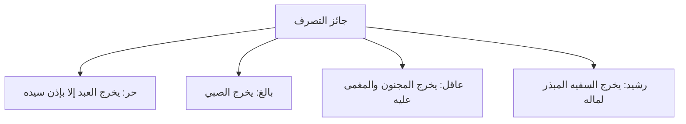

# 03 - شرطا التراضي وجواز تصرف العاقد

> [!info] الفترة المرجعية
> الأسطر: 87–192 من [[تفريغ المحاضرة 1]]

---

## خطة الأجزاء

- **الجزء 01:** الافتتاح وحقيقة البيع وأركانه (الأسطر 1–42)
- **الجزء 02:** صيغ البيع وأدب التدوين (الأسطر 43–86)
- **الجزء 03:** شرطا التراضي وجواز تصرف العاقد (الأسطر 87–192) — *[الحالي]*
- **الجزء 04:** شروط المبيع والثمن وأثر أكل الحلال (الأسطر 193–289)
- **الجزء 05:** تفريق الصفقة ورد المظالم والخاتمة (الأسطر 290–404)

---

## الملخص العلمي المنظم

### ضابط الشرط
> ا الشرط شرعاً: هو ما يلزم من عدمه العدم، ولا يلزم من وجوده وجود ولا عدم لذاته.
> وشروط البيع عند الحنابلة **سبعة شروط**؛ إذا انعدم شرط منها بطل العقد أو فسد.

---

### الشرط الأول: الرضا من المتعاقدين (س 105–150)
- **المستند الشرعي:** قوله تعالى: ﴿إِلَّا أَن تَكُونَ تِجَارَةً عَن تَرَاضٍ مِّنكُمْ﴾، وقوله ﷺ: «إِنَّمَا الْبَيْعُ عَنْ تَرَاضٍ».
- **حقيقة التراضي:** صدور العقد بالإرادة الحرة والاختيار التام؛ ولا ينافي الرضا وقوع البيع بداعي الحاجة أو ضيق الحال أو اقتسام الميراث.

| حالة التعاقد | الحكم الفقهي | العلة والبيان |
|:-------------|:------------|:--------------|
| **الإكراه بغير حق** (كالتهديد بالسلاح على البيع) | باطل لا يصح | انعدام الإرادة الحرة والاختيار، ولو دفع له الثمن كاملاً. |
| **الإكراه بحق** (كإلزام القاضي للمفلس ببيع ماله لقضاء دينه) | صحيح ونافذ | قيام ولاية الشرع لإيصال الحقوق لأصحابها وسداد الديون. |
| **شراء سلعة المضطر المستعجل بأقل من قيمتها** | صحيح مع الكراهة | العقد صحيح لصدوره عن إرادة واختيار، لكنه **مكروه شرعاً** لاستغلال ضائقة المسلم، والمطلوب إعانته أو الشراء بالمعروف. |

---

### الشرط الثاني: كون العاقد جائز التصرف (س 153–192)

- **ضابط جائز التصرف:** أن يكون العاقد (بائعاً أو مشترياً): حراً، بالغاً، عاقلاً، رشيداً.

| الصنف | الحكم الفقهي لتصرفه في البيع والشراء | التفصيل والاستثناء |
|:------|:-------------------------------------|:-------------------|
| **العبد المملوك** | لا يصح تصرفه استقلالاً | يصح إذا أذن له سيده في التجارة والبيع. |
| **الصبي غير المميز** (دون سن السابعة) | باطل لا يصح قولاً واحداً | لانعدام التمييز والأهلية الشرعية. |
| **الصبي المميز** (فوق السابعة إلى البلوغ) | الأصل المنع وتوقف العقد على إذن الولي | **يستثنى المحقرات واليسير عرفاً:** كشراء الحلوى، والخبز، وساندوتش بـ 50 جنيهاً فيصح. أما الأشياء الثمينة (هاتف، دراجة، سيارة) فلا يصح قطعاً. |
| **السفيه (غير الرشيد)** | لا يصح تصرفه المالي | هو من لا يحسن التصرف ويبذر أمواله، فيُحجر عليه حفظاً لماله ومصالح ورثته. |

---

## نص المتحدث الكامل

> **[الشرط الأول: الرضا وحقيقة التراضي]:**
> قال: بسبعه شروط، اول شيء: **الرضا**، اول شيء ايه؟ الرضا: **يا ايها الذين امنوا لا تاكلوا اموالكم بينكم بالباطل الا ان تكون تجاره عن تراض منكم**، وقال النبي صلى الله عليه واله وسلم: **انما البيع عن تراض**.
> بس خلي بالك، التراضي هنا مش معناه ان انت بتحب انك تبيع وتشتري، لا، التراضي هنا انك **ما تبقاش مكره**، انك ما تكونش بمكره.
> لكن والله ده انا عندي كتاب اخصر المختصرات غال عليا قوي بس مزنوق في قرشين فقلت ابيعه رحت بايعه، وربنا يسر بعد يومين ثلاثه جبت الفلوس: خد الفلوس بتاعتك اديني الكتاب، ليه؟ اصل انا بعت وانا مكره! لا انت مش مكره، اصل انا ما كنتش راضي! لا انت كنت راضي، راضي هنا معناه ايه؟ **انك بعت هذا بارادتك**، بعت هذا بارادتك.
> لكن انا مزنوق، والله ده جه واحد عرض عليا قرشين زغللوا في عينيا رحت بايع، ده انا كانت عندي مثلا شقه بتاعه ابويا غاليه عليا وبعدين اخويا جه اضطرينا ان احنا نبيعها عشان نقسم الميراث، كل ده ما هواش اسمه مكره، لا انت راضي انت راضي، ليس الرضا معناه انك حابب هذا لكن انك ما تكونش مكره، الرضا منهما نعم.

> **[الإكراه بغير حق والإكراه بحق ومسألة المستعجل المضطر]:**
> فلا يصح من مكره الا اذا كان الاكراه بحق، اما اذا كان الاكراه بغير حق فلا يصح.
> جيت انا رحت جاي كده ماسك عم الشيخ ربيع رحت رافع الطبنجة عليه: بيع لي الكتاب دوت، بيع لي حته الارض ديت، ورحت ضارب طلقه جنب ودنه، فقال لي حاضر، راح ماضي وكمان اديته الفلوس مش ان انا مضيته ببلاش، لا ده حته الارض كلها بـ 800 الف انا اديته 850 الف ومع ذلك لا يصح العقد ده لانه مكره، لازم يبيع بارادته.
> **الا اذا كان الاكراه بحق**: واحد دلوقتي مديون، واحد مفلس، فجه القاضي راح حكم عليه حكم بالحجر ويبيع الاملاك بتاعته في المزاد لان هو مش راضي يسدد اللي عليه، العقد ده لما باع املاكه ده كان بكره ولا بارادته؟ بكره، طب ده بحق ولا بباطل؟ بحق، يبقى العقد ده صحيح. جيت انا لي عندك 100000 جنيه وانت عندك عربيه ومش راضي تدي الفلوس بتاعتي، راح ابوك جه وحكم عليك: لا هتبيع العربيه ديت ونسدد اللي عليك وبعناها خلاص، ليه؟ لان بعت هذا لسداد ما عليك فهذا بحق.
> في بقى مسألة: ساعات تلاقيني مزنوق وبتاع وهتحبس، فانت هشتري منك العربيه ديت، انت هتتحبس اشتريها منك وخلاص بكام؟ بـ 35000، يخرب بيتك ده بـ 100 اصلا! قال له والله انا عشان خاطرك اشتريها بـ 50 فالراجل راح بايع، البيع ده صحيح؟ اول شيء هو باع بارادته ولا بكره؟ بارادته، لكن لما وجد منه هذا الشيء **البعض قال ان البيع ده مكروه ولكنه صحيح**، مكروه ليه؟ لانك استغليت حاجه اخيك، فما دام انك فيك عقل وما حدش ضحك عليك وما حدش لوى دراعك العقد صحيح، لكن الاخلاق الاسلاميه تقول لي لا، اما تلاقي اخاك في كده اما انك تقف بجواره او على الاقل لما تشتري منه تشتري منه بالمعقول.

> **[الشرط الثاني: أن يكون العاقد جائز التصرف]:**
> الشرط الثاني: **وكون عاقد جائز التصرف**، الشرط الثاني ان يكون البائع والمشتري كل منهما جائز التصرف، يعني ايه جائز التصرف؟ **ان يكون حرا بالغا عاقلا رشيدا**.
> - **حر**: العبد اصلا ما ينفعش يبيع ويشتري الا باذن سيده لان ده لا يملك شيئا خلاص. طب هو احنا عندنا عبيد؟ لا ما عندناش، طب احنا بنجيب الكلام ده ليه؟ عشان تفهم الفقه لما تقرا الكتب تعرف، ومش بنقول كده عشان احنا بنطلب ان احنا نعيد العبيد ثاني لا، الاسلام طلب بتحرير العبيد، لكن عشان لما تقرا الكتب تفهم.
> - **بالغ**: يبقى الصبي لا يصح عقده، تخيل بقى كده جبت عيل ثمان سنين قلت له تعالى تبيع لي نصيبك من الميراث بتاع ابيك ورحت مشتري منه البيت والدكان ومش هقول لك انك بخسته لا اديته كمان الثمن، ما ينفعش ليه؟ لان هو لما يعقل ويبقى يعرف مصلحته عايز يبيع يبيع مش عايز يبيع ما يبيعش.
> غير المميز قولا واحدا لا يصح بيعه، عيل عنده ثلاث اربع سنين ما يصحش اصلا بيعه.
> - **عاقل رشيد**: رشيد يعني ايه؟ يعني يحسن التصرف، لا يحسن التصرف يبقى سفيه ما يعرفش يبيع ويشتري كده، ممكن يجي معاه 1000 جنيه في جيبه يقول خد هات بس الدنيا وخلاص، عايز يروح يشتري مكنه بكام يا ابني يقول له بـ 50 خد من غير ما يفاصل، ده ما ينفعش يبيع ويشتري واضح؟
> طب لو هو مميز مثلا ابوه بعته يشتري حاجه؟ في الاشياء اليسيره: اذا كان العرف يجيز هذا كثير من الفقهاء اجازوه اذا كان العرف يجيزه، لكن الواد اللي جه عنده سبع سنين جاي يشتري مني ايفون وبعد ما خد البتاع راح كسره، ده عيل صغير ازاي تبيع للعيل الصغير التليفون بهذه الطريقه؟ لكن جاي يشتري ساندوتش، جاي يشتري حاجه بـ 50 جنيه ده العرف بيجيزها ماشي خلاص يا مشايخ؟

---

## إحصاء الجزء

- **إجمالي عدد الأجزاء:** 5 أجزاء دراسية
- **الجزء الحالي:** 3
- **عدد الأجزاء المتبقية:** جزآن (2)

---

## التنقل

- **السابق:** [[02 - صيغ البيع وأدب التدوين]]
- **التالي:** [[04 - شروط المبيع والثمن وأثر أكل الحلال]]
- **الملف المجمع:** [[باب_البيع_المحاضرة_1_ملف_مجمع]]
