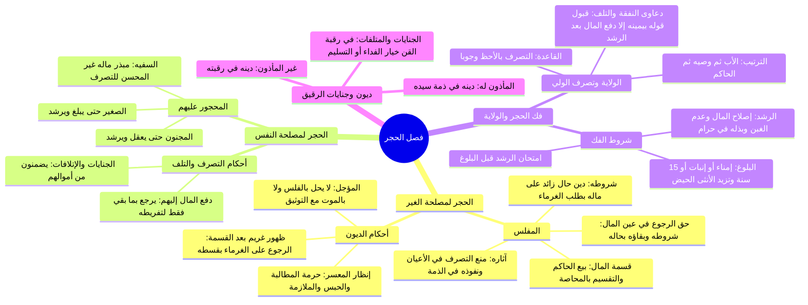

# 00 - الفهرس والخطة: المحاضرة 11 من كتاب أخصر المختصرات (فصل الحجر)

> [!info] بيانات المحاضرة
> - **الكتاب:** [[أخصر المختصرات]] في الفقه على مذهب الإمام أحمد بن حنبل للعلامة [[ابن بلبان الحنبلي]].
> - **الباب والموضوع:** ختام مسائل الشفعة والاشتراك في النهر والبئر، ثم الشروع الكامل في **فصل الحجر**:
>   1. الحجر على المفلس لمصلحة الغرماء، شروطه، سن إظهاره، أحكام تصرفاته وإقراره، وحكم استرداد عين المال.
>   2. قسمة مال المفلس بالمحاصة، إنظار المعسر وحرمة مطالبته وحبسه وملازمته، وعدم حلول الدين المؤجل بالفلس أو الموت (مع التوثيق)، وحكم ظهور غريم بعد القسمة.
>   3. الحجر لمصلحة المحجور عليه (الصغير والمجنون والسفيه)، تعريف السفه وضابطه، حكم دفع المال إليهم وتلفه، وضمان جناياتهم وإتلافاتهم.
>   4. فك الحجر بالبلوغ والرشد، علامات البلوغ في الذكر والأنثى، اختبار الرشد، ترتيب الأولياء وتصرفهم بالأحظ، قبول قول الولي بعد فك الحجر، وأحكام ديون وجنايات الرقيق.
> - **المصدر المعتمد:** [[تفريغ المحاضرة 11]] — لا توجد توقيتات زمنية مسجلة بالتفريغ، المرجع المعتمد هو أرقام الأسطر (1 – 218).

---

## 📋 خطة الأجزاء وتوزيع الأسطر

| رقم الجزء | عنوان الجزء | نطاق الأسطر بالتفريغ | المحاور والمسائل الأساسية |
|:---:|:---|:---:|:---|
| **01** | [[01 - الحجر على المفلس لمصلحة الغرماء وحكم تصرفاته]] | 1 – 47 | ختام عمارة النهر والبئر المشترك، شروط الحجر على المفلس (حالاً بطلب الغرماء)، سن إظهار الحجر وسنده المقاصدي، بطلان تصرفه في أعيان ماله ونفوذه في ذمته، استرداد البائع لعين ماله بشروطه، وقسمة المال بالمحاصة. |
| **02** | [[02 - إنظار المعسر وحكم الديون المؤجلة وظهور غريم بعد القسمة]] | 48 – 95 | وجوب إنظار المعسر وحرمة مطالبته وحبسه وملازمته، الفارق بين الدين ومنافع الأعيان المستأجرة، الدين المؤجل لا يحل بالفلس ولا بالموت إذا وثق الورثة، ظهور غريم بعد القسمة ورجوعه على الغرماء بقسطه. |
| **03** | [[03 - الحجر لمصلحة النفس على الصغير والمجنون والسفيه وضمان الجنايات]] | 96 – 138 | الحجر لمصلحة النفس (الصغير، المجنون، السفيه)، تعريف السفيه وضابطه والفارق بينه وبين المقامر والعاصي، حكم دفع المال إليهم وتلفه مع تفريط الدافع، وضمانهم للجنايات والمتلفات التي لم تُدفع إليهم من أموالهم. |
| **04** | [[04 - فك الحجر بالبلوغ والرشد وتصرف الولي بالأحظ ودين الرقيق]] | 139 – 218 | انفكاك الحجر بالبلوغ والرشد بلا حكم، علامات البلوغ للذكر والأنثى، اختبار الرشد ومحله، ترتيب الأولياء وتصرفهم بالأحظ، قبول قول الولي بيمينه والاستثناءات، وتعلق ديون وجنايات وإتلافات الرقيق (بين ذمة السيد ورقبة العبد). |
| **05** | [[05 - خطة تطبيق الدروس]] | ملحق تطبيقي | خطوات تنفيذية عملية بمربعات اختيار للمسائل والمعاملات المالية المعاصرة المستفادة من المحاضرة. |
| **—** | [[ملخص المراجعة السريعة]] | مراجعة شاملة | جداول مقارنة وقواعد وضوابط فقهية مركزة لاستذكار الباب كاملاً في دقائق. |
| **—** | [[أسئلة المراجعة والاختبار الذاتي]] | تقييم الفهم | بنك أسئلة موضوعية (MCQ وصح/خطأ) ومسائل فقهية تطبيقية مع حلول نموذجية مطوية. |
| **—** | [[باب_البيع_المحاضرة_11_ملف_مجمع]] | ملف شامل | الجمع الكامل لنصوص المتحدث الحرفية لجميع الأجزاء مع الشرح المنظم وخالياً من الاختبارات والمراجعة. |

---

## 🗺️ خريطة المفاهيم العامة للمحاضرة

---

## 🔑 المفاهيم والكلمات المفتاحية (WikiLinks)

- [[الحجر]]
- [[المفلس]]
- [[الغرماء]]
- [[عين المال]]
- [[المحاصة]]
- [[إنظار المعسر]]
- [[السفيه]]
- [[البلوغ]]
- [[الرشد]]
- [[امتحان الرشد]]
- [[الولاية على المال]]
- [[التصرف بالأحظ]]
- [[أرش الجناية]]
- [[العبد المأذون]]
