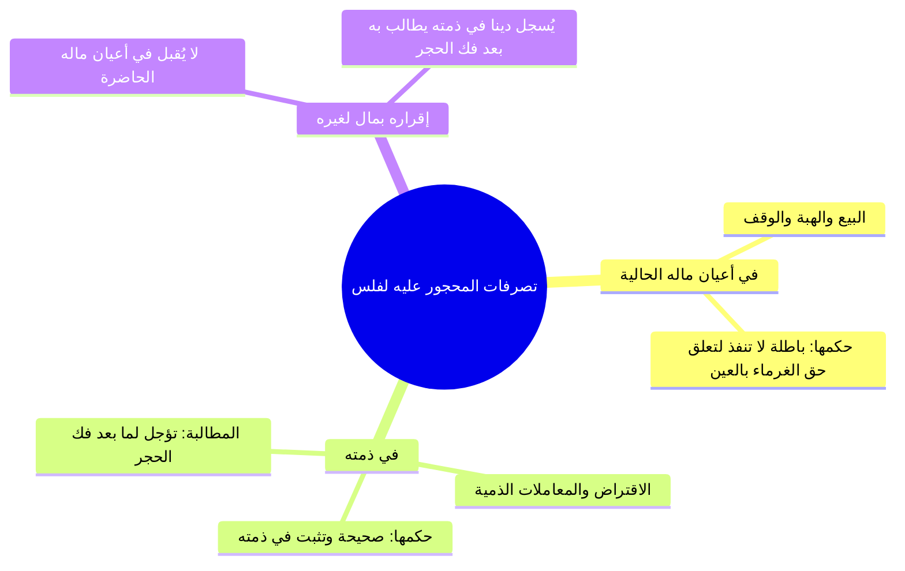

# 01 - الحجر على المفلس لمصلحة الغرماء وحكم تصرفاته (الأسطر 1 – 47)

> [!abstract] محاور الجزء
> - **خاتمة عمارة الأملاك المشتركة:** نفقة تطهير وإصلاح النهر والترعة والبئر المشترك وتوزيعها بحسب الحصص.
> - **ضابط الحجر على [[المفلس]]:** أن يكون ماله لا يفي بما عليه حالاً، ويكون بطلب من بعض الغرماء.
> - **سنّ إظهار الحجر:** استحبابه حمايةً للمتعاملين وصيانةً لأموال الناس عن الضياع.
> - **أثر الحجر في تصرفات وإقرارات المفلس:** بطلان تصرفه في أعيان ماله، ونفوذه وإقراره في ذمته مؤجلاً لما بعد فك الحجر.
> - **استرداد عين المال:** شروط رجوع الدائن في عين ماله إذا وجدها قائمة بعينها ولم تتغير ولم يسبق علمه بالحجر.
> - **قسمة مال المفلس:** بيع الحاكم لماله وقسمته على الدائنين بالمحاصة بحسب نسبة ديونهم.

---

### 1. ختام المسائل المشتركة وضابط الحجر على المفلس

- ا قاعدة الأملاك المشتركة: نفقة إصلاح وتطهير وتعمير الأنهار والآبار والترع المشتركة تكون على جميع الشركاء بقدر حصصهم وأراضيهم.
- ا تعريف الحجر: منع صاحب المال من التصرف في ماله، ويكون إما لمصلحة المحجور عليه نفسه، أو لمصلحة غيره (كالغرماء).

| الحالة | شروط إيقاع الحجر على المدين | الأثر المترتب |
|:---|:---|:---|
| **الحجر للمفلس** | 1. أن يكون دَينه حالاً (لا مؤجلاً). 2. أن يكون ماله قاصراً عن الوفاء بديونه. 3. أن يطلب ذلك بعض الغرماء أو كلهم من القاضي. | يمنعه الحاكم من التصرف في أعيان ماله حمايةً لحقوق الغرماء. |

> ⚠️ ا تنبيه: لا يملك القاضي الحجر على المدين المفلس تلقائياً من تلقاء نفسه، بل يشترط رفع الأمر إليه ومطالبة الغرماء (أو بعضهم) بذلك؛ لأن الحق لهم.

---

### 2. سن إظهار الحجر وأحكام تصرفات وإقرارات المحجور عليه

- ا سند سنّ الإظهار: يُسنّ للحاكم إشهار الحجر وإعلانه بين الناس، ومستنده عموميات الشريعة في تحصيل المصالح وسد أبواب الغرر والضرر.

---

### 3. استرداد عين المال وقسمة التركة بالمحاصة

| المسألة | الحكم الفقهي | الشرط والضابط |
|:---|:---|:---|
| **وجود عين المبيع عند المفلس** | يسترد البائع عين بضاعته ويسقط دينه من التفليسة. | أن تكون السلعة باقية بحالها لم تتغير، وأن يكون البائع جاهلاً بحجر المشتري عند تسليمها. |
| **تغير المبيع أو نقصه أو علم البائع بالحجر** | لا يملك استرداد العين، ويتحول إلى غريم عادي. | يشارك بقية الغرماء بنسبة دينه، وتدخل العين في أموال التفليسة. |
| **قسمة مال المفلس** | يبيع الحاكم ماله ويقسمه على الغرماء بالمحاصة. | قسمة حاصل البيع على مجموع الديون بنسبة مئوية موحدة لكل دائن. |

> ⚠️ ا تنبيه في المحاصة: إذا بيع مال المفلس ولم يفِ بكامل الديون وأخذ كل دائن نصيبه بالمحاصة، فإن الباقي لا يسقط ديانة، بل يثبت ديناً في ذمته حتى يوسع الله عليه ويتمكن من السداد، ولا حرج عليه شرعاً إن لم يكن مفرطاً لقوله ﷺ: «مطل الغني ظلم».

---

## 4️⃣ نص المتحدث الكامل (الأسطر 1 – 47)

> رزعه مفهوم المخالفه وان بناه بغير نيه الرجوع لا يرزع قال لي وكذا ونحو انا دلوقتي عندنا اراضي صداعيه انا عندي 20 30 فدان وانت عندك 20 30 فدان وبعدين في نهر نسق منه فرعيه من النيل او ترعه كبيره وبعدين الترعه دي او الفرعي ده من النيل بيحتاج تنظيف بيحتاج انه يتطهر مثلا في حافه منه بدات تنهدم عايزين نصلحها انا وانت مش احنا شركا في القدر دوت وبنسق ارضنا منها قال لي اه قال علي وعليك احنا في الصحراوي وعاملين استصلاح اراضي وبعدين حفرنا بئر ولو انت شركا في البئر دوت البئر ده في مكن بيسحب الماء فالممكن ده اتعطل يبقى اصلحنا وانت على حسابنا البير ده محتاج يطهر يبقى على حسابي وعلى حسابك البيت ده حصل اي ظرف وبدا ينهدم والميه اللي فيه هتبدا لا يبقى علي وعليكم وكاذا نهر وايه ونحو خلاص يا مشايخ
>
> ثم قال المصنف رحمه الله تعالى **فصل ومن ماله يكفي بما عليه حالا وجب الحجر عليه بطلب بعض غرمائه** صليتوا هنا على النبي، صلى الله عليه وسلم، صلى الله عليه وسلم ده **فصل الحجر** فصل ايه الحجر.
>
> **والحجر اما ان يكون لمصلحه المحذور عليه او لمصلحه الغير** والحجر هناك بتمنع صاحب المال ان يتصرف في ماله اما لمصلحته او لمصلحه الغير، بناء على ايه يا عم الشيخ؟ بناء على ان انا ليه يحقق عليك انا مداينك ب 2 مليون جنيه، يعني هل بيظهر في الشخص اللي احنا هنحمات تدل ان هو مثلا سفين او او لا؟ سياتي حالا سياتي حالا خلاص قال لي ومن ماله ليفي بما عليه اه يبقى انا مديون باثنين لا اربعه 10 مليون جنيه والديون دي حل سدادها وحل قضائها جه النهارده راح جاي الحاج ايمن الحاج ربيع جايبين الورق المستندات عايزين منك 10 مليون جنيه والله انا الفلوس اللي عندي لا تكفي لايه تك فانا كل الليملكه دلوقتي 2 مليون جنيه 5 مليون 7 مليون او ال 10 مليون جنيه السوريا دي ما عنديش لكن انا عندي اصول عندي اراضي عندي بيوت لا معلش احنا محتاجين فلوسنا دلوقتي فانت دلوقتي لك دايم حل سداده وحل وقته وانا ما معيش ان انا اسد الديون ديت فدلوقتي انت ليك حق صح والحق ده المفروض ان انا اديه طب انا ما معيش اديه رحت انت رافع امرك لل القاضي رحت مقدم ورقك ومستنداتك قدام القاضي والله احنا لينا دلوقتي عند سيد الشركه بتاعته 10 مليون جنيه وحل الوقت ولم يسدد القاضي يبعت لي يا سيد الناس دي ليه عندك فلوس اه ليها عندي لا ليها عندي طب اديلهم في اموالهم ما معيش والله يا سيدنا القاضي الحمل معيش اسدد لهم خلاص نعمل ايه **وجب الحشر عليهم يعني يجي القاضي ي يمنعني من التصرف في ماله بس بشرط ان الغرماء يروحوا يطلبوا او بعض الغرا يطلبوا هذا من القاضي** فيجي الحاج الربيع يقدم كده طلب عند القاضي والله انا اطلب الحجر على اموال سيد حتى استرد بالي منه قوم يجي القاضي يروح هاجر عليا حجر عليا دلوقتي لمصلحته ولا مصلحه الغرماء؟ مصلحه الغرماء السلام، وعليكم السلام ورحمه الله وبركاته خلاص كده يا مولانا؟ اه كده جزاك الله خير لكن الابناء احيانا بيحجروا على ابائيه، جاي حالا واحده واحده احنا قلنا ايه نستنى ما نخلص الفصل وبعدين نشوف اللي جاي ما احنا عشان كده قلنا اما ان يكون لمصلحه المحجور عليه او للغيظ هنا بنتكلم على الغيظ واضح.
>
> عليكم السلام ورحمه الله اللي جايين دلوقتي اتاخرتوا سيدنا والله كنت باكل بعد الصلاه، كنت بتاكل بعد الصلاه ليه؟ عشان تاخر ماشي يا عم حرك عل س، ماشي بعدين انا ملاحظ ان الاخوه بيجي متاخر ليه يعني برض يا اخوانا المحاضرتين الولايتين دول ما ينفعش محتاجين ان احنا نبدا نضحي شويه انا حتى حاولت ابعت لكم رساله الكمبيوتر التليفون ض مش عارف في حاجه غلط فيا اليومين دول لكن لازم نضحي شويه يا شباب ولازم ان احنا نعد انفسنا ونرتب امورنا ان احنا نبقى موجودين اليوم كاملا لان برده لما نيجي نلاقي مثلا ده الشيخ طاهر قليل مش عارف ايه برض مش جيد وكمان ده بيعلمك الكسل ماشي.
>
> جه القاضي الحاكم قال يا اخوانا قرار يحجر على اموال سيد حتى ا يعني يقضي ديون الغرماء او حتى نبيع هذه الاموال ونسدد اموال الغرماء الحكم ده والقرار دوت قال لي **وسن اظهاره** يستحب ان احنا نيجي في الطلبيه كده اخوانا سيد حجر عليه ليه عشان ما يجيش واحد يجي يتعامل معاه هو فاكر ان هو لسه معاه الموال وبتاعضيع الحقوق واضح طب وسنه اظهاره ده ده عليه دليل قولا من النبي عليه الصلاه والسلام لا ده ده ببدا تحصين المصالح من عموميات الشريعه خلاص.
>
> طب دلوقتي جه القاضي بعد ما حجر على الارض الاراضي بتاعته البيوت ما انا جيت وحبيت ان انا اهب فدان ولا حاجه لواحد مثلا غلبان او ان انا ابيع مثلا شقه ولا دكان من دكاكين ولا محل من محلاتي قال **لا ينفذ هذا التصرف ولا ينفذ تصرفه في المال بعد الحش** ليه؟ لان هناك من الغرماء او ان الغرماء تعلقت حقوقهم بعين هذه الاموال فلا يجوز لي ان اتصرف فيها لان خلاص انتقل هنا الحق لاخرين حتى ترد عليهم اموالهم واضح يا مشايخ، واضح سي.
>
> قال لي بس ساعات بقى بتحصل ظروف كده هو ماتصرفش ده بعد ما حجر القض عليا جيت قلت على فكره يا فلان على فكره الثلاث اربع فدادين دول اللي في اول البلد دول مش بتوعي ده دول ملك مين؟ ملك الشيخ عبد الرحمن فانا اقريت ان ثلاث فادت دول ملك مين ومش ملكي الاقرار ده يعمل به ولا لا يعمل به قال **ولا اقراره عليه** برض هذا الاقرار لا يع عمل به القاضي ولا يؤثر في حقوق مين الغارمين اما اللي هيبقى فين هيبقى في دمتي هيبقى ايه مش انا اقريت ان في ثلاث فدادين مش بتوعي بتوع الشيخ عبد الرحمن اه عبد الرحمن ممكن يجي يطالبني بالثلاث فدادين دول انا ليا في ذمتك ايه ثلاث فدادين لانه اقر صح ولا ايه؟ اه وكمان لو اتفك الحاجر عنه ممكن عبد الرحمن يجي يطالب بثلاث فدادين دول لانه دلوقتي اقر بحق في ذمته وهل المحجور عليه يجوز له ان يتصرف في ذمته يعني ياخد شيء في ذمته مش متعلق باعيان الاموال بتاعته قال له اه قلت له يعني ايه قال يعني انا ممكن كده اروح امت كده على محمد سعيد اقول له اديني ايه ارنبين سلف اين مليون واخد بالك يقولله خدها صح احنا الناس لبعضها برض روح مديني 2 مليون جنيه اداني 2 مليون جنيه دول دين في ذمتي ولا لا اه ولذلك **بل في ذمته يبقى المحجور عليه للغير يجوز له ان يتصرف في ذمته** خلاص شوف بقى الايه **فيطالب بعد فك حجر** جه بقى القاضي فك الحجر عن الاموال بتاعتي انا اقريت لمحمد سعيد بالثلاث فدادين قال له تعالى يا ريس انا ليه عندك ثلاث فدادين فين انت ياض انت مش جيت واقريت قدام القاضي ان الثلاث فددين دول بتوعي يا ابني ده انا بقول كده عشان خاطر قال هاخد اي حاجه قال لا الكلام ده تقول عند العمر ده ما ينفعش هنا ق ويه قدام القاضي يقول لي سلم لي ثلاث فدادين دول واخد بالك فيطارب بعد فك حجر خلاص.
>
> قال لي انا لما جيت اتحجر عليا انا كنت رحت اشتريت من الشيخ مصطفى جمال عربيه او ثلاجه ايديال في ايديال موجود فيه ايديال مش عارف 18 ايه او 16 خلاص ويا سبحان الله خدت منه الثلاجه دي ولا العربيه بتاعته اللي انا شريتها منه بالدين وهوبا راح القاضي عامل ايه حجر عليا خلاص فدلوقتي جه يا عم مصطفى عرف ان انا اتحجر عليا وان انا اشتري وانا محجور عليا راح جاري على طول داخل جوه لقى نفس الثلاجه بتاعته بعنها موجوده فين؟ في المدخل بتاع البيت لسه مدخلها الصاله بتاعه الشقه حاططها في المخزن بس بعينها ما جرالش اي حاجه خلاص والقادر حاجر على كل اموالي طب دلوقتي مصطفى جمال يعمل ايه؟ قال لي لا ياخدها دي قال **من سلمه عين ماله جاهل الحشاها** طب لو كان مصطفى بعد التثلاجه هو عارف ويعلم ان انا محجور عليا ما ينفعش يجي ياخدها واضح كده يا مشايخ قال لي بس خلي بالك انا لما جيت اشتريت منه العربيه رحت مغير منها الموتور لا ده انا لما اخدت العربيه حصل حاجه اتربقت اتكسرت ابوابها ولا السقف بتاعها اتغير العربيه دلوقتي بحالها ولا ليست بحالها ليستح ليست بحالها طب نعمل يجي دلوقتي عم مصطفى ياخد العربيه بتاعته قال لا كده هيبقى زي الغرماء يبقى سياتي وننظر في دينه اللي هو ثمن السياره ويبقى له نصيب كان نصيب الغرماء كما سنعرف دلوقتي كيف نقسم الاموال على الغرماء الغرماء يعني ايه الديانه الميل الدائنون قال لي طب دلوقتي انا لما اخدت العربيه واتغيرت ولا التثلاجه قاللي تمانها كله يبقى في هو شريت العربيه منه بكام ب 100000 يبقى انا مديون ب 100 لاجه ب 50 يبقى انا مديون ب 50 طب هو لما لقى بقى العربيه بتمامها هياخدها ولا مش هياخدها؟ هياخدها خلاص طب دلوقتي هو لما يجي ياخدها طب ما الديانه طب ما هو لما ياخد العربيه كده مال سيد المحجور عليها هينقص صح ولا لا؟ ما انتم مش واخدين بالكم الحاجه دي هيحصل في ايه انا دلوقتي لما اتحجر على مالي كان مالي ده بمليون جنيه خلاص والغرماء الديانه ليه 2 مليون جنيه وانا كل ما قبلكم هي اعيان بمليون هيجي القاضي يبيع الارض دي بمليون ويقسم المليون على الغرماء على حسب قصهم من الديون طب هو دلوقتي لما يجي ياخد العربيه بتاعته هيحصل ايه؟ هينقص المالعم صح ايوه صح فهنيجي نقول ده قدر ربنا بقى بالنسبه لكم بايه بالنسبه لكم طب لو هو بقى فضل عطلانه او حصل لها عيوب خلاص كده اصبح الماده من ضمن المحجور عليه وهيبقى دلوقتي المليون ال 100000 جنيه بتاعه العربيه كلها في دمتي انا فيجي محمد سعد ولا مصطفى اللي انا شريت منه هيطالب بال 100000 جنيه دول من ضمن الغرماء يا نعم انا جيت انت لقيت العربيه بتاعتك بعينها هتعمل ايه؟ هتاخدها وخلصنا الموضوع لا ده انت جيت لقيت العربيه بتاعتك اتغيرت الثلاجه شلت انا منها البيبان فما بقتش بحالها مش هينفع تاخدها خلاص لان اصل تمنها ناقص واصبحت من ضمن الاموال المحجوره عليها طب هنا دلوقتي لما هو اخدها كده نضاع عليها حاجه قال لي لا وعوضها كله باق انت الدين بتاعك كله علي انا ال 100000 جنيه بتاعه العربيه 50000 بتاع عليا انا خلاص طب انت لو خدت بقى التثلاجه سليمه يجينا يقول لك لا احنا لنا فيها نصيب من الديون بتاعتنا لا واضح كده.
>
> طب يا سيدنا هو انا لما يتحجل عليا القاضي بياخد كل حاجه عندي حتى الشقه كل شيء ولا مثلا على حسب المحك عليه هو حجر على ايه اه اذا حجر على كل شقه ياخد كل الشقه حجر على الاطيان على حسب الاموال اللي هو بيحصرها الخبير ويجي يقول اه ده فلان ده سيد فيمن يعني من تصرفات واضح والتصرفات المقصود بها ان انت لا تنقل ملكتي للغير وهكذا لحد ما نشوف هنسدد ديون الناس دي ازاي طيب دلوقتي حجر عليا ايه اللي هيحصل **ويبيع حاكم ماله ويقسمه على غرمائهم** واضح كده مشايخ دلوقتي انا عندي لاثه ديانه غرمات واحد ليه 50000 واحد ليه 30 واحد ليه 10 يبقى الديون كام؟ 90 خليهم بقى 100 كلهم يعني 50 و30 و20 خلاص يبقى كام؟ 100000 انا لما حجر عليا المال بتاعي بكام؟ ب 50000 طب نعمل ايه هنيجي نقسم الديون دي على ال 50 ال 10 او ال 100000 على ال 50 يبقى فيها الكام النص ولا كام؟ص النص يبقى كل واحد من الديانه هياخد نص الديون بتاعته فاللي 500000 او 50000 ياخد النصف اللي 30 ولا 300 ياخد النصف اللي ليه ال 20 ولا 10 ياخد النصف وهكذا والباقي والباقي يسقط يا شيخنا الايه هم ليهم باقي فلوس بتسقط التون دي ولا خلاص تسقط ما دام اللي ما معهوش اه تمام مادام ما معهوش هيعمل ايه يعني خلاص تفضل تفضل دين عنده بتصب لما ربنا بقى يوسع عليه وبعضهم بيقول تسقط عنهم شرع ولا حنا يعني هو يعني كده بزمته يوم الدين باقي ولا كده ما احنا قلنا الديون اذا لم يتمكن صاحبه من السداد ادى الله عنه امتى ولذلك النبي صلى الله عليه واله وسلم يقول ماذا **مطل الغني ظلم** والله عز وجل قال **وان كان ذو عصره فنظره الى ميصره** ميصره ف ما معوش اصلا طب هو ماش يسدد هيحاسب امام الله على ايه واضح ولذلك من اخذ اموال الناس يريد ادائها ادى الله عنه بس المهم ما يكونش مفرط ولا معتدل.

---

## 5️⃣ إحصاء الجزء والتقدم

- **إجمالي عدد الأجزاء:** 4 أجزاء.
- **الجزء الحالي:** 1 من 4.
- **الأجزاء المتبقية:** 3 أجزاء.
