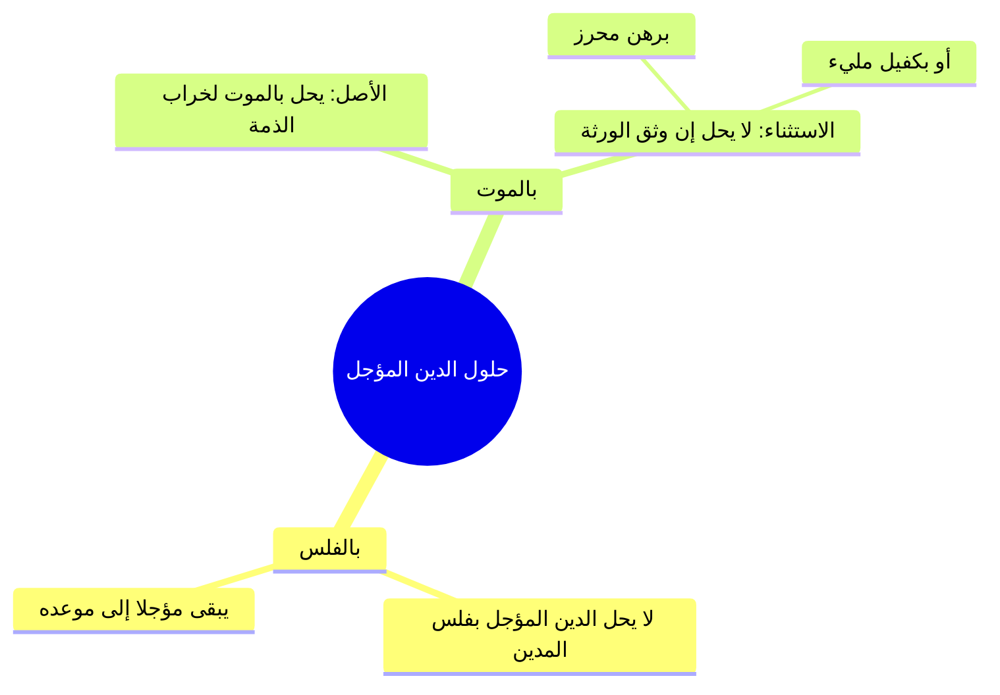

# 02 - إنظار المعسر وحكم الديون المؤجلة وظهور غريم بعد القسمة (الأسطر 48 – 95)

> [!abstract] محاور الجزء
> - **وجوب [[إنظار المعسر]]:** حرمة مطالبته، وحرمة حبسه، وحرمة ملازمته ومضايقته.
> - **الفرق بين الدَّين الثابت ومنفعة العين المؤجرة:** استيفاء دين الإيجار وحق المؤجر في فسخ العقد وطرد المستأجر للأشهر اللاحقة لعدم لزوم التبرع بالمنفعة.
> - **أثر الفلس والموت في الديون المؤجلة:** عدم حلول المؤجل بالفلس مطلقاً، ولا بالموت إذا وثّق الورثة برهن محرز أو كفيل مليء.
> - **وجوب تأجيل الديون شرعاً:** حرمة ترك القرض والدين دون أجل مسمى، واعتبار العرف التجاري عند الإطلاق.
> - **حكم ظهور غريم جديد بعد قسمة مال المفلس:** عدم سقوط حقه، ورجوعه على بقية الغرماء بحصته وقسطه.

---

### 1. أحكام المعسر وضوابط مطالبته

- ا الحكم الشرعي في المعسر: يحرم على الدائن مطالبته بدينه، أو حبسه، أو ملازمته والتردد عليه إحراجاً له، ما دام عاجزاً عن الوفاء بنص القرآن: {وَإِن كَانَ ذُو عُسْرَةٍ فَنَظِرَةٌ إِلَىٰ مَيْسَرَةٍ}.
- ا ضابط الحبس المشروع: إنما يُحبس المدين المماطل القادر على السداد الذي معه وفاء ويمتنع، لقوله ﷺ: «مطل الغني ظلم».

| الحالة | الحكم | التفصيل والتعليل |
|:---|:---|:---|
| **المدين المعسر الحقيقي** | تحرم مطالبته وحبسه وملازمته. | ماله قد هلك أو لا يكفي، وهو معذور شرعاً. |
| **المستأجر المعسر بالأجرة** | يجوز إخراجه من العين للأشهر اللاحقة. | المؤجر لا يُجبر على التبرع بمنفعته المستقبلية، وإن كان الإيجار الماضي ديناً يُنظَر فيه. |

> ⚠️ ا تنبيه: ملازمة المدين المعسر بالوقوف له عند بابه أو تتبعه في المسجد للتشهير به أو الضغط النفسي عليه محرمة شرعاً وكبيرة من مظالم المعاملات.

---

### 2. حكم الديون المؤجلة بالفلس والموت وتوثيقها

- ا قاعدة تأجيل الديون: لابد في المداينة من تحديد أجل مسمى شرعاً لقوله تعالى: {يَا أَيُّهَا الَّذِينَ آمَنُوا إِذَا تَدَايَنتُم بِدَيْنٍ إِلَىٰ أَجَلٍ مُّسَمًّى فَاكْتُبُوهُ}، وما تعورف عليه بين التجار اعتُبر أجلاً كالمشروط.

---

### 3. ظهور غريم بعد قسمة مال المفلس

| المسألة | الحكم الفقهي | الأثر المترتب |
|:---|:---|:---|
| **ظهور غريم بعد بيع الحاكم واقتسام الغرماء** | يرجع الغريم الجديد على سائر الغرماء بقسطه. | لا يضيع حقه، ويسترد من كل غريم النسبة الزائدة التي أخذها ليعاد التوزيع بالمحاصة بين الجميع. |

> ⚠️ ا تنبيه: لا يسوغ للغرماء السابقين الامتناع بحجة أن القسمة تمت بحكم القاضي وأن الغريم تأخر؛ لأن التأخر بعذر (كسفر أو جهل) لا يُسقط أصل الحق المالي.

---

## 4️⃣ نص المتحدث الكامل (الأسطر 48 – 95)

> قال لي بقى **ومن لم يقدر على وفاء شيء من دينه او هو مؤجل تحرم مطالبته وحبسه وكذا ملازمته** واخد بالك دلوقتي انت ليك عندي 100000 جنيه انا مش قادر اسدد مش عارف اجيب لك حقك او ان انت ليك عندي 100000 جنيه بس ده لسه في الشهر واحد اللي جاي قال لي تحرم مطالبه يحرم عليك انك تروح تطالب انت عارف ان انا ما معيش وعارف ان انت لك عندي مليون جنيه وانا المحل بتاع انت شفته لما احترق وضاع مالي جاي طالبني ازاي اللي اتصرف فل ماليش دخل حرام عليك لان ربنا بيقول وان كان ذو عصرات فنطره الى ميصر او لسه الميعاد ما جاش مش من حقك ولا يجوز لك انك تطالبني هذا الدنيا ما دام ان الوقت لم يحل ده لسه مؤكد انت ليك شهر واحد يبقى تعالى حضرتك طالبني في شهر ايه واحد طب انت جيت لسه دلوقتي في شهر 10 بتطالبني ده ظلم منك ولذلك تتحاسب على هذا تحرم مطالبتهم ده مش كده ويحرم حبسه انا هحبسك راح جاي رافع عليه الورق حبسه وهو عارف ان ما معهوش حرام عليك لا ده حبس بالظلم.
>
> ده يحبس امتى لما يكون ده معاه وبيماطل ويقدر يسدد، الله اكبر الله اكبر، الله اكبر، طب سيدنا لو لو واحد ماجر شقه وبعدين جه معاد الايجار وماعرفش يسدد، واحد معجر شقه ماشي عين ج مع الايجار و مش هي لاخرجه اخرجه عادي يعني اه لان ده انت ده مش ده ده مقابل منفعه هم ماوش خلاص ما ياخدهاش الصرف ف واخد بالك لكن لا ده هو اجر الشقه ب 10000 جنيه وبعدين جه سدد ما معهوش خرجته من الشقه وعليه 10000 جنيه وانت عارف ان ما معهوش يحلم عليك انك تطالبه لحد ما ربنا يوسع عليك وانك ما تروحش تحبسه الله اكبر الله اكبر.
>
> الله اكبر الله، اشهد ان لا اله الا الله، اشهد، اشهد ان لا اله الا الله، اشهد ان محمدا رسول الله اشهد ان، اشهد ان محمد رسول الله حي على الفلاح، حي على الصلاه حي على الف حي على الفلاح، الله الله اكبر الله اكبر، لا اله الا الله، لا اله الا الله اشهد ان لا اله الا الله.
>
> قال المصنف رحم **تحر طالبته وحبسه وكذا منته** مش تفضل بقى كل ما تيجي تستناد تحت البيت تحت يروح يصلي تروح وراه عند الجامع تقعد قدام الجامع تروح يقعد مش عارف في المكان الفلا مش كده ما انت عارف ان هو مش قادر يسدد وان هو معذور وان هو في ظروف صعبه يبقى يجب عليك ان انت تصبر عليه شويه طب انا ذنبي ايه انا مدي لله دلوقتي فلوس انا ذنب ايه طيب دي فلوس ناس انا مشغلها دي اقدار وهو ذنبه ايه ان ربنا تبارك وتعالى قدر ان ان ما بقاش حاجه دي اقدار ده من الذنب ده اختبارات من الله عز وجل لك وله عشان كده مساله المعاملات محتاجين نعرف حكمه الله عز وجل فيها ان ده اختبار وبلاء بين بين المسلمين وذلك ممكن تلاقيني في الجامع بعاملك بطريقه زي الفل وجميل وزي وكل تمام التمام اول ما اتعامل معاك بالفلوس واول ما تبقى في ازمه وان انا هخسر تلاقي بقى كل قبيح ظهر عشان كده وقت والله كلمه سيدنا عمر عملته بالدرهم والدينار اسفرت معه لا يبقى انت لا تعرفه عشان كده الاخ يظهر فين والمسلم يظهر امتى لما تبقى في معاملات لما يبقى في فلوس لما تبقى في مصالح لما يبقى فيه انت هتخسر حاجه هيظهر بقى مع دمك واضح يا شباب، واضح نعم.
>
> هو مطالبته يعني عند القاضي نعم مطالبته يعني عند القاضي اه ايوه لكن انا مثلا برض انك تطالب هو في نفسه لو انت عارف ان هو اصلا ما معهوش لكن ممكن تقول ربنا يرضك حاول انت لو قدرت تتصرف حاول كده اشتغل يعني عشان انا محتاجشياء دي حاجه وبين ايه انا لي عندك 100000 جنيه انا ماليش دخل انا عايزهم بكره انا عايزهم النهارده شوف فرق بين الامرين ازاي، نعم.
>
> قال لي **ولا يحل مؤشر بفلس** انت ليك دلوقتي عندي مليون جنيه حل السداد في شهر واحد انا فلست النهارده الشركه فلست النهارده ينفع ان تجي طالبني النهارده بال بالمليون جنيه اللي هيحل في شهر واحد قال لي لا ده لا يجعل فلسي يعني ايه سبب لجعل الدين حال هو مازال مؤجل فيها اشكال طب لو الدين مالوش معاد الايهون معاد اول حاجه يكون ان الدين مالوش معاد ده دي معصيه لان الدين لابد ان يكون ايه **يا ايها الذين امنوا اذا تداينتم الى اذا تداينتم بدين الى اجل مسمى** لازم تسلفني تقول لي سنه ست اشهر ما تسيبهاش كده خلاص في الجي تشتغل من حاجه قال لما ربنا يصر كدهجيبلك حساب ماينفعش، على حسب العرف ده بقى ان احنا في العرف ايه ان انا بسدد في خلال قد ايه ساعات التجار اه كده في خلال يومين اسبوع شهر على حسب عرف المعاملات ديت ما هو **المعروف عرفا كالمشروط شرطا** لكن المشكله فين بقى ان انا اجي اروح مسترف منك 50 6 الف جنيه وان شاء الله ربنا يسر هبقى واما ربنا يكرمك اي وقتنا ماماكش حاجه ده يادي المشاكل يادي الايه لا ما كانش كده لان انا طالب بهذا في اي وقت بصراحه واضح او احدد وقت او احدد ايه فان طالب بتقول لا احنا ما حددناش وقت خلاص انا عايز بقى ان شاء الله النهارده مش هينفع طب قد ايه شهر كده تجيب لك الديون يبقى انا بدات احدد اهو ماشي يا مشايخ.
>
> طيب دلوقتي التريك عندي 10 مليون جنيه صح، ايوه، مت والموت علينا حق صح ولا ايه انا لله وانا اليه راجعون الدين ده هيحل امتى شهر واحد هل انا بعد ما اموت الدين ده بقى حال يجي الجماعه الغرماء دول يجي لعيالي يقف عن احنا لينا عند ابوك 10 من طلع يا باشا قبل ما ت ما توزعوا التركه قال لي **ولا بموت لا يحل بالايه بالموت قال لي ان وثق الورثه برهن محرز** يعني ايه انا جيت جه الغريم لابن عبد الله قال لي يا عبد الله انا ليه عند ابوك يا ابني 10 مليون جنيه قال له بص يا عمو ان شاء الله في شهر واحد ال 10 مليون جنيه ده هيكون عنده وخلي بالك حته الارض اللي في اول البلد دي يا رهن لو احنا ما ادينا لكش الفلوس في اول واحد يبقى دي خد حقك من الارض دي ماشي ماكراش حاجه واضح كده.
>
> قال لي طيب دلوقتي بتبقى عندنا مشكله ايه دلوقتي بعد القطم حجر عليا وج الغرماء الغرماء دول كان كلهم لهم كام مثلا 100000 جنيه وانا التركه بتاعتي او المال بتاعي 5500 ف الاضرح مقسم ال 50 على الغرماء وخلصنا يا اخي سبحان الله فجاه كده لقينا واحد جه جديد قدم ورقه اهو قال لا انا ل 100000 جنيه عند سيد قال بس احنا وزعنا الترك خلاص ولا وزعنا الايه المال مافيش بح يعني انا كده ضاع حقي ولا ايه قال لي **وان ظهر غريم بعد قسمه رجع على الغرماء بقسطته** مين اللي خد الفلوس بتاع السيد فلانفلان فلان وفلان وف ارجع لهم يا اخوانا انا ل 100000 جنيه فانا ليا نصيب فين في الفلوس لقيت اخدتوها فيدوا له نصيبهم ا كصيبتهم واضح، ما يجيش بقى لا احنا ما لناش دخل والله انت ما جيتش ليه من بدري انا كنت مسافر ما كنتش عارف لا والله احنا ما احنا مش هنبقى مش هيبقى خراب بيوت احنا ولا مش عارفين لا مش من حقك لان ده حق له كما ان لك حق ايوه بس احنا ذنبنا ايه يا ابني مش ذنبك ايه ده هو ربنا بيختبر العباد ما هو اخره عشان يختبره هتشوف انت هتاكل اموال الناس بالباطل ولا هتدفع حق الراجل وتستعوض بقى هذا عند الله وتقول اللهم ازرني في مصبتي واخلف لي خيرا من هم واضح المشايخ ما تصلوا على النبي صلى الله عليه وسلم صلى الله عليه واله وسلم ده حجر عليه لمصلحه الغير لمصلحه ايه الغير.

---

## 5️⃣ إحصاء الجزء والتقدم

- **إجمالي عدد الأجزاء:** 4 أجزاء.
- **الجزء الحالي:** 2 من 4.
- **الأجزاء المتبقية:** جزءان (الجزء 3 والجزء 4).
