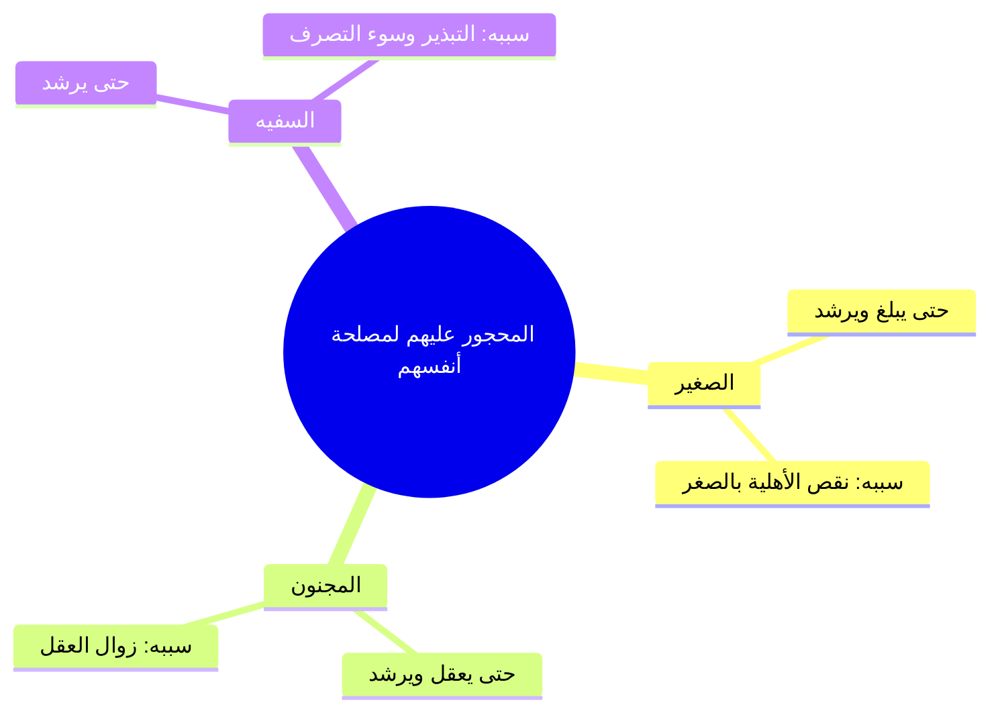

# 03 - الحجر لمصلحة النفس على الصغير والمجنون والسفيه وضمان الجنايات (الأسطر 96 – 138)

> [!abstract] محاور الجزء
> - **الحجر لمصلحة النفس:** مشروعيته على [[الصغير]] و[[المجنون]] و[[السفيه]] لحفظ أموالهم ومنع ضياعها.
> - **تعريف وضابط السفه:** من لا يُحسن التصرف ويُبذر ماله بأتفه الأسباب ولا يقدّر قيمة الأشياء.
> - **الفروق الدقيقة بين السفيه وغيره:** التمييز بين السفيه، ولاعب القمار، والعاصي المتلف ماله في المحرمات.
> - **أثر دفع المال للمحجور عليه وتلفه:** سقوط الضمان في التالف عن المحجور عليه لتفريط الدافع، ورجوعه في العين الباقية فقط.
> - **ضمان الجنايات والمتلفات القهرية:** لزوم التعويض والدية من مال الصغير والمجنون والسفيه فيما لم يدفعه صاحبه إليهم.

---

### 1. أقسام المحجور عليهم لمصلحة أنفسهم

- ا الغاية الشرعية: منعهم من التصرف في أعيان أموالهم حمايةً للمال من الضياع، مع بقاء ملكية المال لهم وتولي الولي النفقة عليهم منه.

---

### 2. ضابط السفه والفروق الفقهية

| الوصف | التعريف والضابط | الحكم والتوصيف |
|:---|:---|:---|
| **[[السفيه]]** | من لا يحسن البيع والشراء ويضيع ماله بأقل الأسباب ولا يدرك قيمة الأشياء. | يُحجر عليه لمصلحة نفسه لمنعه من التبذير. |
| **المقامر** | من يُخاطر بماله في القمار عالماً بالنتيجة ويسعى للمكسب المحرم ولا يخشى الله. | ليس سفيهاً في ذاته، بل فاسق مرتكب لكبيرة. |
| **شارب الخمر / العاصي** | من يبذل ماله في المعاصي مدركاً لفعله وما يؤول إليه. | عاصٍ يُقام عليه الحد والتعزير، ولا يُحجر عليه بمجرد المعصية إن كان رشيداً في بيعه وشرائه. |

---

### 3. أحكام تفريط الدافع وضمان الجنايات والإتلافات

| الحالة والمسألة | الحكم الفقهي | التعليل والضابط |
|:---|:---|:---|
| **دفع شخص ماله للمحجور عليه بعقد أو غيره** | يرجع في الباقي فقط، ويسقط ما تلف. | لأن الدافع هو المفرط بتسليمه ماله لغير جائز التصرف. |
| **إتلاف المحجور عليه مالاً لم يُدفع إليه** | يضمن المحجور عليه البدل كاملاً. | يُستوفى الضمان من مال المحجور عليه القائم عليه وليه؛ لأن الإتلاف يتعلق بالمال لا بالتكليف. |
| **جناية الصغير أو المجنون على النفس أو الأطراف** | تجب الدية أو أرش الجناية في ماله وعاقلته. | عمد الصغير والمجنون خطأ، وحقوق العباد المالية مضمونة في أموالهم. |

> ⚠️ ا تنبيه: إذا سلّم بالغٌ عاقل سلعة أو حاسوباً لصبي أو مجنون فأتلفه أو أفسده، لم يضمن الصبي إلا ما بقي من عينه، ولا حق للبالغ في طلب تعويض الجزء التالف؛ لمباشرته إسقاط حقه بتفريطه.

---

## 4️⃣ نص المتحدث الكامل (الأسطر 96 – 138)

> قال **ويحجر على الصغير والمجنون والسفيه** لحظه عندي عيل صغير عنده خمس سنين وربنا كرمه ب 10 من جنيه اسيبهم يروح يجيب ويلعب بيهم كوتشينه ويلعب بلاي ستيشن، ويجيب بيهم بلالين، لا، لا نحكر عليه نمنعه من التصرف ما ينفعش ويجي وليه يصرف عليه لحد ما يكبر من ماله برده واحد مجنون وعنده اطيان واراضي ايه واصر وفلل وتمام التمام نسيبها له يضحك عليه نحجر عليه يعني ايه يعني لا يصح ان يتصرف في اي مال من هذه الاموال بس المال ده بتاع مين؟ بتاع يبقى انا بحجر عليه لمصلحتين طب الواد الصغير ده عايز الصغير ده حجرت عليه ده ماله برض ملكه بس انا منعته من التصرف حفاظا على مصلحتين والسفيه واحد سفيه اه بيعرف كده بس سفيه ياخد ممكن ايه الفلل والاصول والاراضي الزراعيه بتاعته والمحلات تلاقي في شهرين ثلاثه يروح مش عارف يبهدل الدنيا قوم نيجي نحجر على نمنعه من التص تصرف ليه حفاظا عليه عشان ما يجيش الواد ده او السفيه ده يضيع ماله في شهرين ثلاثه في سنه وبعدين يقعد يشحت والسفيه لايه لحظه في سؤال.
>
> سلم، هو السفي ده ليه ضبط معين ولا مثلا على حسب الاف ولا ايه؟ **سفيه هو الذي لا يحسن التصرف بحيث ان يمكن ان يضيع ماله باقل الاسباب فلا يحسن لا البيع ولا الشراء عندها الاشياء لا يعرف لها قيمه** اي حد يجي يقول له حاجه ماشي يجي يقولله بقوللك ايه اجيب لك علبه جواها فيل وتكتب لي الفيله دي مقابل العلبه علبه فيها فيل قال له اه ويجيب لي علبه فيها فيل صغير بزلو ويبيع له الفيلا عشان قلت له كلمه ايه ده ده سفيه ده ولا مش سفيه ده نمنعه ولا ما نمنعوش يبقى ده الذي لا يحسن له ان ولا ان يشتري ولا يحسن قيمه الاشياء عبيط يعني مش مقصود به العاقل اللي يسير التصرف بال لا يس التصرف ده حاجه ما احنا كلنا احنا كلنا سفهاء اه كلنا ايه على هذه الطرف ده احنا بنضحك عليه دلوقتي ما شاء الله علينا يعني لا بيتكلم على ان يكون ده ايه دي على طول هو عبيط على طول عبيط ايه.
>
> مش زي مثلا المقابر اللي بيلعب اوار وكده مش بيندرج تحت السفين؟ لا ده بكره لكن ده مزد ده بيجي يلعب قمار وبيفكر الس مش عارف وبعدين يجي يروح قتله بعد كده عشان ياخد المال الذي اخذه منهم ده دوت لا يخشى الله ده شيء اخر لكن الثاني عبيط اصلا ايوه كده لكن اللي بيلعب هو عارف بيعمل ايه بس هو بيحب المغامره لكن التاني ده ما بياخدهاش مغامره ده فكره ايه ها تشوف لما تروح تلاقي الولد الصغير الشري مثلا يعني قالب لبن ولا مالبن ام تديله الورقه دي خد طب الورقه دي ب 100000 جنيه ما يعرفش عن حاجه المهم ياخد اللبانه لكن التاني عارف القمار بيعمل ايه وبيروح كده خلاص بقى.
>
> المخامر الايه واللي بيشرب خمر وكده ده يتجلد اه قال **ده مش سفيه يا ابني ده عاصيعم لانه شرب هذا وهو يعلم ما يؤول اليه هذا الشراب** نعم يعقل يعني اه يعقل هذا مدرك اللي هيبقى ليها ايه خلاص.
>
> قال ان وثق الورثه برهن محرز لا ده مافيش رهن او كفيل ماليه يجي واحد كافي بص انا او واحد واحد اذا جه ولاد سيد ده مادوش لم ي يعطوك انا هجيبهملك انا ايه هجيبهملك ماشي خلاص فين ماشي قال وان ظهر غريم بعد القسمه رجع الغريمه دي خلصناها بقسمه واضح فيها ايش كان.
>
> فصل ويحجر على خلصنا الكلام ايه اللي جابنا هنا يا عم الشيخ فين هو السطر اللي بعده من دفع المال ماشي، فصل ويحجر على الصغير والمجنون والسفيه لحظ **ومن دفع اليهم ماله بعقد او لا رزع فيما بقي لا ما لا ما في تلف او لا ما تلف** يعني ايه انا جيت عايز الصغير المحجور عليهم دول اديته مالي لا ده انا عملت عقد انا هو رحت بيع له كمبيوتر ب 100000 جنيه ب 100000 الواد الصغير ده ولا المجنون ولا مسك الكمبيوتر ب 100000 جنيه فضل بيه نعم ماشي بس عشان بقى في عفرت جوه ماشي مسكت الكمبيوتر ده بوظت من نوع كده الراجل جه يعمل ايه؟ يرجع على هذا السفي فيما بقي لما تلف الكمبيوتر ده لما اخده مني كان ب 100 انا بوظته بقى بكام؟ ب 50 الراجل عايز ياخد حقه ياخد 50 ولا 100 ياخد 50 بس ليه لان هو اللي اعطى ماله لغير اصلا مكلف لغير جاز تصرف يبقى هو اللي عبيط رخ فانعقب على هذا لانه فر لانه ماذا **فرط**.
>
> طب دلوقتي الصبي المحجور عليه والمجنون والسفيه ده عشان محجور عليه خلاص قال لا **ويضمنون جنايه واتلاف ما لا يدفع اليهم** يعني ايه جه العيل الصغير والمجنون ده راح ماسك الكمبيوتر بقى بتاع كسره قتله فمالي ولا لا اه طب يضمن ولا لا يضمن يضمن يضمن طب ماز ده هو اصلا زي ما بعمل تصرف قال لا ما احنا هنرجع على ولي على مين؟ على يعني سناخذ ضمان ما اتلفه من ماله التي يقوم عليه وليه خلاص لا ده جه بقى راح اوقع جنايه على اخر موت واحد خلاص يبقى عليه طمان قتل الخطا خلاص طب لا ده انا ما اديتوش ده هو دخل البيت عندي وراح راح مكسر يبقى يضمن خلاص.
>
> قال **ومن بلغ رشيدا او مجنودا او مجنونا ثم عقل ورشد انفك الحجر عنه بلا حكم** انا عندي عيل يتيم عنده ثلاث اربع سنين حجرنا عليه الواد ده اول ما يبلغ الحجر ده ينفك اوتوماتيكي اوتوماتيكي اوتوماتيكي ماشي الايه الحله قال يعني مش محتاج ان انا اطلع حكم من المحكمه قال لي لا مش محتاج قال لي بس دلوقتي القوانين الاداريه بتحتاج ده امر اخر ده امر ايه لكن من حيث الحقوق الماده بتاع الراجل البالغ بيتصرف فيه واخد بالك اما الامور الاداريه ده برض بيرجع الى مصالح لان الزمان فسد الزمان ايهسد فسد.

---

## 5️⃣ إحصاء الجزء والتقدم

- **إجمالي عدد الأجزاء:** 4 أجزاء.
- **الجزء الحالي:** 3 من 4.
- **الأجزاء المتبقية:** جزء واحد (الجزء الرابع).
