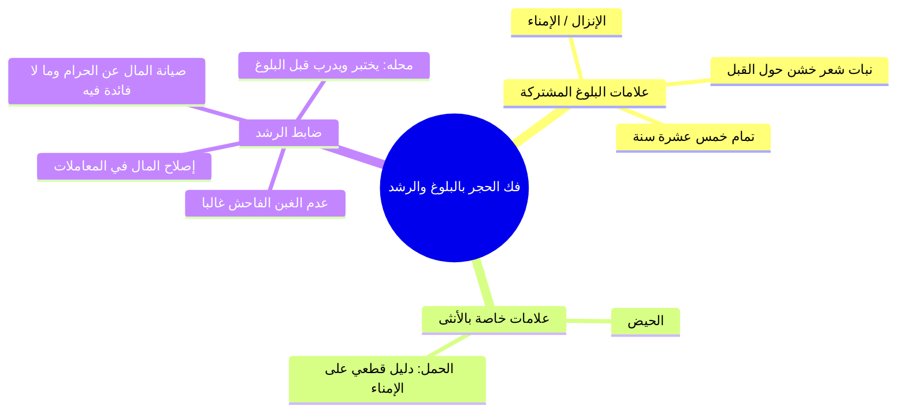

# 04 - فك الحجر بالبلوغ والرشد وتصرف الولي بالأحظ ودين الرقيق (الأسطر 139 – 218)

> [!abstract] محاور الجزء
> - **ضابط فك الحجر:** زوال سببه ببلوغ الصغير رشيداً، وعقل المجنون ورشده، وانفكاك الحجر حكماً دون توقف على قضاء القاضي.
> - **علامات البلوغ:** علامات الذكر الثلاث (الإمناء، الإنبات، تمام 15 سنة)، وزيادة الحيض والحمل للأنثى.
> - **امتحان الرشد:** محله قبل البلوغ، وضابطه إصلاح المال بعدم الغبن الفاحش غالباً وعدم بذله في الحرام أو ما لا فائدة فيه.
> - **مراتب الأولياء وقاعدة تصرفهم:** ترتيب الولاية (الأب، ثم وصيه، ثم الحاكم)، ووجوب التصرف بالأحظ للرعية.
> - **دعاوى الولي بعد فك الحجر:** قبول قوله بيمينه في النفقة والتلف والضرورة، ورده في دعوى دفع أصل المال بعد الرشد إلا ببينة أو كان متبرعاً.
> - **أحكام ديون وجنايات الرقيق:** تعلق دين المأذون بذمة السيد، وتعلق دين غير المأذون وأرش الجنايات وقيم المتلفات برقبة العبد.

---

### 1. علامات البلوغ واختبار الرشد

---

### 2. ترتيب الأولياء وأحكام تصرفاتهم ودعاويهم

- ا قاعدة الولاية: «تصرف الراعي على الرعية منوط بالمصلحة»، ولا يجوز للولي التصرف في مال المحجور عليه إلا بما هو الأحظ والأنفع له قطعاً.

| المسألة | الحكم الفقهي | التعليل واليمين |
|:---|:---|:---|
| **ترتيب الأولياء** | 1. الأب، 2. وصي الأب، 3. الحاكم. | القرابة والشفقة مقدمة، ثم إنابة الأب، ثم السلطان ولي من لا ولي له. |
| **دعوى الولي النفقة أو التلف أو الضرورة** | يُقبل قوله بيمينه. | لأنه أمين ونائب شرعي، والأصل تصرفه بحسن نية ما لم يقم المدعي بينة على تفريطه. |
| **دعوى الولي تسليم أصل المال للمحجور بعد رشده** | لا يُقبل قوله إلا ببينة عادلة. | لأن الأصل بقاء المال في ذمته، وبراءة الذمة تقتضي الإشهاد عملاً بالآية: {فَإِذَا دَفَعْتُمْ إِلَيْهِمْ أَمْوَالَهُمْ فَأَشْهِدُوا عَلَيْهِمْ}. |
| **استثناء الولي المتبرع** | يُقبل قوله بيمينه في الدفع. | لكونه متبرعاً محسناً، و{مَا عَلَى الْمُحْسِنِينَ مِن سَبِيلٍ}. |

---

### 3. أحكام ديون الرقيق والجنايات والمتلفات

| النوع | جهة التعلق | الحكم ومسؤولية السيد |
|:---|:---|:---|
| **دين العبد المأذون له في التجارة** | يتعلق بذمة السيد مباشرة. | السيد هو الذي أذن له وأطلقه، فيلزمه قضاء دينه من ماله. |
| **دين غير المأذون له** | يتعلق برقبة العبد. | السيد مخير بين فدائه وقضاء دينه، أو تسليم العبد ليباع ويستوفى الدين من ثمنه. |
| **أرش جناية القن وقيم المتلفات** | تتعلق برقبة العبد. | السيد يخيّر بين فداء رقبته بأرش الجناية أو تسليمه لتباع رقبته، فإن قصر ثمنه سقط الفائض واقتسمه المستحقون. |

> ⚠️ ا تنبيه معاصر: المستأجر المعسر الذي تراكمت عليه أجرة الشقة؛ لا يُجبر المؤجر شرعاً على إبقائه في العين لشهور جديدة تبرعاً بالمنفعة؛ بل له إخراجه منها، وتثبت الأجرة السابقة ديناً معسراً في ذمته يحرم حبسه أو مطالبته به.

---

## 4️⃣ نص المتحدث الكامل (الأسطر 139 – 218)

> قال ومن بلغ رشيدا خلاص او مجنونا ثم عقل وراس كان مجنون وعاقل وبقى راجل حلو وفاهم وزي الفل خلاص يبقى يتفك الحجر عنه وياخد البال بتاعه ويتصرف ما جراش حاجه قال **انفك الحسر عنه بلا حكم واعطي ماله** خلاص قال لي طب قبل ما الواد بقى يبلغ او يعقل لا يجوز لك انك تدي له ماله حرام عليك تبقى خايل الامانه تبقى خيل الايه **لا قبل ذلك بحال** مادام ان لسه الواد ما بلغش ما ينفعش انك تديله الفلوس انت خالي الامام ده واحد مجنون قبل ما يعقل ما ينفعش انك تدي لله الفلوس انا مالي يا عم السر يولع يولع هو والفلوس بتاعته حرام عليك لان انت مكلف بهذا.
>
> طيب البلوغ علامات البلوغ قال **وبلوغ ذكر بامناء او تمام 15 سنه وانثى بذلك وبحيض** احنا عندنا **او نبات شعر خشن حول القبر** عند الرجل الذكر في ثلاث علامات للبلوغ اما انه يمني خلاص نزل المناه او انه ينبت شعر خشن حول القبل او ان يبقى عنده 15 سنه عند الحنابله المراه تزيد على الثلاثه دول حاجه ثانيه وهي الايه؟ الحيض خلاص طب ده بقى انا عندي الست زينب ولا جميله دي ما دي لم ا يبل لم تبلغ 15 سنه ولم تنبت شعر العن ولم تن بس حملت جوزت وايه وفي عيل في بطنها نعرف بقى بلغها ازايح ما الحمل ده علام لان تحمل الا مين الا الحر الا البالغ الا مين ولذلك لو لم تبلغ مش ممكن تحمل واضح قال **وحملها دليل امناء**.
>
> **خلاص ولا يدفع اليه ما حتى يختبر بما يليق به ويؤنس رشده** طب انا حجرت على العال الصغير ده لسه يتيم صغير ايوه ما اديلوش بقى ماله الا لما امتحن واختبره اديله كده قرشين اقول له تعال عشان ننزل السوق نشتري ايه بضاعه وبتاع شوف بيعرف ايه يتصرف ازاي طب ده ينفع لحد ما اعرف الواد ده حلو وبيعرف يتصرف اروح مدي له المال بتاعه وعلى بركه الله يا ابني خلاص لكن لا ده اول ما كده اروح مدي له الفلوس كده من غير ما اطمن ان ده رشيد ما هو ممكن يكون بالغ بس ليس رشيد برشيد خلاص قال الامتحان ده بقى امتى ومحله **قبل بلوغ** قبل ما يبلغ كده ابدا ادربه ادي له قرشين كده تعال نزل السوق اوقف في الشركه في الورشه في الدكان ا موقف كده مع مش عارف ا عشان جهاز اخته لحد ما اعرف الواد ده بقى ما شاء الله بقى عنده رشد كده وحلو اول ما يبلغ اول ما يبلغ خد يا ابني فلوسك على بركه الله.
>
> ما هو الرشد؟ قال **والرسد هنا اصلاح المال بان يبيع ويشريه فلا يبن غالبا ولا يبذل ماله في حرام وغير فائده** هو لسه صغير واخد بالك ليه؟ لان قبل ما لان احنا قلنا الامتحان قبل البلوغ صح لكن بعد ما يبلغ بقى عاقل هو اللي بيرتكب عاص قال بان يبيع ويشتري فلا يقبن غالبا لكن ممكن يقبل احيانا ولا يبذل ماله في حرام يروح بالمال ديت يروح بقى الكازوهات والبراط ويشوف النساء ويسافر مش عارف فين وايه ويضرب ماكس وستروكس ايه تاني ايس وايس كريم ايس ماشي لسه في ايس ولا شال ده سيدس اه ما انا عارف بس عرفت ان مسك الست اللي بتتاج في الحاجات دي وكده ايه الايس منس كده احسن قال وغير ربنا قال ايه ربنا يعافينا اللهم يعاف يا رب.
>
> **ووليهم حال الحجر الاب ثم وصيهم ثم الحاكم** من ولي السفيه ابوه من ولي العال الصغير ابوه طب ابوه مش موجود يبقى وصيه ابوه وص مين وصى عمه عليه يبقى عمه وصيه ابيه ده وصى الحاج محمد جاره يبقى يبقى الحاج محمد ده وصيه طب ما فيش يبقى الحاكم يبقى مين الحاكم الحاكم قال لي لابد بقى احنا نعرف كده ان تصرفات الراعي على الرعيه منطب بالمصلحه انت ربنا جعلك راعي على السفين يبقى تتصرف له على حسب مصلحته ولذلك **لا يتصرفون لهم الا بالاحاف بالايه يعني لازم انت احسن حاجه ليه** يعني انت دلوقتي عندك مال يتيم ممكن تشتغل شغلانه يكسب 100 وحاجه تانيه تكسب 150 ما ينفعش تشتغل ميه وسيبي 150 لو انت دلوقتي عايز تشتري له بدله ولا جلابيه في جلابيه تشتريها ب 100 جنيه ماركه معتبره وواحده ثانيه ب 100 جنيه نص ماركه يبقى ما ينفعش تشتري نص م الماركه تشتري الايه اللي هي احسن حاجه خلاص.
>
> جينا بعد ما عقل الواد بعد ما كبر يا اخوانا طلع عيل ما تمرش في الربايه راح جاي قال لا انا الفلوس بتاعتك كانت 10 مليون وانت جبتلي 9 مليون انا فين مليون جنيه انت اخدتهم مني قوم يجي الولي او الوصيه قال لا انا صرفتهم عليك وكنت بجبتلك مش عارف ايه وبتاع لا معاك دليل هات شهود يقول لي لا **ويقبل قوله بعد فك حجر في منفعه وضروره وتلف** خلاص اه يبقى القول قول الولي ما ينفعش بقى ان انا بعد ما جيت انا قمت على مصلحتك وبعد ما كبرت ورجليك شالتك تروح جاي تتهمني بدون لكن لو عندك انت بقى بينه اه يبقى طلع انت بينه البينه بتاعتك ليه لان الوالد هنا مؤتمن ماله والقول قول المؤتمن هنا واضح.
>
> قال لي بس ده فين في المنفعه وفي فين خلاص ويقبل قوله بعد فك حاج في ايه في منفعه خلاص كل ما جا بتاع لا اله الا الله الكبيتر بيقول لك فيها كده صلى الله صلى الله عليه وسلم صلى الله عليه وعلى وسلم يعني خلصنا ال قال في ايه في منفعت يعني انا اصلا دفعت من جدا كنت بنفعك يا ابني ده انا عملت لك مش عارف ايه ودفعت عنك لما جه امين الشرطه وكان حاب يفسد مالك رحت مديله اديله ايه كان بيشيله باكو كده اديته له وبعد كده انا مش عارف حصل ايه؟ جاني قرار مش عارف من الحي ف خلاص هو قال لي كده اقبل كلامه اهو لان القول قول مين؟ قول خلاص او ضروره انا كنت لا ده انا كنت عملت لك الورد ده كان ضروره اخلصه لك ودفعت عليه الفلوس ديت او لا ده في بعض المال تلف تلف وانا لم اتمكن من فعل شيء ما تجيش تقول لي لا مدام تل اديني حقه لا انت اللي عليك البينه لو ادعيت ان انا عملت ده بتفريط او تعدي منه.
>
> قال لي **لا في دفع مال بعد رشيد** ده انا بعد ما بلغت بقيت رشيد بقول لك اديني فلوس يا يا دفعتهم لك انا ايه دفعتهم لك قال لي لا ده ده خلاف الاصل انا بعد ما ابلغ انت ما تيجي كده انك تشهد لما تيجي تديني الفلوس بتاعتي لان القول قول لنا انا لان انا اللي مداينك انا اللي ايه اللي مداينك واضح يا مشايخ لا في دفع مال بعد رسل تقول يا مولانا حد بيسال حاجه؟ قال **الا من متبرع** الا اذا كان واحد متبرع خلاص لان المتبرع ده لا ده هو متصدق عليك بتبرع هذا اصلا ما بياخدش لاجل ولا مقابل في ولايته عليك ماشي يا مشايخ، نعم.
>
> قال لي **ويتعلق دين ماثون له بذمه سيده ودين غير وارس جنايه قن وقيام متلفات برقبته** خلاص انتقل هنا بقى الاحوال ايه الرقيق بينا دلوقتي انا لي عبد الاصل في العبد ان بيملك ولا لا يملك لكن انا اذنته وقلتله روح يا فلان اشترييل حته الارض الفلانيه يبقى انا رايح اشتري دلوقتي باذن مين؟ باذن خلاص فلما راح العب يشتري حته الارض ولا الموتوسيكل ولا العجله ديت بقى عليه دين الدين ده في رقبه مين في رقبه السيد لان السيد اللي قال له خلاص كده جه بقى صاحب الدين يطالب السيد بالمال ده هل السيد يقول لا انا مش هدفع لا ده في رقبه السيد يدفع خلاص طب اذا كان بقى ده لم ياذن له بالتصرف ودين غيره يعني دين غير الماذول له في التصرف او ان ج العبد ده راح عمل جنايه على احد فاصبح دلوقتي في قرش الجنايه هنا على العبد الاخر على مين؟ او ان جه العبد ده اتلف شيء وعليه قيمه العوض على مين؟ قال لي برقبته برقبه مين؟ العبد العبد ايه الفرق بين الاثنين ده كان ده ايوه ايه بقى الفرق بين ان ان الدين يتعلق بذمه السيد وان الدين يتعلق برقبه العبد فهمتوا المساله؟ اه فهمها اه طب ما هو العبد اصلا لا يملك قال لا ما الفرق بين الاثنين الاول على طول ابتداء هيروح مين؟ للسيد هاد الثاني يعمل ايه لا ده في رقبه مين العبد.
>
> هيخليه يبيعه اه يا اما بقى ان هو يروح دلوقتي للقاضي فالسيد يقول له روح بيعه وسدد او ايه او ان فلان دوت هيبقى عليه ق من قيمتي قد كده طب نفرض ان العبد ده اصلا كله على بعضه كده ب 5000 وهو تعلق في رقامات 20000 السيد يعمل ايه مش خدوه انا ماليش دخل فيبيعوه ويسددوا ايه الديون على حسب 80 افهمتش يعني يا سيد ما كده السيد كده خسر العد يعني هو كده اقدار مصيبه ما احنا قلنا يا اخوان دي واحد دلوقتي عنده عربيه وماشي في الطريق ضرب واحد موته خطا عليه ديه ولا ما عليهوش طب هو ذبه ايه اقدار يا اخوه لازم نعرف ان ربنا بيختبرنا ودي اقدار اتفهمني انت ممكن تبقى قاعد في الورثه والمحل بتاعك اي ظرف كده تلاقيه خسرت نص ملك صح ولا ايه؟ طب هو ايه اللي حصل ان بيختبر العباد.
>
> طب السيدنا اللي هو المتبرع ده يعني مش لازم يشهد لما يديله فلوسه اه بس القول قوله يعني مش فاهم ايه متبر يعني مش فاهم يعني الواحد كده يعني هو اصلا ان اللي هو الشخص نفسه مالوش فلوس عنده اصلا لا بنتكلم دلوقتي على ان ده ولي محجور عليه اه يعني في عيل صغير دلوقتي اه مين اللي قائم على ماله؟ وليه اه اللي هو ابوه اوص طب مافيش الاثنين بيبقى الحاكم انا افرض ان ما فيش حد بقى لا في ابوه ولا وصي ولا حاكم واحد تبر قال يا اخوانا ده عي اليتيم او معنى بس لله لوجه الله وعمل كده تب تبرعا لا يبقى القول قوله القول ايه واضح واضح.
>
> حاجهانيه نعم في المساله الاولى لو ادنا له السيد هناخد اثنين من السيد ايوه طب في المساله الثانيه لو لم ياذن له السيد هيكون الدين في رقبه العبد رقبه العبد والسيد بيبيع العبد عشان يسدد ولا على حسب بقى كل حاجه اما السيد شايف ان يدفع المكان دوت وخلاص ويسدد عن عبده يبقى خلاص او ان لا انت روح انت ليك كام يبقى تاخده من قيمه العبد من قيمه الايه السيد اللي دفع لا ما خلي بالك هو الاول بيتكلم في عشان تفريق الاحكام هو على كل الاحوال السيد هيغرم السيد هييه بس هيغرم باني طريقه هو ممكن اصلا يغرر البعض ومن وقعت عليه الجنايه او الضمان يغرم البعض يعني العبد ب 50000 ودلوقتي تعلق برقباته 100000 ال 50000 الزياده دول مين هيدفعهم ما فيش حد خلاص العد كده كده هيتباع بال 50 وناخد ال 50 نسددهم يبقى سقط حق دوت وحق ده فاهم حاجه.
>
> بعد اذنك شيخ افضل دلوقتي السؤال السؤال بتاع الشيخ عبد الرحمن اللي هو بيقول لك لو سكن عندي وعليه ايجار ومادفعش نعم وانا عارف ان هو ظروفه صعبه وما معوش فلوس نعم تحق لي ان انا اطلعه ايوه هناك فرق بين الدا ان انا اتبرع بمنفعه اه في فرق ان انا المستاجر ده انا ل عنده 200 الف جنيه ايجار خلاص ل 10 اشهر فاتوا ومش قادر يدفع دلوقتي ده دايم اسمه ايه الشهر بقى اللي جاي لا يجب علي ان انا اخليه انا كده بديله حقي تطوعا ولا يجوز لاحد ان يجبرني على التطوع.

---

## 5️⃣ إحصاء الجزء والتقدم

- **إجمالي عدد الأجزاء:** 4 أجزاء.
- **الجزء الحالي:** 4 من 4 (اكتملت جميع الأجزاء التفصيلية للمحاضرة بنجاح).
- **الأجزاء المتبقية:** 0 (الانتقال لملف خطة التطبيق، ثم ملخص المراجعة السريعة، وأسئلة المراجعة، والملف المجمع).
