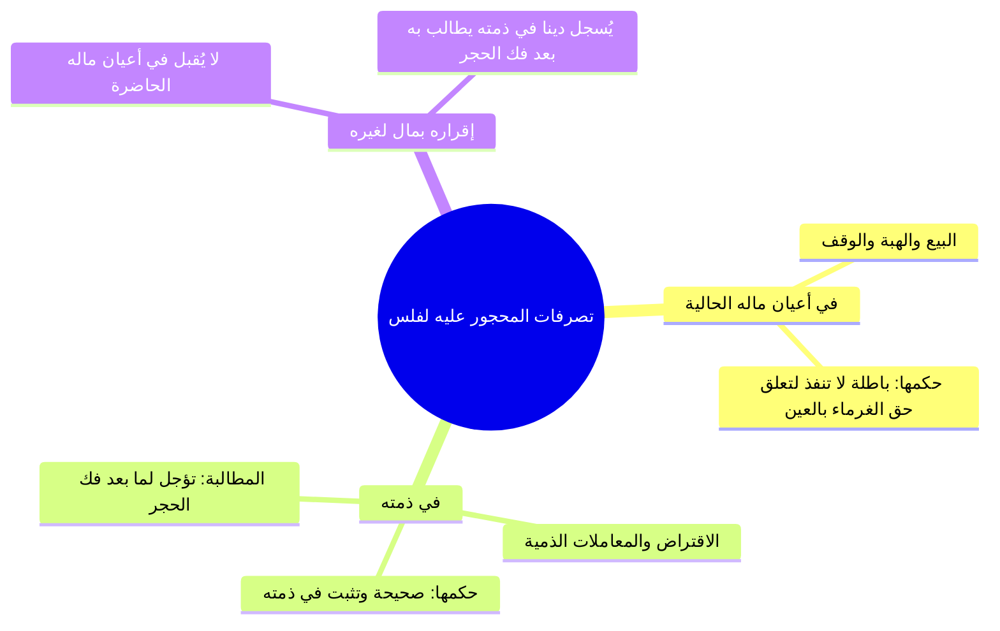
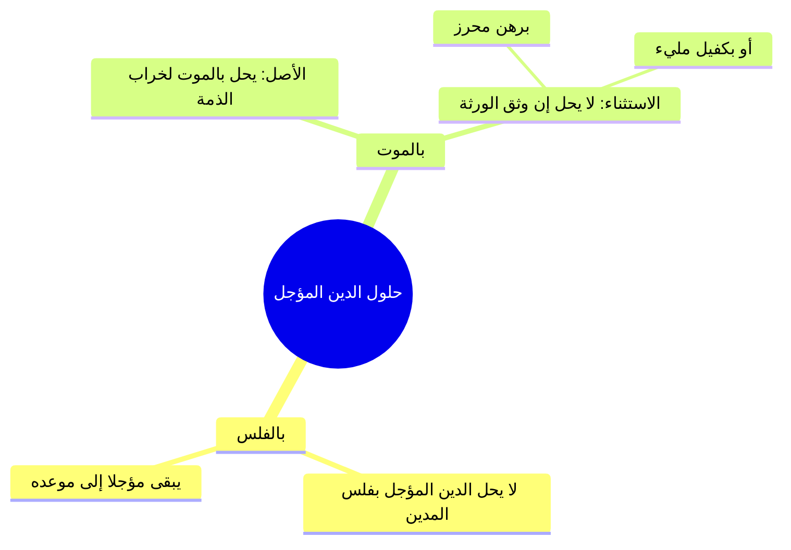
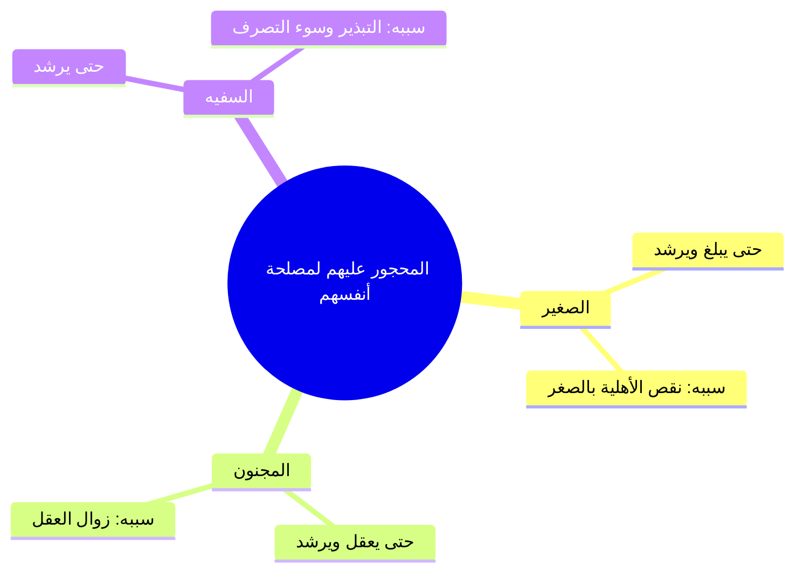
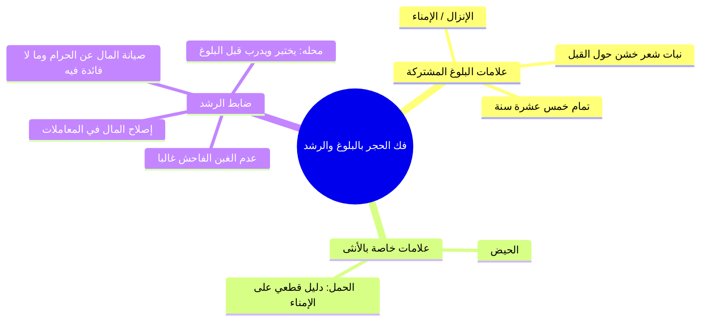

# الملف المجمع: المحاضرة 11 من كتاب أخصر المختصرات (فصل الحجر)

> [!info] توثيق الملف المجمع
> يشتمل هذا الملف على الجمع الكامل والمنظم لكافة مباحث وأجزاء المحاضرة 11 من شرح [[أخصر المختصرات]] (فصل الحجر)، مع إثبات **النص الحرفي الكامل لكلام المتحدث** لكل جزء دون اختصار، ومجرداً تماماً من جداول المراجعة السريعة وبنوك الاختبارات الذاتية، ودون أي توقيتات زمنية مختلقة (المرجع هو أرقام أسطر التفريغ الأصلي 1 – 218).

---

## 📑 فهرس موضوعات الملف المجمع

1. [[#الجزء الأول: الحجر على المفلس لمصلحة الغرماء وحكم تصرفاته (الأسطر 1 – 47)]]
2. [[#الجزء الثاني: إنظار المعسر وحكم الديون المؤجلة وظهور غريم بعد القسمة (الأسطر 48 – 95)]]
3. [[#الجزء الثالث: الحجر لمصلحة النفس على الصغير والمجنون والسفيه وضمان الجنايات (الأسطر 96 – 138)]]
4. [[#الجزء الرابع: فك الحجر بالبلوغ والرشد وتصرف الولي بالأحظ ودين الرقيق (الأسطر 139 – 218)]]

---

## الجزء الأول: الحجر على المفلس لمصلحة الغرماء وحكم تصرفاته (الأسطر 1 – 47)

### 1. ختام المسائل المشتركة وضابط الحجر على المفلس

- ا قاعدة الأملاك المشتركة: نفقة إصلاح وتطهير وتعمير الأنهار والآبار والترع المشتركة تكون على جميع الشركاء بقدر حصصهم وأراضيهم.
- ا تعريف الحجر: منع صاحب المال من التصرف في ماله، ويكون إما لمصلحة المحجور عليه نفسه، أو لمصلحة غيره (كالغرماء).

| الحالة | شروط إيقاع الحجر على المدين | الأثر المترتب |
|:---|:---|:---|
| **الحجر للمفلس** | 1. أن يكون دَينه حالاً (لا مؤجلاً). 2. أن يكون ماله قاصراً عن الوفاء بديونه. 3. أن يطلب ذلك بعض الغرماء أو كلهم من القاضي. | يمنعه الحاكم من التصرف في أعيان ماله حمايةً لحقوق الغرماء. |

> ⚠️ ا تنبيه: لا يملك القاضي الحجر على المدين المفلس تلقائياً من تلقاء نفسه، بل يشترط رفع الأمر إليه ومطالبة الغرماء (أو بعضهم) بذلك؛ لأن الحق لهم.

### 2. سن إظهار الحجر وأحكام تصرفات وإقرارات المحجور عليه

- ا سند سنّ الإظهار: يُسنّ للحاكم إشهار الحجر وإعلانه بين الناس، ومستنده عموميات الشريعة في تحصيل المصالح وسد أبواب الغرر والضرر.

### 3. استرداد عين المال وقسمة التركة بالمحاصة

| المسألة | الحكم الفقهي | الشرط والضابط |
|:---|:---|:---|
| **وجود عين المبيع عند المفلس** | يسترد البائع عين بضاعته ويسقط دينه من التفليسة. | أن تكون السلعة باقية بحالها لم تتغير، وأن يكون البائع جاهلاً بحجر المشتري عند تسليمها. |
| **تغير المبيع أو نقصه أو علم البائع بالحجر** | لا يملك استرداد العين، ويتحول إلى غريم عادي. | يشارك بقية الغرماء بنسبة دينه، وتدخل العين في أموال التفليسة. |
| **قسمة مال المفلس** | يبيع الحاكم ماله ويقسمه على الغرماء بالمحاصة. | قسمة حاصل البيع على مجموع الديون بنسبة مئوية موحدة لكل دائن. |

> ⚠️ ا تنبيه في المحاصة: إذا بيع مال المفلس ولم يفِ بكامل الديون وأخذ كل دائن نصيبه بالمحاصة، فإن الباقي لا يسقط ديانة، بل يثبت ديناً في ذمته حتى يوسع الله عليه ويتمكن من السداد، ولا حرج عليه شرعاً إن لم يكن مفرطاً لقوله ﷺ: «مطل الغني ظلم».

### نص المتحدث الكامل للجزء الأول (الأسطر 1 – 47)

> رزعه مفهوم المخالفه وان بناه بغير نيه الرجوع لا يرزع قال لي وكذا ونحو انا دلوقتي عندنا اراضي صداعيه انا عندي 20 30 فدان وانت عندك 20 30 فدان وبعدين في نهر نسق منه فرعيه من النيل او ترعه كبيره وبعدين الترعه دي او الفرعي ده من النيل بيحتاج تنظيف بيحتاج انه يتطهر مثلا في حافه منه بدات تنهدم عايزين نصلحها انا وانت مش احنا شركا في القدر دوت وبنسق ارضنا منها قال لي اه قال علي وعليك احنا في الصحراوي وعاملين استصلاح اراضي وبعدين حفرنا بئر ولو انت شركا في البئر دوت البئر ده في مكن بيسحب الماء فالممكن ده اتعطل يبقى اصلحنا وانت على حسابنا البير ده محتاج يطهر يبقى على حسابي وعلى حسابك البيت ده حصل اي ظرف وبدا ينهدم والميه اللي فيه هتبدا لا يبقى علي وعليكم وكاذا نهر وايه ونحو خلاص يا مشايخ
>
> ثم قال المصنف رحمه الله تعالى **فصل ومن ماله يكفي بما عليه حالا وجب الحجر عليه بطلب بعض غرمائه** صليتوا هنا على النبي، صلى الله عليه وسلم، صلى الله عليه وسلم ده **فصل الحجر** فصل ايه الحجر.
>
> **والحجر اما ان يكون لمصلحه المحذور عليه او لمصلحه الغير** والحجر هناك بتمنع صاحب المال ان يتصرف في ماله اما لمصلحته او لمصلحه الغير، بناء على ايه يا عم الشيخ؟ بناء على ان انا ليه يحقق عليك انا مداينك ب 2 مليون جنيه، يعني هل بيظهر في الشخص اللي احنا هنحمات تدل ان هو مثلا سفين او او لا؟ سياتي حالا سياتي حالا خلاص قال لي ومن ماله ليفي بما عليه اه يبقى انا مديون باثنين لا اربعه 10 مليون جنيه والديون دي حل سدادها وحل قضائها جه النهارده راح جاي الحاج ايمن الحاج ربيع جايبين الورق المستندات عايزين منك 10 مليون جنيه والله انا الفلوس اللي عندي لا تكفي لايه تك فانا كل الليملكه دلوقتي 2 مليون جنيه 5 مليون 7 مليون او ال 10 مليون جنيه السوريا دي ما عنديش لكن انا عندي اصول عندي اراضي عندي بيوت لا معلش احنا محتاجين فلوسنا دلوقتي فانت دلوقتي لك دايم حل سداده وحل وقته وانا ما معيش ان انا اسد الديون ديت فدلوقتي انت ليك حق صح والحق ده المفروض ان انا اديه طب انا ما معيش اديه رحت انت رافع امرك لل القاضي رحت مقدم ورقك ومستنداتك قدام القاضي والله احنا لينا دلوقتي عند سيد الشركه بتاعته 10 مليون جنيه وحل الوقت ولم يسدد القاضي يبعت لي يا سيد الناس دي ليه عندك فلوس اه ليها عندي لا ليها عندي طب اديلهم في اموالهم ما معيش والله يا سيدنا القاضي الحمل معيش اسدد لهم خلاص نعمل ايه **وجب الحشر عليهم يعني يجي القاضي ي يمنعني من التصرف في ماله بس بشرط ان الغرماء يروحوا يطلبوا او بعض الغرا يطلبوا هذا من القاضي** فيجي الحاج الربيع يقدم كده طلب عند القاضي والله انا اطلب الحجر على اموال سيد حتى استرد بالي منه قوم يجي القاضي يروح هاجر عليا حجر عليا دلوقتي لمصلحته ولا مصلحه الغرماء؟ مصلحه الغرماء السلام، وعليكم السلام ورحمه الله وبركاته خلاص كده يا مولانا؟ اه كده جزاك الله خير لكن الابناء احيانا بيحجروا على ابائيه، جاي حالا واحده واحده احنا قلنا ايه نستنى ما نخلص الفصل وبعدين نشوف اللي جاي ما احنا عشان كده قلنا اما ان يكون لمصلحه المحجور عليه او للغيظ هنا بنتكلم على الغيظ واضح.
>
> عليكم السلام ورحمه الله اللي جايين دلوقتي اتاخرتوا سيدنا والله كنت باكل بعد الصلاه، كنت بتاكل بعد الصلاه ليه؟ عشان تاخر ماشي يا عم حرك عل س، ماشي بعدين انا ملاحظ ان الاخوه بيجي متاخر ليه يعني برض يا اخوانا المحاضرتين الولايتين دول ما ينفعش محتاجين ان احنا نبدا نضحي شويه انا حتى حاولت ابعت لكم رساله الكمبيوتر التليفون ض مش عارف في حاجه غلط فيا اليومين دول لكن لازم نضحي شويه يا شباب ولازم ان احنا نعد انفسنا ونرتب امورنا ان احنا نبقى موجودين اليوم كاملا لان برده لما نيجي نلاقي مثلا ده الشيخ طاهر قليل مش عارف ايه برض مش جيد وكمان ده بيعلمك الكسل ماشي.
>
> جه القاضي الحاكم قال يا اخوانا قرار يحجر على اموال سيد حتى ا يعني يقضي ديون الغرماء او حتى نبيع هذه الاموال ونسدد اموال الغرماء الحكم ده والقرار دوت قال لي **وسن اظهاره** يستحب ان احنا نيجي في الطلبيه كده اخوانا سيد حجر عليه ليه عشان ما يجيش واحد يجي يتعامل معاه هو فاكر ان هو لسه معاه الموال وبتاعضيع الحقوق واضح طب وسنه اظهاره ده ده عليه دليل قولا من النبي عليه الصلاه والسلام لا ده ده ببدا تحصين المصالح من عموميات الشريعه خلاص.
>
> طب دلوقتي جه القاضي بعد ما حجر على الارض الاراضي بتاعته البيوت ما انا جيت وحبيت ان انا اهب فدان ولا حاجه لواحد مثلا غلبان او ان انا ابيع مثلا شقه ولا دكان من دكاكين ولا محل من محلاتي قال **لا ينفذ هذا التصرف ولا ينفذ تصرفه في المال بعد الحش** ليه؟ لان هناك من الغرماء او ان الغرماء تعلقت حقوقهم بعين هذه الاموال فلا يجوز لي ان اتصرف فيها لان خلاص انتقل هنا الحق لاخرين حتى ترد عليهم اموالهم واضح يا مشايخ، واضح سي.
>
> قال لي بس ساعات بقى بتحصل ظروف كده هو ماتصرفش ده بعد ما حجر القض عليا جيت قلت على فكره يا فلان على فكره الثلاث اربع فدادين دول اللي في اول البلد دول مش بتوعي ده دول ملك مين؟ ملك الشيخ عبد الرحمن فانا اقريت ان ثلاث فادت دول ملك مين ومش ملكي الاقرار ده يعمل به ولا لا يعمل به قال **ولا اقراره عليه** برض هذا الاقرار لا يع عمل به القاضي ولا يؤثر في حقوق مين الغارمين اما اللي هيبقى فين هيبقى في دمتي هيبقى ايه مش انا اقريت ان في ثلاث فدادين مش بتوعي بتوع الشيخ عبد الرحمن اه عبد الرحمن ممكن يجي يطالبني بالثلاث فدادين دول انا ليا في ذمتك ايه ثلاث فدادين لانه اقر صح ولا ايه؟ اه وكمان لو اتفك الحاجر عنه ممكن عبد الرحمن يجي يطالب بثلاث فدادين دول لانه دلوقتي اقر بحق في ذمته وهل المحجور عليه يجوز له ان يتصرف في ذمته يعني ياخد شيء في ذمته مش متعلق باعيان الاموال بتاعته قال له اه قلت له يعني ايه قال يعني انا ممكن كده اروح امت كده على محمد سعيد اقول له اديني ايه ارنبين سلف اين مليون واخد بالك يقولله خدها صح احنا الناس لبعضها برض روح مديني 2 مليون جنيه اداني 2 مليون جنيه دول دين في ذمتي ولا لا اه ولذلك **بل في ذمته يبقى المحجور عليه للغير يجوز له ان يتصرف في ذمته** خلاص شوف بقى الايه **فيطالب بعد فك حجر** جه بقى القاضي فك الحجر عن الاموال بتاعتي انا اقريت لمحمد سعيد بالثلاث فدادين قال له تعالى يا ريس انا ليه عندك ثلاث فدادين فين انت ياض انت مش جيت واقريت قدام القاضي ان الثلاث فددين دول بتوعي يا ابني ده انا بقول كده عشان خاطر قال هاخد اي حاجه قال لا الكلام ده تقول عند العمر ده ما ينفعش هنا ق ويه قدام القاضي يقول لي سلم لي ثلاث فدادين دول واخد بالك فيطارب بعد فك حجر خلاص.
>
> قال لي انا لما جيت اتحجر عليا انا كنت رحت اشتريت من الشيخ مصطفى جمال عربيه او ثلاجه ايديال في ايديال موجود فيه ايديال مش عارف 18 ايه او 16 خلاص ويا سبحان الله خدت منه الثلاجه دي ولا العربيه بتاعته اللي انا شريتها منه بالدين وهوبا راح القاضي عامل ايه حجر عليا خلاص فدلوقتي جه يا عم مصطفى عرف ان انا اتحجر عليا وان انا اشتري وانا محجور عليا راح جاري على طول داخل جوه لقى نفس الثلاجه بتاعته بعنها موجوده فين؟ في المدخل بتاع البيت لسه مدخلها الصاله بتاعه الشقه حاططها في المخزن بس بعينها ما جرالش اي حاجه خلاص والقادر حاجر على كل اموالي طب دلوقتي مصطفى جمال يعمل ايه؟ قال لي لا ياخدها دي قال **من سلمه عين ماله جاهل الحشاها** طب لو كان مصطفى بعد التثلاجه هو عارف ويعلم ان انا محجور عليا ما ينفعش يجي ياخدها واضح كده يا مشايخ قال لي بس خلي بالك انا لما جيت اشتريت منه العربيه رحت مغير منها الموتور لا ده انا لما اخدت العربيه حصل حاجه اتربقت اتكسرت ابوابها ولا السقف بتاعها اتغير العربيه دلوقتي بحالها ولا ليست بحالها ليستح ليست بحالها طب نعمل يجي دلوقتي عم مصطفى ياخد العربيه بتاعته قال لا كده هيبقى زي الغرماء يبقى سياتي وننظر في دينه اللي هو ثمن السياره ويبقى له نصيب كان نصيب الغرماء كما سنعرف دلوقتي كيف نقسم الاموال على الغرماء الغرماء يعني ايه الديانه الميل الدائنون قال لي طب دلوقتي انا لما اخدت العربيه واتغيرت ولا التثلاجه قاللي تمانها كله يبقى في هو شريت العربيه منه بكام ب 100000 يبقى انا مديون ب 100 لاجه ب 50 يبقى انا مديون ب 50 طب هو لما لقى بقى العربيه بتمامها هياخدها ولا مش هياخدها؟ هياخدها خلاص طب دلوقتي هو لما يجي ياخدها طب ما الديانه طب ما هو لما ياخد العربيه كده مال سيد المحجور عليها هينقص صح ولا لا؟ ما انتم مش واخدين بالكم الحاجه دي هيحصل في ايه انا دلوقتي لما اتحجر على مالي كان مالي ده بمليون جنيه خلاص والغرماء الديانه ليه 2 مليون جنيه وانا كل ما قبلكم هي اعيان بمليون هيجي القاضي يبيع الارض دي بمليون ويقسم المليون على الغرماء على حسب قصهم من الديون طب هو دلوقتي لما يجي ياخد العربيه بتاعته هيحصل ايه؟ هينقص المالعم صح ايوه صح فهنيجي نقول ده قدر ربنا بقى بالنسبه لكم بايه بالنسبه لكم طب لو هو بقى فضل عطلانه او حصل لها عيوب خلاص كده اصبح الماده من ضمن المحجور عليه وهيبقى دلوقتي المليون ال 100000 جنيه بتاعه العربيه كلها في دمتي انا فيجي محمد سعد ولا مصطفى اللي انا شريت منه هيطالب بال 100000 جنيه دول من ضمن الغرماء يا نعم انا جيت انت لقيت العربيه بتاعتك بعينها هتعمل ايه؟ هتاخدها وخلصنا الموضوع لا ده انت جيت لقيت العربيه بتاعتك اتغيرت الثلاجه شلت انا منها البيبان فما بقتش بحالها مش هينفع تاخدها خلاص لان اصل تمنها ناقص واصبحت من ضمن الاموال المحجوره عليها طب هنا دلوقتي لما هو اخدها كده نضاع عليها حاجه قال لي لا وعوضها كله باق انت الدين بتاعك كله علي انا ال 100000 جنيه بتاعه العربيه 50000 بتاع عليا انا خلاص طب انت لو خدت بقى التثلاجه سليمه يجينا يقول لك لا احنا لنا فيها نصيب من الديون بتاعتنا لا واضح كده.
>
> طب يا سيدنا هو انا لما يتحجل عليا القاضي بياخد كل حاجه عندي حتى الشقه كل شيء ولا مثلا على حسب المحك عليه هو حجر على ايه اه اذا حجر على كل شقه ياخد كل الشقه حجر على الاطيان على حسب الاموال اللي هو بيحصرها الخبير ويجي يقول اه ده فلان ده سيد فيمن يعني من تصرفات واضح والتصرفات المقصود بها ان انت لا تنقل ملكتي للغير وهكذا لحد ما نشوف هنسدد ديون الناس دي ازاي طيب دلوقتي حجر عليا ايه اللي هيحصل **ويبيع حاكم ماله ويقسمه على غرمائهم** واضح كده مشايخ دلوقتي انا عندي لاثه ديانه غرمات واحد ليه 50000 واحد ليه 30 واحد ليه 10 يبقى الديون كام؟ 90 خليهم بقى 100 كلهم يعني 50 و30 و20 خلاص يبقى كام؟ 100000 انا لما حجر عليا المال بتاعي بكام؟ ب 50000 طب نعمل ايه هنيجي نقسم الديون دي على ال 50 ال 10 او ال 100000 على ال 50 يبقى فيها الكام النص ولا كام؟ص النص يبقى كل واحد من الديانه هياخد نص الديون بتاعته فاللي 500000 او 50000 ياخد النصف اللي 30 ولا 300 ياخد النصف اللي ليه ال 20 ولا 10 ياخد النصف وهكذا والباقي والباقي يسقط يا شيخنا الايه هم ليهم باقي فلوس بتسقط التون دي ولا خلاص تسقط ما دام اللي ما معهوش اه تمام مادام ما معهوش هيعمل ايه يعني خلاص تفضل تفضل دين عنده بتصب لما ربنا بقى يوسع عليه وبعضهم بيقول تسقط عنهم شرع ولا حنا يعني هو يعني كده بزمته يوم الدين باقي ولا كده ما احنا قلنا الديون اذا لم يتمكن صاحبه من السداد ادى الله عنه امتى ولذلك النبي صلى الله عليه واله وسلم يقول ماذا **مطل الغني ظلم** والله عز وجل قال **وان كان ذو عصره فنظره الى ميصره** ميصره ف ما معوش اصلا طب هو ماش يسدد هيحاسب امام الله على ايه واضح ولذلك من اخذ اموال الناس يريد ادائها ادى الله عنه بس المهم ما يكونش مفرط ولا معتدل.

---

## الجزء الثاني: إنظار المعسر وحكم الديون المؤجلة وظهور غريم بعد القسمة (الأسطر 48 – 95)

### 1. أحكام المعسر وضوابط مطالبته

- ا الحكم الشرعي في المعسر: يحرم على الدائن مطالبته بدينه، أو حبسه، أو ملازمته والتردد عليه إحراجاً له، ما دام عاجزاً عن الوفاء بنص القرآن: {وَإِن كَانَ ذُو عُسْرَةٍ فَنَظِرَةٌ إِلَىٰ مَيْسَرَةٍ}.
- ا ضابط الحبس المشروع: إنما يُحبس المدين المماطل القادر على السداد الذي معه وفاء ويمتنع، لقوله ﷺ: «مطل الغني ظلم».

| الحالة | الحكم | التفصيل والتعليل |
|:---|:---|:---|
| **المدين المعسر الحقيقي** | تحرم مطالبته وحبسه وملازمته. | ماله قد هلك أو لا يكفي، وهو معذور شرعاً. |
| **المستأجر المعسر بالأجرة** | يجوز إخراجه من العين للأشهر اللاحقة. | المؤجر لا يُجبر على التبرع بمنفعته المستقبلية، وإن كان الإيجار الماضي ديناً يُنظَر فيه. |

> ⚠️ ا تنبيه: ملازمة المدين المعسر بالوقوف له عند بابه أو تتبعه في المسجد للتشهير به أو الضغط النفسي عليه محرمة شرعاً وكبيرة من مظالم المعاملات.

### 2. حكم الديون المؤجلة بالفلس والموت وتوثيقها

- ا قاعدة تأجيل الديون: لابد في المداينة من تحديد أجل مسمى شرعاً لقوله تعالى: {يَا أَيُّهَا الَّذِينَ آمَنُوا إِذَا تَدَايَنتُم بِدَيْنٍ إِلَىٰ أَجَلٍ مُّسَمًّى فَاكْتُبُوهُ}، وما تعورف عليه بين التجار اعتُبر أجلاً كالمشروط.

### 3. ظهور غريم بعد قسمة مال المفلس

| المسألة | الحكم الفقهي | الأثر المترتب |
|:---|:---|:---|
| **ظهور غريم بعد بيع الحاكم واقتسام الغرماء** | يرجع الغريم الجديد على سائر الغرماء بقسطه. | لا يضيع حقه، ويسترد من كل غريم النسبة الزائدة التي أخذها ليعاد التوزيع بالمحاصة بين الجميع. |

> ⚠️ ا تنبيه: لا يسوغ للغرماء السابقين الامتناع بحجة أن القسمة تمت بحكم القاضي وأن الغريم تأخر؛ لأن التأخر بعذر (كسفر أو جهل) لا يُسقط أصل الحق المالي.

### نص المتحدث الكامل للجزء الثاني (الأسطر 48 – 95)

> قال لي بقى **ومن لم يقدر على وفاء شيء من دينه او هو مؤجل تحرم مطالبته وحبسه وكذا ملازمته** واخد بالك دلوقتي انت ليك عندي 100000 جنيه انا مش قادر اسدد مش عارف اجيب لك حقك او ان انت ليك عندي 100000 جنيه بس ده لسه في الشهر واحد اللي جاي قال لي تحرم مطالبه يحرم عليك انك تروح تطالب انت عارف ان انا ما معيش وعارف ان انت لك عندي مليون جنيه وانا المحل بتاع انت شفته لما احترق وضاع مالي جاي طالبني ازاي اللي اتصرف فل ماليش دخل حرام عليك لان ربنا بيقول وان كان ذو عصرات فنطره الى ميصر او لسه الميعاد ما جاش مش من حقك ولا يجوز لك انك تطالبني هذا الدنيا ما دام ان الوقت لم يحل ده لسه مؤكد انت ليك شهر واحد يبقى تعالى حضرتك طالبني في شهر ايه واحد طب انت جيت لسه دلوقتي في شهر 10 بتطالبني ده ظلم منك ولذلك تتحاسب على هذا تحرم مطالبتهم ده مش كده ويحرم حبسه انا هحبسك راح جاي رافع عليه الورق حبسه وهو عارف ان ما معهوش حرام عليك لا ده حبس بالظلم.
>
> ده يحبس امتى لما يكون ده معاه وبيماطل ويقدر يسدد، الله اكبر الله اكبر، الله اكبر، طب سيدنا لو لو واحد ماجر شقه وبعدين جه معاد الايجار وماعرفش يسدد، واحد معجر شقه ماشي عين ج مع الايجار و مش هي لاخرجه اخرجه عادي يعني اه لان ده انت ده مش ده ده مقابل منفعه هم ماوش خلاص ما ياخدهاش الصرف ف واخد بالك لكن لا ده هو اجر الشقه ب 10000 جنيه وبعدين جه سدد ما معهوش خرجته من الشقه وعليه 10000 جنيه وانت عارف ان ما معهوش يحلم عليك انك تطالبه لحد ما ربنا يوسع عليك وانك ما تروحش تحبسه الله اكبر الله اكبر.
>
> الله اكبر الله، اشهد ان لا اله الا الله، اشهد، اشهد ان لا اله الا الله، اشهد ان محمدا رسول الله اشهد ان، اشهد ان محمد رسول الله حي على الفلاح، حي على الصلاه حي على الف حي على الفلاح، الله الله اكبر الله اكبر، لا اله الا الله، لا اله الا الله اشهد ان لا اله الا الله.
>
> قال المصنف رحم **تحر طالبته وحبسه وكذا منته** مش تفضل بقى كل ما تيجي تستناد تحت البيت تحت يروح يصلي تروح وراه عند الجامع تقعد قدام الجامع تروح يقعد مش عارف في المكان الفلا مش كده ما انت عارف ان هو مش قادر يسدد وان هو معذور وان هو في ظروف صعبه يبقى يجب عليك ان انت تصبر عليه شويه طب انا ذنبي ايه انا مدي لله دلوقتي فلوس انا ذنب ايه طيب دي فلوس ناس انا مشغلها دي اقدار وهو ذنبه ايه ان ربنا تبارك وتعالى قدر ان ان ما بقاش حاجه دي اقدار ده من الذنب ده اختبارات من الله عز وجل لك وله عشان كده مساله المعاملات محتاجين نعرف حكمه الله عز وجل فيها ان ده اختبار وبلاء بين بين المسلمين وذلك ممكن تلاقيني في الجامع بعاملك بطريقه زي الفل وجميل وزي وكل تمام التمام اول ما اتعامل معاك بالفلوس واول ما تبقى في ازمه وان انا هخسر تلاقي بقى كل قبيح ظهر عشان كده وقت والله كلمه سيدنا عمر عملته بالدرهم والدينار اسفرت معه لا يبقى انت لا تعرفه عشان كده الاخ يظهر فين والمسلم يظهر امتى لما تبقى في معاملات لما يبقى في فلوس لما تبقى في مصالح لما يبقى فيه انت هتخسر حاجه هيظهر بقى مع دمك واضح يا شباب، واضح نعم.
>
> هو مطالبته يعني عند القاضي نعم مطالبته يعني عند القاضي اه ايوه لكن انا مثلا برض انك تطالب هو في نفسه لو انت عارف ان هو اصلا ما معهوش لكن ممكن تقول ربنا يرضك حاول انت لو قدرت تتصرف حاول كده اشتغل يعني عشان انا محتاجشياء دي حاجه وبين ايه انا لي عندك 100000 جنيه انا ماليش دخل انا عايزهم بكره انا عايزهم النهارده شوف فرق بين الامرين ازاي، نعم.
>
> قال لي **ولا يحل مؤشر بفلس** انت ليك دلوقتي عندي مليون جنيه حل السداد في شهر واحد انا فلست النهارده الشركه فلست النهارده ينفع ان تجي طالبني النهارده بال بالمليون جنيه اللي هيحل في شهر واحد قال لي لا ده لا يجعل فلسي يعني ايه سبب لجعل الدين حال هو مازال مؤجل فيها اشكال طب لو الدين مالوش معاد الايهون معاد اول حاجه يكون ان الدين مالوش معاد ده دي معصيه لان الدين لابد ان يكون ايه **يا ايها الذين امنوا اذا تداينتم الى اذا تداينتم بدين الى اجل مسمى** لازم تسلفني تقول لي سنه ست اشهر ما تسيبهاش كده خلاص في الجي تشتغل من حاجه قال لما ربنا يصر كدهجيبلك حساب ماينفعش، على حسب العرف ده بقى ان احنا في العرف ايه ان انا بسدد في خلال قد ايه ساعات التجار اه كده في خلال يومين اسبوع شهر على حسب عرف المعاملات ديت ما هو **المعروف عرفا كالمشروط شرطا** لكن المشكله فين بقى ان انا اجي اروح مسترف منك 50 6 الف جنيه وان شاء الله ربنا يسر هبقى واما ربنا يكرمك اي وقتنا ماماكش حاجه ده يادي المشاكل يادي الايه لا ما كانش كده لان انا طالب بهذا في اي وقت بصراحه واضح او احدد وقت او احدد ايه فان طالب بتقول لا احنا ما حددناش وقت خلاص انا عايز بقى ان شاء الله النهارده مش هينفع طب قد ايه شهر كده تجيب لك الديون يبقى انا بدات احدد اهو ماشي يا مشايخ.
>
> طيب دلوقتي التريك عندي 10 مليون جنيه صح، ايوه، مت والموت علينا حق صح ولا ايه انا لله وانا اليه راجعون الدين ده هيحل امتى شهر واحد هل انا بعد ما اموت الدين ده بقى حال يجي الجماعه الغرماء دول يجي لعيالي يقف عن احنا لينا عند ابوك 10 من طلع يا باشا قبل ما ت ما توزعوا التركه قال لي **ولا بموت لا يحل بالايه بالموت قال لي ان وثق الورثه برهن محرز** يعني ايه انا جيت جه الغريم لابن عبد الله قال لي يا عبد الله انا ليه عند ابوك يا ابني 10 مليون جنيه قال له بص يا عمو ان شاء الله في شهر واحد ال 10 مليون جنيه ده هيكون عنده وخلي بالك حته الارض اللي في اول البلد دي يا رهن لو احنا ما ادينا لكش الفلوس في اول واحد يبقى دي خد حقك من الارض دي ماشي ماكراش حاجه واضح كده.
>
> قال لي طيب دلوقتي بتبقى عندنا مشكله ايه دلوقتي بعد القطم حجر عليا وج الغرماء الغرماء دول كان كلهم لهم كام مثلا 100000 جنيه وانا التركه بتاعتي او المال بتاعي 5500 ف الاضرح مقسم ال 50 على الغرماء وخلصنا يا اخي سبحان الله فجاه كده لقينا واحد جه جديد قدم ورقه اهو قال لا انا ل 100000 جنيه عند سيد قال بس احنا وزعنا الترك خلاص ولا وزعنا الايه المال مافيش بح يعني انا كده ضاع حقي ولا ايه قال لي **وان ظهر غريم بعد قسمه رجع على الغرماء بقسطته** مين اللي خد الفلوس بتاع السيد فلانفلان فلان وفلان وف ارجع لهم يا اخوانا انا ل 100000 جنيه فانا ليا نصيب فين في الفلوس لقيت اخدتوها فيدوا له نصيبهم ا كصيبتهم واضح، ما يجيش بقى لا احنا ما لناش دخل والله انت ما جيتش ليه من بدري انا كنت مسافر ما كنتش عارف لا والله احنا ما احنا مش هنبقى مش هيبقى خراب بيوت احنا ولا مش عارفين لا مش من حقك لان ده حق له كما ان لك حق ايوه بس احنا ذنبنا ايه يا ابني مش ذنبك ايه ده هو ربنا بيختبر العباد ما هو اخره عشان يختبره هتشوف انت هتاكل اموال الناس بالباطل ولا هتدفع حق الراجل وتستعوض بقى هذا عند الله وتقول اللهم ازرني في مصبتي واخلف لي خيرا من هم واضح المشايخ ما تصلوا على النبي صلى الله عليه وسلم صلى الله عليه واله وسلم ده حجر عليه لمصلحه الغير لمصلحه ايه الغير.

---

## الجزء الثالث: الحجر لمصلحة النفس على الصغير والمجنون والسفيه وضمان الجنايات (الأسطر 96 – 138)

### 1. أقسام المحجور عليهم لمصلحة أنفسهم

- ا الغاية الشرعية: منعهم من التصرف في أعيان أموالهم حمايةً للمال من الضياع، مع بقاء ملكية المال لهم وتولي الولي النفقة عليهم منه.

### 2. ضابط السفه والفروق الفقهية

| الوصف | التعريف والضابط | الحكم والتوصيف |
|:---|:---|:---|
| **[[السفيه]]** | من لا يحسن البيع والشراء ويضيع ماله بأقل الأسباب ولا يدرك قيمة الأشياء. | يُحجر عليه لمصلحة نفسه لمنعه من التبذير. |
| **المقامر** | من يُخاطر بماله في القمار عالماً بالنتيجة ويسعى للمكسب المحرم ولا يخشى الله. | ليس سفيهاً في ذاته، بل فاسق مرتكب لكبيرة. |
| **شارب الخمر / العاصي** | من يبذل ماله في المعاصي مدركاً لفعله وما يؤول إليه. | عاصٍ يُقام عليه الحد والتعزير، ولا يُحجر عليه بمجرد المعصية إن كان رشيداً في بيعه وشرائه. |

### 3. أحكام تفريط الدافع وضمان الجنايات والإتلافات

| الحالة والمسألة | الحكم الفقهي | التعليل والضابط |
|:---|:---|:---|
| **دفع شخص ماله للمحجور عليه بعقد أو غيره** | يرجع في الباقي فقط، ويسقط ما تلف. | لأن الدافع هو المفرط بتسليمه ماله لغير جائز التصرف. |
| **إتلاف المحجور عليه مالاً لم يُدفع إليه** | يضمن المحجور عليه البدل كاملاً. | يُستوفى الضمان من مال المحجور عليه القائم عليه وليه؛ لأن الإتلاف يتعلق بالمال لا بالتكليف. |
| **جناية الصغير أو المجنون على النفس أو الأطراف** | تجب الدية أو أرش الجناية في ماله وعاقلته. | عمد الصغير والمجنون خطأ، وحقوق العباد المالية مضمونة في أموالهم. |

> ⚠️ ا تنبيه: إذا سلّم بالغٌ عاقل سلعة أو حاسوباً لصبي أو مجنون فأتلفه أو أفسده، لم يضمن الصبي إلا ما بقي من عينه، ولا حق للبالغ في طلب تعويض الجزء التالف؛ لمباشرته إسقاط حقه بتفريطه.

### نص المتحدث الكامل للجزء الثالث (الأسطر 96 – 138)

> قال **ويحجر على الصغير والمجنون والسفيه** لحظه عندي عيل صغير عنده خمس سنين وربنا كرمه ب 10 من جنيه اسيبهم يروح يجيب ويلعب بيهم كوتشينه ويلعب بلاي ستيشن، ويجيب بيهم بلالين، لا، لا نحكر عليه نمنعه من التصرف ما ينفعش ويجي وليه يصرف عليه لحد ما يكبر من ماله برده واحد مجنون وعنده اطيان واراضي ايه واصر وفلل وتمام التمام نسيبها له يضحك عليه نحجر عليه يعني ايه يعني لا يصح ان يتصرف في اي مال من هذه الاموال بس المال ده بتاع مين؟ بتاع يبقى انا بحجر عليه لمصلحتين طب الواد الصغير ده عايز الصغير ده حجرت عليه ده ماله برض ملكه بس انا منعته من التصرف حفاظا على مصلحتين والسفيه واحد سفيه اه بيعرف كده بس سفيه ياخد ممكن ايه الفلل والاصول والاراضي الزراعيه بتاعته والمحلات تلاقي في شهرين ثلاثه يروح مش عارف يبهدل الدنيا قوم نيجي نحجر على نمنعه من التص تصرف ليه حفاظا عليه عشان ما يجيش الواد ده او السفيه ده يضيع ماله في شهرين ثلاثه في سنه وبعدين يقعد يشحت والسفيه لايه لحظه في سؤال.
>
> سلم، هو السفي ده ليه ضبط معين ولا مثلا على حسب الاف ولا ايه؟ **سفيه هو الذي لا يحسن التصرف بحيث ان يمكن ان يضيع ماله باقل الاسباب فلا يحسن لا البيع ولا الشراء عندها الاشياء لا يعرف لها قيمه** اي حد يجي يقول له حاجه ماشي يجي يقولله بقوللك ايه اجيب لك علبه جواها فيل وتكتب لي الفيله دي مقابل العلبه علبه فيها فيل قال له اه ويجيب لي علبه فيها فيل صغير بزلو ويبيع له الفيلا عشان قلت له كلمه ايه ده ده سفيه ده ولا مش سفيه ده نمنعه ولا ما نمنعوش يبقى ده الذي لا يحسن له ان ولا ان يشتري ولا يحسن قيمه الاشياء عبيط يعني مش مقصود به العاقل اللي يسير التصرف بال لا يس التصرف ده حاجه ما احنا كلنا احنا كلنا سفهاء اه كلنا ايه على هذه الطرف ده احنا بنضحك عليه دلوقتي ما شاء الله علينا يعني لا بيتكلم على ان يكون ده ايه دي على طول هو عبيط على طول عبيط ايه.
>
> مش زي مثلا المقابر اللي بيلعب اوار وكده مش بيندرج تحت السفين؟ لا ده بكره لكن ده مزد ده بيجي يلعب قمار وبيفكر الس مش عارف وبعدين يجي يروح قتله بعد كده عشان ياخد المال الذي اخذه منهم ده دوت لا يخشى الله ده شيء اخر لكن الثاني عبيط اصلا ايوه كده لكن اللي بيلعب هو عارف بيعمل ايه بس هو بيحب المغامره لكن التاني ده ما بياخدهاش مغامره ده فكره ايه ها تشوف لما تروح تلاقي الولد الصغير الشري مثلا يعني قالب لبن ولا مالبن ام تديله الورقه دي خد طب الورقه دي ب 100000 جنيه ما يعرفش عن حاجه المهم ياخد اللبانه لكن التاني عارف القمار بيعمل ايه وبيروح كده خلاص بقى.
>
> المخامر الايه واللي بيشرب خمر وكده ده يتجلد اه قال **ده مش سفيه يا ابني ده عاصيعم لانه شرب هذا وهو يعلم ما يؤول اليه هذا الشراب** نعم يعقل يعني اه يعقل هذا مدرك اللي هيبقى ليها ايه خلاص.
>
> قال ان وثق الورثه برهن محرز لا ده مافيش رهن او كفيل ماليه يجي واحد كافي بص انا او واحد واحد اذا جه ولاد سيد ده مادوش لم ي يعطوك انا هجيبهملك انا ايه هجيبهملك ماشي خلاص فين ماشي قال وان ظهر غريم بعد القسمه رجع الغريمه دي خلصناها بقسمه واضح فيها ايش كان.
>
> فصل ويحجر على خلصنا الكلام ايه اللي جابنا هنا يا عم الشيخ فين هو السطر اللي بعده من دفع المال ماشي، فصل ويحجر على الصغير والمجنون والسفيه لحظ **ومن دفع اليهم ماله بعقد او لا رزع فيما بقي لا ما لا ما في تلف او لا ما تلف** يعني ايه انا جيت عايز الصغير المحجور عليهم دول اديته مالي لا ده انا عملت عقد انا هو رحت بيع له كمبيوتر ب 100000 جنيه ب 100000 الواد الصغير ده ولا المجنون ولا مسك الكمبيوتر ب 100000 جنيه فضل بيه نعم ماشي بس عشان بقى في عفرت جوه ماشي مسكت الكمبيوتر ده بوظت من نوع كده الراجل جه يعمل ايه؟ يرجع على هذا السفي فيما بقي لما تلف الكمبيوتر ده لما اخده مني كان ب 100 انا بوظته بقى بكام؟ ب 50 الراجل عايز ياخد حقه ياخد 50 ولا 100 ياخد 50 بس ليه لان هو اللي اعطى ماله لغير اصلا مكلف لغير جاز تصرف يبقى هو اللي عبيط رخ فانعقب على هذا لانه فر لانه ماذا **فرط**.
>
> طب دلوقتي الصبي المحجور عليه والمجنون والسفيه ده عشان محجور عليه خلاص قال لا **ويضمنون جنايه واتلاف ما لا يدفع اليهم** يعني ايه جه العيل الصغير والمجنون ده راح ماسك الكمبيوتر بقى بتاع كسره قتله فمالي ولا لا اه طب يضمن ولا لا يضمن يضمن يضمن طب ماز ده هو اصلا زي ما بعمل تصرف قال لا ما احنا هنرجع على ولي على مين؟ على يعني سناخذ ضمان ما اتلفه من ماله التي يقوم عليه وليه خلاص لا ده جه بقى راح اوقع جنايه على اخر موت واحد خلاص يبقى عليه طمان قتل الخطا خلاص طب لا ده انا ما اديتوش ده هو دخل البيت عندي وراح راح مكسر يبقى يضمن خلاص.
>
> قال **ومن بلغ رشيدا او مجنودا او مجنونا ثم عقل ورشد انفك الحجر عنه بلا حكم** انا عندي عيل يتيم عنده ثلاث اربع سنين حجرنا عليه الواد ده اول ما يبلغ الحجر ده ينفك اوتوماتيكي اوتوماتيكي اوتوماتيكي ماشي الايه الحله قال يعني مش محتاج ان انا اطلع حكم من المحكمه قال لي لا مش محتاج قال لي بس دلوقتي القوانين الاداريه بتحتاج ده امر اخر ده امر ايه لكن من حيث الحقوق الماده بتاع الراجل البالغ بيتصرف فيه واخد بالك اما الامور الاداريه ده برض بيرجع الى مصالح لان الزمان فسد الزمان ايهسد فسد.

---

## الجزء الرابع: فك الحجر بالبلوغ والرشد وتصرف الولي بالأحظ ودين الرقيق (الأسطر 139 – 218)

### 1. علامات البلوغ واختبار الرشد

### 2. ترتيب الأولياء وأحكام تصرفاتهم ودعاويهم

- ا قاعدة الولاية: «تصرف الراعي على الرعية منوط بالمصلحة»، ولا يجوز للولي التصرف في مال المحجور عليه إلا بما هو الأحظ والأنفع له قطعاً.

| المسألة | الحكم الفقهي | التعليل واليمين |
|:---|:---|:---|
| **ترتيب الأولياء** | 1. الأب، 2. وصي الأب، 3. الحاكم. | القرابة والشفقة مقدمة، ثم إنابة الأب، ثم السلطان ولي من لا ولي له. |
| **دعوى الولي النفقة أو التلف أو الضرورة** | يُقبل قوله بيمينه. | لأنه أمين ونائب شرعي، والأصل تصرفه بحسن نية ما لم يقم المدعي بينة على تفريطه. |
| **دعوى الولي تسليم أصل المال للمحجور بعد رشده** | لا يُقبل قوله إلا ببينة عادلة. | لأن الأصل بقاء المال في ذمته، وبراءة الذمة تقتضي الإشهاد عملاً بالآية: {فَإِذَا دَفَعْتُمْ إِلَيْهِمْ أَمْوَالَهُمْ فَأَشْهِدُوا عَلَيْهِمْ}. |
| **استثناء الولي المتبرع** | يُقبل قوله بيمينه في الدفع. | لكونه متبرعاً محسناً، و{مَا عَلَى الْمُحْسِنِينَ مِن سَبِيلٍ}. |

### 3. أحكام ديون الرقيق والجنايات والمتلفات

| النوع | جهة التعلق | الحكم ومسؤولية السيد |
|:---|:---|:---|
| **دين العبد المأذون له في التجارة** | يتعلق بذمة السيد مباشرة. | السيد هو الذي أذن له وأطلقه، فيلزمه قضاء دينه من ماله. |
| **دين غير المأذون له** | يتعلق برقبة العبد. | السيد مخير بين فدائه وقضاء دينه، أو تسليم العبد ليباع ويستوفى الدين من ثمنه. |
| **أرش جناية القن وقيم المتلفات** | تتعلق برقبة العبد. | السيد يخيّر بين فداء رقبته بأرش الجناية أو تسليمه لتباع رقبته، فإن قصر ثمنه سقط الفائض واقتسمه المستحقون. |

> ⚠️ ا تنبيه معاصر: المستأجر المعسر الذي تراكمت عليه أجرة الشقة؛ لا يُجبر المؤجر شرعاً على إبقائه في العين لشهور جديدة تبرعاً بالمنفعة؛ بل له إخراجه منها، وتثبت الأجرة السابقة ديناً معسراً في ذمته يحرم حبسه أو مطالبته به.

### نص المتحدث الكامل للجزء الرابع (الأسطر 139 – 218)

> قال ومن بلغ رشيدا خلاص او مجنونا ثم عقل وراس كان مجنون وعاقل وبقى راجل حلو وفاهم وزي الفل خلاص يبقى يتفك الحجر عنه وياخد البال بتاعه ويتصرف ما جراش حاجه قال **انفك الحسر عنه بلا حكم واعطي ماله** خلاص قال لي طب قبل ما الواد بقى يبلغ او يعقل لا يجوز لك انك تدي له ماله حرام عليك تبقى خايل الامانه تبقى خيل الايه **لا قبل ذلك بحال** مادام ان لسه الواد ما بلغش ما ينفعش انك تديله الفلوس انت خالي الامام ده واحد مجنون قبل ما يعقل ما ينفعش انك تدي لله الفلوس انا مالي يا عم السر يولع يولع هو والفلوس بتاعته حرام عليك لان انت مكلف بهذا.
>
> طيب البلوغ علامات البلوغ قال **وبلوغ ذكر بامناء او تمام 15 سنه وانثى بذلك وبحيض** احنا عندنا **او نبات شعر خشن حول القبر** عند الرجل الذكر في ثلاث علامات للبلوغ اما انه يمني خلاص نزل المناه او انه ينبت شعر خشن حول القبل او ان يبقى عنده 15 سنه عند الحنابله المراه تزيد على الثلاثه دول حاجه ثانيه وهي الايه؟ الحيض خلاص طب ده بقى انا عندي الست زينب ولا جميله دي ما دي لم ا يبل لم تبلغ 15 سنه ولم تنبت شعر العن ولم تن بس حملت جوزت وايه وفي عيل في بطنها نعرف بقى بلغها ازايح ما الحمل ده علام لان تحمل الا مين الا الحر الا البالغ الا مين ولذلك لو لم تبلغ مش ممكن تحمل واضح قال **وحملها دليل امناء**.
>
> **خلاص ولا يدفع اليه ما حتى يختبر بما يليق به ويؤنس رشده** طب انا حجرت على العال الصغير ده لسه يتيم صغير ايوه ما اديلوش بقى ماله الا لما امتحن واختبره اديله كده قرشين اقول له تعال عشان ننزل السوق نشتري ايه بضاعه وبتاع شوف بيعرف ايه يتصرف ازاي طب ده ينفع لحد ما اعرف الواد ده حلو وبيعرف يتصرف اروح مدي له المال بتاعه وعلى بركه الله يا ابني خلاص لكن لا ده اول ما كده اروح مدي له الفلوس كده من غير ما اطمن ان ده رشيد ما هو ممكن يكون بالغ بس ليس رشيد برشيد خلاص قال الامتحان ده بقى امتى ومحله **قبل بلوغ** قبل ما يبلغ كده ابدا ادربه ادي له قرشين كده تعال نزل السوق اوقف في الشركه في الورشه في الدكان ا موقف كده مع مش عارف ا عشان جهاز اخته لحد ما اعرف الواد ده بقى ما شاء الله بقى عنده رشد كده وحلو اول ما يبلغ اول ما يبلغ خد يا ابني فلوسك على بركه الله.
>
> ما هو الرشد؟ قال **والرسد هنا اصلاح المال بان يبيع ويشريه فلا يبن غالبا ولا يبذل ماله في حرام وغير فائده** هو لسه صغير واخد بالك ليه؟ لان قبل ما لان احنا قلنا الامتحان قبل البلوغ صح لكن بعد ما يبلغ بقى عاقل هو اللي بيرتكب عاص قال بان يبيع ويشتري فلا يقبن غالبا لكن ممكن يقبل احيانا ولا يبذل ماله في حرام يروح بالمال ديت يروح بقى الكازوهات والبراط ويشوف النساء ويسافر مش عارف فين وايه ويضرب ماكس وستروكس ايه تاني ايس وايس كريم ايس ماشي لسه في ايس ولا شال ده سيدس اه ما انا عارف بس عرفت ان مسك الست اللي بتتاج في الحاجات دي وكده ايه الايس منس كده احسن قال وغير ربنا قال ايه ربنا يعافينا اللهم يعاف يا رب.
>
> **ووليهم حال الحجر الاب ثم وصيهم ثم الحاكم** من ولي السفيه ابوه من ولي العال الصغير ابوه طب ابوه مش موجود يبقى وصيه ابوه وص مين وصى عمه عليه يبقى عمه وصيه ابيه ده وصى الحاج محمد جاره يبقى يبقى الحاج محمد ده وصيه طب ما فيش يبقى الحاكم يبقى مين الحاكم الحاكم قال لي لابد بقى احنا نعرف كده ان تصرفات الراعي على الرعيه منطب بالمصلحه انت ربنا جعلك راعي على السفين يبقى تتصرف له على حسب مصلحته ولذلك **لا يتصرفون لهم الا بالاحاف بالايه يعني لازم انت احسن حاجه ليه** يعني انت دلوقتي عندك مال يتيم ممكن تشتغل شغلانه يكسب 100 وحاجه تانيه تكسب 150 ما ينفعش تشتغل ميه وسيبي 150 لو انت دلوقتي عايز تشتري له بدله ولا جلابيه في جلابيه تشتريها ب 100 جنيه ماركه معتبره وواحده ثانيه ب 100 جنيه نص ماركه يبقى ما ينفعش تشتري نص م الماركه تشتري الايه اللي هي احسن حاجه خلاص.
>
> جينا بعد ما عقل الواد بعد ما كبر يا اخوانا طلع عيل ما تمرش في الربايه راح جاي قال لا انا الفلوس بتاعتك كانت 10 مليون وانت جبتلي 9 مليون انا فين مليون جنيه انت اخدتهم مني قوم يجي الولي او الوصيه قال لا انا صرفتهم عليك وكنت بجبتلك مش عارف ايه وبتاع لا معاك دليل هات شهود يقول لي لا **ويقبل قوله بعد فك حجر في منفعه وضروره وتلف** خلاص اه يبقى القول قول الولي ما ينفعش بقى ان انا بعد ما جيت انا قمت على مصلحتك وبعد ما كبرت ورجليك شالتك تروح جاي تتهمني بدون لكن لو عندك انت بقى بينه اه يبقى طلع انت بينه البينه بتاعتك ليه لان الوالد هنا مؤتمن ماله والقول قول المؤتمن هنا واضح.
>
> قال لي بس ده فين في المنفعه وفي فين خلاص ويقبل قوله بعد فك حاج في ايه في منفعه خلاص كل ما جا بتاع لا اله الا الله الكبيتر بيقول لك فيها كده صلى الله صلى الله عليه وسلم صلى الله عليه وعلى وسلم يعني خلصنا ال قال في ايه في منفعت يعني انا اصلا دفعت من جدا كنت بنفعك يا ابني ده انا عملت لك مش عارف ايه ودفعت عنك لما جه امين الشرطه وكان حاب يفسد مالك رحت مديله اديله ايه كان بيشيله باكو كده اديته له وبعد كده انا مش عارف حصل ايه؟ جاني قرار مش عارف من الحي ف خلاص هو قال لي كده اقبل كلامه اهو لان القول قول مين؟ قول خلاص او ضروره انا كنت لا ده انا كنت عملت لك الورد ده كان ضروره اخلصه لك ودفعت عليه الفلوس ديت او لا ده في بعض المال تلف تلف وانا لم اتمكن من فعل شيء ما تجيش تقول لي لا مدام تل اديني حقه لا انت اللي عليك البينه لو ادعيت ان انا عملت ده بتفريط او تعدي منه.
>
> قال لي **لا في دفع مال بعد رشيد** ده انا بعد ما بلغت بقيت رشيد بقول لك اديني فلوس يا يا دفعتهم لك انا ايه دفعتهم لك قال لي لا ده ده خلاف الاصل انا بعد ما ابلغ انت ما تيجي كده انك تشهد لما تيجي تديني الفلوس بتاعتي لان القول قول لنا انا لان انا اللي مداينك انا اللي ايه اللي مداينك واضح يا مشايخ لا في دفع مال بعد رسل تقول يا مولانا حد بيسال حاجه؟ قال **الا من متبرع** الا اذا كان واحد متبرع خلاص لان المتبرع ده لا ده هو متصدق عليك بتبرع هذا اصلا ما بياخدش لاجل ولا مقابل في ولايته عليك ماشي يا مشايخ، نعم.
>
> قال لي **ويتعلق دين ماثون له بذمه سيده ودين غير وارس جنايه قن وقيام متلفات برقبته** خلاص انتقل هنا بقى الاحوال ايه الرقيق بينا دلوقتي انا لي عبد الاصل في العبد ان بيملك ولا لا يملك لكن انا اذنته وقلتله روح يا فلان اشترييل حته الارض الفلانيه يبقى انا رايح اشتري دلوقتي باذن مين؟ باذن خلاص فلما راح العب يشتري حته الارض ولا الموتوسيكل ولا العجله ديت بقى عليه دين الدين ده في رقبه مين في رقبه السيد لان السيد اللي قال له خلاص كده جه بقى صاحب الدين يطالب السيد بالمال ده هل السيد يقول لا انا مش هدفع لا ده في رقبه السيد يدفع خلاص طب اذا كان بقى ده لم ياذن له بالتصرف ودين غيره يعني دين غير الماذول له في التصرف او ان ج العبد ده راح عمل جنايه على احد فاصبح دلوقتي في قرش الجنايه هنا على العبد الاخر على مين؟ او ان جه العبد ده اتلف شيء وعليه قيمه العوض على مين؟ قال لي برقبته برقبه مين؟ العبد العبد ايه الفرق بين الاثنين ده كان ده ايوه ايه بقى الفرق بين ان ان الدين يتعلق بذمه السيد وان الدين يتعلق برقبه العبد فهمتوا المساله؟ اه فهمها اه طب ما هو العبد اصلا لا يملك قال لا ما الفرق بين الاثنين الاول على طول ابتداء هيروح مين؟ للسيد هاد الثاني يعمل ايه لا ده في رقبه مين العبد.
>
> هيخليه يبيعه اه يا اما بقى ان هو يروح دلوقتي للقاضي فالسيد يقول له روح بيعه وسدد او ايه او ان فلان دوت هيبقى عليه ق من قيمتي قد كده طب نفرض ان العبد ده اصلا كله على بعضه كده ب 5000 وهو تعلق في رقامات 20000 السيد يعمل ايه مش خدوه انا ماليش دخل فيبيعوه ويسددوا ايه الديون على حسب 80 افهمتش يعني يا سيد ما كده السيد كده خسر العد يعني هو كده اقدار مصيبه ما احنا قلنا يا اخوان دي واحد دلوقتي عنده عربيه وماشي في الطريق ضرب واحد موته خطا عليه ديه ولا ما عليهوش طب هو ذبه ايه اقدار يا اخوه لازم نعرف ان ربنا بيختبرنا ودي اقدار اتفهمني انت ممكن تبقى قاعد في الورثه والمحل بتاعك اي ظرف كده تلاقيه خسرت نص ملك صح ولا ايه؟ طب هو ايه اللي حصل ان بيختبر العباد.
>
> طب السيدنا اللي هو المتبرع ده يعني مش لازم يشهد لما يديله فلوسه اه بس القول قوله يعني مش فاهم ايه متبر يعني مش فاهم يعني الواحد كده يعني هو اصلا ان اللي هو الشخص نفسه مالوش فلوس عنده اصلا لا بنتكلم دلوقتي على ان ده ولي محجور عليه اه يعني في عيل صغير دلوقتي اه مين اللي قائم على ماله؟ وليه اه اللي هو ابوه اوص طب مافيش الاثنين بيبقى الحاكم انا افرض ان ما فيش حد بقى لا في ابوه ولا وصي ولا حاكم واحد تبر قال يا اخوانا ده عي اليتيم او معنى بس لله لوجه الله وعمل كده تب تبرعا لا يبقى القول قوله القول ايه واضح واضح.
>
> حاجهانيه نعم في المساله الاولى لو ادنا له السيد هناخد اثنين من السيد ايوه طب في المساله الثانيه لو لم ياذن له السيد هيكون الدين في رقبه العبد رقبه العبد والسيد بيبيع العبد عشان يسدد ولا على حسب بقى كل حاجه اما السيد شايف ان يدفع المكان دوت وخلاص ويسدد عن عبده يبقى خلاص او ان لا انت روح انت ليك كام يبقى تاخده من قيمه العبد من قيمه الايه السيد اللي دفع لا ما خلي بالك هو الاول بيتكلم في عشان تفريق الاحكام هو على كل الاحوال السيد هيغرم السيد هييه بس هيغرم باني طريقه هو ممكن اصلا يغرر البعض ومن وقعت عليه الجنايه او الضمان يغرم البعض يعني العبد ب 5000ودلوقتي تعلق برقباته 100000 ال 50000 الزياده دول مين هيدفعهم ما فيش حد خلاص العد كده كده هيتباع بال 50 وناخد ال 50 نسددهم يبقى سقط حق دوت وحق ده فاهم حاجه.
>
> بعد اذنك شيخ افضل دلوقتي السؤال السؤال بتاع الشيخ عبد الرحمن اللي هو بيقول لك لو سكن عندي وعليه ايجار ومادفعش نعم وانا عارف ان هو ظروفه صعبه وما معوش فلوس نعم تحق لي ان انا اطلعه ايوه هناك فرق بين الدا ان انا اتبرع بمنفعه اه في فرق ان انا المستاجر ده انا ل عنده 200 الف جنيه ايجار خلاص ل 10 اشهر فاتوا ومش قادر يدفع دلوقتي ده دايم اسمه ايه الشهر بقى اللي جاي لا يجب علي ان انا اخليه انا كده بديله حقي تطوعا ولا يجوز لاحد ان يجبرني على التطوع.
