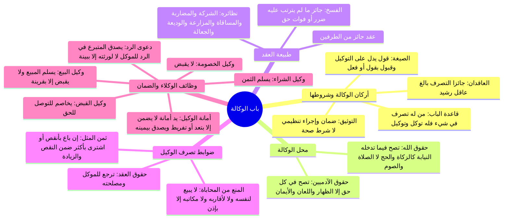

# 00 - الفهرس والخطة: المحاضرة 12 من كتاب أخصر المختصرات (باب الوكالة)

> [!info] بيانات المحاضرة
> - **الكتاب:** [[أخصر المختصرات]] في الفقه على مذهب الإمام أحمد بن حنبل للعلامة [[ابن بلبان الحنبلي]].
> - **الباب والموضوع:** الشروع الكامل في **باب الوكالة**:
>   1. حقيقة الوكالة، شروط صحتها، صيغتها (بالقول أو الفعل الدال عليها)، والفرق بين الانعقاد الشرعي والتوثيق الإداري، وشرط العاقدين (جائزي التصرف)، وما تصح فيه الوكالة من حقوق الآدميين ومستثنياتها (الظهار، اللعان، الأيمان)، وما تدخله النيابة من حقوق الله.
>   2. تكييف الوكالة كعقد جائز، والتفريق الأصولي بين العقود اللازمة والجائزة، واستعراض العقود الجائزة في المذهب (الشركة، المضاربة، المساقاة، المزارعة، الوديعة، الجعالة)، وضابط الضرر في فض الشركة، والتفريق بين مقتضى الشرع والفضل والعِشرة.
>   3. ضوابط تصرف الوكيل: منع بيعه لنفسه أو شرائه منها بلا إذن، ومنع البيع للأصول والفروع والزوجة والمكاتب لنفس العلة (التهمة وتعارض المصالح)، وحكم بيعه بأنقص أو شرائه بأكثر وضمان الفرق، وقاعدة تعلق العقود ومصالحها بالموكل لا الوكيل.
>   4. أحكام التسليم والقبض والتخاصم (وكيل البيع، وكيل الشراء، وكيل الخصومة، وكيل القبض)، ويد الوكيل كيد أمانة وضوابط عدم الضمان إلا بالتعدي أو التفريط، وسماع قوله بيمينه في نفيهما وفي الهلاك، والفارق بين المتبرع وبأجر في دعوى الرد للموكل أو الورثة، وأحكام الأجرة والعمولة.
> - **المصدر المعتمد:** [[تفريغ المحاضرة 12]] — لا توجد توقيتات زمنية مسجلة بالتفريغ، المرجع المعتمد هو أرقام الأسطر (1 – 521).

---

## 📋 خطة الأجزاء وتوزيع الأسطر

| رقم الجزء | عنوان الجزء | نطاق الأسطر بالتفريغ | المحاور والمسائل الأساسية |
|:---:|:---|:---:|:---|
| **01** | [[01 - عقد الوكالة شروطه وصيغته وما تصح فيه من الحقوق]] | 1 – 64 | حكمة مشروعية الوكالة وتيسير الشريعة، صيغة الإيجاب والقبول قولاً وفعلاً، الفرق بين التوثيق الإداري والانعقاد الشرعي، شرط كونهما جائزي التصرف، قاعدة من له تصرف فله توكل وتوكيل، ما تصح فيه من حقوق الآدميين واستثناء الظهار واللعان والأيمان، وما تصح فيه من حقوق الله تدخله النيابة. |
| **02** | [[02 - لزوم العقود وجوازها وتطبيقات العقود الجائزة في الفقه]] | 65 – 179 | تكييف الوكالة كعقد جائز، الفرق بين العقود اللازمة والجائزة وأقسامهما، استعراض العقود الجائزة (الشركة، المضاربة، المساقاة، المزارعة، الوديعة، الجعالة)، ضابط انتفاء الضرر بفوات الربح المتوقع عند فض الشركة، التفريق بين الحكم الشرعي والعِشرة والفضل. |
| **03** | [[03 - ضوابط تصرف الوكيل والمنع من محاباة النفس والقرابة وضمان الثمن]] | 180 – 328 | منع الوكيل من البيع لنفسه أو الشراء منها بلا إذن لموطن التهمة، منع البيع للأب والأم والابن والزوجة والمكاتب، أثر الإذن الصريح، بيع الوكيل بأنقص من ثمن المثل أو الشراء بأكثر وصحة العقد مع ضمان الفرق، رد الفضل والوفر للموكل، وقاعدة تعلق مصلحة العقد بالموكل. |
| **04** | [[04 - أحكام التسليم والقبض والتخاصم وأمانة الوكيل والدعاوى]] | 329 – 521 | وظائف الوكلاء (وكيل البيع يسلم ولا يقبض إلا بقرينة، وكيل الشراء يسلم الثمن، وكيل الخصومة لا يقبض، وكيل القبض يخاصم)، يد الوكيل يد أمانة ولا يضمن إلا بتعدٍّ أو تفريط، تصديق الوكيل بيمينه في نفيهما وفي الهلاك، دعوى رد المتبرع للموكل لا لورثته إلا ببينة، وأحكام العمولة والأجرة. |
| **05** | [[05 - خطة تطبيق الدروس]] | ملحق تطبيقي | خطوات تنفيذية عملية بمربعات اختيار للمسائل والمعاملات المالية والتوكيلات المعاصرة المستفادة من المحاضرة. |
| **—** | [[ملخص المراجعة السريعة]] | مراجعة شاملة | جداول مقارنة وقواعد وضوابط فقهية مركزة لاستذكار باب الوكالة كاملاً في دقائق. |
| **—** | [[أسئلة المراجعة والاختبار الذاتي]] | تقييم الفهم | بنك أسئلة موضوعية ومسائل فقهية تطبيقية مع حلول نموذجية مطوية. |
| **—** | [[باب_البيع_المحاضرة_12_ملف_مجمع]] | ملف شامل | الجمع الكامل لنصوص المتحدث الحرفية لجميع الأجزاء مع الشرح المنظم وخالياً من الاختبارات والمراجعة. |

---

## 🗺️ خريطة المفاهيم العامة للمحاضرة

---

## 🔑 المفاهيم والكلمات المفتاحية (WikiLinks)

- [[الوكالة]]
- [[جائز التصرف]]
- [[العقود الجائزة]]
- [[العقود اللازمة]]
- [[حقوق الآدميين]]
- [[حقوق الله]]
- [[الظهار]]
- [[اللعان]]
- [[الأيمان]]
- [[النيابة في العبادات]]
- [[ثمن المثل]]
- [[تعارض المصالح]]
- [[يد الأمانة]]
- [[التعدي والتفريط]]
- [[وكيل الخصومة]]
- [[وكيل القبض]]
