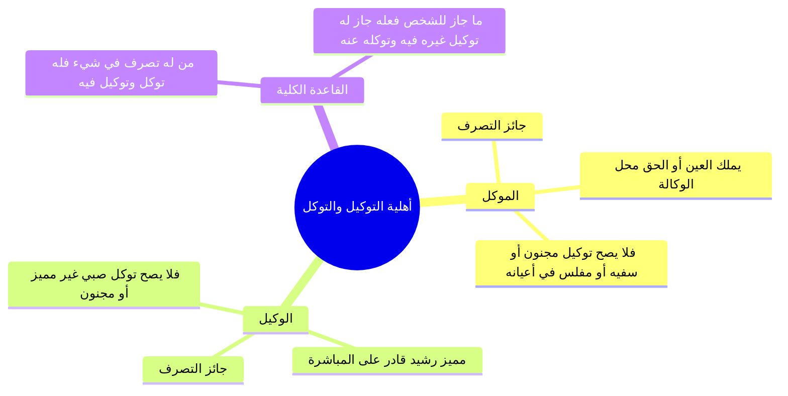

# 01 - عقد الوكالة شروطه وصيغته وما تصح فيه من الحقوق (الأسطر 1 – 64)

> [!abstract] محاور الجزء
> - **حكمة مشروعية [[الوكالة]]:** التيسير ورفع الحرج؛ لعجز الإنسان عن مباشرة جميع شؤونه ومصالحه بنفسه.
> - **صيغة انعقاد الوكالة وقبولها:** اشتراط قول دال على التوكيل، وصحة القبول بالقول أو بالفعل الدال عليه.
> - **الفرق بين الانعقاد الشرعي والتوثيق الإداري:** التوثيق وسيلة تنظيمية وضمانة لحفظ الحقوق عند فساد الذمم وليس شرط صحة.
> - **شرط العاقدين:** كونهما جائزي التصرف، وتطبيق قاعدة: «من له تصرف في شيء فله توكل وتوكيل فيه».
> - **ما تصح فيه الوكالة من حقوق الآدميين:** صحتها في كل حق آدمي إلا ثلاثة: الظهار، واللعان، والأيمان.
> - **ما تصح فيه الوكالة من حقوق الله:** انقسامها إلى ما تدخله النيابة (كالزكاة والحج) وما لا تدخله (كالصلاة والصيام).

---

### 1. تعريف الوكالة وحكمتها وصيغتها

- ا حكمة المشروعية: شُرعت الوكالة تيسيراً وتوسعةً على العباد، إذ لا يستطيع الإنسان بطاقته الفردية القيام بجميع حوائجه ومصالحه، فأباحت الشريعة إنابة الغير ليقوم مقامه.
- ا صيغة الانعقاد والقبول:
  - **الإيجاب:** لابد فيه من **قول يدل على التوكيل** (مثل: «وكلتك تبيع لي كذا»، «اشترِ لي الشيء الفلاني»، «قُم مقامي في كذا»).
  - **القبول:** يصح بـ **القول** (مثل: «قبلت»، «حاضر»، «على عيني ورأسي») أو بـ **الفعل الدال عليه** (كمباشرة الشراء أو البيع فوراً دون تلفظ بالقبول).

---

### 2. الفرق بين انعقاد العقد وتوثيقه الإداري

| وجه المقارنة | الانعقاد الشرعي للعقد | التوثيق الإداري (الرسمي) |
|:---|:---|:---|
| **الحقيقة والماهية** | توافر الأركان والشروط الشرعية (إيجاب، قبول، أهلية، خلو من الموانع). | تسجيل العقد في السجلات الرسمية وإثباته كتابياً (كالشهر العقاري أو المحكمة). |
| **الأثر والحكم** | ينعقد به العقد شرعاً وتترتب عليه آثاره وحقوقه أمام الله عز وجل. | وسيلة إجرائية لحفظ الحقوق وقطع المنازعات عند فساد الذمم؛ وليس شرطاً لصحة العقد. |
| **المثال التوضيحي** | عقد النكاح المستوفي للولي والشهود والمهر ينعقد شرعاً وإن لم يوثق عند المأذون. | توكيل المحامي كتابةً تطلبه المحاكم إدارياً لإثبات الصفة ومنع ادعاء الوكالة بغير حق. |

---

### 3. شروط العاقدين وقاعدة الباب الكلية

- ا معنى «جائز التصرف»: هو الحر، البالغ، العاقل، الرشيد، غير المحجور عليه لسفه أو جنون أو فلس (فيما يتعلق بأعيان ماله).
- ا قاعدة الباب الكلية: **«من له تصرف في شيء فله توكل وتوكيل فيه»**؛ فكل تصرف يملكه الإنسان أصالةً لنفسه، جاز له أن يوكل غيره فيه، وجاز له أن يقبل الوكالة عن غيره فيه.

---

### 4. ما تصح فيه الوكالة ومستثنياتها

#### أولاً: حقوق الآدميين
تصح الوكالة في **كل حق آدمي** (كالبيع، الشراء، الإجارة، النكاح، الخلع، الطلاق)، **إلا ثلاثة أمور**:

| المستثنى | علة المنع من التوكيل فيه |
|:---|:---|
| **1. [[الظهار]]** | محرم ومنكر من القول وزور أصالة، والوكالة لا تنعقد على فعل محرم قط؛ فلا يصح أن يقول: «ظاهر عني من امرأتي». |
| **2. [[اللعان]]** | أيمان وشهادات مخصوصة ومرتبطة بالأعيان والضمائر لدفع حد القذف؛ فلا يقوم غير الزوجين مقامهما فيها. |
| **3. [[الأيمان]]** | اليمين مبناها على نية الحالف وبراءته القلبية الذاتية، ولا تنوب ذمة عن ذمة في الحلف بالله. |

#### ثانياً: حقوق الله عز وجل
تنقسم حقوق الله عز وجل بحسب دخول النيابة فيها إلى قسمين:
- **ما لا تدخله النيابة:** العبادات البدنية المحضة المرتبطة بذات المكلف (كالصلوات الخمس، وصيام شهر رمضان)؛ فلا تصح الوكالة فيها بحال.
- **ما تدخله النيابة:** العبادات المالية أو المركبة التي أذن الشارع في الإنابة فيها (كتفريق [[الزكاة]]، و[[الحج]] والعمرة عن المعضوب العاجز بدنياً)؛ فتصح الوكالة فيها شرعاً.

---

### 📝 نص المتحدث الكامل (الأسطر 1 – 64)

وقبولها بقول او فعل دال عليه، بدا يتكلم عن الوكاله، والوكاله ايضا من تيسير هذه الشريعه لان العبد لا يقدر ان يقوم بكل حوائجه بنفسه، فاجاز واباح مساله ان الوكاله ان توكل غيرك ليقوم ببعض مصالحك. فقال: **الوكاله حتى تصح لابد فيها من القول الدال على التوكيل**، فلابد ان انا اقول لك: انا وكلتك انك تجيب لي شيء فلاني، او خد روح اشتري الشيء الفلاني، او الله يكرمك خذ مقامي في المكان الفلاني، اذا لابد في الوكاله من قول يدل على التوكيل خلاص. 

وايضا لابد ان **الوكيل يقبل هذا بالقول او بفعل دال عليه**، جيت انا قلت لك: انا وكلتك مثلا انك تبيع لي حته الارض ديت، فقلت لي: ماشي على عيني على راسي حاضر يعني حط في بطنك بطيخه صيفي، اه القول ده دال على قبول الوكاله ولا لا؟ اه. او فعلا، قلت له خد اشتري لي الشيء الفلاني، من غير ما يقول راح اشتراها لي، راح عمل لي اللي انا طلبته منه، هيبقى ده قبول للوكاله بماذا؟ بالفعل. 

انا جاي رايح موكل محامي عشان خاطر في مشكله في مثلا هيئه من الهيئات اداره من الادارات، فباجي اقول له يا متر انا عايزك تعمل لي العمل الفلاني وانا هوكلك عشان تقوم مقامي، فبدل ما انا قلت له هذا وهو قبل، اصبحت هذه الوكاله. طبعا بقى هيجي يقول: التوثيق، **التوثيق شيء وانعقاد الوكاله شيء اخر**، يعني هل من شروط الوكاله التوثيق؟ لا، هو في المحاماه اه دي امور اداريه عشان خاطر المصالح تستقيم، لان انا لو جيت وكلت فلان كده بمجرد الكلام من غير توثيق، طب جه امام المحكمه مش هينفع، هيقول له: انا وكيل عن فلان، ايه اللي يدل يا استاذ؟ ما هو قال لي، الكلام ده ما ينفعش، لازم تجيب شيء يوثق مستند يبين ان هو وكلك، عشان كده في فرق بين التوثيق وانعقاد العقد. 

دلوقتي جاء رجل وتزوج امراه باركانها وشروطها: في ولي، في شهود، ما فيش موانع، في مهر، في كل حاجه، وعقد العقد، انعقد النكاح ولا لم ينعقد؟ انعقد. طب لم يوثق عند المأذون؟ اصبحت دي مراته ولا مش مراته؟ مراته، زوجته وامام الله عز وجل زوجته وحقها ثابت، لكن التوثيق لما فسدت الذمم بدانا الامور الاداريه دي، دي اسمها من باب الوسائل او الامور الاداريه عشان حفظ الحقوق، ولذلك **صحه العقد ليست موقوفه على التوثيق، لكن التوثيق ضمان وتقويه لهذه العقود**، خالص يا مشايخ.

قال: **وشرطه كونهما جائز التصرف**، اللي هيوكل والوكيل لابد ان كل واحد منهم جائز التصرف. انا هاجي اوكلك في بيع ارض، هو انا اصلا ينفع ان انا ابيع الارض ديت؟ اه يبقى ينفع اوكل، لا ما ينفعش يبقى ما ينفعش اوكل. حته الارض ديت بتاعه جاري، دي ملكي ولا مش ملكي؟ مش ملكي، ينفع اتصرف فيها؟ لا، طب ينفع ان انا اوكل غيري يبيعها؟ لا لان انا اصلا لا يجوز لي التصرف فيها. او ان انا اصلا نفسي مجنون، او ان انا غير مميز غير عاقل، او ان انا محجور عليا، ما هو كل ده غير جائز التصرف، فالمحجور عليه ما ينفعش يوكل غيره، او ان انا نفسي سفيه مجنون عيل صغير ما ينفعش ان انا ابقى وكيل لغيري، يبقى لابد من الموكل والوكيل ان يكون جائز ماذا؟ التصرف.

قال: **من له تصرف في شيء فله توكل وتوكيل فيه**، ما دام يجوز ان انا اتصرف ويجوز ان انا ابيع واشتري يبقى يجوز ان انا ابقى وكيل، ان انا ابقى وكيل ما جراش حاجه واضح مشايخ؟ ومن له تصرف في شيء فله توكل وتوكيل فيه، يعني لان هو يوكل ويبقى وكيل، يوكل غيره يبقى هو وكل، وواحد تاني يجي يوكله يبقى اصبح وكيل خلاص.

طيب خلاص كده عرفنا الوكاله، قال لي: الوكاله بقى تصح في ايه؟ هوكلك في ايه وانت هتوكلني في ايه، وانا هبقى وكيل في ايه؟ قال: **وتصح في كل حق ادمي**، ثم بقى ايه «كل» ده من اقوى صيغ العموم يعني تشمل كل حق للادمي، ثم جاء وخصص هذا العموم قال: **لا ظهار ولعان وايمان**، يبقى القاعده الاولى: تصح الوكاله في كل حق للادمي الا في الظهار واللعان والايمان. انا دلوقتي اقدر اوكلك في البيع والشراء؟ اه، طب ينفع ان انا اوكلك في عقد زواجي؟ نعم، يعني انا مثلا في مصر وعندي مثلا امراه عايز اتجوزها في المغرب، ممكن اوكل واحد في المغرب يبقى وكيل عني ويعقد عليها؟ نعم ينفع. طب ينفع ان انا اوكل واحد مثلا ان هو ياجر لي شقه في اسوان؟ ينفع. يبقى كل حق للادمي يجوز ان انا اوكل فيه وابقى وكيل فيه. 

قال لي: لا ظهار، طب ينفع اوكل في الطلاق؟ اه، يعني انا ممكن اوكل واحد زي كده اقول لابويا: يا يابا انا وكلتك طلق زوجتي طلق فلانه، يقوم يروح يطلقها وهو وكيل عني، ده انا ممكن اقول لامي طلقيها، ده انا ممكن اوكل الزوجه نفسها ان هي تطلق نفسها. قال لي: لا ظهار، طب ينفع ان انا اوكل محامي او والدي او اخي ان هو يظاهر مكاني؟ قال لي: لا، ليه؟ ما هو ده حق ادمي ولا مش حق ادمي؟ حق ادمي، ليه بقى؟ لان اصلا الظهار حرام، الظهار ايه؟ حرام، فلا يجوز اصلا ان الوكاله تنعقد عن امر محرم، فما ينفعش ان انا اقول: بص لو انت عايز بقى تظاهر منها قل لها انت علي كظهر امي، ما ينفعش لان اصلا الظهار حرام خلاص.

ولعان: اللعان ان واحد شاف امراته مع رجل غريب زنى بها وما عندوش شهود، وجه راح الامر للقاضي: عندك شهود؟ لا ما عنديش شهود، يبقى لابد من الملاعنه، ماشي على بركه الله، فقال: انا بدل ما انا الاعن انا هعمل ايه، هوكل محامي روح انت يا محامي لاعن مكاني، ما ينفعش لان الملاعنه دي ايمان، والايمان تتعلق بالاعيان ما ينفعش حد يقوم مقام صاحب اليمين واضح.

وكذلك وايمان: لان اللعان في معناه، والايمان بقى انا دلوقتي عليا يمين، ما ينفعش ان حد غيري يحلف عني: احلف عني يابا ما ينفعش، طب احلف عني يا متر ما ينفعش، ولذلك في الايمان لابد ان صاحب اليمين بنفسه هو اللي يحضر يحلف واضح، يبقى خلصنا كده: في كل حق ادمي الا هذه الثلاثه.

قال: **وفي كل حق لله تدخله النيابه**، دي يعتبر بقى اعمال قلبيه، ولان اليمين على نيه الحالف فلابد فيها من النيه فما ينفعش غيري ينوي عني، والظهار لانه حرام ماشي. قال: وفي كل حق لله تدخله النيابه، حقوق الله بتنقسم الى قسمين: ما تدخله النيابه وما لا تدخله النيابه. مثلا الصلوات الخمس تدخلها النيابه؟ يعني جيت تعبان كده باقول لك: الله يرضى عليك يا عبد الله خد بس 50 جنيه وصلي مكاني المغرب النهارده، ينفع؟ لا، لكن في بعض الحقوق تجزئ فيها النيابه زي ايه؟ زي مثلا ان اوكلك انك توصل زكاه مالي للفقير، هي دي عباده ولا مش عباده؟ عباده، اخراج الزكاه واجب، لما يوصلها نيابه عني ينفع، او ان الفقير يوكل احد: روح خذ زكاتي من فلان، ينفع. واحد مثلا معضوب مريض من العجزه ما يقدرش يحج، ينفع انه ينيب مكانه من يحج عنه؟ يبقى ينفع تنفع الوكاله هنا، وفي كل حق لله تدخله النيابه. طب ينفع في رمضان اقول لواحد يصوم عني؟ لا، يبقى انت بتنظر في هذه الحقوق التي هي لله، اذا كانت تدخلها النيابه يبقى يجوز التوكيل فيها خلاص، نعم.
