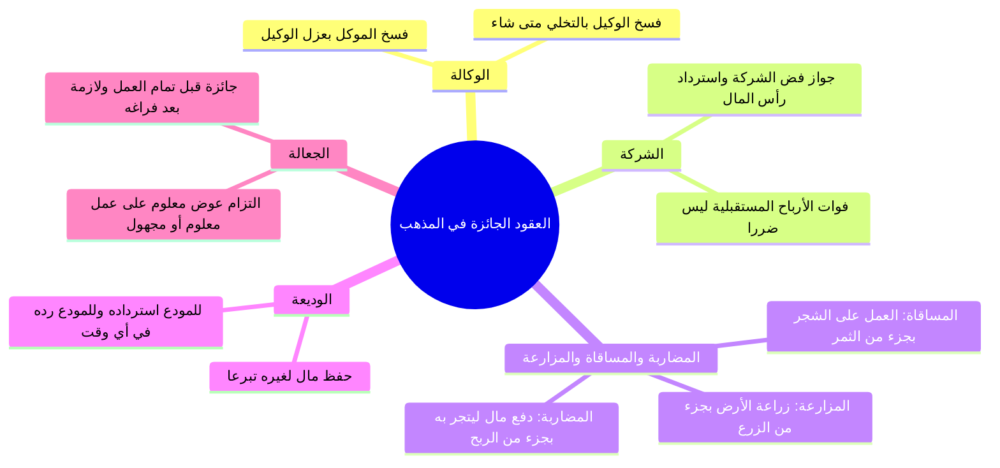

# 02 - لزوم العقود وجوازها وتطبيقات العقود الجائزة في الفقه (الأسطر 65 – 179)

> [!abstract] محاور الجزء
> - **تكييف عقد [[الوكالة]]:** عقد جائز من الطرفين، يجوز لكل منهما فسخه متى شاء.
> - **أقسام العقود من حيث اللزوم والجواز:** بيان حد العقد اللازم والجائز، وأن اللزوم والجواز قد يكون من طرفين أو من طرف واحد.
> - **تطبيقات العقود الجائزة في الفقه الحنبلي:** الوكالة، الشركة، المضاربة، المساقاة، المزارعة، الوديعة، الجعالة.
> - **ضابط الفسخ في الشركة وانتفاء الضرر:** جواز فض الشركة متى شاء أحد الشركاء، وأن فوات الربح المتوقع ليس ضرراً شرعياً يمنع الفسخ.
> - **التفريق بين الحكم الشرعي والعِشرة:** وجوب محاسبة الناس بأحكام الشريعة لا بمشاعر العِشرة والفضل.

---

### 1. تقسيم العقود إلى لازمة وجائزة

بين المحاضر الضابط الفقهي الكلي للفرق بين العقود اللازمة والجائزة:

| نوع العقد | الضابط والحقيقة الفقهية | جهة اللزوم والجواز | أمثلة فقهية |
|:---|:---|:---|:---|
| **العقد اللازم** | ما لا يجوز لأحد الطرفين فسخه أو الرجوع فيه بمفرده إلا برضا الآخر أو بمسوّغ شرعي (كخيار عيب). | قد يكون لازماً من الطرفين، أو من أحدهما فقط. | - **البيع:** لازم من الطرفين بعد التفرق. - **الرهن:** لازم في حق الراهن، جائز في حق المرتهن. |
| **العقد الجائز** | ما يجوز لكل من العاقدين (أو أحدهما) فسخه والرجوع عنه متى شاء دون توقف على رضا الطرف الآخر. | جائز من الطرفين بأصل وضعه الشرعي. | - [[الوكالة]]، [[الشركة]]، [[المضاربة]]، [[المساقاة]]، [[المزارعة]]، [[الوديعة]]، [[الجعالة]]. |

> ⚠️ ا استثناء من جواز فسخ الوكالة: إذا ارتبط بفسخ الوكالة حق لغير العاقدين أو ترتب على الفسخ ضرر متيقن مفسد لمصالح معتبرة، فإن المنع حينئذ يثبت لقاعدة «لا ضرر ولا ضرار» العارضة، لا لخروج الوكالة عن كونها عقداً جائزاً بأصلها.

---

### 2. منظومة العقود الجائزة في الفقه الحنبلي

---

### 3. مسائل وضوابط تفصيلية في العقود الجائزة

#### أ. فض الشركة وفوات الأرباح المتوقعة
- ا الحكم: يجوز لأي شريك في أي وقت أن يطلب فض الشركة وتصفيتها وأخذ رأس ماله وحصته، ولا يملك الشريك الآخر إجباره على البقاء.
- ا تحرير مناط الضرر: احتج بعضهم بأن الخروج يفوت ربحاً متوقعاً (كنقص الأرباح من 100 ألف إلى 10 آلاف)؛ ورد المحاضر بأن **فوات الربح المتوقع ليس ضرراً شرعياً**؛ لأن الأرباح مظنونة ومقدرة بيد الله، والضرر المعتبر شرعاً هو الإتلاف الفعلي للمال القائم.

#### ب. عقد الجعالة بين الجواز واللزوم
- ا قبل إتمام العمل: عقد جائز؛ فيجوز للجاعل أن يرجع في جعله (كأن يقول: من رد ابني فله 100 ألف، ثم يرجع قبل أن يجده أحد).
- ا بعد إتمام العمل: يتحول إلى عقد لازم؛ فإذا وجد الشخص الابن الضائع وسلّمه، لزم الجاعل دفع الـ 100 ألف كاملة دون خيار.

---

### 4. قاعدة تربوية فقهية: التفريق بين حكم الشرع وحق العِشرة

- ا الضبط الشرعي: الشريعة جاءت لتحسم النزاع؛ فإذا مارس المسلم حقه الشرعي في فسخ عقد جائز (كرد وديعة أو فسخ وكالة أو فض شركة)، فلا يجوز للطرف الآخر أن يتشاحن معه أو يعاديه بحجة العِشرة.
- ا التنبيه: «العِشرة فضل وإحسان، والأحكام الشرعية عدل وميزان»؛ والخطأ الشائع محاسبة الناس بالعِشرة والمطالبة بالفضل كأنه واجب لازم، مما يورث القطيعة والخصومات.

---

### 📝 نص المتحدث الكامل (الأسطر 65 – 179)

قال: صلي بنا على النبي بقى، صلى الله عليه وسلم. قال: **العقود بتنقسم الى قسمين: عقود لازمه وعقود جائزه**. اللازمه هي ما لا يجوز لاحد الطرفين او لاحدهما ان هو يفسخ او يرجع في العقد، لا يتمكن من رفعه بمفرده، والجائز ما يجوز ذلك. واللزوم قد يكون من الطرفين او من طرف واحد، والجواز قد يكون من الطرفين او من طرف واحد.

فنيجي دلوقتي: **عقد الوكاله ده عقد لازم ولا جائز؟ جائز**. جائز يعني ايه جائز؟ يعني يجوز ان انا الغيه، انا جيت عملت لك توكيل وبعد يومين ثلاثه: معلش يا متر لو سمحت انا عايز التوكيل بتاعنا فسخت الوكاله، لا والله ما ينفعش؟ لا، ماشي من حقك، لان عقد الوكاله ماذا؟ جائز. المحامي بعد ما عملت له التوكيل جاء يتصل بي قال لي: والله معلش انا مش هقدر اقوم لك بالقضيه ديت خد توكيلك، جائز ولا لازم؟ جائز. 

قال لي: بس خلي بالك، وانا بقول لك كده احكام عامه لابد تعرف ان بعض الامور قد يرتبط بها حقوق من جهه اخرى، فاذا كانت الوكاله فسخ الوكاله سيترتب عليه مفاسد وكده، اه يبقى هيجي النهي مش من اجل ان عقد الوكاله جائز، لا من اجل امر اخر، عشان كده الفقيه لا ينظر الى حكم واحد من جهه واحده، لكن ينظر الى مجموع المساله. 

فقال: يبقى الوكاله ده عقد جائز ولا لازم؟ جائز. 

طب **والشركه**؟ عملت شركه خلاص واحنا مع بعض الشركاء على اساس احنا قاعدين نبقى سنتين ثلاثه، بعدين جيت والله بعد خمس ست اشهر تقول: والله يا صاحبي انا مش هقدر اكمل، انا محتاج الفلوس بتاعتي وعايز افض الشركه ديت، يجوز ولا لا يجوز؟ يجوز، لان **عقد الشركه جائز**. لا ده فض الشركه دي ده تخريب بيتنا! يبقى المنع هنا مش من اجل الشركه ده من اجل ما يترتب عليه. لا بس انا لو هو خرج انا مش هكسب، لا، مش هكسب ده ليس ضررا، ده لو انت لما نبقى مع بعض انا هنكسب اخر السنه 100,000، انت لو فضيت الشركه ده انا مش هكسب 10,000 جنيه على بعض! ده امر اخر ده ليس ضروره ده ليس ضررا، لان الربح والخساره دي امر مقدر عند الله تبارك وتعالى، يبقى الشركه عقد جائز.

**والمضاربه** برضه بنفس الطريقه: اديتك قرشين وقلت لك خد تاجر بالفلوس ديت نجيب قماش نجيب معدات ونتاجر ونكسب كده على بركه الله، وجيت بعد ما اديتك الفلوس والمضارب يا دوب شهرين ثلاثه تقول لك: لو سمحت انا محتاج القرشين بتوعي ونفض المضاربه دي، جائز سواء من احد الطرفين واضح.

طب **والمساقاه**؟ برضه انا عندي حته ارض وعندي ارض بزرعها، فجبت واحد يقوم على سقي هذا الزرع ويقوم على مصلحته، يجوز، العقد ده جائز ولا لازم؟ جائز، يبقى يجوز ان صاحب الارض يقول لي: خلاص انا والله يكفي كده، وللعامل اللي هو جه عقد معاه العقد ان هو يرجع ويقول: خلاص كفايه كده، وياخد على قدر عمله او كما سياتي ان شاء الله تبارك وتعالى.

وكذلك **المزارعه**: ان انا بدي له حته ارض وادي له فيها البذر بتاعه ويقعد يزرعها، وبعد ما يزرعها ياخد قدر معين من الزرع، طب ده عقد لازم ولا جائز؟ جائز.

**ووديعه**: جيت انا اودعت عندك 200,000 او 300,000 جنيه او سياره او مش عارف جرامات ذهب، ده عقد جائز ولا لازم؟ جائز، ينفع ان انا اجي بعد يومين ثلاثه اقول: لو سمحت اديني وديعتي، او تقول لي: خد يا عم وديعتك. يعني ايه لازم؟ لازم يعني لا يجوز ان انا ارجع في العقد، لا يجوز ان انا ارفع العقد افسخ العقد واضح. 

انا جيت دلوقتي انت اتجوزت مراتك وتم الايجاب والقبول خلاص. بلاش ده، البيع: انت رحت اشتريت مكنه موتوسيكل وخدت المكنه ورحت رخصت، العقد ده بيع ولا مش بيع؟ بيع، لازم ولا جائز؟ لازم، ينفع بعد انت ما اخدت المكنه وما فيهاش اي عيوب ولا اي حاجه تروح لصاحب المكنه اللي باعها لك تقول: والله انا بصراحه خد المكنه بتاعتك واديني فلوسي؟ لا. طب ينفع اللي باع لك يجي لك بعد ما انت اخدت المكنه ورخصت وعملت يقول لك: والله المكنه دي تلزمني خد فلوسك واديهاني؟ لا، ليه؟ لان العقد ده لازم. 

لكن ده انا جيت شلت عندك المكنه بتاعتي اودعتها عندك وديعه، هتيجي انت تقول لي قدامي شهرين ثلاثه واجيك ماشي، جيت انا تاني يوم قلت لك: لو سمحت يا عم الشيخ اديني المكنه بتاعتي، تقول لي: لا احنا قلنا شهرين وثلاثه انت جاي بعد يومين؟! لا، طب انا قلت لك خد شيل عندك المكنه ديت شهرين ثلاثه، انت جيت تاني يوم قلت لي: والله يا سيدنا انا مش هقدر ده انا عندي ظروف تعال خد مكنتك، يجوز ولا لا يجوز؟ يجوز، لان ده عقد جائز خلاص، فالعقد الجائز يجوز لكل منهما او لواحد منهما الفسخ واضح المشايخ.

قال: **وجعاله**، ايه الجعاله؟ ان مثلا ضاع عيل من عيالي او حاجه ضاعت مني، قلت: يا اخوانا اللي هيجيب لي ابني ليه عندي 100,000 جنيه، دي اسمها جعاله، فانت جيت قلت: انا هروح اجيب لك ابنك، روح، وبعد نص ساعه قلت: خلاص انا رجعت مش هدور، او انا نفسي قبل ما يلاقوا ابني قلت: يا اخوانا حكايه ان انا هدي 100,000 جنيه مش هدي حد حاجه خلاص انا رجعت وفسخت هذا العقد، يجوز ولا لا يجوز؟ يجوز، لكن لو لقى ابني وسلمه لي يلزم دفع الـ 100,000 جنيه واضح.

ووديعه وجعاله عقود جائزات، يعني لكل فسخها فيها اشكال؟ لا. وده بقى لما تعرفه ما نتخانقش مع بعض ونتشاكل ونتخاصم انا وانت، العقد دوت لازم ولا جائز؟ جائز، ما تزعلش، بس ده ما كانش العشم فيك، العشم ده حاجه والاحكام الشرعيه حاجه ثانيه، والعشم ما يزعلكش لان العشم ده فضل ده فضل. ده انا والله كنت مستني ان انت تقف معايا والناس ما وقفتش، ما تزعلش، امتى تزعل وتخاصم؟ لما انا اخد حقك. احنا مشكلتنا في هذه الاوقات ان احنا بنحاسب الناس بالعشم وعلى طلب الفضل.

الله اكبر الله اكبر، اشهد ان لا اله الا الله، اشهد ان محمدا رسول الله، حي على الصلاه، حي على الفلاح، الله اكبر الله اكبر، لا اله الا الله.
