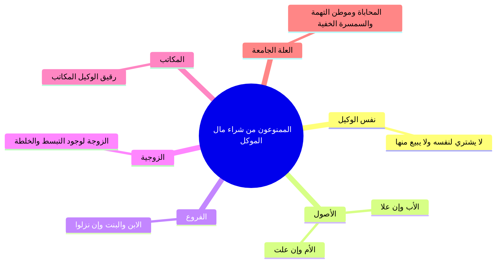

# 03 - ضوابط تصرف الوكيل والمنع من محاباة النفس والقرابة وضمان الثمن (الأسطر 180 – 328)

> [!abstract] محاور الجزء
> - **منع الوكيل من التعاقد مع نفسه:** بطلان بيعه لنفسه أو شرائه منها بلا إذن، وتحرير علة التهمة وتعارض المصالح.
> - **منع البيع للأقارب والمكاتب:** سريان حكم المنع على الأب، والأم، والولد، والزوجة، ومكاتب الوكيل لاتحاد العلة.
> - **أثر الإذن الصريح:** صحة التصرف ونفوذه إذا أذن الموكل صراحةً ببيعه لنفسه أو لأقاربه.
> - **التصرف بغير ثمن المثل:** حكم البيع بأنقص من ثمن المثل أو الشراء بأكثر منه، وصحة العقد مع ضمان الوكيل للفرق.
> - **حكم التوفير في الشراء:** عودة الوفر والمصلحة للموكل لا للوكيل، وقاعدة: «حقوق العقد ومصالحه تعود للموكل».

---

### 1. منع الوكيل من البيع لنفسه أو الشراء منها بلا إذن

- ا الحكم الفقهي: لا يصح للوكيل أن يبيع عين مال موكله لنفسه، ولا أن يشتري من ماله لنفس موكله إلا بإذن صريح سابق.
- ا العلة الفقهية (موطن التهمة): 
  - اجتمعت في الوكيل مصلحتان متعارضتان: صفته وكيلاً تقتضي تحصيل أقصى ربح لموكله، وصفته مشترياً لنفسه تدفعه للاسترخاص والاستحواذ.
  - حتى وإن كان الوكيل أميناً ودفع القيمة العادلة بالسوق، فإن الشريعة علقت الحكم بالمظنة لسد أبواب الطمع والنزاع.
- ا قاعدة معتبرة: «النية الصالحة وحدها لا تكفي في المعاملات المالية»؛ فلو اشترى الوكيل الأرض لنفسه ليعجل فك ضائقة موكله، لم يصح البيع إلا بإعلامه واستئذانه الصريح.

---

### 2. دائرة المنع من القرابة والمحسوبين

> 💡 ا استثناء الإذن: كل ما منع منه الوكيل من البيع لنفسه أو لأقاربه مقيد بقول الماتن: **«بلا إذن»**؛ فإن قال له الموكل: «بعها لنفسك أو لأبيك بكذا»، جاز وصح اتفاقاً لسقوط التهمة برضا صاحب الحق.

---

### 3. مخالفة ثمن المثل بالزيادة أو النقصان

إذا وكل شخص غيره في بيع أو شراء مطلقاً، انصرف الإطلاق عرفاً وشرعاً إلى **[[ثمن المثل]] وبنقد البلد حالاً**:

| صورة التصرف | المثال الفقهي | حكم العقد | أثر الضمان على الوكيل |
|:---|:---|:---:|:---|
| **البيع بأنقص من ثمن المثل** | وُكّل في بيع أرض تسوى مليوناً، فباعها بـ 800 ألف دون تفويض. | **صحيح** | **يضمن الوكيل النقص:** يدفع 200 ألف من ماله الخاص لموكله جبراً لتفريطه. |
| **الشراء بأكثر من ثمن المثل** | وُكّل في شراء أرض تسوى مليوناً، فاشتراها بمليون ونصف بغير إذن. | **صحيح** | **يضمن الوكيل الزيادة:** يدفع 500 ألف من جيبه الخاص جبراً للضرر. |
| **الشراء بأقل مما حدده الموكل** | قال له الموكل: اشترها بـ 10، فاشترى بحذقه نفس السلعة بـ 8. | **صحيح** | **يرد الوفر (2) للموكل:** ولا يجوز للوكيل أخذ الفضل لنفسه؛ لأن مصلحة العقد للموكل. |

---

### 📝 نص المتحدث الكامل (الأسطر 180 – 328)

جئت وكلتك انك تشتري لي حته ارض او انك تبيع حته ارض، فقلت لك: يا استاذ لو سمحت يا متر عايزك تبيع لي حته الارض دي، وكلتك في هذا البلد، قلت لي: من عينيا. رحت لقيت حته الارض تساوي كام؟ مليون جنيه، طب ما انا اولى بيها! **فينفع ان انا كوكيل ابيع حته الارض دي لنفسي؟ لا**. 

الشيخ ربيع يجي يقول لي ولا الشيخ ايمن: طب ما هي اصلا تساوي مليون جنيه، والراجل الوكيل امين ودافع فيها نفس الثمن اللي هيبيع للغريب، طب ما هو اولى بها ايه اللي يجرى يعني؟ قال: لا، اصل الاحكام الشرعيه من اجل ضبط المعاملات، ممكن بس الاصل وعامه المعاملات بيبقى فيها طمع، فانا لما اوكلك وانت تبيع الارض لنفسك يبقى انت كده في موطن تهمه، موطن ايه؟ تهمه، لان لو واحد راح بايعها باقل من قيمتها هتعمل ايه؟ او انك لو كنت بعتها لواحد غريب كنت اعرف ازود عليه، اه هي تمنها مليون بس انا لو كنت في السوق الفلاني كنت بعت بمليون ومليون و100. اه عشان كده الوكيل ما تجيش: **لا تبيع لنفسك بل ولا ينفع انك تشتري ايضا لموكلك من نفسك**، انا جيت وكلتك عايزك تشتري لي حته ارض، قلت: طب ما انا عندي الحته ديت طب ما انا ابيعها لموكلي، ما ينفعش: لا تبيع لنفسك ولا تشتري من نفسك خلاص.

نعم، مساله هنا يا سيدنا: لو انا اذنت له يعمل كده؟ ما هو عشان كده لابد من الاذن، لو اذن خلاص، انا بقول لك: بيعها حتى لو انت عايز تبيعها لنفسك او تشتريها لنفسك ما جراش حاجه، خلاص انا كده اذنت. لكن هنا المساله فين؟ في عدم الاذن، العقد ينعقد ولا لا ينعقد؟ لو خدنا قدام القاضي القاضي يعمل ايه؟ يبطله، انا ما وكلتوش يشتري ده لنفسه ولا يبيعني من نفسه.

قال لي: لا ده هو مش هيبيع لنفسه ولا هيشتري من نفسه، ده **هيبيع لابيه، هيبيع لامه، هيبيع لابنه، هيبيع لزوجته، هيبيع لمكاتبه** (العبد اللي هو عمل له عقد مكاتبه)؟ قال له: برضه ما ينفعش، ما هي نفس التهمه موجوده، ما انت ده ابوك هتحابيه، هتعمل ايه؟ هتحابيه، ما هو لو كان غير ابوك كنت رحت زودت، او كان مصلحتي انك تبيع للغريب كان هيزود، ولا لامك ولا لمراتك ولا لاولادك، خلاص ياخذوا نفس الحكم لو هو تعامل مع نفسه خلاص. ولذلك: **ولا يصح بلا اذن، بلا اذن، طب اذن؟ خلاص**.

قال لي: طب انا لما جيت قلت لك بيع لي حته الارض، حته الارض بكام؟ بمليون جنيه، رحت انت يا استاذ بايعها بثمن اقل من ثمنها بقد ايه؟ بـ 200,000، جيت قلت له: خد يا ابو السيد عشان بس تعرف ان انا بمشي لك اي حاجه 800,000! قال له: لا ده الارض دي بمليون! قال: بقول لك ايه انت قلت لي بيع الارض، انا بعتها لك ولا ما بعتهاش؟ قلت له: انا لما قلت لك بيع الارض يعني تبيعها بايه؟ تقوم مقامي، هو دي قيمتها مليون ولا 800؟ مليون، يبقى ما ينفعش تبيع بـ 800. لو انت ما لقتش كده المفروض تستأذني بقى، تتصل بي: حاج سيد الارض ما جابتش الا 800,000 ايه رايك؟ طب ما عرفتش توصل لي؟ ما تبيعش لان ده مش ثمنها خلاص. 

جيت انت بقى تقدر تتصل بي ما اتصلتش، **العقد صحيح ولا باطل؟ صحيح، طب الفلوس اللي ناقصه؟ يضمنها، يبقى على الوكيل: ادفع بقى الـ 200,000 جنيه يا ريس خلاص**.

طب اشترى باكثر؟ قلت له: اشتري حته ارض، حته الارض دي قيمتها مليون، راح هو مشتريها بمليون ونصف! ايه ده، لا هي الارض تساوي مليون فقط يا متر، قال: لا انا اشتريتها خلاص بمليون ونصف. نقول: لا، كان قبل ما تشتري بمليون ونصف المفروض تعمل ايه؟ تستأذن لان ده ثمن المثل بتاعها مليون، طب دلوقتي خلاص العقد مش هقدر ارجع الارض معلش، خلاص يبقى عليه الـ 500,000 جنيه، **صح العقد وضمن الزياده نقصا او ضمن زياده او نقصا واضح المشايخ**.

عشان ما حدش يفتكر ان الوكاله ده امر سهل، ان انت اوكلك يبقى انت بتقيم نفسك مكاني، انا لو هاجي ابيع واشتري ينفع ابيع باقل من ثمنه؟ لا، يبقى انت ما تبيعش باقل من الثمن. طب انا عايز اشتري حته الارض دي، انا هشتريها باكثر من ثمنها؟ لا، يبقى انت ما ينفعش تشتري باكثر من ثمنها واضح.

طب هو لو مثلا هي بـ 10 وانا اشتريتها بـ 8، اديها له بـ 8 ولا اديها له بـ 10؟ لا، هي بـ 10 واشتريتها بـ 8 تديله الباقي، لان انت وكيل بس، ليه؟ لان انت كده اقمت المصلحه للموكل، واضح، لان لازم تعرف **القاعده: ان العقود تتعلق بالموكل لا بالوكيل**. دلوقتي انت لما اشتريت بـ 8 العقد ده لمين؟ للموكل، وده ما فيش ضرر عليا يبقى يرجع مصلحته للموكل.

طب الراجل بيقول: انا الموكل ده مزنوق في الفلوس وانا عارف ظروفه، وانا عشان ظروفه انا بعته لنفسي عشان اديله الفلوس عشان الموضوع هياخد وقت في البيع، ايه الضرر كده ما هو كده مصلحه الموكل برضه؟ في الصوره اللي انت بتقولها دي ما فيهاش ضرر، تمام، لكن هي المشكله ان لو انت جيت عملت كده يقول لك: لا ده انت خنتني، ده انت عملت كده عشان عرفت زنقتي! انت في نيتك انك تعمل ايه؟ تفك ضيقته وتقوم على مصلحته، صح؟ عايز تعمل كده استأذنه تمام، ما انت خلي بالك النيه واحده، النيه فقط في المعاملات لا تكفي واضح. ولذلك في المعاملات خليك صريح، حط النقاط فوق الحروف: يا حاج سيد الارض دي تساوي كام؟ مليون، قال: طب انا ممكن اخدها لنفسي بمليون؟ على بركه الله، خلاص خلصنا.
