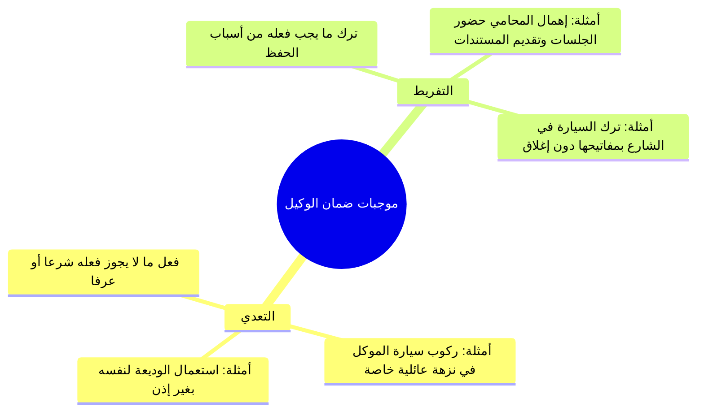

# 04 - أحكام التسليم والقبض والتخاصم وأمانة الوكيل والدعاوى (الأسطر 329 – 521)

> [!abstract] محاور الجزء
> - **صلاحيات الوكلاء في التسليم والقبض:** تفصيل ما يملكه وما لا يملكه وكيل البيع، ووكيل الشراء، ووكيل الخصومة، ووكيل القبض.
> - **يد الوكيل يد أمانة:** انتفاء الضمان إلا بشرطين: التعدي أو التفريط.
> - **دعاوى التلف والهلاك ونفي التفريط:** قبول قول الوكيل بيمينه في نفي التعدي والتفريط ودعوى الهلاك.
> - **دعوى رد العين أو ثمنها:** التفريق بين الوكيل المتبرع وبأجر، وبين الرد للموكل في حياته والرد لورثته بعد موته.
> - **الوكالة بأجر وعمولة:** جواز اشتراط الأجرة وتحديد العمولة اتفاقاً في الوكالات التجارية.

---

### 1. جدول وظائف الوكلاء في التسليم والقبض والتخاصم

| صفة الوكيل | ما يملكه شرعاً بحكم العقد | ما لا يملكه إلا بإذن أو قرينة |
|:---|:---|:---|
| **وكيل البيع** | يسلم المبيع للمشتري. | لا يقبض الثمن إلا بقرينة عرفية (كالكاشير في المحل أو عرف السوق) أو إذن صريح. |
| **وكيل الشراء** | يسلم الثمن للبائع ويقبض السلعة. | لا يجوز له حبس الثمن عن البائع؛ لأن الشراء يتضمن بذل الثمن حتماً. |
| **وكيل الخصومة** | المرافعة والمخاصمة وإثبات الحق قضاءً. | لا يقبض الحق المقضي به؛ فإذا حكم القاضي بالمال انتهت مهمته ولم يملكه. |
| **وكيل القبض** | يخاصم ويرفع الدعوى للتوصل إلى القبض. | ليس له إبراء المدين أو مصالحته على بعض الحق بغير إذن الموكل. |

---

### 2. يد الوكيل وضوابط الضمان (التعدي والتفريط)

- ا القاعدة الكلية: **«يد الوكيل يد أمانة»**؛ فالأمين لا يضمن ما تلف تحت يده بآفة سماوية أو حادث بغير فعله، **ولا يضمن إلا بأحد أمرين**:

---

### 3. أحكام سماع الدعاوى واليمين في الهلاك والرد

| صورة الدعوى | القول المعتمد شرعاً | الحكم والشرط |
|:---|:---:|:---|
| **نفي التعدي والتفريط** | **قول الوكيل** | يقبل قوله؛ لأن الأصل براءته والأمين مؤتمن، وعلى الموكل البينة إن ادعى تفريطه. |
| **دعوى هلاك العين (بآفة)** | **قول الوكيل بيمينه** | يقبل قوله بيمينه؛ لحسم الخصومة وقطع التهمة إن لم يصدقه الموكل. |
| **دعوى المتبرع رد العين للموكل** | **قول الوكيل بيمينه** | يقبل قوله؛ لأنه محسن مؤتمن تبرع بالخدمة، والموكل هو الذي ائتمنه. |
| **دعوى المتبرع رد العين لورثة الموكل** | لا يُقبل إلا ببينة | لا يصدق الوكيل بمجرد قوله؛ لأن الورثة لم يأتمنوه، والأصل بقاء المال في ذمته لهم. |

---

### 4. أحكام الوكالة بأجر والعمولة المعاصرة

- ا مشروعية الأجرة: تصح الوكالة متبرعاً وتصح بأجرة معلومة أو جعالة بنسبة شائعة معلومة بالاتفاق (كالعمولة التجارية: كذا ألف على شراء العقار أو بيعه).
- ا شراء الوكيل من ماله الخاص: إذا قال له: «اشترِ لي كذا وسأحاسبك»، فاشترى الوكيل من ماله الخاص، صار الثمن دَيناً لازماً في ذمة الموكل يجب قضاؤه، وله أجرته أو عمولته المتفق عليها.

---

### 📝 نص المتحدث الكامل (الأسطر 329 – 521)

قال لي: **ووكيل بيع يسلمه ولا يقبض ثمنه الا بقرينه**. انا كده جالس في المعرض، والراجل صاحب المعرض مش موجود، فببيع، فجاء العميل: بكام العربيه دي؟ بمليون، خلاص على بركه الله، بدانا نعمل العقد، اسلمه العربيه ولا ما اسلمهاش؟ اسلمه، لان انا وكيل صح. طب الفلوس بقى مين اللي يدفعها لمين؟ يدفعها لصاحب المعرض. ليه؟ لان الوكيل في البيع يسلم فقط ما ياخدش الفلوس، الا اذا جاء الموكل قال له: استلم الفلوس، او الموكل مش موجود اساسا، يبقى هو وكل المهندس ان يبيع ويقبض خلاص.

خلي بالك احنا بنتكلم على ايه: **متى اذن الموكل للوكيل في تصرف جاز**. فرض المساله: انا دلوقتي مشغلك عندي في الورشه، انت شغال عندي في المعرض بتعمل ايه؟ بتسوق البضاعه، طب الدفع فين، في الخزنه ولا بتدفع لنفس اللي بيسلمك البضاعه؟ اما بتدخل السوبر ماركت مين اللي بيسلمك البضاعه؟ العامل، بكام دي؟ بـ 100 جنيه، الدفع فين؟ عند الكاشير صح، لكن صاحب المحل لو جه وكلني ابيع واسلم واقبض خلاص، ادام في اذن وقرينه وصرحت لك بهذا لا حرج. لكن الاصل ايه؟ ان وكيل المبيع يسلم البضاعه، ولا يقبض الثمن الا بقرينه خلاص.

ده وكيل المبيع، طب **وكيل الشراء**؟ قلت لك اشتري لي حته الارض، هو انت لما تشتري مش لازم يبقى معاك فلوس هتشتري بيها؟ نعم، قال: **ويسلم وكيل الشراء الثمن**، رايح اشتري حته الارض فهكتب الارض لمين؟ للحاج فلان، اتفضل يا باشا الفلوس بتاعتك اهي، يبقى انا وكيل في الشراء وهسلم الثمن واضح.

لا، ده انت بقى **وكيلي في خصومه**، يعني في مشكله بيني وبين جاري على حته ارض، جيت انا للمحامي قلت له: بعد اذنك انا بوكلك عشان تخلص لي المشكله دي والخصومه دي، قال لي: حاضر، ده راح المحكمه رفع الدعوى كسب القضيه، خلاص كده خلصت مهمته، يروح يستلم الارض؟ قال لي: لا، **ووكيل خصومه لا يقبض**، ما يروحش يقبض ولا يستلم الارض، او مثلا لي عندك فلوس فالمحامي راح لحد ما كسب القضيه وثبتت الفلوس في ذمتك خلاص، ليس له ان يروح يقبض المال.

قال لي: طب ده انا وكلتك انك تروح تقبض من الحاج فلان مليون جنيه ثمن الارض اللي انا بعتها له، يبقى انا وكلتك في ماذا؟ في القبض، رحت انت عشان تاخد الفلوس وتقبض المال من الحاج فلان بدا يتلاعب، فهل لي ان انا اروح اخاصم؟ يعني اروح ارفع عليه قضيه ودعوى واروح النيابه؟ قال له: اه، **وقبض يخاصم**، يعني وكيل القبض يخاصم من اجل ان يحصل هذا القبض واضح.

طب انا لما جيت وكلتك في قبض المال، جيت دخلت عليا كده لقيتك متبهدل وهدومك متعفره: الفلوس ضاعت! وانا جاي حصل العربيه وقعت في النيل كل حاجه راحت! طب دوت بقى ايه؟ قال: **والوكيل امين، ادام امين فالامين لا يضمن الا بامرين: بالتعدي او التفريط**. 

ده جايب البضاعه بتاعتك من السوق اللي اشتريتها لك، وانا جاي من على الكوبري العربيه اتقلبت وقعت كل البضاعه في النيل: لا يضمن. ده انا جايب لك العربيه للمعرض وانا جاي حصل ماس في العربيه ولعت راحت: لا يضمن، ليه؟ لان الوكيل امين، والامين لا يضمن الا بالتعدي او التفريط.

لا ده انت لما رحت استلمت العربيه بتاعتي بدل ما تسلمها لي خدت عيالك ورحت رحله للقناطر وانت في الطريق ولعت؟ تضمن، لانك انت تعديت. لا ده انت جيت خدت العربيه بدل ما تحطها جوه الجراج رحت حطيتها في الشارع وسبت المفاتيح جواها واحد جه فتح ومشي؟ تضمن لانك فرطت. ده انا جيت وكلته في قضيه خسرنا القضيه، هل يضمن؟ لا، الا اذا فرط: المحامي ما حضرش الجلسات ما قدمش المستندات، يضمن واضح.

قال لي: طب يا مولانا ده جاي الوكيل يقول لي احنا خسرنا وانا ما فرطتش وقدمت الاوراق كلها، ايه الحكم؟ قال: **القول قوله لان القول قول الامين، ويقبل قوله في نفيهما** (يعني في نفي التعدي والتفريط)، انت ما رضيتش يبقى انت تجيب بينه لانك بتدعي خلاف الاصل.

قال لي: بس احنا عايزين نفرق بين حاجتين: جبت العربيه وقلت لك ان العربيه هلكت، القول قول برضه الوكيل، بس يزيد عليه شيء: **ان يحلف اليمين، ويقبل قوله في نفيهما وفي الهلاك بيمين**. انت ما اعتديتش ولا فرطت؟ قال: والله ما حصل والله لم افرط ولم اعتدِ، خلاص يقبل هذا، انت مش موافق يبقى هات لي البينه.

قال لي: الوكيل ده بقى بينقسم لقسمين: في **وكيل بمقابل ووكيل متبرع**. لما اروح لمحامي ده وكيل بمقابل، لكن لما يكون وكيل متبرع: انا عايز اخدمك وابيع لك حاجتك، قال لك: **دعوى متبرع رد عين او ثمنها لموكل لا لورثته الا ببينه**. انت لما جيت تخدمني وتبرعت بالوكاله، الاصل ان انا سلمتك لان انا متبرع، لكن لا، ده لما انت جيت تبرعت عشان تبيع الارض بتاعتي، انا جيت مت واولادي الورثه بيطالبوا بالفلوس اللي عندك، قلت: ما انا سلمتها لكم، قال: لا، القول ليس قول الوكيل الان، لابد من بينه: لا لورثته الا ببينه واضح.

حد عنده سؤال؟ حد يشتري لي حاجه فما اديتوش الثمن وهو اشترى وقال لي هحاسبك؟ اه، هو بيشتري في ذمته والدين عليك، يبقى الوكيل هيدفع من ماله ويبقى دين عليك، وللوكيل عموله او اجره بنتفق عليها.
