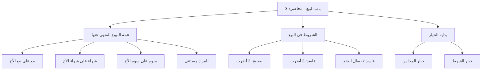

# 00 - الفهرس والخطة

> [!info] موقع المحاضرة
> هذه المحاضرة الثالثة في شرح **باب البيع** من كتاب **أخصر المختصرات**، وتكمل مسائل البيع على بيع الأخ ثم تنتقل إلى **الشروط في البيع** وبداية **الخيار**.

> [!note] المرجع
> المصدر: [[تفريغ المحاضرة 3 فقه]] — لا توجد توقيتات زمنية؛ المرجع بأرقام الأسطر.

---

## 📋 خطة الأجزاء

| الجزء | العنوان | الأسطر |
|:------:|:--------|:------:|
| 01 | البيع والشراء والسوم على الأخ | 1–75 |
| 02 | المزادات وأسئلة عملية | 76–166 |
| 03 | الفرق بين شروط البيع والشروط في البيع | 167–214 |
| 04 | الشروط الصحيحة الثلاثة | 215–310 |
| 05 | الشروط الفاسدة | 311–407 |
| 06 | شرط فاسد لا يبطل العقد وحديث بريرة | 408–724 |
| 07 | البراءة من العيب وبداية الخيار | 725–1007 |

---

## 🗺️ خريطة المفاهيم

---

## 🔑 المفاهيم الرئيسية

- [[البيع على بيع الأخ]]
- [[الشراء على شراء الأخ]]
- [[السوم على سوم الأخ]]
- [[المزاد]]
- [[شروط البيع]]
- [[الشروط في البيع]]
- [[مقتضى العقد]]
- [[شرطين في بيع]]
- [[تعليق البيع]]
- [[شرط عدم الخسارة]]
- [[البراءة من العيب]]
- [[خيار المجلس]]
- [[خيار الشرط]]
- [[النهي يقتضي الفساد]]
- [[الخراج بالضمان]]
- [[الولاء لمن أعتق]]

---

## 📊 الأحكام الفقهية في المحاضرة

| الحكم | التفصيل |
|:------|:--------|
| حرام وفاسد | البيع على بيع الأخ (مذهب الحنابلة) |
| حرام وفاسد | الشراء على شراء الأخ |
| حرام مع صحة البيع | السوم على سوم الأخ (الحرمة في السوم لا في العقد) |
| جائز | المزاد العلني |
| صحيح | الشروط الصحيحة الثلاثة |
| فاسد / يبطل | الشروط الفاسدة (خلاف مقتضى العقد، عقد آخر، التعليق) |
| شرط باطل والعقد صحيح | شرط عدم الخسارة / متى نَفَق وإلا رُدّ |
| ثابت | خيار المجلس ما لم يتفرقا بأبدانهما عرفًا |

---

## 🔗 التنقل

- **التالي:** [[01 - البيع والشراء والسوم على الأخ]]
- **المصدر:** [[تفريغ المحاضرة 3 فقه]]
- **السابق:** [[باب_البيع_المحاضرة_2_الشيخ سيد]]
