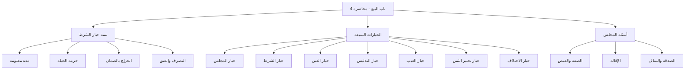

# 00 - الفهرس والخطة

> [!info] موقع المحاضرة
> هذه المحاضرة الرابعة في شرح **باب البيع** من كتاب **أخصر المختصرات**. تُتمّ [[خيار الشرط]] ثم تشرح بقية أقسام [[الخيار]] السبعة، وتُختم بأسئلة مجلس العقد والصدقة.

> [!note] المرجع
> المصدر: [[تفريغ المحاضرة 4  ل كتاب اخصر المختصرات]] — لا توجد توقيتات زمنية؛ المرجع بأرقام الأسطر.

---

## خطة الأجزاء

| الجزء | العنوان | الأسطر |
|:------:|:--------|:------:|
| 01 | الافتتاحية وخيار الشرط | 1–85 |
| 02 | خيار الغبن | 86–116 |
| 03 | خيار التدليس | 117–176 |
| 04 | خيار العيب | 176–265 |
| 05 | خيار تخبير الثمن | 265–302 |
| 06 | خيار الاختلاف بين المتبايعين | 302–355 |
| 07 | أسئلة المجلس والإقالة والصدقة | 355–518 |

---

## خريطة المفاهيم

---

## المفاهيم الرئيسية

- [[الخيار]]
- [[خيار المجلس]]
- [[خيار الشرط]]
- [[خيار الغبن]]
- [[النجش]]
- [[خيار التدليس]]
- [[التصرية]]
- [[خيار العيب]]
- [[الأرش]]
- [[خيار تخبير الثمن]]
- [[خيار الاختلاف]]
- [[الخراج بالضمان]]
- [[الغنم بالغرم]]
- [[الإقالة]]
- [[بيع العربون]]

---

## الأحكام الفقهية في المحاضرة

| الحكم | التفصيل |
|:------|:--------|
| جائز | خيار الشرط بمدة معلومة لأحدهما أو كليهما |
| حرام + لا يصح البيع | الحيلة بخيار الشرط لأكل الربا |
| ينتقل الملك للمشتري | في مدة الخيار؛ الربح له والضمان عليه |
| يحرم ولا يصح | التصرف الناقل للملك في المبيع وعوضه مدة الخيار (إلا العتق / إلا إذا كان الخيار له) |
| على التراخي | خيار الغبن والعيب والتدليس ما لم يوجد دليل الرضا |
| ثلاثة أيام | استثناء التصرية |
| تخيير | عند العلم بالعيب: إمساك مع أرش أو رد مع أخذ الثمن |
| قول المشتري بيمينه | عند الاختلاف في حدوث العيب |
| قول النافي | عند الاختلاف في الأجل أو الشرط لأن الأصل عدمه |
| قول البائع | عند الاختلاف في عين المبيع أو قدره |
| عقد جديد | رد السلعة بعد لزوم البيع برضا الطرفين (إقالة أو بيع جديد) |

---

## التنقل

- **التالي:** [[01 - الافتتاحية وخيار الشرط]]
- **الملف المجمع:** [[باب_البيع_المحاضرة_4_ملف_مجمع]]
- **المصدر:** [[تفريغ المحاضرة 4  ل كتاب اخصر المختصرات]]
- **السابق:** [[باب_البيع_المحاضرة_3_ملف_مجمع]]
