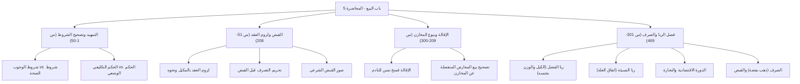

# 00 - الفهرس والخطة

> [!info] موقع المحاضرة
> هذه المحاضرة الخامسة في شرح **باب البيع** من كتاب **أخصر المختصرات** للعلامة ابن بلبان الحنبلي رحمه الله.
> تتناول المحاضرة تصحيح مفاهيم الشروط، ثم تشرع في مسائل **لزوم العقد والتصرف قبل القبض**، وكيفيات **القبض الشرعي** في المبيعات، وأحكام **[[الإقالة]]** وتصحيح المعاملات التجارية الحديثة، ثم تفرد فصلاً وافياً في **[[الربا]]** (أصنافه الستة، وعلة ربا الفضل والنسيئة عند الحنابلة، والحكمة الاقتصادية لتدوير المال، وأحكام الصرف).

> [!note] المرجع
> المصدر: [[تفريغ المحاضرة 5 ]] — لا توجد توقيتات زمنية بالدقائق والثواني في المصدر؛ المرجع معتمد بدقة على أرقام الأسطر (1–469).

---

## خطة الأجزاء

| الجزء | العنوان | الأسطر المرجعية | المحتوى الرئيسي |
|:------:|:--------|:---------------:|:----------------|
| **01** | [[01 - الافتتاح وتصحيح شروط العبادات والمعاملات]] | 1–50 | الافتتاح والدعاء، تحرير الفرق بين شروط الصلاة والشروط فيها، شروط الوجوب وشروط الصحة، التمييز الأصولي بين الحكم التكليفي والوضعي |
| **02** | [[02 - لزوم العقد والتصرف قبل القبض]] | 51–115 | متن: «ومن اشترى مكيلاً ونحوه لزم بالعقد ولم يصح تصرفه فيه قبل قبضه»، نحو المكيل، معنى لزوم العقد، النهي عن التصرف قبل القبض ودليله، وتصحيح بيع ما ليس عنده |
| **03** | [[03 - ضوابط وكيفيات قبض المبيعات]] | 116–208 | كيفيات القبض (المكيل، الموزون، المذروع، الصبرة، ما يُتناول، العقار والسيارات)، اشتراط حضور المشتري أو نائبه، التخلية، والفرق بين الملك والتصرف |
| **04** | [[04 - الإقالة وتصحيح بيوع المخازن والمعارض]] | 209–300 | متن: «والإقالة فسخ تسن للنادم»، فضل الإقالة وحكم شرط عدم الرد، الفرق بين الفسخ والبيع الجديد، تصحيح عقود معارض البلاط والسيراميك مع المخازن |
| **05** | [[05 - فصل ربا البيوع وربا الفضل]] | 301–396 | ربا الديون وربا البيوع، ربا الفضل، الأصناف الربوية الستة، علة الحنابلة (الكيل والوزن)، ضابط بيع الجنس بجنسه أو بغير جنسه، الدورة الاقتصادية في المجتمع، والمعدودات |
| **06** | [[06 - ربا النسيئة وأحكام الصرف وقواعد المعاملات]] | 397–469 | ربا النسيئة في متحد العلة، مسألة التمر وتفاوت المقادير، حكم حيلة مد عجوة، بيع مختلف العلة، أحكام الصرف وقبض المجلس، وأدب التمهل في السؤال |
| **07** | [[07 - ملخص المراجعة السريعة]] | كامل المحاضرة | بطاقة شاملة، جداول الفروق، والقواعد المركزية والأدلة النبوية |
| **08** | [[08 - أسئلة المراجعة والاختبار الذاتي]] | كامل المحاضرة | بنك أسئلة تطبيقي واستدلالي للمراجعة والتقييم الذاتي |
| **09** | [[09 - خطة تطبيق الدروس]] | خطة عملية | خطة تنفيذية للمتعلم والتجار تشمل 5 مراحل وجداول واختيارات للمراجعة |

---

## خريطة المفاهيم

---

## المفاهيم الرئيسية

- [[القبض الشرعي]]
- [[المكيل]]
- [[الموزون]]
- [[المذروع]]
- [[الصبرة]]
- [[التخلية]]
- [[التناول]]
- [[الإقالة]]
- [[ربا الفضل]]
- [[ربا النسيئة]]
- [[الأصناف الربوية الستة]]
- [[علة الربا]]
- [[الصرف]]
- [[الدورة الاقتصادية في الإسلام]]

---

## جدول الأحكام الفقهية المقررة بالمحاضرة

| المسألة | الحكم الفقهي | العلة / المستند الشرعي |
|:--------|:------------|:-----------------------|
| عقد المكيل والموزون والمذروع | يلزم بالعقد | استقرار الحق في الذمة وثبوت المطالبة قضاءً |
| تصرف المشتري فيما اشتراه قبل قبضه | يحرم ولا يصح | حديث: «من ابتاع طعاماً فلا يبيعه حتى يستوفيه» |
| إقالة النادم بعد لزوم البيع | سنة مستحبة للبائع | حديث: «من أقال مسلماً أقال الله عثرته يوم القيامة» |
| الامتناع عن رد السلعة اللازمة بلا عيب | جائز شرعاً والبائع غير ملزم | تمام لزوم العقد بالتفرق وعدم ثبوت خيار |
| استرداد السلعة النادمة بخصم من الثمن | بيع جديد وليس إقالة | لأن الإقالة فسخ بمثل الثمن، والزيادة أو النقص تخرجه لبيع مستأنف |
| بيع مكيل أو موزون بجنسه متفاضلاً | يحرم (ربا فضل) | اشتراط التماثل في معيار الشرع (مثلاً بمثل يداً بيد) |
| بيع مكيل بمكيل من غير جنسه (قمح بشعير) | يجوز متفاضلاً ويحرم نسيئة | لاختلاف الجنس مع اتحاد علة الكيل فيشترط الحلول والتقابض |
| بيع غير المكيل والموزون (كالمعدودات) | يجوز متفاضلاً ونسيئة | انتفاء علة الربا عند الحنابلة (ليست مكيلة ولا موزونة) |
| بيع مكيل بموزون من غير جنسه (بر بملح) | يجوز مطلقاً متفاضلاً ونسيئة | لاختلاف الجنس وافتراق علة الربا |
| صرف الذهب بالفضة | يجوز متفاضلاً ويشترط تقابض المجلس | لاختلاف جنس النقدين مع اتحاد صفة الثمنية (هاء وهاء) |

---

## التنقل السريع

- **التالي:** [[01 - الافتتاح وتصحيح شروط العبادات والمعاملات]]
- **الملف المجمع:** [[باب_البيع_المحاضرة_5_ملف_مجمع]]
- **المصدر الأصلي:** [[تفريغ المحاضرة 5 ]]
- **المحاضرة السابقة:** [[باب_البيع_المحاضرة_4_ملف_مجمع]]
