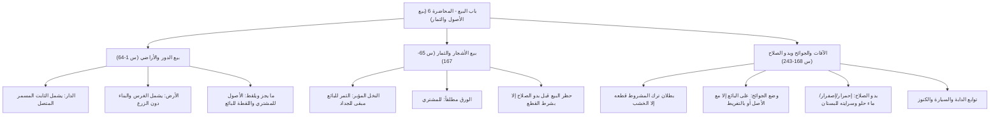

# 00 - الفهرس والخطة

> [!info] موقع المحاضرة
> هذه المحاضرة السادسة في شرح **باب البيع** من كتاب **أخصر المختصرات** للعلامة ابن بلبان الحنبلي رحمه الله.
> يُعقد هذا المجلس لشرح **فصل بيع الأصول والثمار**؛ لبيان ما يدخل تبعاً في بيع الدور، والأراضي، والأشجار، وحكم ما يجز ويلقط مراراً، وضوابط بيع الثمار قبل بدو الصلاح واشتراط القطع، وأحكام وضع الجوائح والآفات السماوية، ومقاييس بدو الصلاح، وتوابع الدواب والمركبات، والكنوز المعثور عليها في العقار.

> [!note] المرجع
> المصدر: [[تفريغ المحاضرة 6]] — لا توجد توقيتات زمنية بالدقائق والثواني في المصدر؛ المرجع معتمد بدقة على أرقام الأسطر (1–243).

---

## خطة الأجزاء

| الجزء | العنوان | الأسطر المرجعية | المحتوى الرئيسي |
|:------:|:--------|:---------------:|:----------------|
| **01** | [[01 - الافتتاح وما يدخل في بيع الدار والبيت]] | 1–27 | الافتتاح والدعاء لنزع حب الدنيا والرياء، الفرق بين الاسم والمسمى، ما يدخل في بيع الدار (الأرض، البناء، السقف، الأبواب المنصوبة، السلالم والرفوف المسمرة، الخابية المدفونة)، وتحكيم العرف في الأقفال والسباكة |
| **02** | [[02 - ما يدخل في بيع الأرض وما يجز أو يلقط مراراً]] | 28–64 | ما يدخل في بيع الأرض (الغرس والبناء دون الزرع والبذر)، حكم جهل العاقد، وأحكام ما يجز أو يلقط مراراً (الخيار، البامية، الطماطم): الأصول للمشتري واللقطة الأولى الظاهرة للبائع |
| **03** | [[03 - بيع النخل والشجر ذي الثمر والورق]] | 65–116 | بيع النخل بعد تشقق الطلع وإبقاؤه للبائع إلى الجداد، ضابط الشجر المثمر بظهور نوره أو أكمامه، والتنصيص على أن ورق الشجر (حتى ورق العنب) مطلقاً للمشتري |
| **04** | [[04 - بيع الثمار قبل بدو الصلاح واشتراط القطع]] | 117–167 | حظر بيع الثمار والزرع قبل بدو الصلاح واشتداد الحب، الحالات المستثناة (البيع لمالك الأصل، أو بشرط القطع لمصلحة مباحة مع انتفاء الشيوع)، وموعظة شربة الماء في طالوت |
| **05** | [[05 - ترك المشروط قطعه وضمان الجوائح والآفات]] | 168–217 | حكم ترك ما شرط قطعه حتى زاد زيادة غير يسيرة، استثناء الخشب، توزيع نفقات الحصاد والسقي، وأحكام وضع الجوائح والآفات السماوية وقاعدة: «المفرط والمعتدي يضمن» |
| **06** | [[06 - علامات بدو الصلاح وتوابع الدابة والكنوز]] | 218–243 | علامات بدو الصلاح في النخل والعنب وسائر الثمار وسرايته في البستان، ما يدخل في بيع الدابة (عذار، مقود، نعل) وقياس السيارات، وواجب رد كنز المالكين والركاز |
| **07** | [[07 - ملخص المراجعة السريعة]] | كامل المحاضرة | بطاقة شاملة، جداول الفروق الجوهرية، القواعد الكلية والأدلة النبوية |
| **08** | [[08 - أسئلة المراجعة والاختبار الذاتي]] | كامل المحاضرة | بنك أسئلة تطبيقي وفقهي للمراجعة والتقييم الذاتي مع إجابات نموذجية مطوية |
| **09** | [[09 - خطة تطبيق الدروس]] | خطة عملية | خطة تنفيذية من 5 مراحل وجداول وبدائل وقسم حل المشكلات التشغيلية |

---

## خريطة المفاهيم

---

## المفاهيم الرئيسية

- [[بيع الأصول والثمار]]
- [[التابع تابع]]
- [[المعروف عرفاً كالمشروط شرطاً]]
- [[الغرس والبناء]]
- [[ما يجز ويلقط مراراً]]
- [[تشقق الطلع]]
- [[مبقى إلى الجداد]]
- [[بدو الصلاح]]
- [[اشتراط القطع]]
- [[وضع الجوائح]]
- [[الآفة السماوية]]
- [[المفرط والمعتدي يضمن]]
- [[توابع الدابة والسيارة]]
- [[الركاز وكنوز الأرض]]

---

## جدول الأحكام الفقهية المقررة بالمحاضرة

| المسألة | الحكم الفقهي | العلة / الضابط الشرعي |
|:--------|:------------|:----------------------|
| بيع الدار | يشمل الأرض، البناء، السقف، الباب المنصوب، السلم والرف المسمر، والخابية المدفونة | تندرج تحت مسمى الدار وتعد من توابعها المتصلة الثابتة |
| المنفصلات بالدار (أثاث، قفل منفصل قديماً، دلاء) | لا تدخل في البيع إلا بشرط | لأنها ليست جزءاً من مسمى الدار ولا ثابتة فيها |
| السباكة، أطقم الحمامات، مواتير الرفع الثابتة | تدخل في بيع الدار بالعرف المعاصر | قاعدة: «المعروف عرفاً كالمشروط شرطاً» |
| بيع الأرض | يشمل الغرس والبناء، ولا يشمل الزرع والبذر | لأن الغرس مستقر للبقاء، والزرع مودع للنقل والحصاد |
| الزرع واللقطة الظاهرة عند بيع الأرض | للبائع، وأصول الشجر للمشتري | لعدم دخول الزرع في مسمى الأرض إلا بشرط صريح |
| بيع نخل تشقق طلعه | الثمر للبائع مبقى إلى الجداد | لحديث ابن عمر: «من باع نخلاً قد أُبِّرَتْ فثمرتها للبائع» |
| ورق الشجر (حتى ورق العنب) | للمشتري مطلقاً (قبل وبعد بدو الصلاح) | لأنه من أجزاء الشجرة وأصولها وليس بثمر |
| بيع الثمار قبل بدو صلاحها والزرع قبل اشتداد حبه | لا يصح (باطل) | لنهي النبي ﷺ عن بيع الثمار حتى يبدو صلاحها منعاً للغرر |
| بيع الثمار قبل بدو الصلاح بشرط القطع | يجوز لمصلحة ومنفعة مباحة | لأمن الغرر بالقطع الفوري حالاً، بشرط ألا يكون مشاعاً |
| تلف الثمار بآفة سماوية قبل القبض | على البائع، ويسقط الثمن عن المشتري | لحديث جابر في الأمر بوضع الجوائح |
| تلف الثمار إذا بيعت مع أصلها أو فرط المشتري | على المشتري | لأن المشتري ملك الأصل، وقاعدة: «المفرط يضمن» |
| صلاح بعض ثمر البستان الواحد | صلاح لجميع نوعه في البستان | لأن الجنس الواحد يعم صلاحه تدريجياً والتابع تابع |

---

## التنقل السريع

- **التالي:** [[01 - الافتتاح وما يدخل في بيع الدار والبيت]]
- **الملف المجمع:** [[باب_البيع_المحاضرة_6_ملف_مجمع]]
- **المصدر الأصلي:** [[تفريغ المحاضرة 6]]
- **المحاضرة السابقة:** [[باب_البيع_المحاضرة_5_ملف_مجمع]]
