# 00 - الفهرس والخطة

> [!info] موقع المحاضرة
> هذه المحاضرة السابعة في شرح **باب البيع** من كتاب **أخصر المختصرات** للعلامة ابن بلبان الحنبلي رحمه الله.
> يُعقد هذا المجلس لشرح **فصل السلم**؛ لبيان حقيقته الشرعية والاقتصادية، وشروطه السبعة الخاصة الزائدة على شروط البيع العامة، وأحكام ما بعد العقد (موضع التسليم، التصرف في المسلم فيه قبل قبضه، الحوالة والرهن والكفالة، واستبدال العوض)، مع تنزيل أحكامه الفقهية على التطبيقات المعاصرة في التوريدات، والوساطة التجارية، والاستيراد.

> [!note] المرجع
> المصدر: [[تفريغ المحاضرة 7 .md|تفريغ المحاضرة 7]] — لا توجد توقيتات زمنية بالدقائق والثواني في المصدر؛ المرجع معتمد بدقة تامة على أرقام الأسطر (1–334).

---

## خطة الأجزاء

| الجزء | العنوان | الأسطر المرجعية | المحتوى الرئيسي |
|:------:|:--------|:---------------:|:----------------|
| **01** | [[01 - الافتتاح والرجاء ومدخل عقد السلم]] | 1–25 | موعظة آيات العتاب والرجاء، دعاء حياة القلوب وتجديد الإيمان، تعريف السلم، الحكمة منه، وعدد شروطه |
| **02** | [[02 - الشروط الثلاثة الأولى (ضبط الصفات، بيان الجنس والنوع، وتقدير الكيل والوزن)]] | 26–78 | اشتراط ضبط الصفات (بطلان السلم في الجواهر)، ذكر الجنس والنوع وأوصاف اختلاف الثمن، وتقدير الكيل والوزن وضابطهما |
| **03** | [[03 - الشروط الرابع والخامس والسادس (الأجل والوجود وقبض الثمن كاملاً)]] | 79–148 | اشتراط الأجل المعلوم، إمكان وجود المسلم فيه غالباً وقت حلوله، اشتراط قبض رأس المال كاملاً بالمجلس، ونفي الغبن |
| **04** | [[04 - الشرط السابع وأحكام ما بعد العقد (ثبوته بالذمة والتصرف والتوثيق والبدل)]] | 149–220 | ثبوته بالذمة وبطلان تعيينه في عين أو شجرة، موضع الوفاء، حكم بيعه والحوالة به، مسألة الرهن والكفيل، وبطلان البدل |
| **05** | [[05 - التطبيقات المعاصرة والتوريدات والوساطة التجارية وأدب الدرس]] | 221–334 | تنزيل السلم على استيراد السيارات والهواتف، الفرق بين السلم والعربون، تكييف الوسيط التجاري، وخيار اختلاف المواصفات |
| **06** | [[06 - ملخص المراجعة السريعة]] | كامل المحاضرة | بطاقة مكثفة شاملة، جداول الشروط والفروق، والقواعد الكلية الحاكمة |
| **07** | [[07 - أسئلة المراجعة والاختبار الذاتي]] | كامل المحاضرة | بنك أسئلة تطبيقي وفقهي للمراجعة والتقييم مع إجابات نموذجية مطوية |
| **08** | [[08 - خطة تطبيق الدروس]] | خطة عملية | خطة تنفيذية للمتعاملين والوسطاء والمستهلكين بمراحل ومربعات اختيار وقسم حل المشكلات |

---

## خريطة المفاهيم

```mermaid
graph TD
    A["باب البيع - المحاضرة 7 (فصل السلم)"] --> B["مدخل وتأصيل السلم (س 1-25)"]
    A --> C["شروط صحة السلم السبعة (س 26-179)"]
    A --> D["أحكام ما بعد العقد (س 180-220)"]
    A --> E["التطبيقات والمسائل المعاصرة (س 221-334)"]

    B --> B1["تعريف السلم: بيع موصوف بالذمة مؤجل بثمن معجل"]
    B --> B2["الحكمة: تيسير السيولة للمنتج والربح للمشتري"]

    C --> C1["1. إمكان ضبط الصفات"]
    C --> C2["2. ذكر الجنس والنوع وكل وصف مؤثر"]
    C --> C3["3. ذكر القدر بكيل أو وزن معلوم"]
    C --> C4["4. ذكر أجل معلوم"]
    C --> C5["5. وجوده غالباً وقت الحلول"]
    C --> C6["6. قبض الثمن كاملاً بمجلس العقد"]
    C --> C7["7. ثبوته في الذمة دون تعيين عين"]

    D --> D1["بطلان بيع المسلم فيه قبل قبضه"]
    D --> D2["بطلان الحوالة به أو عليه على المذهب"]
    D --> D3["الرهن والكفيل (منع المذهب وجواز الرواية الأخرى)"]
    D --> D4["بطلان أخذ عوض بديل دون فسخ"]

    E --> E1["تجارة التوريدات والوساطة التجارية"]
    E --> E2["الفرق بين السلم وبيع العربون"]
    E --> E3["استيراد السلع (سيارات، هواتف) وحرية مصدر التوريد"]
    E --> E4["خيار اختلاف المواصفات والعيب"]
```

---

## المفاهيم الرئيسية

- [[عقد السلم]]
- [[المسلم فيه]]
- [[رأس مال السلم]]
- [[الموصوف في الذمة]]
- [[مجلس العقد]]
- [[القبض الفوري للثمن]]
- [[بيع الكالئ بالكالئ]]
- [[الكيل والوزن]]
- [[الأجل المعلوم]]
- [[الوجود عند الحلول]]
- [[بيع ما لا يملك]]
- [[بيع العربون]]
- [[التوريدات التجارية]]
- [[الوساطة التجارية]]
- [[خيار العيب واختلاف المواصفات]]

---

## جدول الأحكام والضوابط الفقهية المقررة بالمحاضرة

| المسألة | الحكم الفقهي | العلة / الضابط الشرعي |
|:--------|:------------|:----------------------|
| تعريف السلم ومشروعيته | جائز شرعاً باتفاق، وهو مستثنى من بيع ما لا يملك | لحديث: «من أسلف في شيء فليسلف في كيل معلوم ووزن معلوم إلى أجل معلوم» |
| عدد شروط السلم | سبعة شروط خاصة | زائدة على الشروط السبعة العامة للبيوع لنفي الجهالة والغرر |
| السلم في الجواهر والأحجار الكريمة | لا يصح | لتعذر انضباط صفاتها وتفاوت أفرادها تفاوتاً كبيراً يؤدي للنزاع |
| ذكر أوصاف المبيع المؤثرة | واجب وشرط لصحة العقد | لأن كل وصف يختلف به الثمن غالباً يؤثر في الرضا وقيمة السلعة |
| بيع المكيل وزناً أو الموزون كيلاً | لا يصح على المذهب (وجوزه ابن تيمية إن انضبط) | سداً لذريعة التفاوت والنزاع ومراعاة للمعيار الشرعي الأصلي |
| تأجيل الاستلام لأجل مجهول | باطل | للغرر والجهالة، ويشترط تحديد موعد محدد كشهر أو موعد الحصاد |
| عقد السلم في زمن ينقطع فيه وجود السلعة | باطل | لاشتراط غلبة وجود المسلم فيه عند حلول الأجل للقدرة على التسليم |
| تأخير تسليم رأس المال عن مجلس العقد | باطل | لوقوعه في بيع الدين بالدين (الكالئ بالكالئ) المنهي عنه |
| السلم في ثمرة بستان معين أو شجرة معينة | باطل | لأن السلم يجب أن يثبت في الذمة، والتعيين يعرضه للهلاك وانقطاع الصفقة |
| بيع المسلم فيه قبل قبضه | لا يصح | لعدم تمام الملك واستقرار الضمان بالقبض الفعلي |
| الحوالة بالمسلم فيه أو عليه | لا تصح على المذهب (وجوزها بعض الفقهاء لأنه دين) | لكونه ديناً غير مستقر قد يتعذر تسليمه |
| أخذ رهن أو كفيل بالمسلم فيه | لا يصح على المشهور من المذهب (وجاز في رواية للتوثيق) | لأن الرهن والكفالة في دين السلم فيه شبهة استيثاق بما لم يستقر |
| أخذ سلعة بديلة عن المسلم فيه (سكر بدل قمح) | لا يجوز استبدالاً، ويجوز بفسخ العقد وإبرام عقد جديد | منعاً من بيع الدين بالدين أو الاستبدال بغير رضا منضبط |
| تعذر التسليم عند حلول الأجل | يخير المشتري بين الصبر أو الفسخ واسترداد رأس المال | ولا تجوز الزيادة على رأس المال لأنها ربا صريح |
| بيع العربون | مشروع ومستقل عن السلم | لأن المشتري يدفع جزءاً من الثمن لا جميعه، وينعقد البيع عند إحضار السلعة |

---

## التنقل السريع

- **التالي:** [[01 - الافتتاح والرجاء ومدخل عقد السلم]]
- **الملف المجمع:** [[باب_البيع_المحاضرة_7_ملف_مجمع]]
