# 00 - الفهرس والخطة

> [!info] موقع المحاضرة
> هذه المحاضرة الثامنة في شرح **باب البيع** من كتاب **أخصر المختصرات** للعلامة ابن بلبان الحنبلي رحمه الله.
> يُعقد هذا المجلس لشرح **فصل القرض**؛ لبيان حقيقته كعقد إرفاق وإحسان، وثوابه العظيم، وضابط ما يصح قرضه وما يستثنى منه، وأحكام سداد القرض ورد المثل في النقود والمثليات مع معالجة التضخم وتقلبات الأسعار، وقيمة فاقد المثل والمقومات، وضابط الربا المحرم في القرض («كل قرض جر نفعاً»)، مع مناقشة مستفيضة للأعراف الاجتماعية المعاصرة (كالواجب، والنقطة في المناسبات، والمساعدات المرضية، والفرق بين الدين والإحسان).

> [!note] المرجع
> المصدر: [[تفريغ المحاضرة 8 .md|تفريغ المحاضرة 8]] — لا توجد توقيتات زمنية بالدقائق والثواني في المصدر؛ المرجع معتمد بدقة تامة على أرقام الأسطر (1–160).

---

## خطة الأجزاء

| الجزء | العنوان | الأسطر المرجعية | المحتوى الرئيسي |
|:------:|:--------|:---------------:|:----------------|
| **01** | [[01 - الافتتاح ومدخل عقد القرض وفضله وضابط ما يصح قرضه]] | 1–22 | دعاء حياة القلوب ونزع الوهن، القرض كعقد إرفاق وإحسان، فضله وأجره كصدقة، ضابط: «كل ما صح بيعه صح قرضه إلا بني آدم»، وتأصيل رد المثل في النقد |
| **02** | [[02 - أحكام سداد القرض ورد المثل والتضخم وفقدان المثل والمقومات]] | 23–30 | وجوب رد المثل في المثليات (العملات، الذهب، المكيل، الموزون)، حكم فقدان المثل (قيمته يوم فقده)، وحكم المقومات كالشياه والجواهر (قيمته يوم قبضه) |
| **03** | [[03 - قاعدة كل قرض جر نفعاً وحسن القضاء والهدايا بعد الوفاء]] | 31–87 | قاعدة: «كل قرض جر نفعاً فهو ربا» (الشرط الصريح والعرفي)، مشروعية حسن القضاء والوفاء بأجود بلا شرط، وتفصيل علة استثناء الآدميين والفرق بين القرض والإعارة |
| **04** | [[04 - المعاملات والأعراف الاجتماعية المعاصرة (النقطة، المساعدات المرضية، والفرق بين الدين والإحسان)]] | 88–160 | تكييف الهدايا والواجب، حكم «النقطة» في الأفراح وتفنيد اعتبارها ديناً ملزماً، المساعدات المرضية ومصيرها بعد الوفاة، وقاعدة: «كل عرف خالف الشرع فهو باطل» |
| **05** | [[05 - ملخص المراجعة السريعة]] | كامل المحاضرة | بطاقة مكثفة شاملة، جداول القواعد الفقهية، الفروق الجوهرية، والأدلة النبوية |
| **06** | [[06 - أسئلة المراجعة والاختبار الذاتي]] | كامل المحاضرة | بنك أسئلة تطبيقي وفقهي للمراجعة والتقييم مع إجابات نموذجية مطوية |
| **07** | [[07 - خطة تطبيق الدروس]] | خطة عملية | خطة تنفيذية للمتعاملين بالقرض الحسن، قائمة تحقق (Checklist)، وقسم استكشاف الأخطاء |

---

## خريطة المفاهيم

```mermaid
graph TD
    A["باب البيع - المحاضرة 8 (فصل القرض)"] --> B["مدخل القرض وفضله (س 1-22)"]
    A --> C["أحكام الرد والتقلبات المالية (س 23-30)"]
    A --> D["قاعدة الربا وحسن القضاء (س 31-87)"]
    A --> E["الأعراف المعاصرة والدين والإحسان (س 88-160)"]

    B --> B1["عقد إرفاق وإحسان لا معاوضة"]
    B --> B2["ثواب الإقراض: مرتان كصدقة مرة"]
    B --> B3["ضابط: كل ما صح بيعه صح قرضه إلا بني آدم"]

    C --> C1["المثليات: رد المثل مطلقاً ولا عبرة بالتضخم"]
    C --> C2["فقدان المثل: قيمته يوم فقده"]
    C --> C3["المقومات: قيمته يوم قبضه"]

    D --> D1["قاعدة: كل قرض جر نفعاً فهو ربا"]
    D --> D2["الشروط الصريحة والضمنية (المعروف عرفاً)"]
    D --> D3["جواز حسن القضاء والهدية بعد الوفاء بلا شرط"]
    D --> D4["الفرق بين القرض وتمليك الرقبة والإعارة"]

    E --> E1["النقطة في الأفراح: هدية مستحبة وليست ديناً"]
    E --> E2["المساعدات المرضية: إحسان لا يسترد من التركة إلا إذا كان قرضاً"]
    E --> E3["ضابط: كل عرف خالف الشريعة فهو باطل"]
```

---

## المفاهيم الرئيسية

- [[عقد القرض]]
- [[عقود الإرفاق والإحسان]]
- [[المثليات والمقومات]]
- [[رد المثل]]
- [[التضخم وتقلب العملة]]
- [[قيمته يوم فقده]]
- [[قيمته يوم قبضه]]
- [[كل قرض جر نفعا فهو ربا]]
- [[المعروف عرفا كالمشروط شرطا]]
- [[حسن القضاء]]
- [[الهدية بعد الوفاء]]
- [[النقطة في الأفراح]]
- [[المساعدات المالية والتركة]]
- [[العرف ومخالفة الشرع]]

---

## جدول الأحكام والضوابط الفقهية المقررة بالمحاضرة

| المسألة | الحكم الفقهي | العلة / الضابط الشرعي |
|:--------|:------------|:----------------------|
| حكم عقد القرض | مستحب للمقرِض، مباح للمقترِض | لأنه من عقود الإرفاق والمعونة على تفريج كرب المسلمين |
| ثواب القرض | إقراض مرتين يعدل صدقة مرة | لحديث النبي ﷺ: «ما من مسلم يقرض مسلماً قرضاً مرتين إلا كان كصدقتها مرة» |
| ضابط ما يصح قرضه | كل ما صح بيعه صح قرضه إلا بني آدم | لعموم جواز التصرف فيه بالبيع، واستثناء الآدمي درءاً للوطء المحرم ولعدم وروده |
| سداد القرض في النقود والمثليات | يجب رد المثل مطلقاً | لأن القرض عقد إرفاق، والمقرِض يدخله متبرعاً لا طالباً للربح، فلا عبرة بالتضخم |
| فقدان المثل من السوق عند السداد | تجب قيمته يوم فقده | لأنه الوقت الذي استقر فيه العجز عن أداء الأصل فثبتت قيمته في الذمة |
| قرض المقومات (ما لا مثل له كالحيوان والجوهر) | تجب قيمته يوم قبضه | لأن وقت القبض هو الذي تم فيه تملك السلعة ودخولها في ضمان المقترض |
| اشتراط زيادة أو نفع في القرض | محرم وهو ربا صريح | لقاعدة: «كل قرض جر نفعاً فهو ربا»، سواء كان الشرط صريحاً أو عرفياً |
| الوفاء بأجود أو إهداء هدية بعد السداد بلا شرط | جائز ومستحب | لأنه من حسن القضاء ومكافأة الإحسان بالإحسان دون شرط مسبق |
| إلزام الناس برد "النقطة" بنفس القيمة كدين | باطل شرعاً ومخالف للأصل | لأن النقطة هدية مستحبة، والهدية لا تجب مكافأتها جبراً ولا تلزم من التركة |
| المساعدات المالية للمريض ومصاريف العلاج | إحسان لا يُسترد من التركة إلا إذا اتُفق على كونه قرضاً | لأن الأصل في الإعانة التبرع، ولا يجوز تحويل التبرع إلى دين إلا بإذن صريح |
| الأعراف المصادمة لأحكام الشريعة | غير معتبرة وباطلة | لأن العرف لا يُعتد به إلا إذا وافق أصول الشريعة ولم يحل حراماً أو يحرم حلالاً |

---

## التنقل السريع

- **التالي:** [[01 - الافتتاح ومدخل عقد القرض وفضله وضابط ما يصح قرضه]]
- **الملف المجمع:** [[باب_البيع_المحاضرة_8_ملف_مجمع]]
