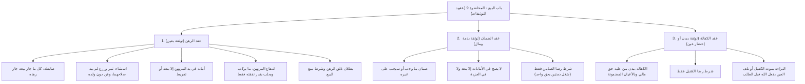

# 00 - الفهرس والخطة

> [!info] موقع المحاضرة
> هذه المحاضرة التاسعة في شرح **باب البيع** من كتاب **أخصر المختصرات** للعلامة ابن بلبان الحنبلي رحمه الله.
> يُعقد هذا المجلس لشرح **عقود التوثيقات لحفظ الديون والحقوق**، وتشتمل على ثلاثة فصول كبرى:
> 1. **فصل الرهن**: ضابط ما يجوز رهنه، لزومه بالقبض، التصرف فيه، هلاكه وأمانته في يد المرتهن، أحكام بيعه عند حلول الأجل، الشروط الفاسدة (غلق الرهن)، والانتفاع بالرهن والنفقة عليه وعمارته.
> 2. **فصل الضمان**: تعريفه وشروطه، ضمان ما وجب وما سيجب، حكم ضمان الأمانات والجزية، وانفراد شرط رضا الضامن، ومطالبة الدائن من شاء.
> 3. **فصل الكفالة**: الكفالة ببدن من عليه حق مالي وبالأعيان المضمونة، والفرق الجوهري بين الضامن والكفيل، وأحكام موت الكفيل أو تلف العين قبل الطلب وبعده.

> [!note] المرجع
> المصدر: [[تفريغ المحاضرة 9.md|تفريغ المحاضرة 9]] — لا توجد توقيتات زمنية بالدقائق والثواني في المصدر؛ المرجع معتمد بدقة تامة على أرقام الأسطر (1–398).

---

## خطة الأجزاء

| الجزء | العنوان | الأسطر المرجعية | المحتوى الرئيسي |
|:------:|:--------|:---------------:|:----------------|
| **01** | [[01 - مدخل عقود التوثيق وضوابط الرهن ولزومه والتصرف فيه]] | 1–58 | حفظ الحقوق، دليل الرهن، ضابط ما يصح رهنه وما يصح رهنه دون بيعه، لزومه بالقبض، بطلان تصرف أحدهما بلا إذن، عتق الراهن، وأمانة الرهن |
| **02** | [[02 - بيع الرهن عند الحلول والشروط الفاسدة وغلق الرهن]] | 59–104 | حلول الأجل وعجز المدين: بيع المرتهن بالإذن، تدخل الحاكم بالحبس أو البيع، وحكم الغائب كالممتنع، وبطلان شرط عدم البيع وشرط غلق الرهن |
| **03** | [[03 - الانتفاع بالرهن والنفقة عليه وتطبيقات المستأجر والمستعير]] | 105–184 | ركوب وحلب ما يركب ويحلب بقدر نفقتهما لحديث النبي ﷺ، منع انتفاع المرتهن بما عدا ذلك، النفقة بغير إذن الراهن، قياس المستعير والمستأجر، وعمارة ما خرب |
| **04** | [[04 - عقد الضمان وأحكامه وأسئلة الطلاب في الرهن]] | 185–312 | أسئلة الطلاب، تعريف الضمان، ضمان ما وجب وما سيجب (الديون الحاضرة والمستقبلية)، بطلان ضمان الأمانات والجزية، ورضا الضامن وحده |
| **05** | [[05 - عقد الكفالة بالبدن والعين والفرق بينها وبين الضمان]] | 313–398 | الفرق بين الضامن والكفيل، الكفالة ببدن الغريم وبالأعيان، اشتراط رضا الكفيل وحده، براءة الكفيل بموته أو تلف العين بآفة سماوية، وحكم الطلب |
| **06** | [[06 - ملخص المراجعة السريعة]] | كامل المحاضرة | بطاقة مكثفة شاملة لعقود التوثيقات الثلاثة، جداول القواعد، الفروق الجوهرية، والأدلة |
| **07** | [[07 - أسئلة المراجعة والاختبار الذاتي]] | كامل المحاضرة | بنك أسئلة تطبيقي وفقهي للمراجعة والتقييم مع إجابات نموذجية مطوية |
| **08** | [[08 - خطة تطبيق الدروس]] | خطة عملية | خطة تنفيذية للمتعاملين بالرهن والضمان والكفالة، قائمة تحقق، وقسم حل المشكلات |

---

## خريطة المفاهيم

---

## المفاهيم الرئيسية

- [[عقود التوثيقات]]
- [[عقد الرهن]]
- [[الراهن والمرتهن]]
- [[الرهن المقبوض]]
- [[غلق الرهن]]
- [[انتفاع المرتهن بالرهن]]
- [[نفقة الرهن]]
- [[عقد الضمان]]
- [[جائز التصرف]]
- [[ضمان ما سيجب]]
- [[ضمان الأمانات]]
- [[عقد الكفالة]]
- [[الكفالة بالبدن]]
- [[الكفيل والأصيل]]
- [[الطلب وحلول الأجل]]

---

## جدول الأحكام والضوابط الفقهية المقررة بالمحاضرة

| المسألة | الحكم الفقهي | العلة / الضابط الشرعي |
|:--------|:------------|:----------------------|
| ضابط ما يصح رهنه | كل ما جاز بيعه جاز رهنه | لإمكان استيفاء الدين من ثمنه عند تعذر السداد |
| رهن الثمار والزرع قبل بدو الصلاح | يصح رهنهما (وإن حرم بيعهما) | لأن الدين باق في الذمة لا يسقط بتلفهما فلا غرر على المرتهن |
| رهن قن دون ولده | يصح رهنه (وإن حرم بيعه مفرداً) | لأن الرهن حبس للعين وليس بيعاً وتفريقاً في الحال |
| لزوم الرهن | يلزم في حق الراهن بمجرد القبض | لقوله تعالى: ﴿فَرِهَانٌ مَقْبُوضَةٌ﴾، أما المرتهن فله فسخه |
| تصرف أحد العاقدين في الرهن بلا إذن الآخر | باطل | لتعلق حق الراهن بالملك وحق المرتهن بالوثيقة |
| عتق الراهن للعبد المرهون | ينفذ العتق وتؤخذ قيمته رهناً مكانه | تغليباً للسراية والحرية مع حفظ حق المرتهن ببدله المالي |
| هلاك الرهن في يد المرتهن بلا تعد ولا تفريط | لا يضمنه المرتهن ولا يسقط الدين | لأنه أمانة في يده، وقاعدة: «الأمين لا يضمن إلا بتعد أو تفريط» |
| شرط غلق الرهن («إن لم أسدد فالرهن لك بالدين») | شرط باطل ومحرم | للنهي النبوي: «لا يغلق الرهن»، ولأنه يفضي للغرر وأكل أموال الناس بالباطل |
| انتفاع المرتهن بالرهن | يحرم إلا في ركوب الظهر وحلب الدر بقدر نفقتهما | لحديث: «الظهر يركب بنفقته إذا كان مرهوناً، ولبن الدر يشرب بنفقته» |
| النفقة على الرهن بغير إذن الراهن مع إمكانه | تبرع لا رجوع فيه | لقاعدة: «المتبرع لا يرجع في تبرعه كالكلب يعود في قيئه» |
| ضمان ما وجب وما سيجب في المستقبل | يصح ضمانهما | لحاجة المعاملات وتوثيق الديون الحاضرة والمستقبلية |
| ضمان الأمانات (كالوديعة والعارية) | لا يصح إلا بالتعدي أو التفريط فيها | لأن الأصل في الأمانة عدم الضمان، فلا يضمن ما لا يجب ضمانه |
| اشتراط الرضا في عقد الضمان | يشترط رضا الضامن وحده | لأن الحق يشغل ذمته باختياره، ولا يشترط رضا المضمون عنه ولا له |
| الكفالة ببدن من عليه حق مالي | تصح شرعاً | لتوثيق إحضار الغريم إلى مجلس الحكم، والضامن يضمن المال والكفيل يضمن البدن |
| موت الكفيل أو تلف العين بفعل الله قبل الطلب | يبرأ الكفيل وتسقط الكفالة | لتعذر الإحضار بأمر سماوي قبل استقرار المطالبة في ذمته |

---

## التنقل السريع

- **التالي:** [[01 - مدخل عقود التوثيق وضوابط الرهن ولزومه والتصرف فيه]]
- **الملف المجمع:** [[باب_البيع_المحاضرة_9_ملف_مجمع]]
